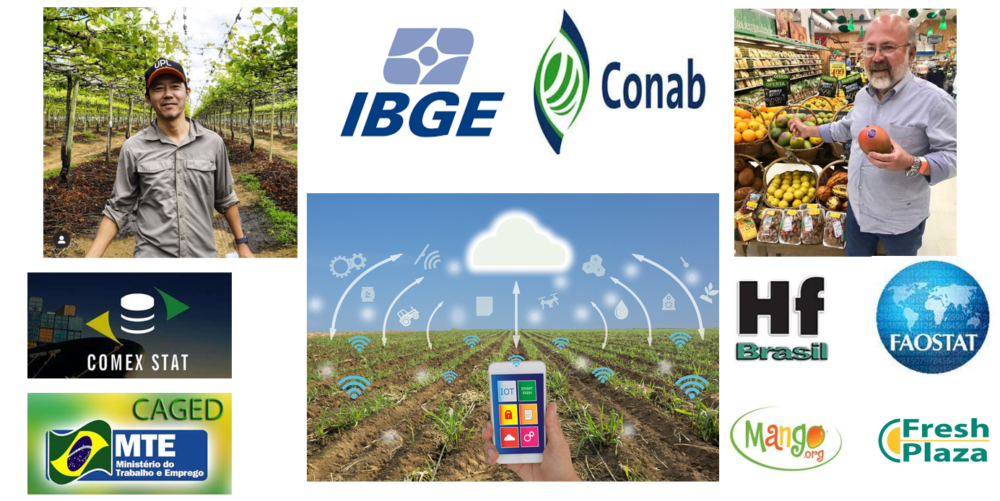
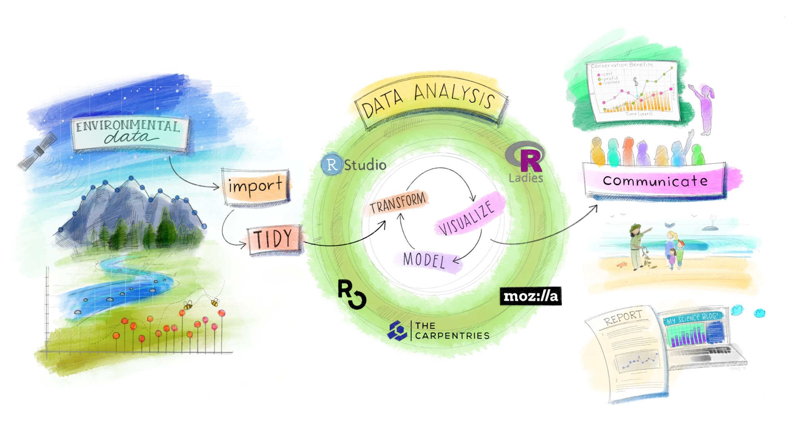

class: center, middle

```{r setup, include=FALSE}
# Dependências dos slides/aula
library(knitr)          # CRAN v1.33
library(rmarkdown)      # CRAN v2.10
library(xaringan)       # CRAN v0.22
library(xaringanthemer) # CRAN v0.3.0
library(xaringanExtra)  # [github::gadenbuie/xaringanExtra] v0.5.5
library(RefManageR)     # CRAN v1.3.0
library(ggplot2)        # CRAN v3.3.5
library(fontawesome)    # [github::rstudio/fontawesome] v0.1.0
library(pagedown)

# Opções de chunks
options(htmltools.dir.version = FALSE)
knitr::opts_chunk$set(
  echo       = FALSE,
  warning    = FALSE,
  message    = FALSE,
  fig.retina = 3,
  fig.width  = 11.5,
  fig.asp    = 0.618,
  out.width  = "100%",
  fig.align  = "center",
  comment    = "#"
  )

# Cores para gráficos
colors <- c(
  blue       = "#282f6b",
  red        = "#b22200",
  yellow     = "#eace3f",
  green      = "#224f20",
  purple     = "#5f487c",
  orange     = "#b35c1e",
  turquoise  = "#419391",
  green_two  = "#839c56",
  light_blue = "#3b89bc",
  gray       = "#666666"
  )
```

```{r xaringan, echo=FALSE}
# Tema da apresentação
xaringanthemer::style_mono_light(
  base_color                      = unname(colors["blue"]),
  title_slide_background_image    = params$logo_slides, 
  title_slide_background_size     = 12,
  title_slide_background_position = "bottom 10px right 20px",
  title_slide_background_color    = "white",
  title_slide_text_color          = unname(colors["blue"]),
  footnote_position_bottom        = "15px"
  )

# Opções extras do tema
xaringanExtra::use_progress_bar(
  color    = colors["blue"], 
  location = "bottom"
  )
xaringanExtra::use_extra_styles(
  hover_code_line         = TRUE,
  mute_unhighlighted_code = FALSE
  )
xaringanExtra::use_panelset()
```

```{css, echo=FALSE}
pre {
  white-space: pre-wrap;
  overflow-y: scroll !important;
  max-height: 45vh !important;
  overflow-x: auto;
  max-width: 100%;
}
```

```{r load_refs, echo=FALSE, eval=params$references}
# Configuração de citações
RefManageR::BibOptions(
  check.entries = FALSE,
  bib.style     = "authoryear",
  cite.style    = "authoryear",
  style         = "markdown",
  hyperlink     = FALSE,
  dashed        = FALSE
  )
if(params$references){
  temp_refbib <- tempdir()
  download.file(
    url      = params$references_path, 
    destfile = paste0(temp_refbib, "/references.bib"), 
    mode     = "wb"
    )
  myBib <- RefManageR::ReadBib(paste0(temp_refbib, "/references.bib"), check = FALSE)
  }

# Como citar?
# RefManageR::TextCite(myBib, "id_da_citacao")
```

```{r utils, echo=FALSE}
# Função que pega um arquivo .Rmd, condicionalmente o renderiza, 
# e embute o conteúdo do mesmo formatado como Markdown puro 
# no output do documento atual
print_rmd <- function(file, encoding = "UTF-8", render = TRUE){
  if(render){rmarkdown::render(input = file, quiet = TRUE)}
  rmd <- readLines(con = file, encoding = encoding)
  cat("```md\n")
  cat(rmd, sep = "\n")
  cat("```\n")
}
```

### O QUE É UM OBSERVATÓRIO? 

.pull-left[
```{r, echo=FALSE, out.width="300%"}
knitr::include_graphics("img_r/observatorio.webp")
```
]

.pull-right[
- Existem algumas definições para Observatórios, usamos a de Antunes e Mangueira (2005) que consideram observatório como **"um modelo facilitador entre as universidades, setor produtivo e o setor público, permitindo a identificação de demandas geradoras de emprego e renda, aumento da competitividade, identificação de novas tendências, por meio da gestão da informação e do conhecimento gerado"**.

- O propósito do Observatório, segundo Marcial (2009) é **"investigar, caracterizar, avaliar e discutir informaçoes relevantes na área; relatar os resultados para a sociedade e oferecer um espaço aberto para contribuiçoes dos agentes externos interessados que compartilham interesses mútuos"**

]

---
class: center, middle
### OBJETIVOS DO OBSERVATÓRIO 

.pull-left[
- O objetivo maior é a **geração de informações sobre os mercados de manga e uva visando estabelecer estratégias que aumentem a competitividade e fortaleçam a fruticultura**.

- Para isto, busca gerar estudos, análises prospectivas e informações que contemplem: 

a) **a tendência dos mercados no curto, médio e longo prazos e com isso antecipar as possíveis soluções para que as empresas possam adotar os instrumentos de ajustes requeridos**; 

]

.pull-right[
- b) **a cadeia da logística de um determinado produto (transporte, armazenamento e distribuição) e novas tecnologias que  associadas aos produtos lhes agreguem valor e assegurem uma posição mais competitiva nos mercados**;

- c) **a estruturação de um sistema  composto de um banco de dados com as principais variáveis sobre preços, volumes comercializados, países concorrentes, de forma a acompanhar as mudanças conjunturais e de longo prazo desses mercados**.

As ações do Observatório contribuem para *aproximar a Embrapa do Setor Produtivo*. 

]

---
class: center
### OBSERVATÓRIOS DE MERCADO DA EMBRAPA

```{r, echo=FALSE, out.width="950%"}

```

---
class: center
### O CICLO DA CIÊNCIA DE DADOS

```{r, echo=FALSE, out.width="80%", fig.cap="<left><b>Fonte: Beatriz Mils (2021)</b></left>", echo = FALSE}

```

---
class: left, middle
### HISTÓRICO DAS DISPONIBILIZAÇÕES DAS INFORMAÇÕES 
.pull-left[
- 1) Maio de 2020 - Boletim elaborado para a manga com preços
- 2) Junho de 2020 - Boletim disponibilizado para manga - mercado externo
- 3) Abril de 2021 - Boletim Informaçoes sobre o mercado de uva - interno e externo
- 4) Maio de 2021 - Boletim Informaçoes sobre Geração de Emprego na Manga e Uva
- 5) Setembro de 2021 - Boletim Informações sobre o CEAGESP -CONAB
- 6) Novembro de 2021 - Boletim com informaçoes Gerais IBGE/PAM
- 7) Maio de 2022 - Boletim Consumo Manga e uva IBGE/POF
- 8) Julho de 2022 - Incorporação das Informações do NMB
- 9) Setembro de 2022 - Informaçoes CEAGESP - Gabriel
]

.pull-right[

- 2020 -  29 Boletins de Preços e 8 de Exportaçoes Manga
- 2021 -  47 Boletins de Preços e 12 de Exportaçoes Manga; 36 Boletins de Preços e 9 de Exportaçoes de Uva; 5 Boletins CEAGESP; 2 Boletins Informaçoes IBGE/PAM; 9 Boletins sobre Empregos;
2022 - 33 Boletins de Preços, 7 de Exportaçoes de Manga, 6 de Geraçao de Empregos e 1 Consumo de Mangas; 33 Boletins de Preços, 7 de Exportaçoes de Uvas, 6 de Geraçao de Empregos e 1 Consumo de Uvas;

A partir de 2022, os dados dos boletins passam a ser disponibilizados em pdf e html;

Além disso, foram disponibilizadas 3 painéis (dashboards), sendo uma para mercado interno de manga, outra para mercado externo de manga e uma para mercado interno e externo de uvas. 

]

---

class: center
### COLETA, TRATAMENTO E DIVULGAÇÃO DE INFORMAÇÕES

```{r, echo=FALSE, out.width="100%"}
knitr::include_graphics("img_r/fig2.png")
```

---
class: center, middle
### ACESSO ÀS INFORMAÇÕES DOS OBSERVATÓRIOS 

.left-column[

- Entrar no site da Embrapa Semiárido

www.embrapa.br/semiarido

- Do lado direito, canto inferior aparecem os logos dos dois observatórios, de manga e de uva.

- **É só clicar no Observatório de interesse!**

]

.right-column[
```{r, echo=FALSE, out.width="78%"}
knitr::include_graphics("img_r/fig4_sumi.png")
```
]

---
class: center
### EXEMPLO NO SITE DO OBSERVATÓRIO DA UVA

.pull-left[
```{r, echo=FALSE, out.width="100%"}
knitr::include_graphics("img_r/fig5_sumi.png")
```
]

.pull-right[

- No site do Observatório de Mercado de uva (https://www.embrapa.br/observatorio-da-uva) existem colunas com diversas informações (mercado interno, exportações, emprego)!

- Contudo, os observatórios tem gerado muito mais informações do que estas disponibilizadas neste link. 

- Basicamente existem 3 formas de se ter acesso as informações completas: a) um site da internet; b) um documento pdf; c) A Dashboard (Painel) do Observatório.

- Qualquer opção que se clicar no site irá abrir possibilidades para acessar os outros links.

]

---
class: center, middle

# OBRIGADO!


João Ricardo F. de Lima <br>
Email: joao.ricardo@embrapa.br


https://www.embrapa.br/observatorio-da-manga <br>
https://www.embrapa.br/observatorio-da-uva


Telefones:<br>
87-3866-3667  
87-99961-5799 
