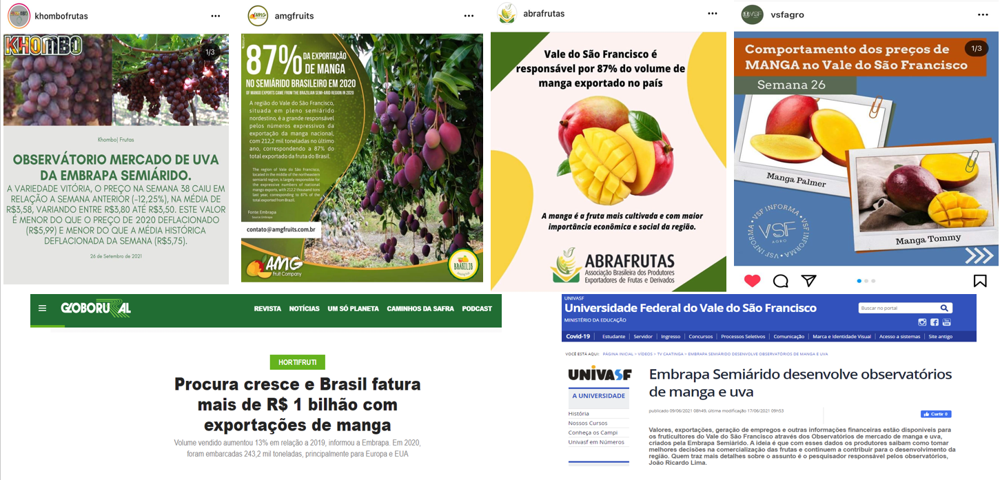
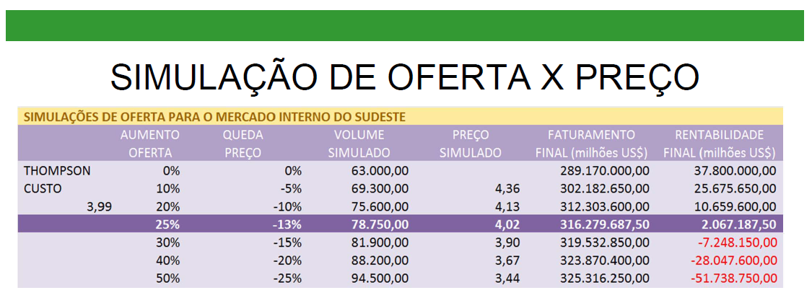

class: center

```{r setup, include=FALSE}
# Dependências dos slides/aula
library(knitr)          # CRAN v1.33
library(rmarkdown)      # CRAN v2.10
library(xaringan)       # CRAN v0.22
library(xaringanthemer) # CRAN v0.3.0
library(xaringanExtra)  # [github::gadenbuie/xaringanExtra] v0.5.5
library(RefManageR)     # CRAN v1.3.0
library(ggplot2)        # CRAN v3.3.5
library(fontawesome)    # [github::rstudio/fontawesome] v0.1.0

# Opções de chunks
options(htmltools.dir.version = FALSE)
knitr::opts_chunk$set(
  echo       = FALSE,
  warning    = FALSE,
  message    = FALSE,
  fig.retina = 3,
  fig.width  = 11.5,
  fig.asp    = 0.618,
  out.width  = "100%",
  fig.align  = "center",
  comment    = "#"
  )

# Cores para gráficos
colors <- c(
  blue       = "#282f6b",
  red        = "#b22200",
  yellow     = "#eace3f",
  green      = "#224f20",
  purple     = "#5f487c",
  orange     = "#b35c1e",
  turquoise  = "#419391",
  green_two  = "#839c56",
  light_blue = "#3b89bc",
  gray       = "#666666"
  )
```

```{r xaringan, echo=FALSE}
# Tema da apresentação
xaringanthemer::style_mono_light(
  base_color                      = unname(colors["blue"]),
  title_slide_background_image    = params$logo_slides, 
  title_slide_background_size     = 12,
  title_slide_background_position = "bottom 10px right 20px",
  title_slide_background_color    = "white",
  title_slide_text_color          = unname(colors["blue"]),
  footnote_position_bottom        = "15px"
  )

# Opções extras do tema
xaringanExtra::use_progress_bar(
  color    = colors["blue"], 
  location = "bottom"
  )
xaringanExtra::use_extra_styles(
  hover_code_line         = TRUE,
  mute_unhighlighted_code = FALSE
  )
xaringanExtra::use_panelset()
```

```{css, echo=FALSE}
pre {
  white-space: pre-wrap;
  overflow-y: scroll !important;
  max-height: 45vh !important;
  overflow-x: auto;
  max-width: 100%;
}
```

```{r load_refs, echo=FALSE, eval=params$references}
# Configuração de citações
RefManageR::BibOptions(
  check.entries = FALSE,
  bib.style     = "authoryear",
  cite.style    = "authoryear",
  style         = "markdown",
  hyperlink     = FALSE,
  dashed        = FALSE
  )
if(params$references){
  temp_refbib <- tempdir()
  download.file(
    url      = params$references_path, 
    destfile = paste0(temp_refbib, "/references.bib"), 
    mode     = "wb"
    )
  myBib <- RefManageR::ReadBib(paste0(temp_refbib, "/references.bib"), check = FALSE)
  }

# Como citar?
# RefManageR::TextCite(myBib, "id_da_citacao")
```

```{r utils, echo=FALSE}
# Função que pega um arquivo .Rmd, condicionalmente o renderiza, 
# e embute o conteúdo do mesmo formatado como Markdown puro 
# no output do documento atual
print_rmd <- function(file, encoding = "UTF-8", render = TRUE){
  if(render){rmarkdown::render(input = file, quiet = TRUE)}
  rmd <- readLines(con = file, encoding = encoding)
  cat("```md\n")
  cat(rmd, sep = "\n")
  cat("```\n")
}
```

### OBSERVATÓRIOS DE MERCADO DE UVA E MANGA DA EMBRAPA

```{r, echo=FALSE, out.width="950%"}
knitr::include_graphics("img_r/fig1.png")
```
---
class: center
### COLETA, TRATAMENTO E DIVULGAÇÃO DE INFORMAÇÕES

```{r, echo=FALSE, out.width="100%"}

```

---
class: center
### ACESSO ÀS INFORMAÇÕES DOS OBSERVATÓRIOS 

.pull-left[
```{r, echo=FALSE, out.width="100%"}
knitr::include_graphics("img_r/fig4_sumi.png")
```
]

.pull-right[

- Entrar no site da Embrapa Semiárido (https://www.embrapa.br/semiarido)

- Do lado direito, canto inferior aparecem os logos dos dois observatórios, de manga e de uva.

- **É só clicar no Observatório de interesse!**

]
---
class: center
### EXEMPLO NO SITE DO OBSERVATÓRIO DA UVA

.pull-left[
```{r, echo=FALSE, out.width="100%"}

```
]

.pull-right[

- No site do Observatório de Mercado de uva (https://www.embrapa.br/observatorio-da-uva) existem colunas com diversas informações (mercado interno, exportações, emprego)!

- Contudo, os observatórios tem gerado muito mais informações do que estas disponibilizadas neste link. 

- Basicamente existem 3 formas de se ter acesso as informações completas: a) um site da internet; b) um documento pdf; c) A Dashboard (Painel) do Observatório.

- Qualquer opção que se clicar no site irá abrir opções para os outros links.

]

---
class: center
### ANÁLISE DA DEMANDA DE UVA

```{r sumimoto_1}
#Direcionado o R para o Diretorio a ser trabalhado
setwd('c:/Users/Joao Ricardo Lima/Dropbox/tempecon/dados_uva')

#Inicio do Script
#Pacotes a serem utilizados 
library(ggplot2)
library(scales)
library(plotly)
library(dplyr)
library(readxl)
library(reshape2)
library(kableExtra)# complex tables
library(lmtest)
library(DT)
library(magrittr)

mycolors2 <- c("orange", "lightblue3", "darkblue", "gold", "red", "darkgreen")

#Entrando dados no R
dados3 <- read_excel('consrenda_brasil.xlsx', col_names = TRUE)
dados3m <- melt(dados3, id.var='classes')

g4 <- ggplot()+
  geom_col(data=dados3m, aes(x=variable, y=value, fill=classes), lwd=1, position = "dodge")+ scale_fill_manual(values=mycolors2)+
  labs(y= "Consumo (kg) per capita anual", x= "Brasil e Regiões", title='Aquisição domiciliar per capita anual de uva por faixas de renda - 2018',
  caption = "Fonte: POF/IBGE reprocessado pelo Observatório de Mercado de Uva da Embrapa")+
  theme_minimal()+
  theme(axis.text.x=element_text(angle=0, hjust=0.5, size=10, margin = margin(b=10)),
        axis.text.y=element_text(hjust=0.5, size=10, margin = margin(l=10)),
        axis.title.y = element_text(size=10, face = "bold"),
        axis.title.x = element_text(size=10, face = "bold"),
        panel.grid.major = element_blank(),
        panel.grid.minor = element_blank(),
        plot.title = element_text(hjust = 0.5, size=10),
        plot.caption = element_text(hjust = 0, size=10),
        legend.position = "bottom", legend.title = element_blank(),
        legend.text=element_text(size=8)) # Definindo posição da legenda

ggplotly(g4) %>%
  layout(legend = list(
                      orientation = "h", 
                      x=0.0, 
                      y=-0.2,
                      title=''))
```

---
class: center
### ANÁLISE DA DEMANDA DE MANGA

```{r sumimoto_2}
#Direcionado o R para o Diretorio a ser trabalhado
setwd('c:/Users/Joao Ricardo Lima/Dropbox/tempecon/dados_manga')

#Inicio do Script
#Pacotes a serem utilizados 
library(ggplot2)
library(scales)
library(plotly)
library(dplyr)
library(readxl)

mycolors2 <- c("orange", "lightblue3", "darkblue", "gold", "red", "darkgreen")

#Entrando dados no R
dados3 <- read_excel('consrenda_brasil.xlsx', col_names = TRUE)
dados3m <- melt(dados3, id.var='classes')

g4 <- ggplot()+
  geom_col(data=dados3m, aes(x=variable, y=value, fill=classes), lwd=1, position = "dodge")+ scale_fill_manual(values=mycolors2)+
  labs(y= "Consumo (kg) per capita anual", x= "Brasil e Regiões", title='Aquisição domiciliar per capita anual de manga por faixas de renda - 2018',
  caption = "Fonte: POF/IBGE reprocessado pelo Observatório de Mercado de Manga da Embrapa")+
  theme_minimal()+
  theme(axis.text.x=element_text(angle=0, hjust=0.5, size=10, margin = margin(b=10)),
        axis.text.y=element_text(hjust=0.5, size=10, margin = margin(l=10)),
        axis.title.y = element_text(size=10, face = "bold"),
        axis.title.x = element_text(size=10, face = "bold"),
        panel.grid.major = element_blank(),
        panel.grid.minor = element_blank(),
        plot.title = element_text(hjust = 0.5, size=10),
        plot.caption = element_text(hjust = 0, size=10),
        legend.position = "bottom", legend.title = element_blank(),
        legend.text=element_text(size=8)) # Definindo posição da legenda

ggplotly(g4) %>%
  layout(legend = list(
                      orientation = "h", 
                      x=0.0, 
                      y=-0.2,
                      title=''))
```
---
class: center
### ANÁLISE DOS PREÇOS DE UVA NEGRA SEM SEMENTE EMBALADA

``` {r sumimoto_3}
library(imputeTS)
library(tsutils)
data <- as.Date("2022-05-20")
sem_ano <- 20 #ajustar semanalmente

#Direcionado o R para o Diretorio a ser trabalhado
setwd('c:/Users/Joao Ricardo Lima/Dropbox/tempecon/dados_Uva')

options(digits=4)

#Entrando dados no R Branca Arra-15
dados1 <- read.csv2('dados_uva_arra_semana.csv', header=T, sep=";", dec=".")
#dados <- dados[,-c(9:10)] #retirar as ultimas colunas
colnames(dados1)[1]<-'produto'


#Entrando dados no R Vitoria com Embalagem
dados2 <- read.csv2('dados_uva_vitoria_semana.csv', header=T, sep=";", dec=".")
#dados <- dados[,-c(9:10)] #retirar as ultimas colunas
colnames(dados2)[1]<-'produto'


#Entrando dados no R Vitoria sem Embalagem
dados3 <- read.csv2('dados_uva_vitoriaSE_semana.csv', header=T, sep=";", dec=".")
#dados <- dados[,-c(9:10)] #retirar as ultimas colunas
colnames(dados3)[1]<-'produto'


#organização das bases para Uva Branca e Vitoria Embalada

#Entrando dados no R - Deflator
igpdi <- read.csv2('igpdi_uva.csv', 
                   header=T, sep=";",
                   dec=".")
colnames(igpdi)[1]<-'ano'

#Juntar tudo em um unico tibble
dados <- full_join(dados1, dados2) %>% full_join(igpdi)

#Resolver os Missing
dados <-na_kalman(dados)

#Deflacionar a série de precos
dados$preco_def <- dados[,4]*(tail(dados[,5],1)/dados[,5])

#Criando uma variável com as datas semanais
dados$date <- seq(as.Date('2017-01-07'),to=data,by='1 week')

#Passar para um Tibble
dados <- tibble(dados)

#Ajustando como uma série temporal
dados <- dados %>% 
  select(c(date, produto, preco_def, ano))

#organização da base para Vitoria Sem Embalagem

igpdi2 <- igpdi %>% filter(ano >= '2019')

#Juntar tudo em um unico tibble
dadosv <- full_join(dados3, igpdi2)

#Resolver os Missing
dadosv <-na_kalman(dadosv)

#Deflacionar a série de precos
dadosv$preco_def <- dadosv[,4]*(tail(dadosv[,5],1)/dadosv[,5])

#Criando uma variável com as datas semanais
dadosv$date <- seq(as.Date('2019-01-07'),to=data,by='1 week')

#Passar para um Tibble
dadosv <- tibble(dadosv)

#Ajustando como uma série temporal
dadosv <- dadosv %>% 
  select(c(date, produto, preco_def, ano))


#Geração das tendencias

arra <- dados%>% filter(produto=="arra_15")
vitoria <- dados %>% filter(produto=="vitoria")
vitoriase <- dadosv

preco_arra <- ts(arra[,3], start=c(2017,1), freq=52)
sazonal_arra <- cmav(preco_arra, outplot = F)

preco_vitoria <- ts(vitoria[,3], start=c(2017,1), freq=52)
sazonal_vitoria <- cmav(preco_vitoria, outplot = F)

preco_vitoriase <- ts(vitoriase[,3], start=c(2019,1), freq=52)
sazonal_vitoriase <- cmav(preco_vitoriase, outplot = F)

# Parte 2
#Decompor a Série
decompa<-decompose(preco_arra, type = 'multiplicative')

sazonalidade <- decompa$figure
semanas <- seq(1:52)
sazonal_graph <- tibble(cbind(semanas, sazonalidade))

#Parte 3
#Analise das comparações entre as médias
preco_arra_2019 <- window(preco_arra, end=c(2019,52))
seas19<-seasplot(preco_arra_2019, trend=F, outplot = F)
medias19 <- colMeans(seas19$season)

preco_arra_2020 <- window(preco_arra, end=c(2020,52))

preco_arra_2021 <- window(preco_arra, end=c(2021,52))
#seas21<-seasplot(preco_palmer_2021, trend=F, outplot = F)
#medias21 <- colMeans(seas21$season)

preco_arra_22 <- as.matrix(tail(arra$preco_def,sem_ano))
preco_arra_2022 <- matrix(NA, nrow=52, ncol=1)

for(i in 1:sem_ano){
  preco_arra_2022[i,1] = preco_arra_22[i,1]
}
  

#Como só se tem até a semana 52
medias19 <- medias19[1:52]
#medias21 <- medias21[1:52]

matrix = matrix(NA, nrow=52, ncol=2)

for(i in 1:52){
  matrix[i,1] = min(seas19$season[,i])
  matrix[i,2] = max(seas19$season[,i])
}

time <- seq(1:52)
table <- data.frame(time, matrix[,1], round(medias19,2), matrix[,2], round(tail(preco_arra_2020,52),2),
                    round(tail(preco_arra_2021,52),2), preco_arra_2022[,1])
colnames(table) = c('Semanas', 'Mínimo', 'Média', 'Máximo', '2020', '2021', 
                    '2022')
tablea <- table[,-c(5:7)]
tableb <- table[,-c(2,3,4)]

tablea2 <- melt(tablea, id.var='Semanas')
tableb2 <- melt(tableb, id.var='Semanas')
mycolors <- c("dodgerblue2", "gold", "darkmagenta")

#Parte 4

preco_arra_21 <- arra %>% filter(ano=='2021')
preco_arra_2021 <- as.matrix(preco_arra_21$preco_def)
variacao_21 <- (preco_arra_2021/lag(preco_arra_2021, 1) - 1)*100

variacao_22 <- (preco_arra_2022/lag(preco_arra_2022, 1) - 1)*100

semanas <- seq(1:52)
variacao <- data.frame(semanas, variacao_21[,1], variacao_22[,1])
colnames(variacao) = c('Semanas', '2021', '2022')

variacao <- melt(variacao, id.var='Semanas')

mycolors2 <- c("orange", "lightblue3")

# Customizar tema interativamente em tempo real (ver mensagens no console)
#bslib::bs_themer()

#Analise das comparações entre as médias
preco_vitoria_2019 <- window(preco_vitoria, end=c(2019,52))
seas19<-seasplot(preco_vitoria_2019, trend=F, outplot = F)
medias19 <- colMeans(seas19$season)

preco_vitoria_2020 <- window(preco_vitoria, end=c(2020,52))

preco_vitoria_2021 <- window(preco_vitoria, end=c(2021,52))
#seas21<-seasplot(preco_palmer_2021, trend=F, outplot = F)
#medias21 <- colMeans(seas21$season)

preco_vitoria_22 <- as.matrix(tail(vitoria$preco_def,sem_ano))
preco_vitoria_2022 <- matrix(NA, nrow=52, ncol=1)

for(i in 1:sem_ano){
  preco_vitoria_2022[i,1] = preco_vitoria_22[i,1]
}
  
#Como só se tem até a semana 52
medias19 <- medias19[1:52]
#medias21 <- medias21[1:52]

matrix = matrix(NA, nrow=52, ncol=2)

for(i in 1:52){
  matrix[i,1] = min(seas19$season[,i])
  matrix[i,2] = max(seas19$season[,i])
}

time <- seq(1:52)
table <- data.frame(time, matrix[,1], round(medias19,2), matrix[,2], round(tail(preco_vitoria_2020,52),2),
                    round(tail(preco_vitoria_2021,52),2), preco_vitoria_2022[,1])
colnames(table) = c('Semanas', 'Mínimo', 'Média', 'Máximo', '2020', '2021', 
                    '2022')
tablea <- table[,-c(5:7)]
tableb <- table[,-c(2,3,4)]

tablea2 <- melt(tablea, id.var='Semanas')
tableb2 <- melt(tableb, id.var='Semanas')
mycolors <- c("dodgerblue2", "gold", "darkmagenta")

g7 <- ggplot(data=vitoria, aes(x=date)) +  #estetica vai valer para todos os geom's
  geom_line(aes(y=preco_def, colour="PREÇO"), lwd=1)+
  geom_line(aes(y=sazonal_vitoria, colour="TENDÊNCIA"), lwd=1)+
  scale_colour_manual("", 
                      breaks = c("PREÇO", "TENDÊNCIA"),
                      values = c("blue", "red")) +
  labs(y= "Preço R$", x= "Semanas de cada Ano", title='Evolução dos preços ao produtor e Tendência Uva Negra Embalada',
       caption = "Fonte: CEPEA reprocessado pelo Observatório de Mercado de Uva da Embrapa") +
  scale_y_continuous(limits=c(0,20), n.breaks = 10, expand = expansion(add=c(0,0.5)), 
                     labels=number_format(accuracy = 0.01, decimal.mark = ","))+
  scale_x_date(date_breaks = "1 year",
               labels = date_format("%Y"))+
  theme_classic()+ #Definindo tema
  theme(axis.text.x=element_text(angle=0, hjust=0.5, size=8, margin = margin(b=10)),
        axis.text.y=element_text(hjust=0.5, size=8, margin = margin(l=10)),
        axis.title.x = element_text(size=8, face = "bold", margin = margin(b=10)),
        axis.title.y = element_text(size=8, face = "bold", margin = margin(l=10)),
        plot.title = element_text(hjust = 0.5, size=12),
        plot.caption = element_text(hjust = 0, size=8),
        legend.position = c(2,1),
        legend.justification = c(1.2, 1.2),
        legend.text=element_text(size=8)) # Definindo posição da legenda

ggplotly(g7) %>%
  layout(legend = list(
                      orientation = "h", 
                      x=0.35, 
                      y=-0.10,
                      title=''))
```

---
class: center
### ANÁLISE DOS PREÇOS DE UVA NEGRA SEM SEMENTE EMBALADA

``` {r sumimoto_3A}
g5 <- ggplot()+
  geom_col(data=tableb2, aes(x=Semanas, y=value, fill=variable), size=2, width = 0.7,
           position = "dodge")+
  scale_fill_manual(values=mycolors)+
    geom_line(data=tablea2, aes(x=Semanas, y=value, colour=variable), linetype = "solid",
            size = 1)+
  scale_colour_manual(values = c("red", "chocolate", "darkgreen")) +
  scale_y_continuous(limits = c(0, 20), n.breaks = 10, labels = number_format(accuracy = 0.01,
                                                       decimal.mark = ","))+
  scale_x_continuous(breaks = seq(1, 52, by = 2))+
  labs(y= "Preço R$", x= "Semanas de cada Ano", title='Mínimo, Máximo, Média e preços de 2020 a 2022 de Uva Negra Embalada',
       caption = "Fonte: CEPEA reprocessado pelo Observatório de Mercado de Uva da Embrapa")+
   theme_minimal()+
  theme(axis.text.x=element_text(angle=0, hjust=0.5, size=8, margin = margin(b=10)),
        axis.text.y=element_text(hjust=0.5, size=8, margin = margin(l=10)),
        axis.title.y = element_text(size=8, face = "bold"),
        axis.title.x = element_text(size=8, face = "bold"),
        panel.grid.major = element_blank(),
        panel.grid.minor = element_blank(),
        plot.title = element_text(hjust = 0.5, size=12),
        plot.caption = element_text(hjust = 0, size=8),
        legend.position = "bottom", legend.title = element_blank(),
        legend.text=element_text(size=8)) # Definindo posição da legenda

ggplotly(g5) %>%
  layout(legend = list(
                      orientation = "h", 
                      x=0.15, 
                      y=-0.10,
                      title=''))
```
---
class: center
### ANÁLISE DOS PREÇOS DE MANGA PALMER

``` {r sumimoto_4}
#Direcionado o R para o Diretorio a ser trabalhado
setwd('c:/Users/Joao Ricardo Lima/Dropbox/tempecon/dados_manga')

#Entrando dados no R
dados <- read.csv2('dados_manga_palmer_semana.csv', header=T, sep=";", dec=".")
#dados <- dados[,-c(9:10)] #retirar as ultimas colunas
colnames(dados)[1]<-'produto'

#Entrando dados no R - Deflator
igpdi <- read.csv2('igpdi.csv', 
                   header=T, sep=";",
                   dec=".")

dados_comb<-cbind(dados, igpdi)

teste<-dados_comb[,4]-dados_comb[,7]

dadosp<-dados_comb[,-c(1,2,6,7)]

#Deflacionar a serie de manga
dadosp$preco_def <- dadosp[,3]*(tail(dadosp[,4],1)/dadosp[,4])
#dadosp<-dadosp[,-2]

#Criando uma variável com as datas semanais
dadosp$date <- seq(as.Date('2012-01-14'),to=data, by='1 week') 
dadosp$date[dadosp$date == "2016-01-02"] <- "2015-12-31" #ajustando algumas datas
dadosp$date[dadosp$date == "2015-01-03"] <- "2014-12-31"
dadosp$date[dadosp$date == "2014-01-04"] <- "2013-12-31"
dadosp$date[dadosp$date == "2013-01-05"] <- "2012-12-31"

#Analise de Serie Temporal
preco_palmer <- dadosp[,5]
preco_palmer <- ts(preco_palmer, start=c(2012,1), freq=52)
#preco_palmer <- window(preco_palmer, end=c(2021,52))

# Parte 2
#Decompor a série
decompa<-decompose(preco_palmer, type = 'multiplicative')

#Tendecia
trend_palmer <- cmav(preco_palmer, outplot=F)

#Sazonalidade
sazonalidade <- decompa$figure
semanas <- seq(1:52)
sazonal_graph <- tibble(cbind(semanas, sazonalidade))

#Parte 3
#Analise das comparações entre as médias
preco_palmer_2019 <- window(preco_palmer, end=c(2019,52))
seas19<-seasplot(preco_palmer_2019, trend=F, outplot = F)
medias19 <- colMeans(seas19$season)

preco_palmer_2020 <- window(preco_palmer, end=c(2020,52))

preco_palmer_2021 <- window(preco_palmer, end=c(2021,52))
#seas21<-seasplot(preco_palmer_2021, trend=F, outplot = F)
#medias21 <- colMeans(seas21$season)

preco_palmer_22 <- as.matrix(tail(dadosp$preco_def,sem_ano))  
preco_palmer_2022 <- matrix(NA, nrow=52, ncol=1)

for(i in 1:sem_ano){                                          
  preco_palmer_2022[i,1] = preco_palmer_22[i,1]
}
  

#Como só se tem até a semana 52
medias19 <- medias19[1:52]
#medias21 <- medias21[1:52]

matrix = matrix(NA, nrow=52, ncol=2)

for(i in 1:52){
  matrix[i,1] = min(seas19$season[,i])
  matrix[i,2] = max(seas19$season[,i])
}

time <- seq(1:52)
table <- data.frame(time, matrix[,1], round(medias19,2), matrix[,2], round(tail(preco_palmer_2020,52),2),
                    round(tail(preco_palmer_2021,52),2), preco_palmer_2022[,1])
colnames(table) = c('Semanas', 'Mínimo', 'Média', 'Máximo', '2020', '2021', 
                    '2022')
tablea <- table[,-c(5:7)]
tableb <- table[,-c(2,3,4)]

tablea2 <- melt(tablea, id.var='Semanas')
tableb2 <- melt(tableb, id.var='Semanas')
mycolors <- c("lightblue3", "gray44", "gold")

table_db <- data.frame(matrix[,1], round(medias19,2), matrix[,2], round(tail(preco_palmer_2020,52),2),
                    round(tail(preco_palmer_2021,52),2), preco_palmer_2022[,1])
colnames(table_db) = c('Mínimo', 'Média', 'Máximo', '2020', '2021', '2022')

#Parte 4

preco_palmer_21 <- dadosp %>% filter(ano=='2021')
preco_palmer_2021 <- as.matrix(preco_palmer_21$preco_def)
variacao_21 <- (preco_palmer_2021/lag(preco_palmer_2021, 1) - 1)*100

variacao_22 <- (preco_palmer_2022/lag(preco_palmer_2022, 1) - 1)*100

semanas <- seq(1:52)
variacao <- data.frame(semanas, variacao_21[,1], variacao_22[,1])
colnames(variacao) = c('Semanas', 'Ano_2021', 'Ano_2022')

variacao <- melt(variacao, id.var='Semanas')

mycolors2 <- c("orange", "lightblue3")

g3 <- ggplot(data=dadosp, aes(x=date)) +  #estetica vai valer para todos os geom's
  geom_line(aes(y=preco_def, colour="PREÇO"), lwd=1)+
  geom_line(aes(y=trend_palmer, colour="TENDÊNCIA"), lwd=1)+
  scale_colour_manual("", 
                      breaks = c("PREÇO", "TENDÊNCIA"),
                      values = c("blue", "red")) +
  labs(y= "Preço R$", x= "Semanas de cada Ano", title='Evolução dos preços ao produtor e Tendência Manga Palmer',
       caption = "Fonte: CEPEA reprocessado pelo Observatório de Mercado de Manga da Embrapa") +
  scale_y_continuous(limits=c(0,8), n.breaks = 9, expand = expansion(add=c(0,0.5)), 
                     labels=number_format(accuracy = 0.01, decimal.mark = ","))+
  scale_x_date(date_breaks = "1 year",
               labels = date_format("%Y"))+
  theme_classic()+ #Definindo tema
  theme(axis.text.x=element_text(angle=0, hjust=0.5, size=8, margin = margin(b=10)),
        axis.text.y=element_text(hjust=1, size=8, margin = margin(l=10)),
        axis.title.x = element_text(size=8, face = "bold", margin = margin(b=10)),
        axis.title.y = element_text(size=8, face = "bold", margin = margin(l=10)),
        plot.title = element_text(hjust = 0.5, size=12),
        plot.caption = element_text(hjust = 0, size=8),
        legend.position = c(2,1),
        legend.justification = c(1.2, 1.2),
        legend.text=element_text(size=8)) # Definindo posição da legenda

ggplotly(g3) %>%
  layout(legend = list(
                      orientation = "h", 
                      x=0.35, 
                      y=-0.1,
                      title=''))
```

---
class: center
### ANÁLISE DOS PREÇOS DE MANGA PALMER

``` {r sumimoto_4a}
g1 <- ggplot()+
  geom_col(data=tableb2, aes(x=Semanas, y=value, fill=variable), size=2, width = 0.7,
           position = "dodge")+
  scale_fill_manual(values=mycolors)+
    geom_line(data=tablea2, aes(x=Semanas, y=value, colour=variable), linetype = "solid",
            size = 1)+
  scale_colour_manual(values = c("red", "chocolate", "darkgreen")) +
  scale_y_continuous(limits = c(0, 8), n.breaks = 8, labels = number_format(accuracy = 0.01,
                                                       decimal.mark = ","))+
  scale_x_continuous(breaks = seq(1, 52, by = 2))+
  labs(y= "Preço R$", x= "Semanas de cada Ano", title='Mínimo, Máximo, Média e preços de 2020 a 2022 de Manga Palmer ao produtor',
       caption = "Fonte: CEPEA reprocessado pelo Observatório de Mercado de Manga da Embrapa")+
  theme_minimal()+
  theme(axis.text.x=element_text(angle=0, hjust=0.5, size=8, margin = margin(b=10)),
        axis.text.y=element_text(hjust=0.5, size=8, margin = margin(l=10)),
        axis.title.y = element_text(size=8, face = "bold"),
        axis.title.x = element_text(size=8, face = "bold"),
        panel.grid.major = element_blank(),
        panel.grid.minor = element_blank(),
        plot.caption = element_text(hjust = 0, size=8),
        plot.title = element_text(hjust = 0.5, size=12, face=""),
        legend.position = "right", legend.title = element_blank(),
        legend.text=element_text(size=8)) # Definindo posição da legenda

ggplotly(g1) %>%
  layout(legend = list(
                      orientation = "h", 
                      x=0.15, 
                      y=-0.10,
                      title=''))
```
---
class: center
### EXPECTATIVAS E DESAFIOS - EXPORTAÇÕES DE UVA

``` {r sumimoto_5}
#Direcionado o R para o Diretorio a ser trabalhado
setwd('c:/Users/Joao Ricardo Lima/Dropbox/tempecon/dados_uva')

#Inicio do Script
#Pacotes a serem utilizados 
library(mFilter)
library(forecast)
library(tsutils)
library(seasonal)
library(ggplot2)
library(uroot)
library(tseries)
library(ggthemes)
library(dplyr)
library(quantmod)
library(scales)
library(kableExtra)# complex tables
library(lmtest)
library(FinTS)
library(rbcb)
library(plotly)
library(DT)
library(magrittr)
library(rmarkdown)
library(reshape2)
library(rbcb)
library(tidyverse)

checkX13()

options(digits=4)

library(lubridate)
anterior <- as.Date("2022-03-01")
atual <-  as.Date("2022-04-01")
#today <- as.Date("2022-02-11")
mes <- 4

#Entrando dados no R
dados1 <- read.csv2('exportacoes_2016_2022.csv', header=T, sep=";", dec = ".")
dados1 <- dados1/1000
dados1[,1] <- seq(2016, 2022, by = 1)
colnames(dados1) = c('Ano', 'Valor', "Toneladas")
dados1 <- tibble(dados1)

#Entrando dados no R
dados2 <- read.csv2('total_exporta_uva_br.csv', header=T, sep=";", dec = ".")
#dados <- dados[,-c(9:10)] #retirar as ultimas colunas
colnames(dados2)[1]<-'ano'

#Entrando dados no R
dados3 <- read.csv2('destinos_2022.csv', header=T, sep=";", dec = ".")
colnames(dados3) = c('Paises', "Participacao")

#Entrando dados no R
dados4 <- read.csv2('via_2022.csv', header=T, sep=";", dec = ".")
colnames(dados4) = c('Vias', "Participacao")

#Entrando dados no R
dados5 <- read.csv2('uf_2022.csv', header=T, sep=";" , dec = ".")
colnames(dados5) = c('UF', "Participacao")

# Entrando dados no R
dados7 <- read.csv2('importacao.csv', header=T, sep=";" , dec = ".")
dados7 <- dados7[,-c(1,2)]
colnames(dados7) = c('Chile', 'Argentina', 'Peru')

#Ajusta para Valor
#Analise de Serie Temporal
exporta_uva_valor <- dados2[,3]
exporta_uva_valor<-exporta_uva_valor/1000
exporta_uva_valor <- ts(exporta_uva_valor, start=c(2016,1), freq=12)

#Tendencia
trend_valor <- cmav(exporta_uva_valor, outplot=F)
date <- seq(as.Date('2016-01-01'),to=atual,by='1 month') 
trend_valor <- tibble(date, trend_valor)

#Sazonalidade
decompa<-decompose(exporta_uva_valor, type = 'multiplicative')
sazonal_valor <- decompa$figure
#meses <- seq(1:12)
meses <- seq(as.Date("2021/1/1"), by = "month", length.out = 12) 
sazonal_graph <- tibble(meses, sazonal_valor)

#Comparações com os anos e entre as médias/max/min

exporta_uva_valor_2019 <- window(exporta_uva_valor, end=c(2019,12))
seas19<-seasplot(exporta_uva_valor_2019, trend=F, outplot = F)
medias19 <- colMeans(seas19$season)

exporta_uva_valor_2020 <- window(exporta_uva_valor, end=c(2020,12))

exporta_uva_valor_2021 <- window(exporta_uva_valor, end=c(2021,12))
#medias21 <- colMeans(seas21$season)

exporta_uva_valor_22 <- as.matrix(tail(exporta_uva_valor,mes)) 
exporta_uva_valor_2022 <- matrix(NA, nrow=12, ncol=1)

for(i in 1:mes){
  exporta_uva_valor_2022[i,1] = exporta_uva_valor_22[i,1]
}
  
#Como só se tem até a semana 12
medias19 <- medias19[1:12]

matrix = matrix(NA, nrow=12, ncol=2)

for(i in 1:12){
  matrix[i,1] = min(seas19$season[,i])
  matrix[i,2] = max(seas19$season[,i])
}

#time <- c("Janeiro", "Fevereiro", "Março", "Abril", "Maio", "Junho", "Julho", "Agosto", "Setembro", "Outubro", "Novembro", #"Dezembro")
#time <-seq(1:12)
table <- data.frame(meses, matrix[,1], round(medias19,3), matrix[,2], round(tail(exporta_uva_valor_2020,12),3),
                    round(tail(exporta_uva_valor_2021,12),3), exporta_uva_valor_2022[,1])
colnames(table) = c('Meses', 'Mínimo', 'Média', 'Máximo', '2020', '2021', 
                    '2022')

tablea <- table[,-c(5:7)]
tableb <- table[,-c(2,3,4)]

tablea2 <- melt(tablea, id.var='Meses')
tableb2 <- melt(tableb, id.var='Meses')
mycolors <- c("lightblue3", "gray44", "gold")

#Ajusta para Volume
#Analise de Serie Temporal
exporta_uva_volume <- dados2[,4]
exporta_uva_volume<-exporta_uva_volume/1000  #passando de quilo para tonelada

#Ajuste para a variação Mensal do Volume

variacao_volume_20 <-  dados2 %>% filter(ano=='2020')
variacao_volume_21 <-  dados2 %>% filter(ano=='2021')
variacao_volume_22 <-  dados2 %>% filter(ano=='2022')

variacao_volume_20 <-  variacao_volume_20[,4]/1000
variacao_volume_21 <-  variacao_volume_21[,4]/1000
variacao_volume_22 <-  variacao_volume_22[,4]/1000

#Setando como uma série temporal
exporta_uva_volume <- ts(exporta_uva_volume, start=c(2016,1), freq=12)

#Tendencia
trend_volume <- cmav(exporta_uva_volume, outplot=F)
trend_volume <- tibble(date, trend_volume)

#Sazonalidade
decompa<-decompose(exporta_uva_volume, type = 'multiplicative')
sazonal_volume <- decompa$figure
sazonal_graph_volume <- tibble(meses, sazonal_volume)

#Comparações com os anos e entre as médias/max/min

exporta_uva_volume_2019 <- window(exporta_uva_volume, end=c(2019,12))
seas19_vol<-seasplot(exporta_uva_volume_2019, trend=F, outplot = F)
medias19_vol <- colMeans(seas19_vol$season)

exporta_uva_volume_2020 <- window(exporta_uva_volume, end=c(2020,12))

exporta_uva_volume_2021 <- window(exporta_uva_volume, end=c(2021,12))

exporta_uva_volume_22 <- as.matrix(tail(exporta_uva_volume,mes)) #ajustar mensalmente
exporta_uva_volume_2022 <- matrix(NA, nrow=12, ncol=1)

for(i in 1:mes){
  exporta_uva_volume_2022[i,1] = exporta_uva_volume_22[i,1]
}
  
#Como só se tem até a semana 12
medias19_vol <- medias19_vol[1:12]

matrix_vol = matrix(NA, nrow=12, ncol=2)

for(i in 1:12){
  matrix_vol[i,1] = min(seas19_vol$season[,i])
  matrix_vol[i,2] = max(seas19_vol$season[,i])
}

#time <- c("Janeiro", "Fevereiro", "Março", "Abril", "Maio", "Junho", "Julho", "Agosto", "Setembro", "Outubro", "Novembro", #"Dezembro")
#time <-seq(1:12)
table_volume <- data.frame(meses, round(matrix_vol[,1],0), round(medias19_vol,0), round(matrix_vol[,2],0), round(tail(exporta_uva_volume_2020,12),0),
round(tail(exporta_uva_volume_2021,12),0), round(exporta_uva_volume_2022[,1],0))
colnames(table_volume) = c('Meses', 'Mínimo', 'Média', 'Máximo', '2020', '2021', 
                    '2022')

tablea_vol <- table_volume[,-c(5:7)]
tableb_vol <- table_volume[,-c(2,3,4)]

tablea2_vol <- melt(tablea_vol, id.var='Meses')
tableb2_vol <- melt(tableb_vol, id.var='Meses')


#Variação Mensal 2021

variacao_volume_2020 <- as.matrix(variacao_volume_20)
variacao_volume_2021 <- as.matrix(variacao_volume_21)
variacao_volume_2022 <- matrix(NA, nrow=12, ncol=1)
variacao_volume_22 <- as.matrix(variacao_volume_22)

for(i in 1:mes){
  variacao_volume_2022[i,1] = variacao_volume_22[i,1]
}

variacao_21 <- ((variacao_volume_2021/variacao_volume_2020) - 1)*100
variacao_22 <- ((variacao_volume_2022/variacao_volume_2021) - 1)*100

variacao <- data.frame(meses, variacao_21, variacao_22)
colnames(variacao) = c('Meses', 'Variação 2021 e 2020', 'Variação 2022 e 2021')

variacaom <- melt(variacao, id.var='Meses')

mycolors2 <- c("orange", "lightblue3")

#Dados de Importação
importacao <- tibble(date, dados7)
importacao <- melt(importacao, id.var='date')

g7 <- ggplot()+
  geom_col(data=tableb2_vol, aes(x=Meses, y=value, fill=variable), lwd=1,
           position = "dodge")+
  scale_fill_manual(values=mycolors)+
  geom_line(data=tablea2_vol, aes(x=Meses, y=value, colour=variable), linetype = "solid",
            size = 1)+
    scale_colour_manual(values = c("red", "chocolate", "darkgreen")) +
    scale_y_continuous(limits = c(0, 25000), n.breaks = 10)+
    scale_x_date(date_breaks = "1 month",
               labels = date_format("%B"))+
  labs(y= "Toneladas", x= "Meses do Ano", title='Exportações de Uva do Brasil: valores e estatísticas mensais.',
       caption = "")+
  theme_minimal()+ #Definindo tema
  theme(axis.text.x=element_text(angle=35, hjust=0.5, size=8, margin = margin(b=20)),
        axis.text.y=element_text(hjust=1, size=8, margin = margin(l=20)),
        axis.title.x = element_text(size=8, face = "bold", margin = margin(b=20)),
        axis.title.y = element_text(size=8, face = "bold", margin = margin(l=20)),
        plot.title = element_text(hjust = 0.5, size=12),
        plot.caption = element_text(hjust = 0, size=12),
        panel.grid.major = element_blank(),
        panel.grid.minor = element_blank(),
        legend.position = "bottom", legend.title = element_blank(),
        legend.text=element_text(size=9)) # Definindo posição da legenda

ggplotly(g7) %>%
  layout(legend = list(
                      orientation = "h", 
                      x=0.2, 
                      y=-0.15,
                      title=''))
```
---
class: center
### EXPORTAÇÕES DE MANGA

``` {r sumimoto_6}
#Direcionado o R para o Diretorio a ser trabalhado
setwd('c:/Users/Joao Ricardo Lima/Dropbox/tempecon/dados_manga')

options(digits=4)

anterior <- as.Date("2022-03-01")
atual <-  as.Date("2022-04-01") #ultimo mes disponibilizado
today <- as.Date("2022-05-06") #data para o IGPI - ultima semana do preço
mes <- 4

#Entrando dados no R
dados1 <- read.csv2('exportacoes_2012_2022VSF.csv', header=T, sep=";", dec = ".")
dados1 <- dados1/1000000
dados1[,1] <- seq(2012, 2022, by = 1)
colnames(dados1) = c('Ano', 'Valor', "Toneladas")
dados1 <- tibble(dados1)


#Entrando dados no R
dados2 <- read.csv2('total_exporta_vsf.csv', header=T, sep=";", dec = ".")
#dados <- dados[,-c(9:10)] #retirar as ultimas colunas
colnames(dados2)[1]<-'ano'

#Entrando dados no R
dados3 <- read.csv2('destinos_2022VSF.csv', header=T, sep=";", dec = ".")
colnames(dados3)[1]<-'Paises'

#Entrando dados no R
dados4 <- read.csv2('via_2022VSF.csv', header=T, sep=";", dec = ".")
colnames(dados4)[1]<-'Vias'

#Ajusta para Valor
#Analise de Serie Temporal
exporta_manga_valor <- dados2[,3]
exporta_manga_valor<-exporta_manga_valor/1000000
exporta_manga_valor <- ts(exporta_manga_valor, start=c(2012,1), freq=12)

#Tendencia
trend_valor <- cmav(exporta_manga_valor, outplot=F)
date <- seq(as.Date('2012-01-01'),to=atual,by='1 month') 
trend_valor <- tibble(date, trend_valor)

#Sazonalidade
decompa<-decompose(exporta_manga_valor, type = 'multiplicative')
sazonal_valor <- decompa$figure
#meses <- seq(1:12)
meses <- seq(as.Date("2021/1/1"), by = "month", length.out = 12) 
sazonal_graph <- tibble(meses, sazonal_valor)

#Comparações com os anos e entre as médias/max/min

exporta_manga_valor_2019 <- window(exporta_manga_valor, end=c(2019,12))
seas19<-seasplot(exporta_manga_valor_2019, trend=F, outplot = F)
medias19 <- colMeans(seas19$season)

exporta_manga_valor_2020 <- window(exporta_manga_valor, end=c(2020,12))

exporta_manga_valor_2021 <- window(exporta_manga_valor, end=c(2021,12))
#seas21<-seasplot(preco_palmer_2021, trend=F, outplot = F)
#medias21 <- colMeans(seas21$season)

exporta_manga_valor_22 <- as.matrix(tail(exporta_manga_valor,mes)) 

exporta_manga_valor_2022 <- matrix(NA, nrow=12, ncol=1)

for(i in 1:mes){
  exporta_manga_valor_2022[i,1] = exporta_manga_valor_22[i,1]
}
  
#Como só se tem até a semana 12
medias19 <- medias19[1:12]

matrix = matrix(NA, nrow=12, ncol=2)

for(i in 1:12){
  matrix[i,1] = min(seas19$season[,i])
  matrix[i,2] = max(seas19$season[,i])
}

#time <- c("Janeiro", "Fevereiro", "Março", "Abril", "Maio", "Junho", "Julho", "Agosto", "Setembro", "Outubro", "Novembro", #"Dezembro")
#time <-seq(1:12)
table <- data.frame(meses, matrix[,1], round(medias19,3), matrix[,2], round(tail(exporta_manga_valor_2020,12),3),
                    round(tail(exporta_manga_valor_2021,12),3), exporta_manga_valor_2022[,1])
colnames(table) = c('Meses', 'Mínimo', 'Média', 'Máximo', '2020', '2021', 
                    '2022')

tablea <- table[,-c(5:7)]
tableb <- table[,-c(2,3,4)]

tablea2 <- melt(tablea, id.var='Meses')
tableb2 <- melt(tableb, id.var='Meses')
mycolors <- c("lightblue3", "gray44", "gold")

#Ajusta para Volume
#Analise de Serie Temporal
exporta_manga_volume <- dados2[,4]
exporta_manga_volume<-exporta_manga_volume/1000  #passando de quilo para tonelada

#Ajuste para a variação Mensal do Volume

variacao_volume_20 <-  dados2 %>% filter(ano=='2020')
variacao_volume_21 <-  dados2 %>% filter(ano=='2021')
variacao_volume_22 <-  dados2 %>% filter(ano=='2022')

variacao_volume_20 <-  variacao_volume_20[,4]/1000
variacao_volume_21 <-  variacao_volume_21[,4]/1000
variacao_volume_22 <-  variacao_volume_22[,4]/1000

#Setando como uma série temporal
exporta_manga_volume <- ts(exporta_manga_volume, start=c(2012,1), freq=12)

#Tendencia
trend_volume <- cmav(exporta_manga_volume, outplot=F)
trend_volume <- tibble(date, trend_volume)

#Sazonalidade
decompa<-decompose(exporta_manga_volume, type = 'multiplicative')
sazonal_volume <- decompa$figure
sazonal_graph_volume <- tibble(meses, sazonal_volume)

#Comparações com os anos e entre as médias/max/min

exporta_manga_volume_2019 <- window(exporta_manga_volume, end=c(2019,12))
seas19_vol<-seasplot(exporta_manga_volume_2019, trend=F, outplot = F)
medias19_vol <- colMeans(seas19_vol$season)

exporta_manga_volume_2020 <- window(exporta_manga_volume, end=c(2020,12))

exporta_manga_volume_2021 <- window(exporta_manga_volume, end=c(2021,12))

exporta_manga_volume_22 <- as.matrix(tail(exporta_manga_volume,mes)) 

exporta_manga_volume_2022 <- matrix(NA, nrow=12, ncol=1)

for(i in 1:mes){
  exporta_manga_volume_2022[i,1] = exporta_manga_volume_22[i,1]
}
  
#Como só se tem até a semana 12
medias19_vol <- medias19_vol[1:12]

matrix_vol = matrix(NA, nrow=12, ncol=2)

for(i in 1:12){
  matrix_vol[i,1] = min(seas19_vol$season[,i])
  matrix_vol[i,2] = max(seas19_vol$season[,i])
}

#time <- c("Janeiro", "Fevereiro", "Março", "Abril", "Maio", "Junho", "Julho", "Agosto", "Setembro", "Outubro", "Novembro", #"Dezembro")
#time <-seq(1:12)
table_volume <- data.frame(meses, round(matrix_vol[,1],0), round(medias19_vol,0), round(matrix_vol[,2],0), round(tail(exporta_manga_volume_2020,12),0),
round(tail(exporta_manga_volume_2021,12),0), round(exporta_manga_volume_2022[,1],0))
colnames(table_volume) = c('Meses', 'Mínimo', 'Média', 'Máximo', '2020', '2021', 
                    '2022')

tablea_vol <- table_volume[,-c(5:7)]
tableb_vol <- table_volume[,-c(2,3,4)]

tablea2_vol <- melt(tablea_vol, id.var='Meses')
tableb2_vol <- melt(tableb_vol, id.var='Meses')


#Variação Mensal 2021

variacao_volume_2020 <- as.matrix(variacao_volume_20)
variacao_volume_2021 <- as.matrix(variacao_volume_21)
variacao_volume_2022 <- matrix(NA, nrow=12, ncol=1)
variacao_volume_22 <- as.matrix(variacao_volume_22)

for(i in 1:mes){
  variacao_volume_2022[i,1] = variacao_volume_22[i,1]
}

variacao_21 <- ((variacao_volume_2021/variacao_volume_2020) - 1)*100
variacao_22 <- ((variacao_volume_2022/variacao_volume_2021) - 1)*100

variacao <- data.frame(meses, variacao_21, variacao_22)
colnames(variacao) = c('Meses', 'Variação 2021 e 2020', 'Variação 2022 e 2021')

variacaom <- melt(variacao, id.var='Meses')

mycolors2 <- c("orange", "lightblue3")

#Preço Exportação

#Entrando dados no R
dadosexp <- read.csv2('manga_export_medias_deflacionados.csv', header=T, sep=";", dec=".")
colnames(dadosexp)[1]<-'Palmer'

#Entrando dados no R - Deflator
igpdi <- read.csv2('igpdi.csv', 
                   header=T, sep=";",
                   dec=".")
colnames(igpdi)[1]<-'Ano'

igpdi2 <- igpdi %>% filter (Ano >= 2021) 
igpdi2$date <- seq(as.Date('2021-01-05'),to=data,by='1 week') #ajustar mensalmente
igpdi2 <- igpdi2 %>% filter(date > "2021-07-27")

dadosexp_comb<-cbind(dadosexp, igpdi2)

#Deflacionar a serie de manga de exportação
dadosexp_comb$Palmer <- dadosexp_comb[,1]*(tail(dadosexp_comb[,7],1)/dadosexp_comb[,7])
dadosexp_comb$Tommy_USA <- dadosexp_comb[,2]*(tail(dadosexp_comb[,7],1)/dadosexp_comb[,7])
dadosexp_comb$Tommy_Europa <- dadosexp_comb[,3]*(tail(dadosexp_comb[,7],1)/dadosexp_comb[,7])
dadosexp_comb$Kent <- dadosexp_comb[,4]*(tail(dadosexp_comb[,7],1)/dadosexp_comb[,7])

dadosexp_table <- dadosexp_comb %<>%
  select(c(date, Ano, semana, Palmer, Tommy_USA, Tommy_Europa, Kent))

dadosexp_comb %<>%
  select(c(date, Palmer, Tommy_USA, Tommy_Europa, Kent))

dadosexp_comb <- melt(dadosexp_comb, id.var='date')

g7 <- ggplot()+
  geom_col(data=tableb2_vol, aes(x=Meses, y=value, fill=variable), lwd=1,
           position = "dodge")+
  scale_fill_manual(values=mycolors)+
  geom_line(data=tablea2_vol, aes(x=Meses, y=value, colour=variable), linetype = "solid",
            size = 1)+
    scale_colour_manual(values = c("red", "chocolate", "darkgreen")) +
    scale_y_continuous(limits = c(0, 50000), n.breaks = 10)+
    scale_x_date(date_breaks = "1 month",
               labels = date_format("%B"))+
  labs(y= "Toneladas", x= "Meses do Ano", title='Exportações de Manga do Vale do S. Francisco: valores e estatísticas mensais.',
       caption = "")+
  theme_minimal()+ #Definindo tema
  theme(axis.text.x=element_text(angle=35, hjust=0.5, size=8, margin = margin(b=20)),
        axis.text.y=element_text(hjust=1, size=8, margin = margin(l=20)),
        axis.title.x = element_text(size=8, face = "bold", margin = margin(b=20)),
        axis.title.y = element_text(size=8, face = "bold", margin = margin(l=20)),
        plot.title = element_text(hjust = 0.5, size=12),
        plot.caption = element_text(hjust = 0, size=12),
        panel.grid.major = element_blank(),
        panel.grid.minor = element_blank(),
        legend.position = "bottom", legend.title = element_blank(),
        legend.text=element_text(size=9)) # Definindo posição da legenda

ggplotly(g7) %>%
  layout(legend = list(
                      orientation = "h", 
                      x=0.05, 
                      y=-0.1,
                      title=''))
```
---
class: center
### TAXA DE CÂMBIO ESPERADA PARA DEZEMBRO/2022

``` {r sumimoto_7}
dados6 <- get_market_expectations("monthly", "Câmbio", start_date = "2022-01-01")
dados6 <- dados6 %>% filter (baseCalculo == 0) 
dates <- dados6$Data[dados6$DataReferencia=='12/2022']
cambio_esperado <- dados6$Media[dados6$DataReferencia=='12/2022']
cambio_esperado <- round(cambio_esperado,2)
dados6 <- data.frame(dates=dates, cambio=cambio_esperado)

g13 <- ggplot(data=dados6)+
  geom_line(aes(x=dates, y=cambio), color="blue", size=1.5)+
    scale_x_date(date_breaks = "2 weeks",
               labels = date_format("%d-%b"))+
  labs(y= "Reais (R$) por Dólar (US$)", x= "Semanas do Ano", title='',
       caption = "")+
  theme_classic()+
  theme(axis.text.x=element_text(angle=45, hjust=0.5, size=11, margin = margin(b=20)),
        axis.text.y=element_text(hjust=0.5, size=14, margin = margin(l=20)),
        axis.title.y = element_text(size=14, face = "bold"),
        axis.title.x = element_text(size=14, face = "bold"),
        panel.grid.major = element_blank(),
        panel.grid.minor = element_blank(),
        plot.title = element_text(hjust = 0.5, size=12),
        plot.caption = element_text(hjust = 0, size=14),
        legend.position = "bottom", legend.title = element_blank(),
        legend.text=element_text(size=12)) # Definindo posição da legenda

ggplotly(g13)
```
---
### RESTRINGIR A OFERTA DE FRUTAS COM **BAIXA QUALIDADE**

- Estudo do CEPEA (2012) indicando o efeito do aumento da oferta sobre a rentabilidade de uma variedade específica de uva.

```{r, echo=FALSE, out.width="100%"}

```
---

### NECESSIDADE DE AUMENTAR A **DEMANDA** 

### NECESSIDADE DE REDUÇÃO DE **CUSTOS**

### INVESTIR NA **PROFISSIONALIZAÇÃO** DOS PRODUTORES (EMPRESÁRIOS RURAIS)

### PENSAR TAMBÉM A **GESTÃO** DO NEGÓCIO, TODO CENTAVO É RELEVANTE

### MENTALIDADE DE **UNIÃO**, FORMAR **COOPERATIVAS** ou **ASSOCIAÇÕES**

### CONSEGUIR **AGREGAR VALOR** AS FRUTAS

---
class: center, middle

### IMPORTÂNCIA DA FRUTICULTURA DO VALE DO SÃO FRANCISCO

.pull-left[
``` {r sumimoto_8}
#Direcionado o R para o Diretorio a ser trabalhado
setwd('c:/Users/Joao Ricardo Lima/Dropbox/tempecon/dados_caged')

anterior <- as.Date("2022-03-01")
atual <-  as.Date("2022-03-01")
#today <- as.Date("2022-02-11")
today <- as.Date("2022-04-29")

#Inicio do Script
#Pacotes a serem utilizados 
library(ggplot2)
library(scales)
library(plotly)

#Entrando dados no R
dados1 <- read.csv2('marco_2022.csv', header=T, sep=";", dec = ".")
colnames(dados1)[1] <- 'date'
dados1$date <- seq(as.Date('2021-01-01'),to=anterior,by='1 month')
dados1a <- dados1 
dados1a$ano <- strftime(dados1a$date, format="%Y") 
dados1a$mes <- strftime(dados1a$date, format="%b") 

saldo_21 <- dados1a %>% filter(ano=='2021')

saldo_21 <- saldo_21 %>%
  select(c(ano, mes, Saldo_uva))

saldo_22 <- dados1a %>% filter(ano=='2022')

saldo_22 <- saldo_22 %>%
  select(c(ano, mes, Saldo_uva))

saldom <- rbind(saldo_21, saldo_22)
saldom$mes <- factor(saldom$mes,levels = c("jan", "fev", "mar", "abr", "mai", 
                                           "jun", "jul", "ago", "set", "out",
                                           "nov", "dez"))

#Entrando com o restante dos dados

#Entrando com o restante dos dados

load("marco_22_caged.RData")

#dados_03_vsf$sexo <- lapply(dados_03_vsf$sexo, factor)

dados_03_vsf$sexo[dados_03_vsf$sexo == 1] <- 0
dados_03_vsf$sexo[dados_03_vsf$sexo == 3] <- 1

dados_03_vsf <- mutate(dados_03_vsf,
                sexo = factor(sexo, levels = 0:1, labels = c("Masculino", "Feminino")))

# Mantendo apenas 

#Separando as admissoes e as demissoes
dados_03_vsf_positivos <-dados_03_vsf%>% filter(saldo_movim=="1")
dados_03_vsf_negativos <-dados_03_vsf%>% filter(saldo_movim=="-1")

#Mantendo apenas o agronegocio
secao_positivos <-dados_03_vsf_positivos%>% filter(secao=="A")
secao_negativos <-dados_03_vsf_negativos%>% filter(secao=="A")

#Mantendo apenas a uva
subclasse_positivos <-dados_03_vsf_positivos%>% filter(subclasse=="132600")
subclasse_negativos <-dados_03_vsf_negativos%>% filter(subclasse=="132600")

subclasse_positivos <- mutate(subclasse_positivos,
                grau_instrucao = factor(grau_instrucao, levels = 1:13, 
                                        labels = c("Analfabeto",
                                                   "Até 5ª Incompleto",
                                                   "5ª Completo Fundamental",
                                                   "6ª a 9ª Fundamental",
                                                   "Fundamental Completo",
                                                   "Médio Incompleto",
                                                   "Médio Completo",
                                                   "Superior Incompleto",
                                                   "Superior Completo",
                                                   "Mestrado",
                                                   "Doutorado",
                                                   "Pós-Graduação completa",
                                                   "Não Identificado")))

#Gráfico com Ggplot2

mycolor1 <- "gold"
mycolors2 <- c("orange", "lightblue3")

g1 <- ggplot() +  #estetica vai valer para todos os geom's
  geom_col(data=saldom, aes(x=mes, y=Saldo_uva, fill=ano), size=2, width = 0.9, position = "dodge")+
    scale_fill_manual(values=mycolors2)+
    labs(y= "Saldo de Emprego (unidade)", x= "Meses do Ano", title='Saldo mensal de Empregos na Viticultura: 2021 e 2022',
       caption = "")+
    scale_y_continuous(limits=c(-2600, 2200), n.breaks = 10, expand = expansion(add=c(0,0.5)))+
  theme_minimal()+ #Definindo tema
  theme(axis.text.x=element_text(angle=0, hjust=0.5, size=10, margin = margin(b=20)),
        axis.text.y=element_text(hjust=1, size=10, margin = margin(l=20)),
        axis.title.x = element_text(size=10, face = "bold", margin = margin(b=20)),
        axis.title.y = element_text(size=10, face = "bold", margin = margin(l=20)),
        panel.grid.major = element_blank(),
        panel.grid.minor = element_blank(),
        plot.title = element_text(hjust = 0.5, size=12),
        plot.caption = element_text(hjust = 0, size=12),
        legend.position = "bottom", legend.title = element_blank(),
        legend.text=element_text(size=10)) # Definindo posição da legenda

ggplotly(g1) %>%
  layout(legend = list(
                      orientation = "h", 
                      x=0.30, 
                      y=-0.18,
                      title=''))
```
]
.pull-right[
``` {r sumimoto_9}
#Direcionado o R para o Diretorio a ser trabalhado
setwd('c:/Users/Joao Ricardo Lima/Dropbox/tempecon/dados_caged')

anterior <- as.Date("2022-03-01")
atual <-  as.Date("2022-03-01")
#today <- as.Date("2022-02-11")
today <- as.Date("2022-04-29")

#Inicio do Script
#Pacotes a serem utilizados 
library(ggplot2)
library(scales)
library(plotly)

#Entrando dados no R
dados1 <- read.csv2('marco_2022.csv', header=T, sep=";", dec = ".")
colnames(dados1)[1] <- 'date'
dados1$date <- seq(as.Date('2021-01-01'),to=anterior,by='1 month')
dados1a <- dados1 
dados1a$ano <- strftime(dados1a$date, format="%Y") 
dados1a$mes <- strftime(dados1a$date, format="%b") 

saldo_21 <- dados1a %>% filter(ano=='2021')

saldo_21 <- saldo_21 %>%
  select(c(ano, mes, Saldo_Manga))

saldo_22 <- dados1a %>% filter(ano=='2022')

saldo_22 <- saldo_22 %>%
  select(c(ano, mes, Saldo_Manga))

saldom <- rbind(saldo_21, saldo_22)
saldom$mes <- factor(saldom$mes,levels = c("jan", "fev", "mar", "abr", "mai", 
                                           "jun", "jul", "ago", "set", "out",
                                           "nov", "dez"))

#Entrando com o restante dos dados

load("marco_22_caged.RData")

#dados_01_vsf$sexo <- lapply(dados_01_vsf$sexo, factor)

dados_03_vsf$sexo[dados_03_vsf$sexo == 1] <- 0
dados_03_vsf$sexo[dados_03_vsf$sexo == 3] <- 1

dados_03_vsf <- mutate(dados_03_vsf,
                sexo = factor(sexo, levels = 0:1, labels = c("Masculino", "Feminino")))

# Mantendo apenas 

#Separando as admissoes e as demissoes
dados_03_vsf_positivos <-dados_03_vsf%>% filter(saldo_movim=="1")
dados_03_vsf_negativos <-dados_03_vsf%>% filter(saldo_movim=="-1")

#Mantendo apenas o agronegocio
secao_positivos <-dados_03_vsf_positivos%>% filter(secao=="A")
secao_negativos <-dados_03_vsf_negativos%>% filter(secao=="A")

#Mantendo apenas a manga
subclasse_positivos <-dados_03_vsf_positivos%>% filter(subclasse=="133410")
subclasse_negativos <-dados_03_vsf_negativos%>% filter(subclasse=="133410")

subclasse_positivos <- mutate(subclasse_positivos,
                grau_instrucao = factor(grau_instrucao, levels = 1:13, 
                                        labels = c("Analfabeto",
                                                   "Até 5ª Incompleto",
                                                   "5ª Completo Fundamental",
                                                   "6ª a 9ª Fundamental",
                                                   "Fundamental Completo",
                                                   "Médio Incompleto",
                                                   "Médio Completo",
                                                   "Superior Incompleto",
                                                   "Superior Completo",
                                                   "Mestrado",
                                                   "Doutorado",
                                                   "Pós-Graduação completa",
                                                   "Não Identificado")))

mycolor1 <- "gold"
mycolors2 <- c("orange", "lightblue3")

g1 <- ggplot() +  #estetica vai valer para todos os geom's
  geom_col(data=saldom, aes(x=mes, y=Saldo_Manga, fill=ano), size=2, width = 0.9, position = "dodge")+
    scale_fill_manual(values=mycolors2)+
    labs(y= "Saldo de Emprego (unidade)", x= "Meses do Ano", title='Saldo mensal de Empregos na Mangicultura: 2021 e 2022',
       caption = "")+
    scale_y_continuous(limits=c(-1600, 1600), n.breaks = 10, expand = expansion(add=c(0,0.5)))+
  theme_minimal()+ #Definindo tema
  theme(axis.text.x=element_text(angle=0, hjust=0.5, size=10, margin = margin(b=20)),
        axis.text.y=element_text(hjust=1, size=10, margin = margin(l=20)),
        axis.title.x = element_text(size=10, face = "bold", margin = margin(b=20)),
        axis.title.y = element_text(size=10, face = "bold", margin = margin(l=20)),
        panel.grid.major = element_blank(),
        panel.grid.minor = element_blank(),
        plot.title = element_text(hjust = 0.5, size=12),
        plot.caption = element_text(hjust = 0, size=12),
        legend.position = "bottom", legend.title = element_blank(),
        legend.text=element_text(size=10)) # Definindo posição da legenda

ggplotly(g1) %>%
  layout(legend = list(
                      orientation = "h", 
                      x=0.30, 
                      y=-0.18,
                      title=''))
```

]
---
class: center, middle

# OBRIGADO!


João Ricardo F. de Lima <br>
Email: joao.ricardo@embrapa.br


https://www.embrapa.br/observatorio-da-manga <br>
https://www.embrapa.br/observatorio-da-uva


Telefones:<br>
87-3866-3667  
87-99961-5799 
