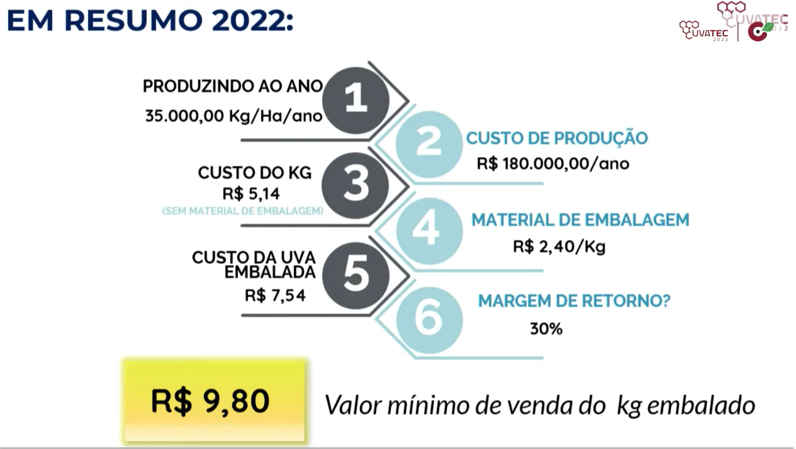
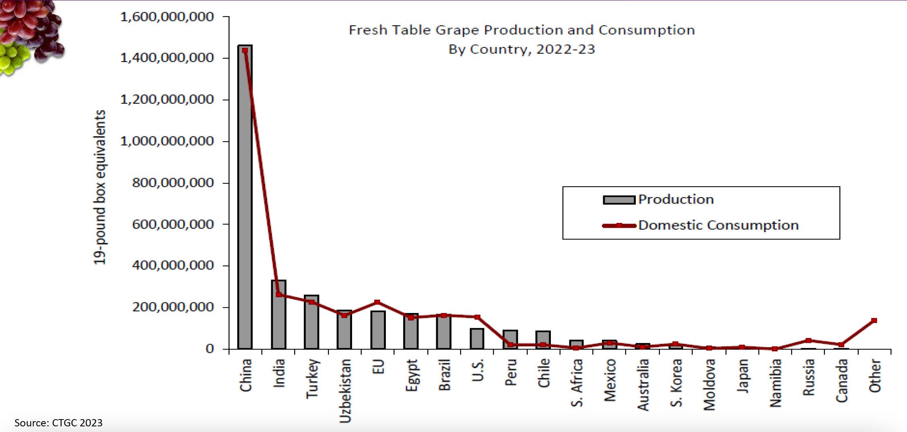
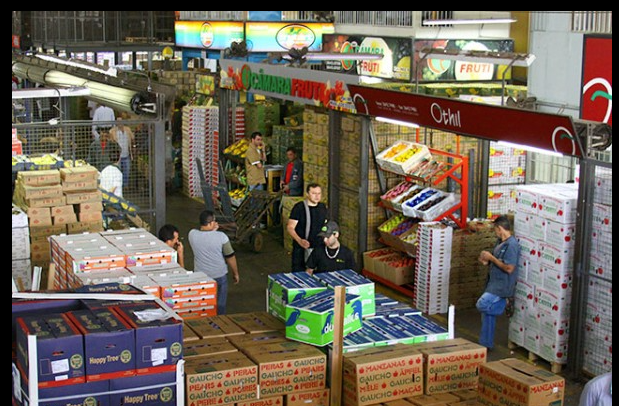
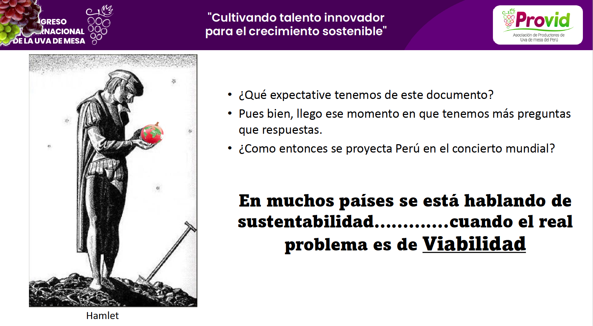
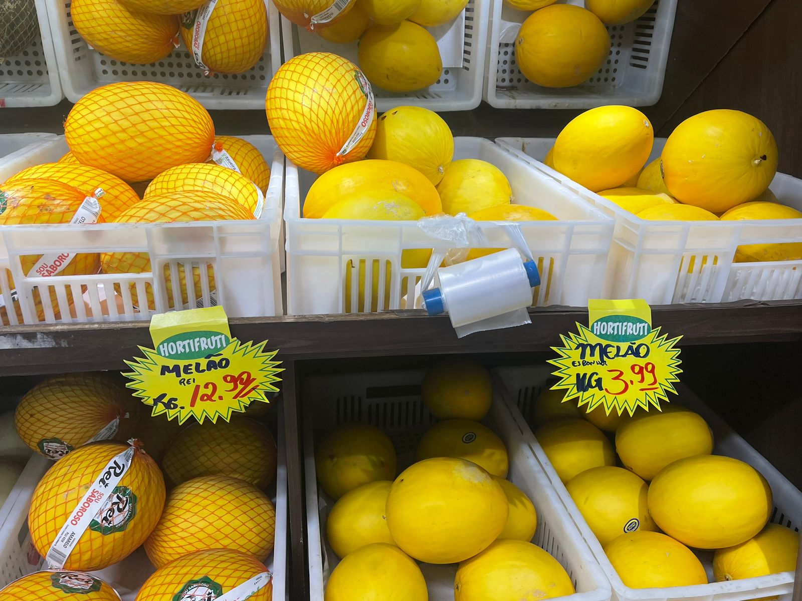
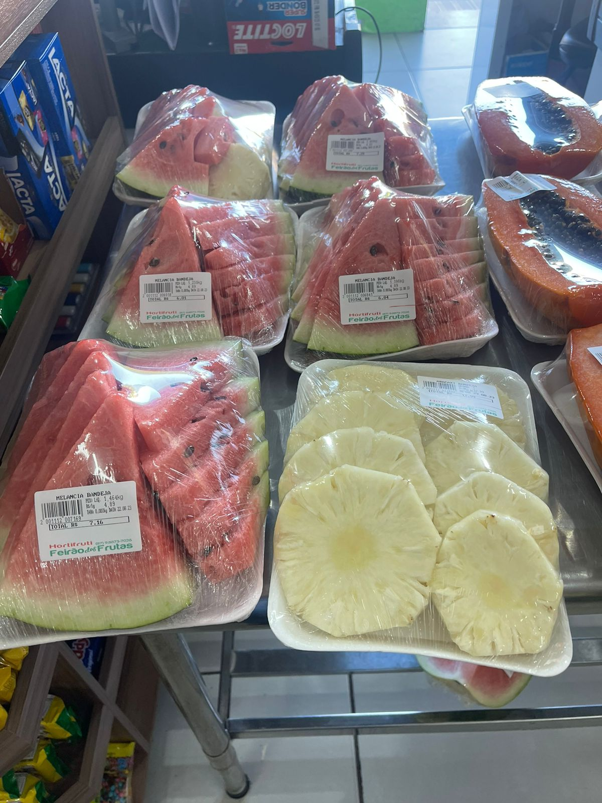
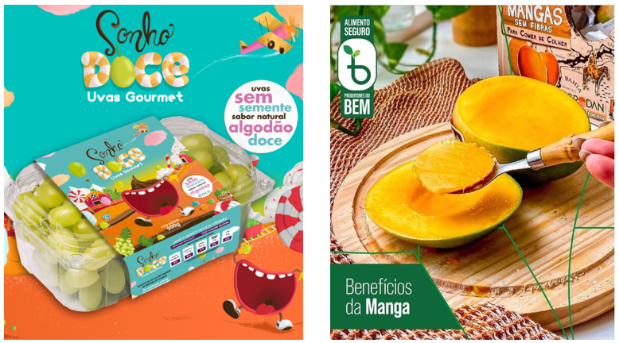
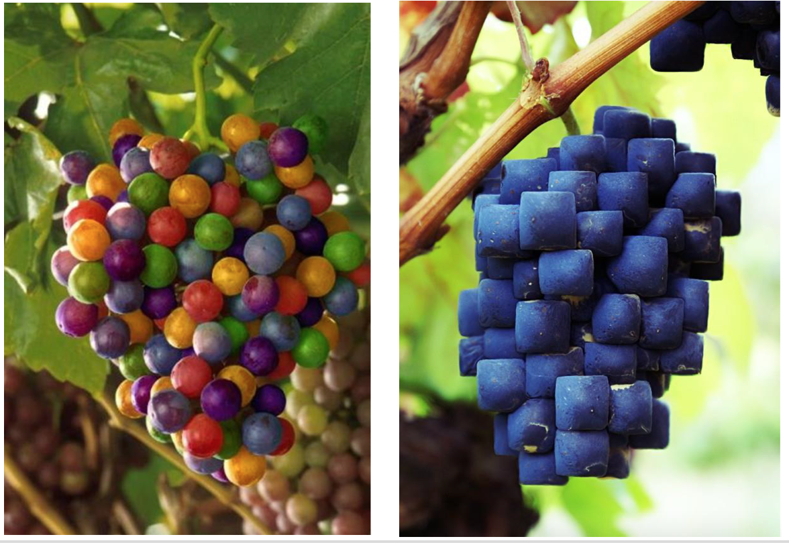
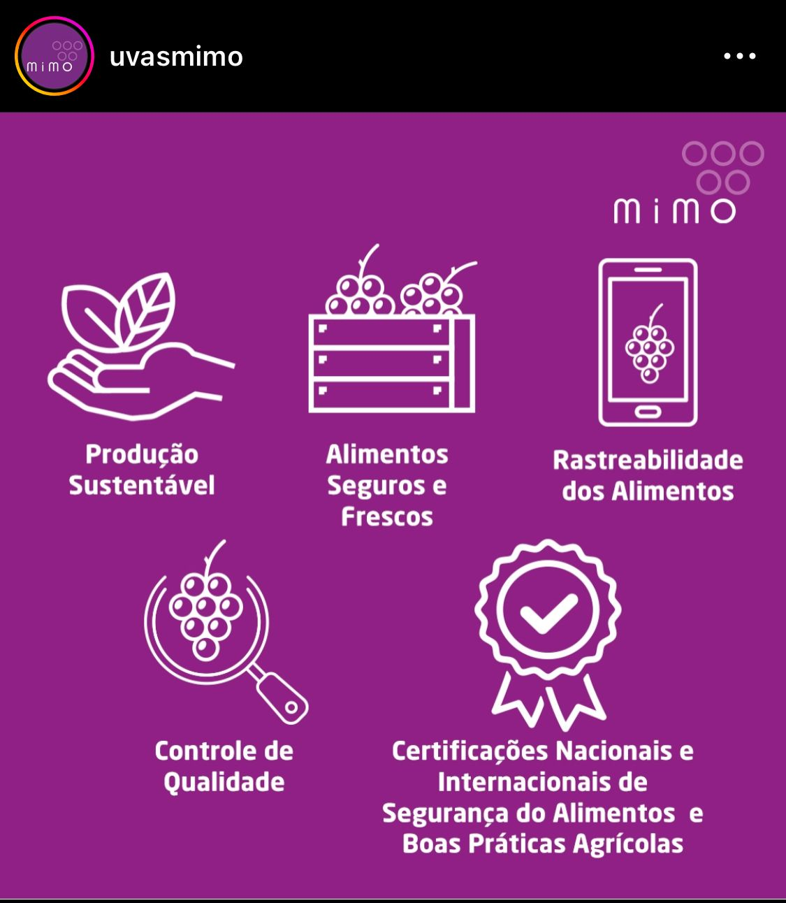
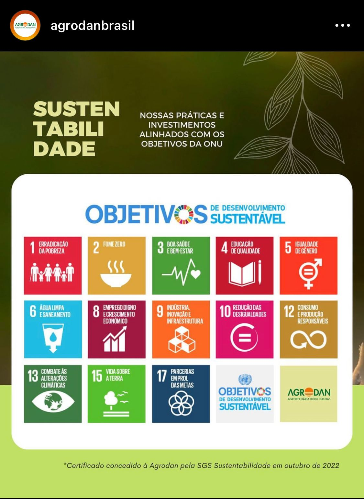

class: center, middle

```{r setup, include=FALSE}
# Dependências dos slides/aula
library(knitr)          # CRAN v1.33
library(rmarkdown)      # CRAN v2.10
library(xaringan)       # CRAN v0.22
library(xaringanthemer) # CRAN v0.3.0
library(xaringanExtra)  # [github::gadenbuie/xaringanExtra] v0.5.5
library(RefManageR)     # CRAN v1.3.0
library(ggplot2)        # CRAN v3.3.5
library(fontawesome)    # [github::rstudio/fontawesome] v0.1.0
library(pagedown)
library(scales)
library(plotly)
library(dplyr)
library(reshape2)
library(readxl)

# Opções de chunks
options(htmltools.dir.version = FALSE)
knitr::opts_chunk$set(
  echo       = FALSE,
  warning    = FALSE,
  message    = FALSE,
  fig.retina = 3,
  fig.width  = 10,
  fig.asp    = 0.6,
  out.width  = "80%",
  fig.align  = "center",
  comment    = "#"
  )

# Cores para gráficos
colors <- c(
  blue       = "#282f6b",
  red        = "#b22200",
  yellow     = "#eace3f",
  green      = "#224f20",
  purple     = "#5f487c",
  orange     = "#b35c1e",
  turquoise  = "#419391",
  green_two  = "#839c56",
  light_blue = "#3b89bc",
  gray       = "#666666"
  )
```

```{r xaringan, echo=FALSE}
# Tema da apresentação
xaringanthemer::style_mono_light(
  base_color                      = unname(colors["blue"]),
  title_slide_background_image    = params$logo_slides, 
  title_slide_background_size     = 12,
  title_slide_background_position = "bottom 10px right 20px",
  title_slide_background_color    = "white",
  title_slide_text_color          = unname(colors["blue"]),
  footnote_position_bottom        = "15px"
  )

# Opções extras do tema
xaringanExtra::use_progress_bar(
  color    = colors["blue"], 
  location = "bottom"
  )
xaringanExtra::use_extra_styles(
  hover_code_line         = TRUE,
  mute_unhighlighted_code = FALSE
  )
xaringanExtra::use_panelset()
```

```{css, echo=FALSE}
pre {
  white-space: pre-wrap;
  overflow-y: scroll !important;
  max-height: 45vh !important;
  overflow-x: auto;
  max-width: 100%;
}
```

```{r load_refs, echo=FALSE, eval=params$references}
# Configuração de citações
RefManageR::BibOptions(
  check.entries = FALSE,
  bib.style     = "authoryear",
  cite.style    = "authoryear",
  style         = "markdown",
  hyperlink     = FALSE,
  dashed        = FALSE
  )
if(params$references){
  temp_refbib <- tempdir()
  download.file(
    url      = params$references_path, 
    destfile = paste0(temp_refbib, "/references.bib"), 
    mode     = "wb"
    )
  myBib <- RefManageR::ReadBib(paste0(temp_refbib, "/references.bib"), check = FALSE)
  }

# Como citar?
# RefManageR::TextCite(myBib, "id_da_citacao")
```

```{r utils, echo=FALSE}
# Função que pega um arquivo .Rmd, condicionalmente o renderiza, 
# e embute o conteúdo do mesmo formatado como Markdown puro 
# no output do documento atual
print_rmd <- function(file, encoding = "UTF-8", render = TRUE){
  if(render){rmarkdown::render(input = file, quiet = TRUE)}
  rmd <- readLines(con = file, encoding = encoding)
  cat("```md\n")
  cat(rmd, sep = "\n")
  cat("```\n")
}
```

### A PRODUÇÃO DE RIQUEZA NO BRASIL

```{r, echo=FALSE, out.width="80%"}
knitr::include_graphics("imgs/fig15.png")
```
Fonte: Navarro, 2021.

---
class: center

### A IMPORTÂNCIA DA PRODUÇÃO DE HF NO NORDESTE

```{r, echo=FALSE, out.width="90%"}
knitr::include_graphics("imgs/fig16.png")
```
Fonte: CNA, 2021.

---
class: center

### A TECNOLOGIA

```{r, echo=FALSE, out.width="98%"}
knitr::include_graphics("imgs/fig17.png")
```

---
class: center
### CUSTO MÉDIO UVA VALE DO SÃO FRANCISCO

```{r, echo=FALSE, out.width="80%"}

```
Fonte: Central de Adubos (UvaTec 2022), 2023.

---
class: center
### O QUE O VALE DO SÃO FRANCISCO FAZ PARA BAIXAR CUSTOS?

```{r, echo=FALSE, out.width="50%"}
knitr::include_graphics("https://media.giphy.com/media/1xVbSX8UzIiMPMZjZP/giphy.gif")
```

---
class: center
### EVOLUÇÃO DA PRODUTIVIDADE UVA PAM/IBGE

```{r senar2}
setwd('/Users/jricardofl/Dropbox/Embrapa/2023/UPE Agro 4.0/2023/aula2/dados')

mycolor1 <- c("purple", "orange", "lightblue3")

#Inicio do Script
#Entrando dados no R
dados1 <- read_excel('produt_uva.xlsx', col_names = TRUE)
dados1[,1] <- seq(2001, 2022, by = 1)

#melt data frame into long format
dados1m <- melt(dados1,  id.vars = 'Ano', variable.name = 'regioes')

g2 <- ggplot(data=dados1m, aes(x=Ano, y=value/1000)) +  #estetica vai valer para todos os geom's
    geom_col(aes(fill=regioes), lwd=1, position = "dodge")+
  scale_fill_manual(values=mycolor1)+
  labs(y= "Toneladas por hectare", x= "Anos", title='Evolução da Produtividade da Uva: 2001-2022',
       caption = "Fonte: IBGE (2023)") +
  scale_y_continuous(limits=c(0, 50), n.breaks = 10, expand = expansion(add=c(0,0.5)))+
  scale_x_continuous(breaks = seq(2001, 2022, by = 1))+
  theme_classic()+ #Definindo tema
  theme(axis.text.x=element_text(angle=0, hjust=0.5, size=10, margin = margin(b=5)),
        axis.text.y=element_text(hjust=1, size=12, margin = margin(l=10)),
        axis.title.x = element_text(size=12, face = "bold", margin = margin(b=0)),
        axis.title.y = element_text(size=12, face = "bold", margin = margin(l=20)),
        plot.title = element_text(hjust = 0.5, size=14),
        plot.caption = element_text(hjust = 0, size=8),
        legend.position = "bottom", legend.title = element_blank(),
        legend.text=element_text(size=12)) # Definindo posição da legenda legenda

g2
```

---
class: center, middle
### PRODUÇÃO X OFERTA

.pull-left[

- E assim... passados "x" dias, a safra (produção total) pode ser colhida!

- A **Oferta** é a quantidade de determinado bem que os produtores desejam vender em um determinado período.

- A **Função de Oferta** é dada por $S_i=f(p_i, \pi_m, p_n, O)$, em que $S_i$ é a quantidade ofertada do bem i no instante t; $p_i$ é o preço do bem i; $\pi_m$ é o preço dos fatores e insumos de produção m; $p_n$ preço de outros n bens, substitutos na produção; O seriam os objetivos e metas do empresário.
]

.pull-right[

```{r, echo=FALSE, out.width="80%"}
knitr::include_graphics("https://media.giphy.com/media/ibqAlAwAmOwtEaPyS0/giphy.gif")
```
]

---
class: center
### ANÁLISE DA PRODUÇÃO DE UVA PAM/IBGE

```{r senar1}
setwd('/Users/jricardofl/Dropbox/Embrapa/2023/UPE Agro 4.0/2023/aula1/dados')

#Inicio do Script
#Pacotes a serem utilizados

#Entrando dados no R
dados1 <- read_excel("tabela1.xlsx", col_names = TRUE)

mycolor2 <- "purple"

g1 <- 
  ggplot(data = dados1) +  #estetica vai valer para todos os geom's
  geom_col(aes(x=Ano, y=Uva/1000, fill="Volume (Mil Toneladas)"), lwd=1)+
  scale_fill_manual(values=mycolor2)+
  labs(y= "Mil Toneladas", x= "Anos", title='Evolução do Volume com Uva no Nordeste: 2001-2022',
       caption = "Fonte: IBGE (2023)") +
  scale_y_continuous(limits=c(0, 550), n.breaks = 8, expand = expansion(add=c(0,0.5)))+
  theme_classic()+ #Definindo tema
  theme(axis.text.x=element_text(angle=0, hjust=0.5, size=10, margin = margin(b=5)),
        axis.text.y=element_text(hjust=1, size=12, margin = margin(l=10)),
        axis.title.x = element_text(size=12, face = "bold", margin = margin(b=0)),
        axis.title.y = element_text(size=12, face = "bold", margin = margin(l=20)),
        plot.title = element_text(hjust = 0.5, size=14),
        plot.caption = element_text(hjust = 0, size=8),
        legend.position = "bottom", legend.title = element_blank(),
        legend.text=element_text(size=12)) # Definindo posição da legenda

g1
```

---
class: center
### DESTINO DA SAFRA: MERCADO EXTERNO.

```{r, echo=FALSE, out.width="80%"}
knitr::include_graphics("https://media.giphy.com/media/ieyVDDdyPJdZaKUJbD/giphy.gif")
```

---
class: center
### ANÁLISE DAS EXPORTAÇÕES DE UVA

``` {r senar5}
#Direcionado o R para o Diretorio a ser trabalhado
setwd('/Users/jricardofl/Dropbox/tempecon/dados_uva')

#Inicio do Script
#Pacotes a serem utilizados 
library(mFilter)
library(forecast)
library(tsutils)
library(seasonal)
library(ggplot2)
library(uroot)
library(tseries)
library(ggthemes)
library(dplyr)
library(quantmod)
library(scales)
library(kableExtra)# complex tables
library(lmtest)
library(FinTS)
library(rbcb)
library(plotly)
library(DT)
library(magrittr)
library(rmarkdown)
library(reshape2)
library(rbcb)
library(tidyverse)

checkX13()

options(digits=4)

library(lubridate)
anterior <- as.Date("2023-09-01")
atual <-  as.Date("2023-10-01")
#today <- as.Date("2022-02-11")
mes <- 10

#Entrando dados no R
dados1 <- read.csv2('exportacoes_2016_2023.csv', header=T, sep=";", dec = ".")
dados1 <- dados1/1000
dados1[,1] <- seq(2016, 2023, by = 1)
colnames(dados1) = c('Ano', 'Valor', "Toneladas")
dados1 <- tibble(dados1)

#Entrando dados no R
dados2 <- read.csv2('total_exporta_uva_br.csv', header=T, sep=";", dec = ".")
#dados <- dados[,-c(9:10)] #retirar as ultimas colunas
colnames(dados2)[1]<-'ano'

#Entrando dados no R
dados3 <- read.csv2('destinos_2023.csv', header=T, sep=";", dec = ".")
colnames(dados3) = c('Paises', "Participacao")

#Entrando dados no R
dados4 <- read.csv2('via_2023.csv', header=T, sep=";", dec = ".")
colnames(dados4) = c('Vias', "Participacao")

#Entrando dados no R
dados5 <- read.csv2('uf_2023.csv', header=T, sep=";" , dec = ".")
colnames(dados5) = c('UF', "Participacao")

# Entrando dados no R
dados7 <- read.csv2('importacao.csv', header=T, sep=";" , dec = ".")
dados7 <- dados7[,-c(1,2)]
colnames(dados7) = c('Chile', 'Argentina', 'Peru')

#Ajusta para Valor
#Analise de Serie Temporal
exporta_uva_valor <- dados2[,3]
exporta_uva_valor<-exporta_uva_valor/1000
exporta_uva_valor <- ts(exporta_uva_valor, start=c(2016,1), freq=12)

#Tendencia
trend_valor <- cmav(exporta_uva_valor, outplot=F)
date <- seq(as.Date('2016-01-01'),to=atual,by='1 month') 
trend_valor <- tibble(date, trend_valor)

#Sazonalidade
decompa<-decompose(exporta_uva_valor, type = 'multiplicative')
sazonal_valor <- decompa$figure
#meses <- seq(1:12)
meses <- seq(as.Date("2021/1/1"), by = "month", length.out = 12) 
sazonal_graph <- tibble(meses, sazonal_valor)

#Comparações com os anos e entre as médias/max/min

exporta_uva_valor_2020 <- window(exporta_uva_valor, end=c(2020,12))
seas20<-seasplot(exporta_uva_valor_2020, trend=F, outplot = F)
medias20 <- colMeans(seas20$season)

exporta_uva_valor_2021 <- window(exporta_uva_valor, end=c(2021,12))

exporta_uva_valor_2022 <- window(exporta_uva_valor, end=c(2022,12))
#medias21 <- colMeans(seas21$season)

exporta_uva_valor_23 <- as.matrix(tail(exporta_uva_valor,mes)) 
exporta_uva_valor_2023 <- matrix(NA, nrow=12, ncol=1)

for(i in 1:mes){
  exporta_uva_valor_2023[i,1] = exporta_uva_valor_23[i,1]
}
  
#Como só se tem até a semana 12
medias20 <- medias20[1:12]

matrix = matrix(NA, nrow=12, ncol=2)

for(i in 1:12){
  matrix[i,1] = min(seas20$season[,i])
  matrix[i,2] = max(seas20$season[,i])
}

#time <- c("Janeiro", "Fevereiro", "Março", "Abril", "Maio", "Junho", "Julho", "Agosto", "Setembro", "Outubro", "Novembro", #"Dezembro")
#time <-seq(1:12)
table <- data.frame(meses, matrix[,1], round(medias20,3), matrix[,2], round(tail(exporta_uva_valor_2021,12),3),
                    round(tail(exporta_uva_valor_2022,12),3), exporta_uva_valor_2023[,1])
colnames(table) = c('Meses', 'Mínimo', 'Média', 'Máximo', '2021', '2022', 
                    '2023')

tablea <- table[,-c(5:7)]
tableb <- table[,-c(2,3,4)]

tablea2 <- melt(tablea, id.var='Meses')
tableb2 <- melt(tableb, id.var='Meses')
mycolors <- c("lightblue3", "gray44", "gold")

#Ajusta para Volume
#Analise de Serie Temporal
exporta_uva_volume <- dados2[,4]
exporta_uva_volume<-exporta_uva_volume/1000  #passando de quilo para tonelada

#Ajuste para a variação Mensal do Volume

variacao_volume_21 <-  dados2 %>% filter(ano=='2021')
variacao_volume_22 <-  dados2 %>% filter(ano=='2022')
variacao_volume_23 <-  dados2 %>% filter(ano=='2023')

variacao_volume_21 <-  variacao_volume_21[,4]/1000
variacao_volume_22 <-  variacao_volume_22[,4]/1000
variacao_volume_23 <-  variacao_volume_23[,4]/1000

#Setando como uma série temporal
exporta_uva_volume <- ts(exporta_uva_volume, start=c(2016,1), freq=12)

#Tendencia
trend_volume <- cmav(exporta_uva_volume, outplot=F)
trend_volume <- tibble(date, trend_volume)

#Sazonalidade
decompa<-decompose(exporta_uva_volume, type = 'multiplicative')
sazonal_volume <- decompa$figure
sazonal_graph_volume <- tibble(meses, sazonal_volume)

#Comparações com os anos e entre as médias/max/min

exporta_uva_volume_2020 <- window(exporta_uva_volume, end=c(2020,12))
seas20_vol<-seasplot(exporta_uva_volume_2020, trend=F, outplot = F)
medias20_vol <- colMeans(seas20_vol$season)

exporta_uva_volume_2021 <- window(exporta_uva_volume, end=c(2021,12))

exporta_uva_volume_2022 <- window(exporta_uva_volume, end=c(2022,12))

exporta_uva_volume_23 <- as.matrix(tail(exporta_uva_volume,mes)) #ajustar mensalmente
exporta_uva_volume_2023 <- matrix(NA, nrow=12, ncol=1)

for(i in 1:mes){
  exporta_uva_volume_2023[i,1] = exporta_uva_volume_23[i,1]
}
  
#Como só se tem até a semana 12
medias20_vol <- medias20_vol[1:12]

matrix_vol = matrix(NA, nrow=12, ncol=2)

for(i in 1:12){
  matrix_vol[i,1] = min(seas20_vol$season[,i])
  matrix_vol[i,2] = max(seas20_vol$season[,i])
}

#time <- c("Janeiro", "Fevereiro", "Março", "Abril", "Maio", "Junho", "Julho", "Agosto", "Setembro", "Outubro", "Novembro", #"Dezembro")
#time <-seq(1:12)
table_volume <- data.frame(meses, round(matrix_vol[,1],0), round(medias20_vol,0), round(matrix_vol[,2],0), round(tail(exporta_uva_volume_2021,12),0),
round(tail(exporta_uva_volume_2022,12),0), round(exporta_uva_volume_2023[,1],0))
colnames(table_volume) = c('Meses', 'Mínimo', 'Média', 'Máximo', '2021', '2022', 
                    '2023')

tablea_vol <- table_volume[,-c(2,4:7)]
tableb_vol <- table_volume[,-c(2:4)]

tablea2_vol <- melt(tablea_vol, id.var='Meses')
tableb2_vol <- melt(tableb_vol, id.var='Meses')


#Variação Mensal 2021

variacao_volume_2021 <- as.matrix(variacao_volume_21)
variacao_volume_2022 <- as.matrix(variacao_volume_22)
variacao_volume_2023 <- matrix(NA, nrow=12, ncol=1)
variacao_volume_23 <- as.matrix(variacao_volume_23)

for(i in 1:mes){
  variacao_volume_2023[i,1] = variacao_volume_23[i,1]
}

variacao_22 <- ((variacao_volume_2022/variacao_volume_2021) - 1)*100
variacao_23 <- ((variacao_volume_2023/variacao_volume_2022) - 1)*100

variacao <- data.frame(meses, variacao_22, variacao_23)
colnames(variacao) = c('Meses', 'Variação 2022 e 2021', 'Variação 2023 e 2022')

variacaom <- melt(variacao, id.var='Meses')

mycolors2 <- c("orange", "lightblue3")

#Dados de Importação
importacao <- tibble(date, dados7)
importacao <- melt(importacao, id.var='date')

#Gráfico com Ggplot2

mycolor1 <- "gold"
mycolor2 <- "red"

g5 <- ggplot(data=dados1) +  #estetica vai valer para todos os geom's
  geom_col(aes(x=Ano, y=Toneladas, fill="Toneladas"), lwd=1)+
    scale_fill_manual(values=mycolor1)+
  geom_line(aes(x=Ano, y=Valor, colour="Mil Dólares"), size=2)+
  scale_colour_manual(values=mycolor2)+
  labs(y= "US$ Mil / Ton", x= "Anos", title='',
       caption = "Fonte: Comexstat reprocessado pelo Observatório de Mercado de Uva da Embrapa, 2023.") +
  scale_y_continuous(limits=c(0, 160000), n.breaks = 10, expand = expansion(add=c(0,0.5)))+
  scale_x_continuous(breaks = seq(2016, 2023, by = 1))+
  theme_classic()+ #Definindo tema
  theme(axis.text.x=element_text(angle=0, hjust=0.5, size=10, margin = margin(b=5)),
        axis.text.y=element_text(hjust=1, size=12, margin = margin(l=10)),
        axis.title.x = element_text(size=12, face = "bold", margin = margin(b=0)),
        axis.title.y = element_text(size=12, face = "bold", margin = margin(l=20)),
        plot.title = element_text(hjust = 0.5, size=14),
        plot.caption = element_text(hjust = 0, size=8),
        legend.position = "bottom", legend.title = element_blank(),
        legend.text=element_text(size=12)) # Definindo posição da legenda legenda

g5
```

---
class: center
### ANÁLISE DAS EXPORTAÇÕES DE UVA

``` {r senar6}

g6 <- ggplot()+
  geom_col(data=tableb2_vol, aes(x=Meses, y=value, fill=variable), lwd=1,
           position = "dodge")+
  scale_fill_manual(values=mycolors)+
  geom_line(data=tablea2_vol, aes(x=Meses, y=value, colour=variable), linetype = "solid",
            size = 1)+
    scale_colour_manual(values = c("chocolate")) +
    scale_y_continuous(limits = c(0, 25000), n.breaks = 10)+
    scale_x_date(date_breaks = "1 month",
               labels = date_format("%B"))+
  labs(y= "Toneladas", x= "Meses do Ano", title='',
       caption = "Fonte: Comexstat reprocessado pelo Observatório de Mercado de Uva da Embrapa, 2023")+
  theme_classic()+ #Definindo tema
  theme(axis.text.x=element_text(angle=0, hjust=0.5, size=10, margin = margin(b=5)),
        axis.text.y=element_text(hjust=1, size=12, margin = margin(l=10)),
        axis.title.x = element_text(size=12, face = "bold", margin = margin(b=0)),
        axis.title.y = element_text(size=12, face = "bold", margin = margin(l=20)),
        plot.title = element_text(hjust = 0.5, size=14),
        plot.caption = element_text(hjust = 0, size=8),
        legend.position = "bottom", legend.title = element_blank(),
        legend.text=element_text(size=12)) # Definindo posição da legenda legenda

g6
```

---
class: center
### ANÁLISE DAS EXPORTAÇÕES DE UVA

``` {r senar7}
#Gráfico com Ggplot2

mycolor1 <- "gold"

g7 <- ggplot(data=dados3) +  #estetica vai valer para todos os geom's
  geom_col(aes(x = reorder(Paises, -Participacao), y= Participacao, fill="% do Total"), lwd=1)+
    scale_fill_manual(values=mycolor1) +
  labs(y= "% do Volume Total Exportados", x= "Países", title='',
       caption = "Fonte: COMEXSTAT reprocessado pelo Observatório de Mercado de Uva da Embrapa, 2023.")+
  scale_y_continuous(limits=c(0, 35), n.breaks = 10, expand = expansion(add=c(0,0.5)))+
  theme_classic()+ #Definindo tema
  theme(axis.text.x=element_text(angle=25, hjust=1, size=10, margin = margin(b=5)),
        axis.text.y=element_text(hjust=1, size=12, margin = margin(l=10)),
        axis.title.x = element_text(size=12, face = "bold", margin = margin(b=0)),
        axis.title.y = element_text(size=12, face = "bold", margin = margin(l=20)),
        plot.title = element_text(hjust = 0.5, size=14),
        plot.caption = element_text(hjust = 0, size=8),
        legend.position = "bottom", legend.title = element_blank(),
        legend.text=element_text(size=12)) # Definindo posição da legenda legenda

g7
``` 

---
class: center
### ANÁLISE DAS IMPORTAÇÕES DE UVA

``` {r senar8}
mycolors3 <- c("orange", "lightblue3", "red")

g8 <- ggplot()+
geom_col(data=importacao, aes(x=date, y=value, fill=variable), lwd=1, position = "dodge")+
  scale_fill_manual(values=mycolors3)+
    scale_x_date(date_breaks = "6 months",
               labels = date_format("%b-%y"),expand = expansion(add=c(0,0)))+
  labs(y= "Volume (Toneladas)", x= "Meses do Ano", title='',
       caption = "Fonte: COMEXSTAT reprocessado pelo Observatório de Mercado de Uva da Embrapa, 2023.")+
  theme_classic()+ #Definindo tema
  theme(axis.text.x=element_text(angle=0, hjust=0.5, size=10, margin = margin(b=5)),
        axis.text.y=element_text(hjust=1, size=12, margin = margin(l=10)),
        axis.title.x = element_text(size=12, face = "bold", margin = margin(b=0)),
        axis.title.y = element_text(size=12, face = "bold", margin = margin(l=20)),
        plot.title = element_text(hjust = 0.5, size=14),
        plot.caption = element_text(hjust = 0, size=8),
        legend.position = "bottom", legend.title = element_blank(),
        legend.text=element_text(size=12)) # Definindo posição da legenda legenda

g8
```

---
class: center
### 98% DAS EXPORTAÇÕES DE UVA TEM ORIGEM NO VALE DO SÃO FRANCISCO, 13% DA PRODUÇÃO EM 2022.

```{r, echo=FALSE, out.width="80%"}
knitr::include_graphics("https://media.giphy.com/media/CslvoHDJ38mIS7w8b4/giphy.gif")
```

---
class: center
### PRODUÇÃO E CONSUMO INTERNO DE UVA EM PAÍSES

```{r, echo=FALSE, out.width="90%"}

```
Fonte: SALGADO, 2023. CONGRESSO UVA DE MESA DO PERÚ

---
class: center
### DESTINO DA SAFRA: MERCADO INTERNO.

```{r, echo=FALSE, out.width="70%"}

```

---
class: center
### ANÁLISE DOS PREÇOS DE UVA BRANCA SEM SEMENTE EMBALADA

``` {r senar9}
library(imputeTS)
library(tsutils)
data <- as.Date("2023-11-03")
sem_ano <- 44 #ajustar semanalmente

#Direcionado o R para o Diretorio a ser trabalhado
setwd('/Users/jricardofl/Dropbox/tempecon/dados_Uva')

options(digits=4)

#Entrando dados no R Branca Arra-15
dados1 <- read.csv2('dados_uva_arra_semana.csv', header=T, sep=";", dec=".")
#dados <- dados[,-c(9:10)] #retirar as ultimas colunas
colnames(dados1)[1]<-'produto'


#Entrando dados no R Vitoria com Embalagem
dados2 <- read.csv2('dados_uva_vitoria_semana.csv', header=T, sep=";", dec=".")
#dados <- dados[,-c(9:10)] #retirar as ultimas colunas
colnames(dados2)[1]<-'produto'


#Entrando dados no R Vitoria sem Embalagem
dados3 <- read.csv2('dados_uva_vitoriaSE_semana.csv', header=T, sep=";", dec=".")
#dados <- dados[,-c(9:10)] #retirar as ultimas colunas
colnames(dados3)[1]<-'produto'


#organização das bases para Uva Branca e Vitoria Embalada

#Entrando dados no R - Deflator
igpdi <- read.csv2('igpdi_uva.csv', 
                   header=T, sep=";",
                   dec=".")
colnames(igpdi)[1]<-'ano'

#Juntar tudo em um unico tibble
dados <- full_join(dados1, dados2) %>% full_join(igpdi)

#Resolver os Missing
dados <-na_kalman(dados)

#Deflacionar a série de precos
dados$preco_def <- dados[,4]*(tail(dados[,5],1)/dados[,5])

#Criando uma variável com as datas semanais
dados$date <- seq(as.Date('2017-01-07'),to=data,by='1 week')

#Passar para um Tibble
dados <- tibble(dados)

#Ajustando como uma série temporal
dados <- dados %>% 
  select(c(date, produto, preco_def, ano))

#organização da base para Vitoria Sem Embalagem

igpdi2 <- igpdi %>% filter(ano >= '2019')

#Juntar tudo em um unico tibble
dadosv <- full_join(dados3, igpdi2)

#Resolver os Missing
dadosv <-na_kalman(dadosv)

#Deflacionar a série de precos
dadosv$preco_def <- dadosv[,4]*(tail(dadosv[,5],1)/dadosv[,5])

#Criando uma variável com as datas semanais
dadosv$date <- seq(as.Date('2019-01-07'),to=data,by='1 week')

#Passar para um Tibble
dadosv <- tibble(dadosv)

#Ajustando como uma série temporal
dadosv <- dadosv %>% 
  select(c(date, produto, preco_def, ano))


#Geração das tendencias

arra <- dados%>% filter(produto=="arra_15")
vitoria <- dados %>% filter(produto=="vitoria")
vitoriase <- dadosv

preco_arra <- ts(arra[,3], start=c(2017,1), freq=52)
sazonal_arra <- cmav(preco_arra, outplot = F)

preco_vitoria <- ts(vitoria[,3], start=c(2017,1), freq=52)
sazonal_vitoria <- cmav(preco_vitoria, outplot = F)

preco_vitoriase <- ts(vitoriase[,3], start=c(2019,1), freq=52)
sazonal_vitoriase <- cmav(preco_vitoriase, outplot = F)

# Parte 2
#Decompor a Série
decompa<-decompose(preco_arra, type = 'multiplicative')

sazonalidade <- decompa$figure
semanas <- seq(1:52)
sazonal_graph <- tibble(cbind(semanas, sazonalidade))

#Parte 3
#Analise das comparações entre as médias
preco_arra_2020 <- window(preco_arra, end=c(2020,52))
seas20<-seasplot(preco_arra_2020, trend=F, outplot = F)
medias20 <- colMeans(seas20$season)

preco_arra_2021 <- window(preco_arra, end=c(2021,52))

preco_arra_2022 <- window(preco_arra, end=c(2022,52))
#seas21<-seasplot(preco_palmer_2021, trend=F, outplot = F)
#medias21 <- colMeans(seas21$season)

preco_arra_23 <- as.matrix(tail(arra$preco_def,sem_ano))   
preco_arra_2023 <- matrix(NA, nrow=52, ncol=1)

for(i in 1:sem_ano){
  preco_arra_2023[i,1] = preco_arra_23[i,1]
}
  

#Como só se tem até a semana 52
medias20 <- medias20[1:52]
#medias21 <- medias21[1:52]

matrix = matrix(NA, nrow=52, ncol=2)

for(i in 1:52){
  matrix[i,1] = min(seas20$season[,i])
  matrix[i,2] = max(seas20$season[,i])
}

time <- seq(1:52)
table <- data.frame(time, matrix[,1], round(medias20,2), matrix[,2], round(tail(preco_arra_2021,52),2),
                    round(tail(preco_arra_2022,52),2), preco_arra_2023[,1])
colnames(table) = c('Semanas', 'Mínimo', 'Média', 'Máximo', 'Ano 2021', 'Ano 2022', 'Ano 2023')
tablea <- table[,-c(2,4:7)]
tableb <- table[,-c(2,3,4)]

tablea2 <- melt(tablea, id.var='Semanas')
tableb2 <- melt(tableb, id.var='Semanas')
mycolors <- c("dodgerblue2", "gold", "darkmagenta")

# Customizar tema interativamente em tempo real (ver mensagens no console)
#bslib::bs_themer()

g9 <- ggplot(data=arra, aes(x=date)) +  #estetica vai valer para todos os geom's
  geom_line(aes(y=preco_def, colour="PREÇO"), lwd=1)+
  geom_line(aes(y=sazonal_arra, colour="TENDÊNCIA"), lwd=1)+
  scale_colour_manual("", 
                      breaks = c("PREÇO", "TENDÊNCIA"),
                      values = c("blue", "red")) +
  labs(y= "Preço R$", x= "Semanas de cada Ano", title='Evolução dos preços ao produtor e Tendência Uva Branca Embalada',
       caption = "Fonte: CEPEA reprocessado pelo Observatório de Mercado de Uva da Embrapa, 2023.") +
  scale_y_continuous(limits=c(0,18), n.breaks = 10, expand = expansion(add=c(0,0.5)), 
                     labels=number_format(accuracy = 0.01, decimal.mark = ","))+
  scale_x_date(date_breaks = "1 year",
               labels = date_format("%Y"))+
  theme_classic()+ #Definindo tema
  theme(axis.text.x=element_text(angle=0, hjust=0.5, size=8, margin = margin(b=10)),
        axis.text.y=element_text(hjust=0.5, size=8, margin = margin(l=10)),
        axis.title.x = element_text(size=8, face = "bold", margin = margin(b=10)),
        axis.title.y = element_text(size=8, face = "bold", margin = margin(l=10)),
        plot.title = element_text(hjust = 0.5, size=12),
        plot.caption = element_text(hjust = 0, size=8),
        legend.position = c(2,1),
        legend.justification = c(1.2, 1.2),
        legend.text=element_text(size=8)) # Definindo posição da legenda

g9
```

---
class: center
### ANÁLISE DOS PREÇOS DE UVA BRANCA SEM SEMENTE EMBALADA

``` {r senar10}
g10 <- ggplot()+
  geom_col(data=tableb2, aes(x=Semanas, y=value, fill=variable), size=2, width = 0.7,
           position = "dodge")+
  scale_fill_manual(values=mycolors)+
    geom_line(data=tablea2, aes(x=Semanas, y=value, colour=variable), linetype = "solid",
            size = 1)+
  scale_colour_manual(values = c("chocolate")) +
  scale_y_continuous(limits = c(0, 16), n.breaks = 10, labels = number_format(accuracy = 0.01,
                                                       decimal.mark = ","))+
  scale_x_continuous(breaks = seq(1, 52, by = 2))+
  labs(y= "Preço R$", x= "Semanas de cada Ano", title='Média histórica e preços de 2021 a 2023 de Uva Branca Embalada',
       caption = "Fonte: CEPEA reprocessado pelo Observatório de Mercado de Uva da Embrapa, 2023.")+
   theme_classic()+
  theme(axis.text.x=element_text(angle=0, hjust=0.5, size=8, margin = margin(b=10)),
        axis.text.y=element_text(hjust=0.5, size=8, margin = margin(l=10)),
        axis.title.y = element_text(size=8, face = "bold"),
        axis.title.x = element_text(size=8, face = "bold"),
        panel.grid.major = element_blank(),
        panel.grid.minor = element_blank(),
        plot.title = element_text(hjust = 0.5, size=12),
        plot.caption = element_text(hjust = 0, size=8),
        legend.position = "bottom", legend.title = element_blank(),
        legend.text=element_text(size=8)) # Definindo posição da legenda

g10
```


---
class: center
### ANÁLISE DOS PREÇOS DE UVA NEGRA SEM SEMENTE EMBALADA

``` {r senar11}

# Customizar tema interativamente em tempo real (ver mensagens no console)
#bslib::bs_themer()

g11 <- ggplot(data=vitoria, aes(x=date)) +  #estetica vai valer para todos os geom's
  geom_line(aes(y=preco_def, colour="PREÇO"), lwd=1)+
  geom_line(aes(y=sazonal_vitoria, colour="TENDÊNCIA"), lwd=1)+
  scale_colour_manual("", 
                      breaks = c("PREÇO", "TENDÊNCIA"),
                      values = c("blue", "red")) +
  labs(y= "Preço R$", x= "Semanas de cada Ano", title='Evolução dos preços ao produtor e Tendência Uva Negra Embalada',
       caption = "Fonte: CEPEA reprocessado pelo Observatório de Mercado de Uva da Embrapa, 2023.") +
  scale_y_continuous(limits=c(0,18), n.breaks = 10, expand = expansion(add=c(0,0.5)), 
                     labels=number_format(accuracy = 0.01, decimal.mark = ","))+
  scale_x_date(date_breaks = "1 year",
               labels = date_format("%Y"))+
  theme_classic()+ #Definindo tema
  theme(axis.text.x=element_text(angle=0, hjust=0.5, size=8, margin = margin(b=10)),
        axis.text.y=element_text(hjust=0.5, size=8, margin = margin(l=10)),
        axis.title.x = element_text(size=8, face = "bold", margin = margin(b=10)),
        axis.title.y = element_text(size=8, face = "bold", margin = margin(l=10)),
        plot.title = element_text(hjust = 0.5, size=12),
        plot.caption = element_text(hjust = 0, size=8),
        legend.position = c(2,1),
        legend.justification = c(1.2, 1.2),
        legend.text=element_text(size=8)) # Definindo posição da legenda

g11
```

---
class: center
### ANÁLISE DOS PREÇOS DE UVA NEGRA SEM SEMENTE EMBALADA

``` {r senar12}

#Analise das comparações entre as médias
preco_vitoria_2020 <- window(preco_vitoria, end=c(2020,52))
seas20<-seasplot(preco_vitoria_2020, trend=F, outplot = F)
medias20 <- colMeans(seas20$season)

preco_vitoria_2021 <- window(preco_vitoria, end=c(2021,52))

preco_vitoria_2022 <- window(preco_vitoria, end=c(2022,52))
#seas21<-seasplot(preco_palmer_2021, trend=F, outplot = F)
#medias21 <- colMeans(seas21$season)

preco_vitoria_23 <- as.matrix(tail(vitoria$preco_def,sem_ano))  
preco_vitoria_2023 <- matrix(NA, nrow=52, ncol=1)

for(i in 1:sem_ano){
  preco_vitoria_2023[i,1] = preco_vitoria_23[i,1]
}
  
#Como só se tem até a semana 52
medias20 <- medias20[1:52]
#medias21 <- medias21[1:52]

matrix = matrix(NA, nrow=52, ncol=2)

for(i in 1:52){
  matrix[i,1] = min(seas20$season[,i])
  matrix[i,2] = max(seas20$season[,i])
}

time <- seq(1:52)
table <- data.frame(time, matrix[,1], round(medias20,2), matrix[,2], round(tail(preco_vitoria_2021,52),2),
                    round(tail(preco_vitoria_2022,52),2), preco_vitoria_2023[,1])
colnames(table) = c('Semanas', 'Mínimo', 'Média', 'Máximo', 'Ano 2021', 'Ano 2022', 
                    'Ano 2023')
tablea <- table[,-c(2,4:7)]
tableb <- table[,-c(2,3,4)]

tablea2 <- melt(tablea, id.var='Semanas')
tableb2 <- melt(tableb, id.var='Semanas')
mycolors <- c("dodgerblue2", "gold", "darkmagenta")

g12 <- ggplot()+
  geom_col(data=tableb2, aes(x=Semanas, y=value, fill=variable), size=2, width = 0.7,
           position = "dodge")+
  scale_fill_manual(values=mycolors)+
    geom_line(data=tablea2, aes(x=Semanas, y=value, colour=variable), linetype = "solid",
            size = 1)+
  scale_colour_manual(values = c("chocolate")) +
  scale_y_continuous(limits = c(0, 16), n.breaks = 10, labels = number_format(accuracy = 0.01,
                                                       decimal.mark = ","))+
  scale_x_continuous(breaks = seq(1, 52, by = 2))+
  labs(y= "Preço R$", x= "Semanas de cada Ano", title='Média histórica e preços de 2021 a 2023 de Uva Negra Embalada',
       caption = "Fonte: CEPEA reprocessado pelo Observatório de Mercado de Uva da Embrapa, 2023.")+
   theme_minimal()+
  theme(axis.text.x=element_text(angle=0, hjust=0.5, size=8, margin = margin(b=10)),
        axis.text.y=element_text(hjust=0.5, size=8, margin = margin(l=10)),
        axis.title.y = element_text(size=8, face = "bold"),
        axis.title.x = element_text(size=8, face = "bold"),
        panel.grid.major = element_blank(),
        panel.grid.minor = element_blank(),
        plot.title = element_text(hjust = 0.5, size=12),
        plot.caption = element_text(hjust = 0, size=8),
        legend.position = "bottom", legend.title = element_blank(),
        legend.text=element_text(size=8)) # Definindo posição da legenda

g12
```

---
class: center, middle
### RENTABILIDADE É O MAIOR PROBLEMA DA FRUTICULTURA NO VALE?

.pull-left[

- A fruticultura apresentou durante muitos anos o lucro econômico. E muitos empresários ou investidores entraram no setor, atraídos por esta rentabilidade. Isto ocorre no curto prazo. 

- E com o tempo, a oferta de mercado foi aumentando, com novas áreas entrando em produção, ou seja, a curva de oferta vai se deslocando para a direita, reduzindo os preços e a tendência é de diminuição de da rentabilidade. 

- É quando se tem um ciclo em que os mais eficientes permanecem no mercado e os ineficientes saem. Em geral este processo acaba causando concentração, com os que permaneceram no mercado adquirindo os que quebraram e se tornando maiores em área, produção, market share, etc. 
]

.pull-right[

```{r, echo=FALSE, out.width="100%"}
knitr::include_graphics("https://media.giphy.com/media/xT5LMO8B6gDBCzL9pm/giphy.gif")
```

]

---
class: center
### RENTABILIDADE NÃO É UM PROBLEMA APENAS DO VALE...

```{r, echo=FALSE, out.width="85%"}

```
Fonte: SALGADO, 2023. CONGRESSO UVA DE MESA DO PERÚ

---
class: center, middle
### QUAL É HOJE O MAIOR PROBLEMA DA FRUTICULTURA NO VALE?

```{r, echo=FALSE, out.width="50%"}
knitr::include_graphics("https://media.giphy.com/media/B9ojEZyAwsiBUNGcDs/giphy.gif")
```

---
class: center, middle

### + PRODUTIVIDADE = - CUSTO MÉDIO = + OFERTA... DEMANDA??

.pull-left[

```{r, echo=FALSE, out.width="105%"}
knitr::include_graphics("https://media.giphy.com/media/WT1xRZGoyDDOZqrxr6/giphy.gif")
``` 
]

.pull-right[

```{r, echo=FALSE, out.width="105%"}
knitr::include_graphics("https://media.giphy.com/media/8lMQKIZIXiOn0VVs3A/giphy.gif")
``` 
]

---
class: center
### A DEMANDA

.pull-left[

- O produtor tem "controle" sobre a produção. Ele pode decidir não produzir nada; pode decidir produzir com qualidade inferior; pode decidir produzir com qualidade superior; pode definir o volume a ser produzido.

- Ele não tem controle sobre o que vai acontecer com a fruta dele depois de colhida. Pode vender tudo ou pode não vender nada. Pode vender e ter lucro, mas pode vender apenas para reduzir o prejuízo.

- Tudo depende da **Demanda** (ou procura), ou seja, da quantidade de determinado bem ou serviço que os consumidores desejam adquirir, num dado período.

]

.pull-right[

 - **Demanda** é um desejo, o máximo que pode ser comprado, dada a renda e o preço de mercado.

```{r echo=FALSE, out.width="80%"}
knitr::include_graphics("https://media.giphy.com/media/4Ho5aPCXJEzOqcwddj/giphy.gif")
```
]


---
class: center
### A DEMANDA

.pull-left[

- As pessoas demandam um bem para obter uma *satisfação*.

- Depende de muitos fatores: renda, preços das outras frutas, sazonalidade, marketing, preferências dos consumidores.

- Depende também da *conjuntura econômica*: disponibilidade de crédito, taxa de juros, inflação, expectativa com o futuro, etc.

- A **Função de Demanda** é dada por $D_i=f(p_i, p_s, p_c, R, G)$, em que $D_i$ é a quantidade demandada do bem i no instante t; $p_i$ é o preço do bem i; $p_s$ é o preço dos bens substitutos; $p_c$ preço de bens complementares; R é a renda e G o gosto/preferências do consumidor.

]

.pull-right[

```{r echo=FALSE, out.width="90%"}
knitr::include_graphics(    "https://media.giphy.com/media/1gWKVWrdprfBNvEMVP/giphy.gif")
```
]

---
class: center
### A DEMANDA

.pull-left[

- A questão da relação entre gostos e preferências e a demanda, pode ser trabalhado com marketing e ações esclarecedoras e educativas. Assim, $\Delta D_i/\Delta G \gtreqless 0$. 

- Caso do **melão da redinha**: era preciso oferecer para os consumidores o melão para pudessem experimentar o brix mais alto e terem vontade de levar para casa;

- Caso do **Avocado**: divulgação de que o consumo do mesmo tem propriedades boas para a saúde. Se tornou a fruta mais consumida!

- Uva **BRS Melodia**: uva com gosto de *tutti-frutti*, sem sementes, vermelha. Exemplo do que não deve ser feito em termos de mercado e demanda. Como alguém vai demandar algo que sequer sabe que existe ou o que seja? 

]

.pull-right[

```{r echo=FALSE, out.width="55%"}
knitr::include_graphics(    "https://media.giphy.com/media/9Ei8FPKMK8kEtcLmum/giphy.gif")
```
]

---
class: center
### ANÁLISE DO CONSUMO DE UVA - POF/IBGE

```{r senar3}
setwd('/Users/jricardofl/Dropbox/tempecon/dados_uva')

#Inicio do Script
#Pacotes a serem utilizados 

mycolors2 <- c("darkgreen", "lightblue3", "orange")

#Entrando dados no R
dados1 <- read_excel('consumo_brasil.xlsx', col_names = TRUE)
dados1m <- melt(dados1, id.var='Região')

g3 <- ggplot()+
  geom_col(data=dados1m, aes(x=Região, y=value, fill=variable), lwd=1, position = "dodge")+ scale_fill_manual(values=mycolors2)+
  labs(y= "Consumo (kg) per capita anual", x= "Brasil e Regiões", title='',
  caption = "Fonte: POF/IBGE reprocessado pelo Observatório de Mercado de Uva da Embrapa")+
 theme_classic()+ #Definindo tema
  theme(axis.text.x=element_text(angle=0, hjust=0.5, size=10, margin = margin(b=5)),
        axis.text.y=element_text(hjust=1, size=12, margin = margin(l=10)),
        axis.title.x = element_text(size=12, face = "bold", margin = margin(b=0)),
        axis.title.y = element_text(size=12, face = "bold", margin = margin(l=20)),
        plot.title = element_text(hjust = 0.5, size=14),
        plot.caption = element_text(hjust = 0, size=8),
        legend.position = "bottom", legend.title = element_blank(),
        legend.text=element_text(size=12)) # Definindo posição da legenda legenda

g3
```


---
class: center
### ANÁLISE DO CONSUMO DE UVA - POF/IBGE

```{r senar4}
#Direcionado o R para o Diretorio a ser trabalhado

mycolors3 <- c("orange", "lightblue3", "darkblue", "gold", "red", "darkgreen")

setwd('/Users/jricardofl/Dropbox/tempecon/dados_uva')
#Entrando dados no R
dados3 <- read.csv2('consrenda_brasil1.csv', header=T, sep=";", dec=".", stringsAsFactors = TRUE)
dados3$classes <- factor(dados3$classes, levels = c("Até R$1.908", "+R$1.908 a R$2.862", "+R$2.862 a R$5.724","+R$5.724 a R$9.540", "+R$9.540 a R$14.310", "+R$14.310"))
#dados3$classes <- as.factor(dados3$classes)  
dados3m <- melt(dados3, id.var='classes')

g4 <- ggplot()+
  geom_col(data=dados3m, aes(x=variable, y=value, fill=classes), lwd=1, position = "dodge")+ scale_fill_manual(values=mycolors3)+
  labs(y= "Consumo (kg) per capita anual", x= "Brasil e Regiões", title='',
  caption = "Fonte: POF/IBGE reprocessado pelo Observatório de Mercado de Uva da Embrapa")+
 theme_classic()+ #Definindo tema
  theme(axis.text.x=element_text(angle=0, hjust=0.5, size=10, margin = margin(b=5)),
        axis.text.y=element_text(hjust=1, size=12, margin = margin(l=10)),
        axis.title.x = element_text(size=12, face = "bold", margin = margin(b=0)),
        axis.title.y = element_text(size=12, face = "bold", margin = margin(l=20)),
        plot.title = element_text(hjust = 0.5, size=14),
        plot.caption = element_text(hjust = 0, size=8),
        legend.position = "bottom", legend.title = element_blank(),
        legend.text=element_text(size=9)) # Definindo posição da legenda legenda

g4
```

---
class: center
### ENTENDER A RELAÇÃO ENTRE A OFERTA E A DEMANDA

.pull-left[

```{r upe3, echo=FALSE, out.width="200%"}
#Decompor a Série
decompa<-decompose(preco_vitoriase, type = 'multiplicative')

sazonalidade <- decompa$figure
semanas <- seq(1:52)
sazonal_graph <- tibble(cbind(semanas, sazonalidade))

g3 <- ggplot(data=sazonal_graph)+
  geom_line(aes(x=semanas, y=sazonalidade), color="blue", size=1)+
  scale_y_continuous(limits=c(0,1.5), n.breaks = 5, expand = expansion(add=c(0,0.5)), 
                     labels=number_format(accuracy = 0.01, decimal.mark = ","))+
  scale_x_continuous(breaks = seq(1, 52, by = 3))+
  labs(y= "Sazonalidade Uva Negra Sem Semente Contentor", x= "Semanas de cada Ano", title='',
       caption = "Fonte: Observatório de Mercado de Uva da Embrapa")+
  theme_classic()+
  theme(axis.text.x=element_text(angle=0, hjust=0.5, size=10, margin = margin(b=20)),
        axis.text.y=element_text(hjust=0.5, size=10, margin = margin(l=20)),
        axis.title.y = element_text(size=10, face = "bold"),
        axis.title.x = element_text(size=10, face = "bold"),
        panel.grid.major = element_blank(),
        panel.grid.minor = element_blank(),
        plot.caption = element_text(hjust = 0, size=14),
        legend.position = "bottom", legend.title = element_blank(),
        legend.text=element_text(size=10)) # Definindo posição da legenda

g3
```

]

.pull-right[

```{r upe4, echo=FALSE, out.width="200%"}
seasplot(preco_vitoriase, outplot = 5)
```

]

---
class: center
### ENTENDER A RELAÇÃO ENTRE A OFERTA E A DEMANDA

.pull-left[

```{r upe4A, echo=FALSE, out.width="200%"}
#Decompor a Série
decompa<-decompose(preco_arra, type = 'multiplicative')

sazonalidade <- decompa$figure
semanas <- seq(1:52)
sazonal_graph <- tibble(cbind(semanas, sazonalidade))

g2 <- ggplot(data=sazonal_graph)+
  geom_line(aes(x=semanas, y=sazonalidade), color="blue", size=1)+
  scale_y_continuous(limits=c(0,1.5), n.breaks = 5, expand = expansion(add=c(0,0.5)), 
                     labels=number_format(accuracy = 0.01, decimal.mark = ","))+
  scale_x_continuous(breaks = seq(1, 52, by = 3))+
  labs(y= "Sazonalidade Uva Branca Sem Semente", x= "Semanas de cada Ano", title='',
       caption = "Fonte: Observatório de Mercado de Uva da Embrapa")+
  theme_classic()+
  theme(axis.text.x=element_text(angle=0, hjust=0.5, size=10, margin = margin(b=20)),
        axis.text.y=element_text(hjust=0.5, size=10, margin = margin(l=20)),
        axis.title.y = element_text(size=10, face = "bold"),
        axis.title.x = element_text(size=10, face = "bold"),
        panel.grid.major = element_blank(),
        panel.grid.minor = element_blank(),
        plot.caption = element_text(hjust = 0, size=14),
        legend.position = "bottom", legend.title = element_blank(),
        legend.text=element_text(size=10)) # Definindo posição da legenda

g2
```
]

.pull-right[

```{r upe2, echo=FALSE, out.width="200%"}
seasplot(preco_arra, outplot = 5)
```
]

---
class: center
### COMERCIALIZAÇÃO - IMPORTÂNCIA DO MARKETING

.pull-left[

- O estudo do marketing evoluiu muito nas últimas décadas, saindo do foco do produto para o foco do consumidor. 

- Não se produz mais qualquer coisa e se contrata um time para vender o estoque. Hoje se contrata um time para buscar as necessidades dos consumidores. Sai na frente quem conseguir se antecipar as necessidades da demanda. 

- Pesquisas de mercado sobre as preferencias do consumidor são ferramentas fundamentais. 

- **Qualidade dos produtos** é outro ponto fundamental na comercialização. A qualidade nem deveria ser pauta de discussão, pois produção sem qualidade nem deveria ir para o Mercado. Exemplo: Produtos da *Boa Fruta*. 

]

.pull-right[

```{r, echo=FALSE, out.width="100%"}
knitr::include_graphics("imgs/comercio3.jpeg")
```

]

---
class: center, middle
### COMERCIALIZAÇÃO - IMPORTÂNCIA DO MARKETING

```{r, echo=FALSE, out.width="65%"}

```

---
class: center, middle
### COMERCIALIZAÇÃO - IMPORTÂNCIA DO MARKETING

.pull-left[
```{r, echo=FALSE, out.width="75%"}

```
]

.pull-right[
```{r, echo=FALSE, out.width="75%"}
knitr::include_graphics("imgs/comercio11.jpeg")
```
]

---
class: center
### AÇÕES QUE FAZEM AUMENTAR A DEMANDA 

```{r, echo=FALSE, out.width="80%"}

```

---
class: center
### AÇÕES QUE FAZEM AUMENTAR A DEMANDA 
```{r, echo=FALSE, out.width="65%"}
knitr::include_graphics("imgs/img4.png")
```
Fonte: SALGADO, 2023. CONGRESSO UVA DE MESA DO PERÚ

---
class: center
### AÇÕES QUE FAZEM AUMENTAR A DEMANDA 

```{r, echo=FALSE, out.width="68%"}

```
Fonte: SALGADO, 2023. CONGRESSO UVA DE MESA DO PERÚ

---
class: center, middle
### COMERCIALIZAÇÃO - SUSTENTABILIDADE

.pull-left[
```{r, echo=FALSE, out.width="80%"}

```
]

.pull-right[
```{r, echo=FALSE, out.width="70%"}

```
]

---
class: center
### COOPERATIVISMO

.pull-left[

- O cooperativismo representa uma nova forma de organização econômica, de mercado e de trabalho, baseados na cooperação. O ingresso dos produtores em cooperativa é importante pois a cooperativa localiza-se em uma estrutura intermediária entre duas economias, de um lado os interesses do produtor e do outro, o mercado.

- As cooperativas podem atuar como organizadoras dos produtores, das agroindústrias da produção, da comercialização de insumos e produtos, etc.

-  No século XX o pensamento enfoca a cooperativa como forma societária e econômica, participante do mercado em condições de competitividade, mas conservando sua essência de sociedade participativa, democrática e social;

]

.pull-right[

```{r, echo=FALSE, out.width="100%"}
knitr::include_graphics("imgs/cooperativa1.png")
```

]

---
class: center
### PRECISAMOS FAZER CONTA! SEMPRE! TODA HORA! 

.pull-left[
```{r, echo=FALSE, out.width="80%"}

```
]

.pull-right[
  
#### LUCRO = RECEITA – CUSTOS
  
#### RECEITA = PREÇO X QUANTIDADE
  
  
## **RECEITA NÃO É LUCRO!**
  
  
#### UMA PARTE DO LUCRO POSITIVO SE TORNA A RECEITA DA FAMÍLIA, QUE COBRE OS CUSTOS DA FAMÍLIA. 
  
#### A OUTRA PARTE É PARA COBRIR OS CUSTOS DA EMPRESA E PARA FAZER INVESTIMENTOS.

]

---
class: center

### OBSERVATÓRIOS DE MERCADO DE UVA E MANGA DA EMBRAPA

```{r, echo=FALSE, out.width="94%"}

```

---
class: center, middle

# OBRIGADO!


João Ricardo F. de Lima <br>
Email: joao.ricardo@embrapa.br

https://www.embrapa.br/observatorio-da-uva <br>
https://www.embrapa.br/observatorio-da-manga

87-3866-3667  e 87-99961-5799 


#### APOIO

```{r, out.width="6%"}

```


```{r, out.width="13%"}
knitr::include_graphics("https://bit.ly/3JJ2ZXA")
```

