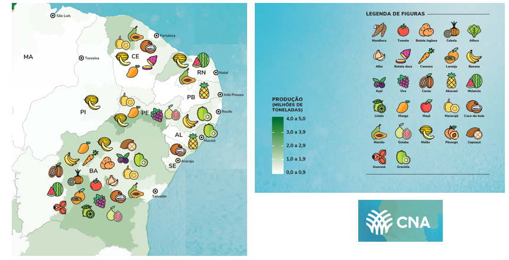

class: center, middle

```{r setup, include=FALSE}
# Dependências dos slides/aula
library(knitr)          # CRAN v1.33
library(rmarkdown)      # CRAN v2.10
library(xaringan)       # CRAN v0.22
library(xaringanthemer) # CRAN v0.3.0
library(xaringanExtra)  # [github::gadenbuie/xaringanExtra] v0.5.5
library(RefManageR)     # CRAN v1.3.0
library(ggplot2)        # CRAN v3.3.5
library(fontawesome)    # [github::rstudio/fontawesome] v0.1.0
library(pagedown)

# Opções de chunks
options(htmltools.dir.version = FALSE)
knitr::opts_chunk$set(
  echo       = FALSE,
  warning    = FALSE,
  message    = FALSE,
  fig.retina = 3,
  fig.width  = 11.5,
  fig.asp    = 0.618,
  out.width  = "100%",
  fig.align  = "center",
  comment    = "#"
  )

# Cores para gráficos
colors <- c(
  blue       = "#282f6b",
  red        = "#b22200",
  yellow     = "#eace3f",
  green      = "#224f20",
  purple     = "#5f487c",
  orange     = "#b35c1e",
  turquoise  = "#419391",
  green_two  = "#839c56",
  light_blue = "#3b89bc",
  gray       = "#666666"
  )
```

```{r xaringan, echo=FALSE}
# Tema da apresentação
xaringanthemer::style_mono_light(
  base_color                      = unname(colors["blue"]),
  title_slide_background_image    = params$logo_slides, 
  title_slide_background_size     = 12,
  title_slide_background_position = "bottom 10px right 20px",
  title_slide_background_color    = "white",
  title_slide_text_color          = unname(colors["blue"]),
  footnote_position_bottom        = "15px"
  )

# Opções extras do tema
xaringanExtra::use_progress_bar(
  color    = colors["blue"], 
  location = "bottom"
  )
xaringanExtra::use_extra_styles(
  hover_code_line         = TRUE,
  mute_unhighlighted_code = FALSE
  )
xaringanExtra::use_panelset()
```

```{css, echo=FALSE}
pre {
  white-space: pre-wrap;
  overflow-y: scroll !important;
  max-height: 45vh !important;
  overflow-x: auto;
  max-width: 100%;
}
```

```{r load_refs, echo=FALSE, eval=params$references}
# Configuração de citações
RefManageR::BibOptions(
  check.entries = FALSE,
  bib.style     = "authoryear",
  cite.style    = "authoryear",
  style         = "markdown",
  hyperlink     = FALSE,
  dashed        = FALSE
  )
if(params$references){
  temp_refbib <- tempdir()
  download.file(
    url      = params$references_path, 
    destfile = paste0(temp_refbib, "/references.bib"), 
    mode     = "wb"
    )
  myBib <- RefManageR::ReadBib(paste0(temp_refbib, "/references.bib"), check = FALSE)
  }

# Como citar?
# RefManageR::TextCite(myBib, "id_da_citacao")
```

```{r utils, echo=FALSE}
# Função que pega um arquivo .Rmd, condicionalmente o renderiza, 
# e embute o conteúdo do mesmo formatado como Markdown puro 
# no output do documento atual
print_rmd <- function(file, encoding = "UTF-8", render = TRUE){
  if(render){rmarkdown::render(input = file, quiet = TRUE)}
  rmd <- readLines(con = file, encoding = encoding)
  cat("```md\n")
  cat(rmd, sep = "\n")
  cat("```\n")
}
```


### OBSERVATÓRIOS DE MERCADO DA EMBRAPA

.left-column[

- Entrar no site da Embrapa Semiárido

www.embrapa.br/semiarido

- Do lado direito, canto inferior aparecem os logos dos dois observatórios, de manga e de uva.

- **É só clicar no Observatório de interesse!**

]

.right-column[
```{r, echo=FALSE, out.width="78%"}
knitr::include_graphics("img_r/fig3.png")
```
]

---
class: center, middle
### O QUE É UM OBSERVATÓRIO? 

.pull-left[
```{r, echo=FALSE, out.width="300%"}

```
]

.pull-right[
- O objetivo maior é a **geração de informações sobre o mercado de manga visando estabelecer estratégias que aumentem a competitividade e fortaleçam o setor.**

- Para isto, busca gerar estudos, análises prospectivas e informações que contemplem: 

a) **a tendência dos mercados no curto, médio e longo prazos e com isso antecipar as possíveis soluções para que as empresas possam adotar os instrumentos de ajustes requeridos**; 

b) **a estruturação de um banco de dados com as principais variáveis sobre preços, volumes comercializados, países concorrentes, de forma a acompanhar as mudanças conjunturais e de longo prazo desses mercados**.

]

---
class: center
### EXEMPLO NO SITE DO OBSERVATÓRIO DA MANGA

.pull-left[
```{r, echo=FALSE, out.width="100%"}
knitr::include_graphics("img_r/fig4.png")
```
]

.pull-right[

- No site do Observatório de Mercado de manga (https://www.embrapa.br/observatorio-da-manga) existem colunas com diversas informações (mercado interno, exportações, emprego)!

- Contudo, os observatórios tem gerado muito mais informações do que estas disponibilizadas neste link. 

- Basicamente existem 3 formas de se ter acesso as informações completas: a) um site da internet; b) um documento pdf; c) a Dashboard (Painel) do Observatório.

- Qualquer opção que se clicar no site irá abrir possibilidades para acessar os outros links.

]

---
class: center
### BOLETIM DOS PREÇOS EM PDF

```{r, echo=FALSE, out.width="70%"}

```

---
class: center
### BOLETIM DOS PREÇOS EM PDF

```{r, echo=FALSE, out.width="70%"}
knitr::include_graphics("img_r/boletim2.png")
```

---
class: center
### BOLETIM DOS PREÇOS DE MANGA EM HTML

```{r, echo=FALSE}
knitr::include_url("https://bit.ly/3Jxb31h", height = "450px")
```

---
class: center, middle

### DASHBOARD MERCADO INTERNO DA MANGA

```{r, out.width="93%", fig.cap="<center><b><a href='https://observatoriosdemercado.github.io/manga/'>Clique aqui para acessar</a></b></center>"}
knitr::include_graphics("img_r/dash1.png")
```

---
class: center, middle

### DASHBOARD MERCADO EXTERNO DA MANGA

```{r, out.width="89%", fig.cap="<center><b><a href='https://observatoriosdemercado.shinyapps.io/manga/'>Clique aqui para acessar</a></b></center>"}

```

---
class: center

### A PRODUÇÃO DE RIQUEZA NO BRASIL

```{r, echo=FALSE, out.width="80%"}
knitr::include_graphics("img_r/fig15.png")
```
Fonte: Navarro, 2021.

---
class: center

### A IMPORTÂNCIA DA PRODUÇÃO DE HF NO NORDESTE

```{r, echo=FALSE, out.width="90%"}

```
Fonte: CNA, 2021.

---
class: center
### ANÁLISE DA OFERTA DE MANGA - CEPEA
```{r, echo=FALSE, out.width="88%"}

```

---
class: center
### ANÁLISE DA OFERTA DE MANGA - CEPEA
```{r, echo=FALSE, out.width="86%"}
knitr::include_graphics("img_r/fig7.png")
```

---
class: center
### ANÁLISE DA OFERTA DE MANGA - IBGE

```{r servtech1}
#Direcionado o R para o Diretorio a ser trabalhado
#setwd('c:/Users/Joao Ricardo Lima/Dropbox/tempecon/dados_manga')
setwd('/Users/jricardofl/Dropbox/tempecon/dados_manga/2022')

#Inicio do Script
#Pacotes a serem utilizados
library(mFilter)
library(forecast)
library(tsutils)
library(seasonal)
library(ggplot2)
library(uroot)
library(tseries)
library(ggthemes)
library(dplyr)
library(tidyverse)
library(quantmod)
library(scales)
library(kableExtra)# complex tables
library(lmtest)
library(FinTS)
library(magrittr)# pipe operations
library(readxl)
library(reshape2)
library(plotly)
#library(rmarkdown)
library(bslib)
library(gridExtra)# multiple grid-based plots on a page
library(patchwork)

checkX13()

options(digits=4)
today <- as.Date("2022-01-01")
date <- seq(as.Date('2021-01-01'),to=as.Date('2021-12-01'),by='1 month')

mycolors2 <- c("darkgray", "lightblue3", "orange", "darkblue", "red", "darkgreen", "gold")
mycolors3 <- c("darkblue", "orange")

#Entrando dados no R
dados1 <- read_excel("area_regioes.xlsx", col_names = TRUE)
#dados1 <- dados1[c(1,3,4),]
dados1m <- melt(dados1, id.var='regiao')

#Gráfico com Ggplot2 Palmer

mycolor1 <- "gold"
mycolor2 <- "darkgreen"
mycolor3 <- "blue"
mycolor4 <- "red"

g1 <- ggplot()+
  geom_col(data=dados1m, aes(x=reorder(regiao, -value), y=value/1000, fill=variable), lwd=1, position = "dodge")+ scale_fill_manual(values=mycolors2)+
  labs(y= "Área Plantada de Manga (1000 ha)", x= "Brasil e Regiões", title='',
       caption = "Fonte: PAM/IBGE reprocessado pelo Observatório de Mercado de Manga da Embrapa")+
  theme_minimal()+
  theme(axis.text.x=element_text(angle=0, hjust=0.5, size=12, margin = margin(b=20)),
        axis.text.y=element_text(hjust=0.5, size=12, margin = margin(l=20)),
        axis.title.y = element_text(size=12, face = "bold"),
        axis.title.x = element_text(size=12, face = "bold"),
        panel.grid.major = element_blank(),
        panel.grid.minor = element_blank(),
        plot.title = element_text(hjust = 0.5, size=12),
        plot.caption = element_text(hjust = 0, size=12),
        legend.position = "bottom", legend.title = element_blank(),
        legend.text=element_text(size=12)) # Definindo posição da legenda

ggplotly(g1) %>%
  layout(legend = list(
    orientation = "h",
    x=0.25,
    y=-0.2,
    title=''))
```

---
class: center
### ANÁLISE DA OFERTA DE MANGA - IBGE

```{r servtech2}
#Direcionado o R para o Diretorio a ser trabalhado
setwd('/Users/jricardofl/Dropbox/tempecon/dados_manga/2022')

#Entrando dados no R
dados2 <- read_excel("area_estados.xlsx", col_names = TRUE)
dados2 <- dados2[c(1:6),]
dados2m <- melt(dados2, id.var='estados')

g2 <- ggplot()+
  geom_col(data=dados2m, aes(x=reorder(estados, -value), y=value/1000, fill=variable), lwd=1, position = "dodge")+ scale_fill_manual(values=mycolors2)+
  labs(y= "Área Plantada de Manga (1000 ha)", x= "Estados do Brasil", title='',
       caption = "Fonte: PAM/IBGE reprocessado pelo Observatório de Mercado de Manga da Embrapa")+
  theme_minimal()+
  theme(axis.text.x=element_text(angle=0, hjust=0.5, size=12, margin = margin(b=20)),
        axis.text.y=element_text(hjust=0.5, size=12, margin = margin(l=20)),
        axis.title.y = element_text(size=12, face = "bold"),
        axis.title.x = element_text(size=12, face = "bold"),
        panel.grid.major = element_blank(),
        panel.grid.minor = element_blank(),
        plot.title = element_text(hjust = 0.5, size=12),
        plot.caption = element_text(hjust = 0, size=12),
        legend.position = "bottom", legend.title = element_blank(),
        legend.text=element_text(size=12)) # Definindo posição da legenda

ggplotly(g2) %>%
  layout(legend = list(
    orientation = "h",
    x=0.25,
    y=-0.2,
    title=''))
```

---
class: center

### ANÁLISE DA OFERTA DE MANGA - IBGE

```{r servtech3}
#Direcionado o R para o Diretorio a ser trabalhado
#Entrando dados no R
setwd('/Users/jricardofl/Dropbox/tempecon/dados_manga/2022')

dados3 <- read_excel("area_cidades.xlsx", col_names = TRUE)
dados3 <- dados3[c(1:14),c(1,7:8)]
dados3m <- melt(dados3, id.var='cidades')

g3 <- ggplot()+
  geom_col(data=dados3m, aes(x=reorder(cidades, -value), y=value, fill=variable), lwd=1, position = "dodge")+ scale_fill_manual(values=mycolors3)+
  labs(y= "Área Plantada de Manga (ha)", x= "Cidades do Brasil", title='',
       caption = "Fonte: PAM/IBGE reprocessado pelo Observatório de Mercado de Manga da Embrapa")+
  theme_minimal()+
  theme(axis.text.x=element_text(angle=20, hjust=0.5, size=8, margin = margin(b=20)),
        axis.text.y=element_text(hjust=0.5, size=8, margin = margin(l=20)),
        axis.title.y = element_text(size=10, face = "bold"),
        axis.title.x = element_text(size=10, face = "bold"),
        panel.grid.major = element_blank(),
        panel.grid.minor = element_blank(),
        plot.title = element_text(hjust = 0.5, size=12),
        plot.caption = element_text(hjust = 0, size=12),
        legend.position = "bottom", legend.title = element_blank(),
        legend.text=element_text(size=12)) # Definindo posição da legenda

ggplotly(g3) %>%
  layout(legend = list(
    orientation = "h",
    x=0.40,
    y=-0.40,
    title=''))
```

---
class: center

### ANÁLISE DA OFERTA DE MANGA - IBGE

```{r servtech3a}
#Direcionado o R para o Diretorio a ser trabalhado
#Entrando dados no R
setwd('/Users/jricardofl/Dropbox/tempecon/dados_manga/2022')

dados4 <- read_excel("area_vale.xlsx", col_names = TRUE)
dados4m <- melt(dados4, id.var='cidades')
mycolors4 <- "blue"

g4 <- ggplot()+
  geom_col(data=dados4m, aes(x=variable, y=value/1000, fill="Area Manga (Hectares)"), lwd=1)+
  scale_fill_manual(values=mycolors4)+
  labs(y= "Área Plantada de Manga (mil ha)", x= "Vale do São Francisco", title='',
       caption = "Fonte: PAM/IBGE reprocessado pelo Observatório de Mercado de Manga da Embrapa")+
  theme_minimal()+
  theme(axis.text.x=element_text(angle=0, hjust=0.5, size=12, margin = margin(b=20)),
        axis.text.y=element_text(hjust=0.5, size=12, margin = margin(l=20)),
        axis.title.y = element_text(size=12, face = "bold"),
        axis.title.x = element_text(size=12, face = "bold"),
        panel.grid.major = element_blank(),
        panel.grid.minor = element_blank(),
        plot.title = element_text(hjust = 0.5, size=12),
        plot.caption = element_text(hjust = 0, size=12),
        legend.position = "bottom", legend.title = element_blank(),
        legend.text=element_text(size=12)) # Definindo posição da legenda

ggplotly(g4) %>%
  layout(legend = list(
    orientation = "h",
    x=0.40,
    y=-0.2,
    title=''))
```

---
class: center

### ANÁLISE DA OFERTA DE MANGA - IBGE

```{r servtech4}
#Direcionado o R para o Diretorio a ser trabalhado
setwd('/Users/jricardofl/Dropbox/tempecon/dados_manga/2022')

#Entrando dados no R
dados1 <- read_excel("produti_regioes.xlsx", col_names = TRUE)
dados1 <- dados1[c(1,3,4),]
dados1m <- melt(dados1, id.var='regiao')
dados1m$value <- round(dados1m$value/1000,0)

g1 <- ggplot()+
  geom_col(data=dados1m, aes(x=regiao, y=value, fill=variable), lwd=1, position = "dodge")+ scale_fill_manual(values=mycolors2)+
  labs(y= "Produtividade na Manga (t/ha)", x= "Brasil e Regiões", title='',
       caption = "Fonte: PAM/IBGE reprocessado pelo Observatório de Mercado de Manga da Embrapa")+
  theme_minimal()+
  theme(axis.text.x=element_text(angle=0, hjust=0.5, size=12, margin = margin(b=20)),
        axis.text.y=element_text(hjust=0.5, size=12, margin = margin(l=20)),
        axis.title.y = element_text(size=12, face = "bold"),
        axis.title.x = element_text(size=12, face = "bold"),
        panel.grid.major = element_blank(),
        panel.grid.minor = element_blank(),
        plot.title = element_text(hjust = 0.5, size=12),
        plot.caption = element_text(hjust = 0, size=12),
        legend.position = "bottom", legend.title = element_blank(),
        legend.text=element_text(size=12)) # Definindo posição da legenda

ggplotly(g1) %>%
  layout(legend = list(
    orientation = "h",
    x=0.25,
    y=-0.2,
    title=''))
```

---
class: center

### ANÁLISE DA OFERTA DE MANGA - IBGE

```{r servtech5}
setwd('/Users/jricardofl/Dropbox/tempecon/dados_manga')

#Entrando dados no R
dados <- read_excel("manga_ibge2021.xlsx", col_names = TRUE)
dados$produtividade <- round(dados$produtividade,1)

g3 <- dados %>% 
  filter(abrangencia=='vale') %>% 
  ggplot() + #estetica vai valer para todos os geom's
  geom_col(aes(x=ano, y=produtividade, fill="Produtividade (Toneladas/Hectares)"), lwd=1)+
  scale_fill_manual(values=mycolor3)+
  labs(y= "Produtividade (Ton/Ha)", x= "Anos", title='Evolução da Produtividade com Manga no Vale do São Francisco: 2015-2021',
       caption = "IBGE (2021)") +
  scale_y_continuous(limits=c(0, 35), n.breaks = 5, expand = expansion(add=c(0,0.5)))+
  scale_x_continuous(breaks = seq(2015, 2021, by = 1))+
  theme_classic()+ #Definindo tema
  theme(axis.text.x=element_text(angle=0, hjust=0.5, size=12, margin = margin(b=5)),
        axis.text.y=element_text(hjust=1, size=12, margin = margin(l=20)),
        axis.title.x = element_text(size=12, face = "bold", margin = margin(b=0)),
        axis.title.y = element_text(size=12, face = "bold", margin = margin(l=20)),
        plot.title = element_text(hjust = 0.5, size=14),
        plot.caption = element_text(hjust = 0, size=8),
        legend.position = "bottom", legend.title = element_blank(),
        legend.text=element_text(size=12)) # Definindo posição da legenda

ggplotly(g3) %>%
  layout(legend = list(
                      orientation = "h", 
                      x=0.35, 
                      y=-0.2,
                      title=''))
```

---
class: center

### ANÁLISE DA OFERTA DE MANGA - IBGE

```{r servtech5a}
setwd('/Users/jricardofl/Dropbox/tempecon/dados_manga')

#Entrando dados no R
dados <- read_excel("manga_ibge2021.xlsx", col_names = TRUE)
dados$produtividade <- round(dados$produtividade,0)

g2 <- dados %>% 
  filter(abrangencia=='brasil') %>% 
  ggplot() + #estetica vai valer para todos os geom's
  geom_col(aes(x=ano, y=quantidade/1000, fill="Volume (Mil Toneladas)"), lwd=1)+
  scale_fill_manual(values=mycolor2)+
  labs(y= "Mil Toneladas", x= "Anos", title='Evolução do Volume com Manga no Brasil: 2015-2021',
       caption = "Fonte: IBGE (2021)") +
  scale_y_continuous(limits=c(0, 1600), n.breaks = 6, expand = expansion(add=c(0,0.5)))+
  scale_x_continuous(breaks = seq(2015, 2021, by = 1))+
  theme_classic()+ #Definindo tema
  theme(axis.text.x=element_text(angle=0, hjust=0.5, size=12, margin = margin(b=5)),
        axis.text.y=element_text(hjust=1, size=12, margin = margin(l=20)),
        axis.title.x = element_text(size=12, face = "bold", margin = margin(b=0)),
        axis.title.y = element_text(size=12, face = "bold", margin = margin(l=20)),
        plot.title = element_text(hjust = 0.5, size=14),
        plot.caption = element_text(hjust = 0, size=8),
        legend.position = "bottom", legend.title = element_blank(),
        legend.text=element_text(size=12)) # Definindo posição da legenda

ggplotly(g2) %>%
  layout(legend = list(
                      orientation = "h", 
                      x=0.40, 
                      y=-0.2,
                      title=''))
```

---
class: center

### ANÁLISE DA OFERTA DE MANGA - IBGE

```{r servtech6}
setwd('/Users/jricardofl/Dropbox/tempecon/dados_manga')

#Entrando dados no R
dados <- read_excel("manga_ibge2021.xlsx", col_names = TRUE)

g2 <- dados %>% 
  filter(abrangencia=='vale') %>% 
  ggplot() + #estetica vai valer para todos os geom's
  geom_col(aes(x=ano, y=quantidade/1000, fill="Volume (Mil Toneladas)"), lwd=1)+
  scale_fill_manual(values=mycolor2)+
  labs(y= "Mil Toneladas", x= "Anos", title='Evolução do Volume com Manga no Vale do São Francisco: 2015-2021',
       caption = "Fonte: IBGE (2021)") +
  scale_y_continuous(limits=c(0, 1000), n.breaks = 6, expand = expansion(add=c(0,0.5)))+
  scale_x_continuous(breaks = seq(2015, 2021, by = 1))+
  theme_classic()+ #Definindo tema
  theme(axis.text.x=element_text(angle=0, hjust=0.5, size=12, margin = margin(b=5)),
        axis.text.y=element_text(hjust=1, size=12, margin = margin(l=20)),
        axis.title.x = element_text(size=12, face = "bold", margin = margin(b=0)),
        axis.title.y = element_text(size=12, face = "bold", margin = margin(l=20)),
        plot.title = element_text(hjust = 0.5, size=14),
        plot.caption = element_text(hjust = 0, size=8),
        legend.position = "bottom", legend.title = element_blank(),
        legend.text=element_text(size=12)) # Definindo posição da legenda

ggplotly(g2) %>%
  layout(legend = list(
                      orientation = "h", 
                      x=0.40, 
                      y=-0.2,
                      title=''))
```

---
class: center

### ANÁLISE DA DEMANDA DE MANGA - MERCADO INTERNO

```{r servtech7}
#Direcionado o R para o Diretorio a ser trabalhado
setwd('/Users/jricardofl/Dropbox/tempecon/dados_manga')

#Inicio do Script
#Pacotes a serem utilizados 
library(ggplot2)
library(scales)
library(plotly)
library(dplyr)
library(readxl)
library(reshape2)
library(kableExtra)# complex tables
library(lmtest)
library(DT)
library(magrittr)

mycolors2 <- c("darkgreen", "lightblue3", "orange")

#Entrando dados no R
dados1 <- read_excel('consumo_brasil.xlsx', col_names = TRUE)
dados1m <- melt(dados1, id.var='Região')

g1 <- ggplot()+
  geom_col(data=dados1m, aes(x=Região, y=value, fill=variable), lwd=1, position = "dodge")+ scale_fill_manual(values=mycolors2)+
  labs(y= "Consumo (kg) per capita anual", x= "Brasil e Regiões", title='Evolução da  aquisição domiciliar per capita anual de manga no Brasil e regiões',
  caption = "Fonte: POF/IBGE reprocessado pelo Observatório de Mercado de Manga da Embrapa")+
  theme_minimal()+
  theme(axis.text.x=element_text(angle=0, hjust=0.5, size=10, margin = margin(b=10)),
        axis.text.y=element_text(hjust=0.5, size=10, margin = margin(l=10)),
        axis.title.y = element_text(size=10, face = "bold"),
        axis.title.x = element_text(size=10, face = "bold"),
        panel.grid.major = element_blank(),
        panel.grid.minor = element_blank(),
        plot.title = element_text(hjust = 0.5, size=10),
        plot.caption = element_text(hjust = 0, size=10),
        legend.position = "bottom", legend.title = element_blank(),
        legend.text=element_text(size=10)) # Definindo posição da legenda

ggplotly(g1) %>%
  layout(legend = list(
                      orientation = "h", 
                      x=0.4, 
                      y=-0.2,
                      title=''))
```

---
class: center

### ANÁLISE DA DEMANDA DE MANGA - MERCADO INTERNO

```{r servtech8}
#Direcionado o R para o Diretorio a ser trabalhado
setwd('/Users/jricardofl/Dropbox/tempecon/dados_manga')

#Inicio do Script
#Pacotes a serem utilizados 
library(ggplot2)
library(scales)
library(plotly)
library(dplyr)
library(readxl)

mycolors2 <- c("orange", "lightblue3", "darkblue", "gold", "red", "darkgreen")

#Entrando dados no R
#dados3 <- read_excel('consrenda_brasil.xlsx', col_names = TRUE)
dados3 <- read.csv2('consrenda_brasil1.csv', header=T, sep=";", dec=".", stringsAsFactors = TRUE)
dados3$classes <- factor(dados3$classes, levels = c("Até R$1.908", "+R$1.908 a R$2.862", "+R$2.862 a R$5.724","+R$5.724 a R$9.540", "+R$9.540 a R$14.310", "+R$14.310"))
#dados3$classes <- as.factor(dados3$classes)  
dados3m <- melt(dados3, id.var='classes')

g4 <- ggplot()+
  geom_col(data=dados3m, aes(x=variable, y=value, fill=classes), lwd=1, position = "dodge")+ scale_fill_manual(values=mycolors2)+
  labs(y= "Consumo (kg) per capita anual", x= "Brasil e Regiões", title='Aquisição domiciliar per capita anual de manga por faixas de renda - 2018',
  caption = "Fonte: POF/IBGE reprocessado pelo Observatório de Mercado de Manga da Embrapa")+
  theme_minimal()+
  theme(axis.text.x=element_text(angle=0, hjust=0.5, size=10, margin = margin(b=10)),
        axis.text.y=element_text(hjust=0.5, size=10, margin = margin(l=10)),
        axis.title.y = element_text(size=10, face = "bold"),
        axis.title.x = element_text(size=10, face = "bold"),
        panel.grid.major = element_blank(),
        panel.grid.minor = element_blank(),
        plot.title = element_text(hjust = 0.5, size=10),
        plot.caption = element_text(hjust = 0, size=10),
        legend.position = "bottom", legend.title = element_blank(),
        legend.text=element_text(size=10)) # Definindo posição da legenda

ggplotly(g4) %>%
  layout(legend = list(
                      orientation = "h", 
                      x=0.0, 
                      y=-0.25,
                      title=''))
```

---
class: center

### ANÁLISE DA DEMANDA DE MANGA - MERCADO EXTERNO

```{r servtech9}
#Direcionado o R para o Diretorio a ser trabalhado
#setwd('c:/Users/Joao Ricardo Lima/Dropbox/tempecon/dados_manga')
setwd('/Users/jricardofl/Dropbox/tempecon/dados_manga')

#Inicio do Script
#Pacotes a serem utilizados 
library(mFilter)
library(forecast)
library(tsutils)
library(seasonal)
library(ggplot2)
library(uroot)
library(tseries)
library(ggthemes)
library(dplyr)
library(quantmod)
library(scales)
library(kableExtra)# complex tables
library(lmtest)
library(FinTS)
library(rbcb)
library(plotly)
library(DT)
library(magrittr)
library(rmarkdown)
library(reshape2)
library(rbcb)
library(tidyverse)

checkX13()

options(digits=4)

anterior <- as.Date("2022-11-01")
atual <-  as.Date("2022-12-01") #ultimo mes disponibilizado
mes <- 12

#Entrando dados no R
dados1 <- read.csv2('exportacoes_2012_2022.csv', header=T, sep=";", dec = ".")
dados1 <- dados1/1000
dados1[,1] <- seq(2012, 2022, by = 1)
colnames(dados1) = c('Ano', 'Valor', 'Toneladas')
dados1 <- tibble(dados1)


#Entrando dados no R
dados2 <- read.csv2('total_exporta_br.csv', header=T, sep=";", dec = ".")
#dados <- dados[,-c(9:10)] #retirar as ultimas colunas
colnames(dados2)[1]<-'ano'


#Entrando dados no R
dados3 <- read.csv2('destinos_2022.csv', header=T, sep=";", dec = ".")
colnames(dados3)[1]<-'Paises'

#Entrando dados no R
dados5 <- read.csv2('uf_2022.csv', header=T, sep=";" , dec = ".")
#dados5 <- read.csv2('data/uf_2022.csv', header=T, sep=";" , dec = ".")
colnames(dados5)[1]<-'UF'

#Ajusta para Valor
#Analise de Serie Temporal
exporta_manga_valor <- dados2[,3]
exporta_manga_valor<-exporta_manga_valor/1000000
exporta_manga_valor <- ts(exporta_manga_valor, start=c(2012,1), freq=12)

#Tendencia
trend_valor <- cmav(exporta_manga_valor, outplot=F)
date <- seq(as.Date('2012-01-01'),to=atual,by='1 month')
trend_valor <- tibble(date, trend_valor)

#Sazonalidade
decompa<-decompose(exporta_manga_valor, type = 'multiplicative')
sazonal_valor <- decompa$figure
#meses <- seq(1:12)
meses <- seq(as.Date("2021/1/1"), by = "month", length.out = 12) 
sazonal_graph <- tibble(meses, sazonal_valor)

#Comparações com os anos e entre as médias/max/min

exporta_manga_valor_2019 <- window(exporta_manga_valor, end=c(2019,12))
seas19<-seasplot(exporta_manga_valor_2019, trend=F, outplot = F)
medias19 <- colMeans(seas19$season)

exporta_manga_valor_2020 <- window(exporta_manga_valor, end=c(2020,12))

exporta_manga_valor_2021 <- window(exporta_manga_valor, end=c(2021,12))
#seas21<-seasplot(preco_palmer_2021, trend=F, outplot = F)
#medias21 <- colMeans(seas21$season)

exporta_manga_valor_22 <- as.matrix(tail(exporta_manga_valor,mes)) #ajustar mensalmente
exporta_manga_valor_2022 <- matrix(NA, nrow=12, ncol=1)

for(i in 1:mes){
  exporta_manga_valor_2022[i,1] = exporta_manga_valor_22[i,1]
}
  
#Como só se tem até a semana 12
medias19 <- medias19[1:12]

matrix = matrix(NA, nrow=12, ncol=2)

for(i in 1:12){
  matrix[i,1] = min(seas19$season[,i])
  matrix[i,2] = max(seas19$season[,i])
}

#time <- c("Janeiro", "Fevereiro", "Março", "Abril", "Maio", "Junho", "Julho", "Agosto", "Setembro", "Outubro", "Novembro", #"Dezembro")
#time <-seq(1:12)
table <- data.frame(meses, matrix[,1], round(medias19,3), matrix[,2], round(tail(exporta_manga_valor_2020,12),3),
                    round(tail(exporta_manga_valor_2021,12),3), exporta_manga_valor_2022[,1])
colnames(table) = c('Meses', 'Mínimo', 'Média', 'Máximo', '2020', '2021', 
                    '2022')

tablea <- table[,-c(5:7)]
tableb <- table[,-c(2,3,4)]

tablea2 <- melt(tablea, id.var='Meses')
tableb2 <- melt(tableb, id.var='Meses')
mycolors <- c("lightblue3", "gray44", "gold")

#Ajusta para Volume
#Analise de Serie Temporal
exporta_manga_volume <- dados2[,4]
exporta_manga_volume<-exporta_manga_volume/1000  #passando de quilo para tonelada

#Ajuste para a variação Mensal do Volume

variacao_volume_20 <-  dados2 %>% filter(ano=='2020')
variacao_volume_21 <-  dados2 %>% filter(ano=='2021')
variacao_volume_22 <-  dados2 %>% filter(ano=='2022')

variacao_volume_20 <-  variacao_volume_20[,4]/1000
variacao_volume_21 <-  variacao_volume_21[,4]/1000
variacao_volume_22 <-  variacao_volume_22[,4]/1000

#Setando como uma série temporal
exporta_manga_volume <- ts(exporta_manga_volume, start=c(2012,1), freq=12)

#Tendencia
trend_volume <- cmav(exporta_manga_volume, outplot=F)
trend_volume <- tibble(date, trend_volume)

#Sazonalidade
decompa<-decompose(exporta_manga_volume, type = 'multiplicative')
sazonal_volume <- decompa$figure
sazonal_graph_volume <- tibble(meses, sazonal_volume)

#Comparações com os anos e entre as médias/max/min

exporta_manga_volume_2019 <- window(exporta_manga_volume, end=c(2019,12))
seas19_vol<-seasplot(exporta_manga_volume_2019, trend=F, outplot = F)
medias19_vol <- colMeans(seas19_vol$season)

exporta_manga_volume_2020 <- window(exporta_manga_volume, end=c(2020,12))

exporta_manga_volume_2021 <- window(exporta_manga_volume, end=c(2021,12))

exporta_manga_volume_22 <- as.matrix(tail(exporta_manga_volume,mes)) #ajustar mensalmente
exporta_manga_volume_2022 <- matrix(NA, nrow=12, ncol=1)

for(i in 1:mes){
  exporta_manga_volume_2022[i,1] = exporta_manga_volume_22[i,1]
}
  
#Como só se tem até a semana 12
medias19_vol <- medias19_vol[1:12]

matrix_vol = matrix(NA, nrow=12, ncol=2)

for(i in 1:12){
  matrix_vol[i,1] = min(seas19_vol$season[,i])
  matrix_vol[i,2] = max(seas19_vol$season[,i])
}

#time <- c("Janeiro", "Fevereiro", "Março", "Abril", "Maio", "Junho", "Julho", "Agosto", "Setembro", "Outubro", "Novembro", #"Dezembro")
#time <-seq(1:12)
table_volume <- data.frame(meses, round(matrix_vol[,1],0), round(medias19_vol,0), round(matrix_vol[,2],0), round(tail(exporta_manga_volume_2020,12),0),
round(tail(exporta_manga_volume_2021,12),0), round(exporta_manga_volume_2022[,1],0))
colnames(table_volume) = c('Meses', 'Mínimo', 'Média', 'Máximo', '2020', '2021', '2022')

tablea_vol <- table_volume[,-c(5:7)]
tableb_vol <- table_volume[,-c(2,3,4)]

tablea2_vol <- melt(tablea_vol, id.var='Meses')
tableb2_vol <- melt(tableb_vol, id.var='Meses')


#Variação Mensal 2021

variacao_volume_2020 <- as.matrix(variacao_volume_20)
variacao_volume_2021 <- as.matrix(variacao_volume_21)
variacao_volume_2022 <- matrix(NA, nrow=12, ncol=1)
variacao_volume_22 <- as.matrix(variacao_volume_22)

for(i in 1:mes){
  variacao_volume_2022[i,1] = variacao_volume_22[i,1] 
}

variacao_21 <- ((variacao_volume_2021/variacao_volume_2020) - 1)*100
variacao_22 <- ((variacao_volume_2022/variacao_volume_2021) - 1)*100

variacao <- data.frame(meses, variacao_21, variacao_22)
colnames(variacao) = c('Meses', 'Variação 2021 e 2020', 'Variação 2022 e 2021')

variacaom <- melt(variacao, id.var='Meses')

mycolors2 <- c("orange", "lightblue3")

#Gráfico com Ggplot2

mycolor1 <- "gold"

g10 <- ggplot(data=dados3) +  #estetica vai valer para todos os geom's
  geom_col(aes(x = reorder(Paises, -Participacao), y= Participacao, fill="% do Total"), lwd=1)+
    scale_fill_manual(values=mycolor1) +
  labs(y= "% do Volume Total Exportados", x= "Países", title='Principais Destinos da Manga (Brasil)',
       caption = "")+
  scale_y_continuous(limits=c(0, 50), n.breaks = 10, expand = expansion(add=c(0,0.5)))+
  theme_classic()+ #Definindo tema
  theme(axis.text.x=element_text(angle=45, hjust=0.5, size=8, margin = margin(b=10)),
        axis.text.y=element_text(hjust=1, size=8, margin = margin(l=20)),
        axis.title.x = element_text(size=8, face = "bold", margin = margin(b=10)),
        axis.title.y = element_text(size=8, face = "bold", margin = margin(l=20)),
        plot.title = element_text(hjust = 0.5, size=12),
        plot.caption = element_text(hjust = 0, size=12),
        legend.position = "bottom", legend.title = element_blank(),
        legend.text=element_text(size=9)) # Definindo posição da legenda

ggplotly(g10) %>%
  layout(legend = list(
                      orientation = "h", 
                      x=0.4, 
                      y=-0.2,
                      title=''))
```

---
class: center

### ANÁLISE DA DEMANDA DE MANGA - MERCADO EXTERNO

```{r servtech10}
g7 <- ggplot()+
  geom_col(data=tableb2_vol, aes(x=Meses, y=value, fill=variable), lwd=1,
           position = "dodge")+
  scale_fill_manual(values=mycolors)+
  geom_line(data=tablea2_vol, aes(x=Meses, y=value, colour=variable), linetype = "solid",
            size = 1)+
    scale_colour_manual(values = c("red", "chocolate", "darkgreen")) +
    scale_y_continuous(limits = c(0, 50000), n.breaks = 10)+
    scale_x_date(date_breaks = "1 month",
               labels = date_format("%B"))+
  labs(y= "Toneladas", x= "Meses do Ano", title='',
       caption = "")+
  theme_minimal()+
  theme(axis.text.x=element_text(angle=20, hjust=0.5, size=11, margin = margin(b=20)),
        axis.text.y=element_text(hjust=0.5, size=14, margin = margin(l=20)),
        axis.title.y = element_text(size=14, face = "bold"),
        axis.title.x = element_text(size=14, face = "bold"),
        panel.grid.major = element_blank(),
        panel.grid.minor = element_blank(),
        plot.caption = element_text(hjust = 0, size=14),
        legend.position = "bottom", legend.title = element_blank(),
        legend.text=element_text(size=12)) # Definindo posição da legenda

ggplotly(g7) %>%
  layout(legend = list(
                      orientation = "h", 
                      x=0.1, 
                      y=-0.2,
                      title=''))
```

---
class: center

### ANÁLISE DA DEMANDA DE MANGA - MERCADO EXTERNO

```{r servtech11}

mycolor1 <- "gold"
mycolor2 <- "red"

g1 <- ggplot(data=dados1) +  #estetica vai valer para todos os geom's
  geom_col(aes(x=Ano, y=Toneladas, fill="Mil Toneladas"), lwd=1)+
    scale_fill_manual(values=mycolor1)+
  geom_line(aes(x=Ano, y=Valor, colour="Milhões de Dólares"), size=2)+
  scale_colour_manual(values=mycolor2)+
  labs(y= "US$ Milhões / Mil Ton", x= "Anos", title='Receita de Exportação e Volume Exportado de Manga (Brasil): 2012 a 2022',
       caption = "") +
  scale_y_continuous(limits=c(0, 300), n.breaks = 10, expand = expansion(add=c(0,0.5)))+
  scale_x_continuous(breaks = seq(2012, 2022, by = 1))+
  theme_classic()+ #Definindo tema
  theme(axis.text.x=element_text(angle=0, hjust=0.5, size=8, margin = margin(b=10)),
        axis.text.y=element_text(hjust=1, size=8, margin = margin(l=20)),
        axis.title.x = element_text(size=8, face = "bold", margin = margin(b=10)),
        axis.title.y = element_text(size=8, face = "bold", margin = margin(l=20)),
        plot.title = element_text(hjust = 0.5, size=12),
        plot.caption = element_text(hjust = 0, size=12),
        legend.position = "bottom", legend.title = element_blank(),
        legend.text=element_text(size=9)) # Definindo posição da legenda

ggplotly(g1) %>%
  layout(legend = list(
                      orientation = "h", 
                      x=0.25, 
                      y=-0.2,
                      title=''))
```

---
class: center
### ANÁLISE DA DEMANDA DE MANGA - MERCADO EXTERNO

```{r servtech12}

#Gráfico com Ggplot2

g12 <- ggplot(data=dados5) +  #estetica vai valer para todos os geom's
  geom_col(aes(x = reorder(UF, -Participacao), y= Participacao, fill="% do Total"), lwd=1)+
    scale_fill_manual(values=mycolor1) +
  labs(y= "% Exportação", x= "Unidade da Federação", title='Participação (%) no volume exportado por Estado',
       caption = "")+
  scale_y_continuous(limits=c(0, 55), n.breaks = 10, expand = expansion(add=c(0,0.5)))+
   theme_classic()+ #Definindo tema
  theme(axis.text.x=element_text(angle=0, hjust=0.5, size=12, margin = margin(b=20)),
        axis.text.y=element_text(hjust=1, size=14, margin = margin(l=20)),
        axis.title.x = element_text(size=14, face = "bold", margin = margin(b=20)),
        axis.title.y = element_text(size=14, face = "bold", margin = margin(l=40)),
        plot.title = element_text(hjust = 0.5, size=14),
        plot.caption = element_text(hjust = 0, size=12),
        legend.position = "bottom", legend.title = element_blank(),
        legend.text=element_text(size=12)) # Definindo posição da legenda

ggplotly(g12) %>%
  layout(legend = list(
                      orientation = "h", 
                      x=0.4, 
                      y=-0.2,
                      title=''))
```

---
class: center, middle

### QUAL É HOJE O MAIOR PROBLEMA DA MANGICULTURA?

```{r, echo=FALSE, out.width="40%"}
knitr::include_graphics("img_r/duvida.png")
```

---
class: center, middle

## QUESTÕES QUE PRECISAMOS MELHORAR... 

```{r, out.width="35%"}
knitr::include_graphics("https://media1.giphy.com/media/VbnUQpnihPSIgIXuZv/giphy-downsized.gif")
```

---
class: center
### NECESSIDADE DE AUMENTAR A **DEMANDA** INTERNA E EXTERNA

```{r, echo=FALSE, out.width="40%"}

```

---
class: center

### NECESSIDADE DE REDUÇÃO DE **CUSTOS**

```{r, echo=FALSE, out.width="88%"}

```

---
class: center
### NECESSIDADE DE REDUÇÃO DE **CUSTOS**

```{r, echo=FALSE, out.width="88%"}
knitr::include_graphics("img_r/fig9.png")
```

---
class: center
### NECESSIDADE DE REDUÇÃO DE **CUSTOS**

```{r, echo=FALSE, out.width="93%"}

```

---
class: center
### NECESSIDADE DE REDUÇÃO DE **CUSTOS**

```{r, echo=FALSE, out.width="93%"}

```

---
class: center

### ANÁLISE DOS PREÇOS DE MANGA - PALMER

``` {r database1}
#Direcionado o R para o Diretorio a ser trabalhado
#setwd('c:/Users/Joao Ricardo Lima/Dropbox/tempecon/dados_manga')
setwd('/Users/jricardofl/Dropbox/tempecon/dados_manga')

library(lubridate)
data <- as.Date("2023-01-20") #ajustar semanalmente
sem_ano <- 3 #ajustar semanalmente

#Entrando dados no R
dados <- read.csv2('dados_manga_palmer_semana.csv', header=T, sep=";", dec=".")
#dados <- dados[,-c(9:10)] #retirar as ultimas colunas
colnames(dados)[1]<-'produto'

#Entrando dados no R - Deflator
igpdi <- read.csv2('igpdi.csv', 
                   header=T, sep=";",
                   dec=".")

dados_comb<-cbind(dados, igpdi)

teste<-dados_comb[,4]-dados_comb[,7]

dadosp<-dados_comb[,-c(1,2,6,7)]

#Deflacionar a serie de manga
dadosp$preco_def <- dadosp[,3]*(tail(dadosp[,4],1)/dadosp[,4])
#dadosp<-dadosp[,-2]

#Criando uma variável com as datas semanais
dadosp$date <- seq(as.Date('2012-01-14'),to=data,by='1 week') 
dadosp$date[dadosp$date == "2016-01-02"] <- "2015-12-31" #ajustando algumas datas
dadosp$date[dadosp$date == "2015-01-03"] <- "2014-12-31"
dadosp$date[dadosp$date == "2014-01-04"] <- "2013-12-31"
dadosp$date[dadosp$date == "2013-01-05"] <- "2012-12-31"
dadosp$date[dadosp$date == "2022-01-01"] <- "2022-01-03"
dadosp$date[dadosp$date == "2022-12-31"] <- "2023-01-01"

#Analise de Serie Temporal
preco_palmer <- dadosp[,5]
preco_palmer <- ts(preco_palmer, start=c(2012,1), freq=52)
#preco_palmer <- window(preco_palmer, end=c(2021,52))

# Parte 2
#Decompor a série
decompa<-decompose(preco_palmer, type = 'multiplicative')

#Tendecia
trend_palmer <- cmav(preco_palmer, outplot=F)

#Sazonalidade
sazonalidade <- decompa$figure
semanas <- seq(1:52)
sazonal_graph <- tibble(cbind(semanas, sazonalidade))

#Parte 3
#Analise das comparações entre as médias

preco_palmer_2020 <- window(preco_palmer, end=c(2020,52))
seas20<-seasplot(preco_palmer_2020, trend=F, outplot = F)
medias20 <- colMeans(seas20$season)

preco_palmer_2021 <- window(preco_palmer, end=c(2021,52))

preco_palmer_2022 <- window(preco_palmer, end=c(2022,52))
#seas21<-seasplot(preco_palmer_2021, trend=F, outplot = F)
#medias21 <- colMeans(seas21$season)

preco_palmer_23 <- as.matrix(tail(dadosp$preco_def,sem_ano)) 
preco_palmer_2023 <- matrix(NA, nrow=52, ncol=1)

for(i in 1:sem_ano){
  preco_palmer_2023[i,1] = preco_palmer_23[i,1]
}
  

#Como só se tem até a semana 52
medias20 <- medias20[1:52]
#medias21 <- medias21[1:52]

matrix = matrix(NA, nrow=52, ncol=2)

for(i in 1:52){
  matrix[i,1] = min(seas20$season[,i])
  matrix[i,2] = max(seas20$season[,i])
}

time <- seq(1:52)
table <- data.frame(time, matrix[,1], round(medias20,2), matrix[,2], round(tail(preco_palmer_2021,52),2),
                    round(tail(preco_palmer_2022,52),2), preco_palmer_2023[,1])
colnames(table) = c('Semanas', 'Mínimo', 'Média', 'Máximo', 'Ano 2021', 'Ano 2022', 
                    'Ano 2023')

tablea <- table[,-c(5:7)]
tableb <- table[,-c(2,3,4)]

tablea2 <- melt(tablea, id.var='Semanas')
tableb2 <- melt(tableb, id.var='Semanas')
mycolors <- c("lightblue3", "gray44", "gold")

table_db <- data.frame(matrix[,1], round(medias20,2), matrix[,2], round(tail(preco_palmer_2021,52),2),
                    round(tail(preco_palmer_2022,52),2), preco_palmer_2023[,1])
colnames(table_db) = c('Mínimo', 'Média', 'Máximo', '2021', '2022', '2023')

#Parte 4

preco_palmer_22 <- dadosp %>% filter(ano=='2022')
preco_palmer_2022 <- as.matrix(preco_palmer_22$preco_def)
variacao_22 <- (preco_palmer_2022/lag(preco_palmer_2022, 1) - 1)*100

variacao_23 <- (preco_palmer_2023/lag(preco_palmer_2023, 1) - 1)*100

semanas <- seq(1:52)
variacao <- data.frame(semanas, variacao_22[,1], variacao_23[,1])
colnames(variacao) = c('Semanas', 'Ano 2022', 'Ano 2023')

#Ajuste para a Tabela da Variação
variacaot <- variacao[,-1]
colnames(variacaot) = c('Variação em 2022', 'Variação em 2023')

variacao <- melt(variacao, id.var='Semanas')

mycolors2 <- c("orange", "lightblue3")

# Customizar tema interativamente em tempo real (ver mensagens no console)
#bslib::bs_themer()

g3 <- ggplot(data=dadosp, aes(x=date)) +  #estetica vai valer para todos os geom's
  geom_line(aes(y=preco_def, colour="PREÇO"), lwd=0.5)+
  geom_line(aes(y=trend_palmer, colour="TENDÊNCIA"), lwd=1)+
  scale_colour_manual("", 
                      breaks = c("PREÇO", "TENDÊNCIA"),
                      values = c("blue", "tomato")) +
  labs(y= "Preço R$", x= "Semanas de cada Ano", title='Evolução dos preços ao produtor e Tendência Manga Palmer',
       caption = "Fonte: CEPEA reprocessado pelo Observatório de Mercado de Manga da Embrapa") +
  scale_y_continuous(limits=c(0,8), n.breaks = 9, expand = expansion(add=c(0,0.5)), 
                     labels=number_format(accuracy = 0.01, decimal.mark = ","))+
  scale_x_date(date_breaks = "6 months",
               labels = date_format("%b-%Y"))+
  theme_classic()+ #Definindo tema
  theme(axis.text.x=element_text(angle=35, hjust=0.5, size=8, margin = margin(b=10)),
        axis.text.y=element_text(hjust=1, size=8, margin = margin(l=10)),
        axis.title.x = element_text(size=8, face = "bold", margin = margin(b=10)),
        axis.title.y = element_text(size=8, face = "bold", margin = margin(l=10)),
        plot.title = element_text(hjust = 0.5, size=12),
        plot.caption = element_text(hjust = 0, size=8),
        legend.position = c(2,1),
        legend.justification = c(1.2, 1.2),
        legend.text=element_text(size=8)) # Definindo posição da legenda

ggplotly(g3) %>%
  layout(legend = list(
                      orientation = "h", 
                      x=0.35, 
                      y=-0.30,
                      title=''))
```

---
class: center

### ANÁLISE DOS PREÇOS DE MANGA - TOMMY

``` {r database2}
#Direcionado o R para o Diretorio a ser trabalhado
#setwd('c:/Users/Joao Ricardo Lima/Dropbox/tempecon/dados_manga')
setwd('/Users/jricardofl/Dropbox/tempecon/dados_manga')

#Entrando dados no R
dados <- read.csv2('dados_manga_tommy_semana.csv', header=T, sep=";", dec=".")
#dados <- dados[,-c(9:10)] #retirar as ultimas colunas
colnames(dados)[1]<-'produto'

#Entrando dados no R - Deflator
igpdi <- read.csv2('igpdi.csv', 
                   header=T, sep=";",
                   dec=".")

dados_comb<-cbind(dados, igpdi)

teste<-dados_comb[,4]-dados_comb[,7]

dadosp<-dados_comb[,-c(1,2,6,7)]

#Deflacionar a serie de manga
dadosp$preco_def <- dadosp[,3]*(tail(dadosp[,4],1)/dadosp[,4])
#dadosp<-dadosp[,-2]

#Criando uma variável com as datas semanais
dadosp$date <- seq(as.Date('2012-01-14'),to=data,by='1 week') 
dadosp$date[dadosp$date == "2016-01-02"] <- "2015-12-31" #ajustando algumas datas
dadosp$date[dadosp$date == "2015-01-03"] <- "2014-12-31"
dadosp$date[dadosp$date == "2014-01-04"] <- "2013-12-31"
dadosp$date[dadosp$date == "2013-01-05"] <- "2012-12-31"
dadosp$date[dadosp$date == "2022-12-31"] <- "2023-01-01"

#Analise de Serie Temporal
preco_tommy <- dadosp[,5]
preco_tommy <- ts(preco_tommy, start=c(2012,1), freq=52)
#preco_tommy <- window(preco_tommy, end=c(2021,52))

# Parte 2
#Decompor a série
decompa<-decompose(preco_tommy, type = 'multiplicative')

#Tendencia
trend_tommy <-cmav(preco_tommy, outplot=F)

#Sazonalidade
sazonalidade <- decompa$figure
semanas <- seq(1:52)
sazonal_graph <- tibble(cbind(semanas, sazonalidade))

#Parte 3
#Analise das comparações entre as médias
preco_tommy_2020 <- window(preco_tommy, end=c(2020,52))
seas20<-seasplot(preco_tommy_2020, trend=F, outplot = F)
medias20 <- colMeans(seas20$season)

preco_tommy_2021 <- window(preco_tommy, end=c(2021,52))

preco_tommy_2022 <- window(preco_tommy, end=c(2022,52))
#seas21<-seasplot(preco_tommy_2021, trend=F, outplot = F)
#medias21 <- colMeans(seas21$season)

preco_tommy_23 <- as.matrix(tail(dadosp$preco_def,sem_ano)) 
preco_tommy_2023 <- matrix(NA, nrow=52, ncol=1)

for(i in 1:sem_ano){
  preco_tommy_2023[i,1] = preco_tommy_23[i,1]
}

#Como só se tem até a semana 52
medias20 <- medias20[1:52]
#medias21 <- medias21[1:52]

matrix = matrix(NA, nrow=52, ncol=2)

for(i in 1:52){
  matrix[i,1] = min(seas20$season[,i])
  matrix[i,2] = max(seas20$season[,i])
}

time <- seq(1:52)
table <- data.frame(time, matrix[,1], round(medias20,2), matrix[,2], round(tail(preco_tommy_2021,52),2),
                    round(tail(preco_tommy_2022,52),2), preco_tommy_2023[,1])
colnames(table) = c('Semanas', 'Mínimo', 'Média', 'Máximo', 'Ano 2021', 'Ano 2022', 
                    'Ano 2023')

tablea <- table[,-c(5:7)]
tableb <- table[,-c(2,3,4)]

tablea2 <- melt(tablea, id.var='Semanas')
tableb2 <- melt(tableb, id.var='Semanas')
mycolors <- c("lightblue3", "gray44", "gold")

table_db <- data.frame(time, matrix[,1], round(medias20,2), matrix[,2], round(tail(preco_tommy_2021,52),2),
                    round(tail(preco_tommy_2022,52),2), preco_tommy_2023[,1])
colnames(table_db) = c('Semanas', 'Mínimo', 'Média', 'Máximo', 'Ano 2021', 'Ano 2022', 
                    'Ano 2023')

#Parte 4

preco_tommy_22 <- dadosp %>% filter(ano=='2022')
preco_tommy_2022 <- as.matrix(preco_tommy_22$preco_def)
variacao_22 <- (preco_tommy_2022/lag(preco_tommy_2022, 1) - 1)*100

variacao_23 <- (preco_tommy_2023/lag(preco_tommy_2023, 1) - 1)*100

semanas <- seq(1:52)
variacao <- data.frame(semanas, variacao_22[,1], variacao_23[,1])
colnames(variacao) = c('Semanas', 'Ano 2022', 'Ano 2023')

variacao <- melt(variacao, id.var='Semanas')

mycolors2 <- c("orange", "lightblue3")

g7 <- ggplot(data=dadosp, aes(x=date)) +  #estetica vai valer para todos os geom's
    geom_line(aes(y=preco_def, colour="PREÇO"), lwd=0.5)+
    geom_line(aes(y=trend_tommy, colour="TENDÊNCIA"), lwd=1)+
    scale_colour_manual("", 
                        breaks = c("PREÇO", "TENDÊNCIA"),
                        values = c("blue", "tomato")) +
    labs(y= "Preço R$", x= "Semanas de cada Ano", title='Evolução dos preços ao produtor e Tendência Manga Tommy',
         caption = "Fonte: CEPEA reprocessado pelo Observatório de Mercado de Manga da Embrapa") +
    scale_y_continuous(limits=c(0,8), n.breaks = 9, expand = expansion(add=c(0,0.5)), 
                       labels=number_format(accuracy = 0.01, decimal.mark = ","))+
    scale_x_date(date_breaks = "6 months",
                 labels = date_format("%b-%Y"))+
    theme_classic()+ #Definindo tema
    theme(axis.text.x=element_text(angle=35, hjust=0.5, size=8, margin = margin(b=10)),
          axis.text.y=element_text(hjust=1, size=8, margin = margin(l=10)),
          axis.title.x = element_text(size=8, face = "bold", margin = margin(b=10)),
          axis.title.y = element_text(size=8, face = "bold", margin = margin(l=10)),
          plot.title = element_text(hjust = 0.5, size=12, face=""),
          plot.caption = element_text(hjust = 0, size=8),
          legend.position = c(2,1),
          legend.justification = c(1.2, 1.2),
          legend.text=element_text(size=8)) # Definindo posição da legenda

ggplotly(g7) %>%
  layout(legend = list(
                      orientation = "h", 
                      x=0.35, 
                      y=-0.30,
                      title=''))
```

---
class: center
### NECESSIDADE DE **UNIÃO**, FORMAR **COOPERATIVAS**

```{r, echo=FALSE, out.width="75%"}

```
Fonte: Anuário do Cooperativismo reprocessado por Lima (2021).

---
class: center

### PERFIL DA PRODUÇÃO E DOS PRODUTORES

```{r, echo=FALSE, out.width="95%"}

```

---
class: center, middle

```{r, out.width="20%"}

```

# OBRIGADO!


João Ricardo F. de Lima <br>
Email: joao.ricardo@embrapa.br


https://www.embrapa.br/observatorio-da-manga <br>
https://www.embrapa.br/observatorio-da-uva


Telefones:<br>
87-3866-3667  
87-99961-5799 