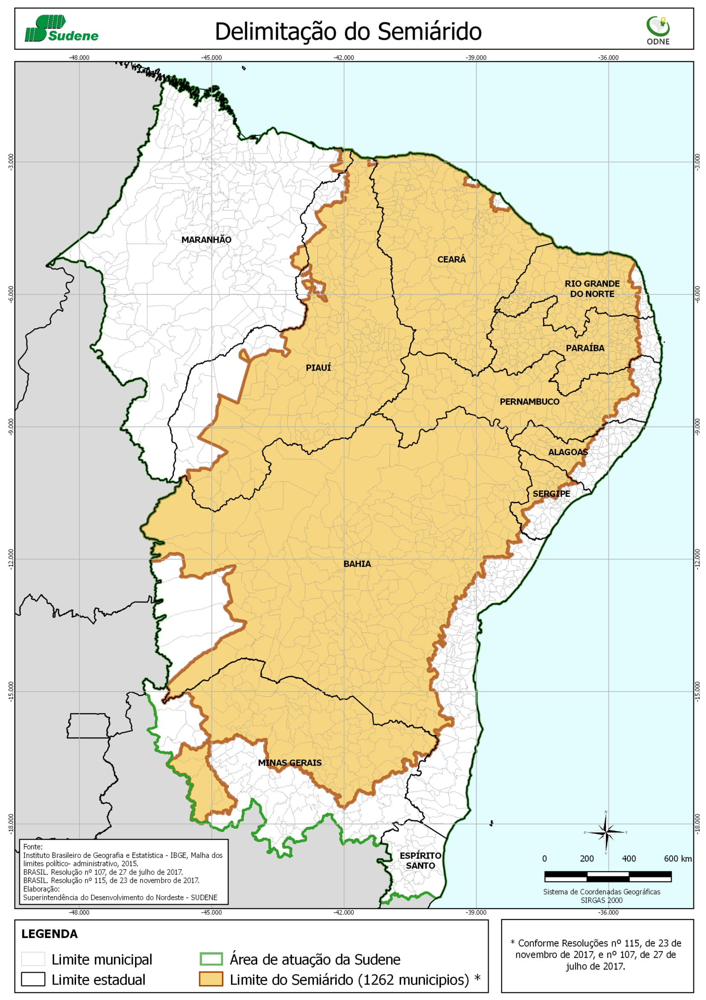
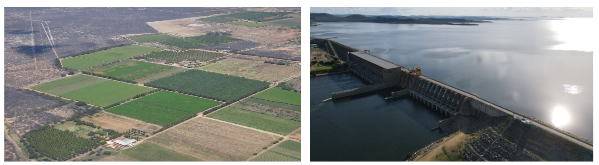
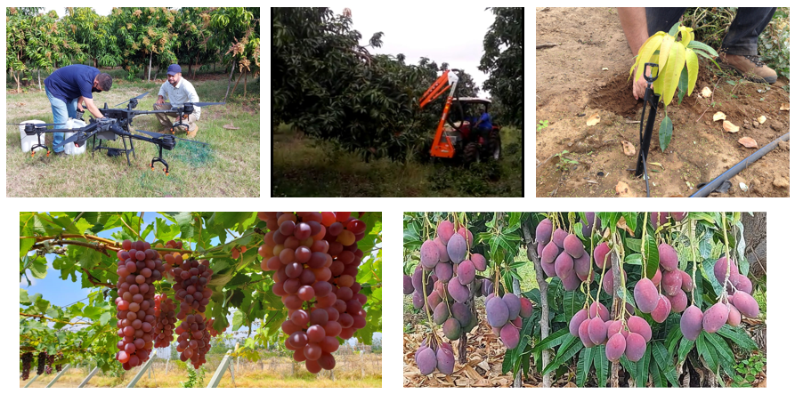
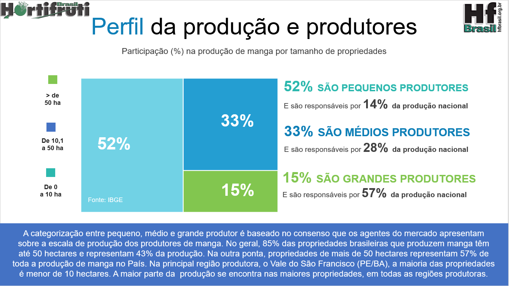
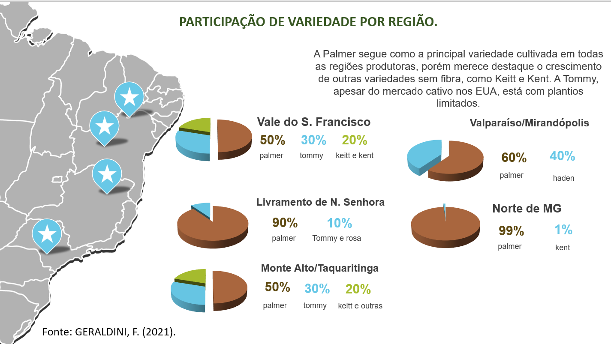
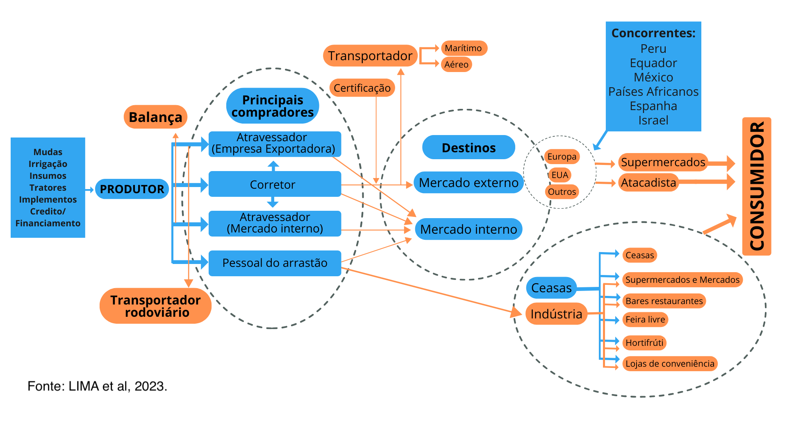
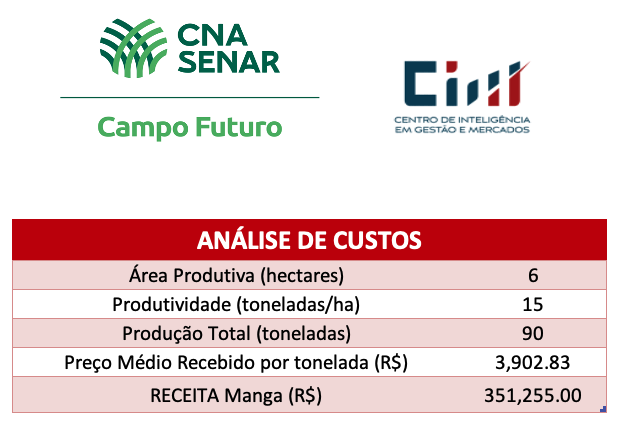
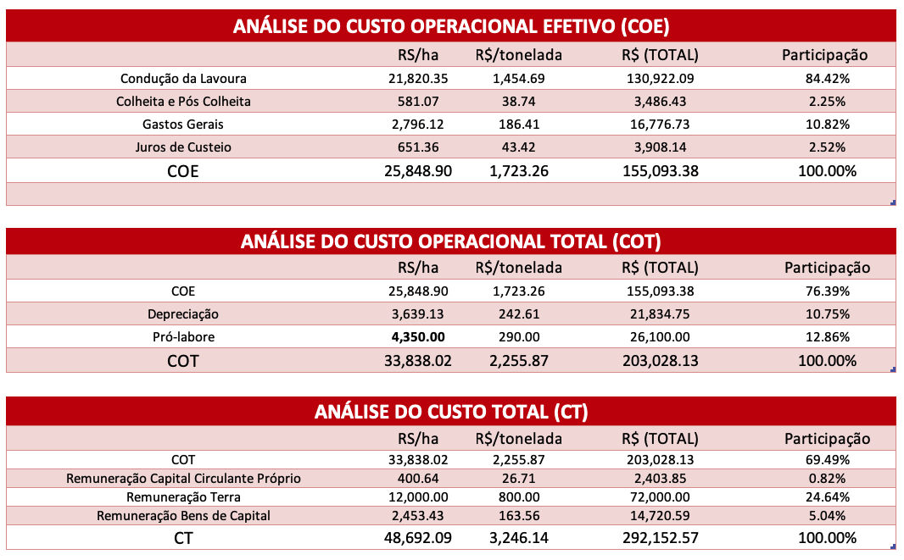
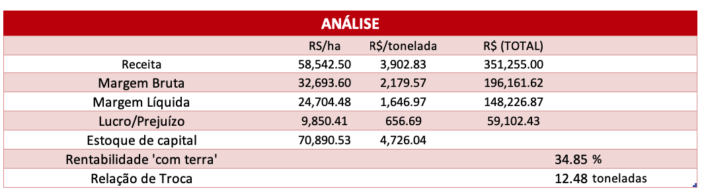
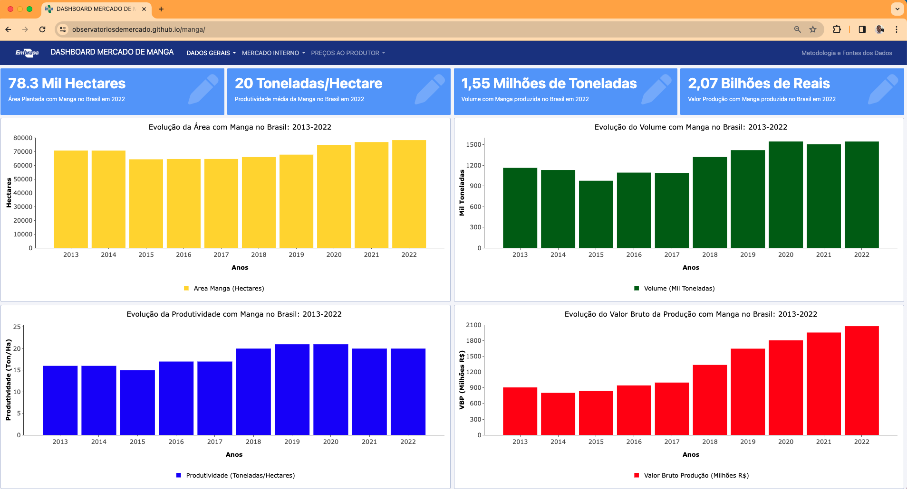

class: center

```{r setup, include=FALSE}
# Dependências dos slides/aula
library(knitr)          # CRAN v1.33
library(rmarkdown)      # CRAN v2.10
library(xaringan)       # CRAN v0.22
library(xaringanthemer) # CRAN v0.3.0
library(xaringanExtra)  # [github::gadenbuie/xaringanExtra] v0.5.5
library(RefManageR)     # CRAN v1.3.0
library(ggplot2)        # CRAN v3.3.5
library(fontawesome)    # [github::rstudio/fontawesome] v0.1.0
library(pagedown)

# Opções de chunks
options(htmltools.dir.version = FALSE)
knitr::opts_chunk$set(
  echo       = FALSE,
  warning    = FALSE,
  message    = FALSE,
  fig.retina = 3,
  fig.width  = 11,
  fig.asp    = 0.618,
  out.width  = "100%",
  fig.align  = "center",
  comment    = "#"
  )

# Cores para gráficos
colors <- c(
  blue       = "#282f6b",
  red        = "#b22200",
  yellow     = "#eace3f",
  green      = "#224f20",
  purple     = "#5f487c",
  orange     = "#b35c1e",
  turquoise  = "#419391",
  green_two  = "#839c56",
  light_blue = "#3b89bc",
  gray       = "#666666"
  )
```

```{r xaringan, echo=FALSE}
# Tema da apresentação
xaringanthemer::style_mono_light(
  base_color                      = unname(colors["blue"]),
  title_slide_background_image    = params$logo_slides, 
  title_slide_background_size     = 12,
  title_slide_background_position = "bottom 10px right 20px",
  title_slide_background_color    = "white",
  title_slide_text_color          = unname(colors["blue"]),
  footnote_position_bottom        = "15px"
  )

# Opções extras do tema
xaringanExtra::use_progress_bar(
  color    = colors["blue"], 
  location = "bottom"
  )
xaringanExtra::use_extra_styles(
  hover_code_line         = TRUE,
  mute_unhighlighted_code = FALSE
  )
xaringanExtra::use_panelset()
```

```{css, echo=FALSE}
pre {
  white-space: pre-wrap;
  overflow-y: scroll !important;
  max-height: 45vh !important;
  overflow-x: auto;
  max-width: 100%;
}
```

```{css}
/* Add this to your xaringan-themer.css file or within a <style> tag in your .Rmd file */
.white-bg {
  background-color: white !important;
  color: black !important; /* Optional: to ensure text is visible against a white background */
}
```

```{r load_refs, echo=FALSE, eval=params$references}
# Configuração de citações
RefManageR::BibOptions(
  check.entries = FALSE,
  bib.style     = "authoryear",
  cite.style    = "authoryear",
  style         = "markdown",
  hyperlink     = FALSE,
  dashed        = FALSE
  )
if(params$references){
  temp_refbib <- tempdir()
  download.file(
    url      = params$references_path, 
    destfile = paste0(temp_refbib, "/references.bib"), 
    mode     = "wb"
    )
  myBib <- RefManageR::ReadBib(paste0(temp_refbib, "/references.bib"), check = FALSE)
  }

# Como citar?
# RefManageR::TextCite(myBib, "id_da_citacao")
```

```{r utils, echo=FALSE}
# Função que pega um arquivo .Rmd, condicionalmente o renderiza, 
# e embute o conteúdo do mesmo formatado como Markdown puro 
# no output do documento atual
print_rmd <- function(file, encoding = "UTF-8", render = TRUE){
  if(render){rmarkdown::render(input = file, quiet = TRUE)}
  rmd <- readLines(con = file, encoding = encoding)
  cat("```md\n")
  cat(rmd, sep = "\n")
  cat("```\n")
}
```

### O SEMIÁRIDO BRASILEIRO

.pull-left[
```{r, echo=FALSE, out.width="73%"}

```
]

.pull-right[
```{r, echo=FALSE, out.width="110%"}
knitr::include_graphics("imgs/semiarido2.png")
```
]

---
class: center

### A PRODUÇÃO DE RIQUEZA NO SEMIÁRIDO

```{r, echo=FALSE, out.width="120%"}

```

### ÁGUA IRRIGAÇÃO + MUITAS HORAS DE SOL + TECNOLOGIA = FRUTICULTURA DO VALE 

---
class: center

### A PRODUÇÃO DE RIQUEZA NO SEMIÁRIDO

```{r, echo=FALSE, out.width="120%"}

```

---
class: center

### GERAÇÃO DE EMPREGOS NA FRUTICULTURA

```{r, echo=FALSE, out.width="80%"}
#Direcionado o R para o Diretorio a ser trabalhado
#Inicio do Script
#Pacotes a serem utilizados 
library(ggplot2)
library(scales)
library(plotly)
library(dplyr)
library(tidyr)

#Entrando dados no R
dados1 <- read.csv2('dados/agosto_2024.csv', header=T, sep=";", dec = ".")
dados1$date <- seq(as.Date('2021-01-01'),to=as.Date('2024-08-01'),by='1 month')

dados1a <- dados1 |> 
  dplyr::select(
    "date"     = `date`,
    "variable" = `Variavel`,
    "value"    = `Proporcao`
  ) |> 
  dplyr::as_tibble()

g1 <- ggplot(data=dados1a) +
  geom_col(aes(x=date, y=value, fill="variable"))+
  scale_fill_manual(values="blue") +#muda a cor da barra
  labs(y= "Proporção Agro/Total (%)", x= "Meses dos Anos",
       caption = "Fonte: CAGED reprocessado pelos Observatórios de Manga e Uva da Embrapa, 2024.")+
  scale_y_continuous(n.breaks = 10)+
  scale_x_date(date_breaks = "1 month",
              labels = date_format("%m/%Y"),
              expand = expansion(add=c(0,0)))+
  geom_text(data=dados1a, aes(y=value, x=date, label=value), 
            hjust=0.5, vjust=-1.2)+
  theme_minimal() + #Definindo tema
   theme(axis.text.x = element_text(angle=45, margin = margin(b=10), 
                                    size=12,
                                    hjust=1), 
        axis.text.y = element_text(margin = margin(b=10), size=14), 
        axis.title.x = element_text(size=14, face = "bold", margin = margin(b=10)),
        axis.title.y = element_text(size=14, face = "bold", margin = margin(l=20)),
        panel.grid.major = element_blank(),
        panel.grid.minor = element_blank(), # retirando as linhas
        plot.caption = element_text(hjust = 0, size=14), #ajuste Fonte
        legend.title = element_blank(),
        legend.text=element_text(size=14),
        legend.position = "none") # Definindo posição da legenda

g1

```

---
class: center

### REPRESENTATIVIDADE DO VALE NA OFERTA NACIONAL EM 2023.

```{r, echo=FALSE, out.width="80%"}
#Direcionado o R para o Diretorio a ser trabalhado
#setwd('/Users/jricardofl/Dropbox/Embrapa/2024/Eventos/SEACON')

#Inicio do Script
#Pacotes a serem utilizados 
library(reshape2)
library(readxl)

#Entrando dados no R
dados2 <- read_excel('dados/volume.xlsx', skip=4)

# Your raw data (assuming it's stored in a tibble named 'dados2')
# Remove the last row (the 'Fonte:' row) and rename the columns
dados2 <- dados2 %>%
  filter(!grepl("Fonte", ...1)) %>%  # Remove rows with "Fonte"
  rename(
    Regiao = `...1`,                  # Rename the region column
    Banana = `Banana (cacho)`,        # Clean the fruit column names
    Coco = `Coco-da-baía*`,
    Goiaba = Goiaba,
    Manga = Manga,
    Maracuja = Maracujá,
    Melancia = Melancia,
    Melao = Melão,
    Uva = Uva
  )

# Step 1: Create a new row 'Vale do São Francisco' by summing the values of São Francisco Pernambucano (PE) and Vale São Franciscano da Bahia (BA)
dados2<- dados2 %>%
  mutate(Regiao = case_when(
    Regiao == "São Francisco Pernambucano (PE)" ~ "Sao_Francisco_PE",
    Regiao == "Vale São-Franciscano da Bahia (BA)" ~ "Vale_Sao_Franciscano_BA",
    TRUE ~ Regiao
  ))

# Summing the values of São Francisco Pernambucano (PE) and Vale São Franciscano da Bahia (BA)
vale_sao_francisco <- dados2 %>%
  filter(Regiao %in% c("Sao_Francisco_PE", "Vale_Sao_Franciscano_BA")) %>%
  summarise(
    Regiao = "Vale do São Francisco",
    Banana = sum(Banana, na.rm = TRUE),
    Coco = sum(Coco, na.rm = TRUE),
    Goiaba = sum(Goiaba, na.rm = TRUE),
    Manga = sum(Manga, na.rm = TRUE),
    Maracuja = sum(Maracuja, na.rm = TRUE),
    Melancia = sum(Melancia, na.rm = TRUE),
    Melao = sum(Melao, na.rm = TRUE),
    Uva = sum(Uva, na.rm = TRUE)
  )

# Step 2: Add the new row and drop the old ones
dados2 <- dados2 %>%
  filter(!Regiao %in% c("Sao_Francisco_PE", "Vale_Sao_Franciscano_BA")) %>%
  bind_rows(vale_sao_francisco)

# Step 3: Calculate the proportions for Vale do São Francisco relative to Nordeste and Brasil
proportions <- dados2 %>%
  filter(Regiao %in% c("Nordeste", "Brasil", "Vale do São Francisco")) %>%
  pivot_longer(-Regiao, names_to = "Fruta", values_to = "Producao") %>%
  pivot_wider(names_from = Regiao, values_from = Producao) %>%
  mutate(
    Percentual_Brasil = round((`Vale do São Francisco` / Brasil) * 100),
    Percentual_Nordeste = round((`Vale do São Francisco` / Nordeste) * 100)
  ) %>%
  select(Fruta, Percentual_Brasil, Percentual_Nordeste)

dados2a <- melt(proportions, id.var='Fruta')

mycolors <- c("lightblue3", "darkgreen")

g2 <- ggplot() +
  geom_col(data=dados2a, aes(x=Fruta, y=value, fill=variable), size=2, width = 0.7, position = position_dodge(width = .5, preserve = "total"))+
  scale_fill_manual(values=mycolors) +
  scale_y_continuous(n.breaks = 10)+
  labs(y= "Vale sobre o Total Nacional (%)", x= "Frutas",
       caption = "Fonte: IBGE reprocessado pelos Observatórios de Manga e Uva da Embrapa,, 2024.")+
  geom_text(data=dados2a, aes(y=value, x=Fruta, group=variable, label=value), 
    position = position_dodge(width = .5, preserve = "total"), 
    size=4, 
    hjust=0.5, 
    vjust=-1.0)+
  theme_minimal() + #Definindo tema
  theme(axis.text.x = element_text(margin = margin(b=10), size=14), 
        axis.text.y = element_text(margin = margin(b=10), size=14), 
        axis.title.x = element_text(size=14, face = "bold", margin = margin(b=10)),
        axis.title.y = element_text(size=14, face = "bold", margin = margin(l=20)),
        panel.grid.major = element_blank(),
        panel.grid.minor = element_blank(), # retirando as linhas
        plot.caption = element_text(hjust = 0, size=14), #ajuste Fonte
        legend.title = element_blank(),
        legend.text=element_text(size=14),
        legend.position = "bottom") # Definindo posição da legenda
# Nome do eixo mais para baixo
g2
```

---
class: center

### PERFIL DA PRODUÇÃO E DOS PRODUTORES

```{r, echo=FALSE, out.width="85%"}

```

---
class: center
### ANÁLISE DA OFERTA DE MANGA - CEPEA
```{r, echo=FALSE, out.width="88%"}
knitr::include_graphics("imgs/manga4.png")
```

---
class: center
### ANÁLISE DA OFERTA DE MANGA - CEPEA
```{r, echo=FALSE, out.width="86%"}

```

---
class: center
### ANÁLISE DA PRODUÇÃO DE MANGA - IBGE

```{r upe1, out.width="80%"}
library(readxl)
#Direcionado o R para o Diretorio a ser trabalhado
#setwd('c:/Users/Joao Ricardo Lima/Dropbox/tempecon/dados_manga')
#setwd('/Users/jricardofl/Dropbox/Embrapa/2023/UPE Agro 4.0/2023/aula1/dados')

#Inicio do Script
#Pacotes a serem utilizados

#Entrando dados no R
dados1 <- read_excel("dados/tabela1.xlsx", col_names = TRUE)

mycolor1 <- "gold"

g3 <- 
  ggplot(data = dados1) +  #estetica vai valer para todos os geom's
  geom_col(aes(x=Ano, y=Manga/1000, fill="Volume (Mil Toneladas)"), lwd=1)+
  scale_fill_manual(values=mycolor1)+
  labs(y= "Mil Toneladas", x= "Anos", title='Evolução do Volume com Manga no Nordeste: 2001-2024',
       caption = "Fonte: IBGE (2024)") +
  scale_y_continuous(limits=c(0, 1500), n.breaks = 8, expand = expansion(add=c(0,0.5)))+
    scale_x_continuous(breaks = seq(2001, 2023, by = 1))+
  theme_classic()+ #Definindo tema
  theme(axis.text.x=element_text(angle=0, hjust=0.5, size=10, margin = margin(b=5)),
        axis.text.y=element_text(hjust=1, size=12, margin = margin(l=10)),
        axis.title.x = element_text(size=12, face = "bold", margin = margin(b=0)),
        axis.title.y = element_text(size=12, face = "bold", margin = margin(l=20)),
        plot.title = element_text(hjust = 0.5, size=14),
        plot.caption = element_text(hjust = 0, size=8),
        legend.position = "bottom", legend.title = element_blank(),
        legend.text=element_text(size=12)) # Definindo posição da legenda

g3
```

---
class: center

### A COMPLEXA CADEIA PRODUTIVA DA FRUTICULTURA.

```{r, echo=FALSE, out.width="90%"}

```
Fonte: LIMA et al, 2023.


---
class: center, middle

### CERTIFICAÇÕES PARA PODER EXPORTAR

```{r, echo=FALSE, out.width="85%"}
knitr::include_graphics("imgs/seacon11.jpg")
```

---
class: center

### O MERCADO EXTERNO

```{r paraguai1, out.width  = "80%"}
library(lubridate)
anterior <- as.Date("2024-08-01")
atual <-  as.Date("2024-09-01") #ultimo mes disponibilizado
today <- as.Date("2024-10-11") #data para o IGPI - ultima semana do preço
mes <- 9

#Direcionado o R para o Diretorio a ser trabalhado
#setwd('c:/Users/Joao Ricardo Lima/Dropbox/tempecon/dados_manga')
setwd('/Users/jricardofl/Dropbox/tempecon/dados_manga')

#Inicio do Script
#Pacotes a serem utilizados 
library(mFilter)
library(forecast)
library(tsutils)
library(seasonal)
library(uroot)
library(tseries)
library(ggthemes)
library(dplyr)
library(quantmod)
library(scales)
library(lmtest)
library(FinTS)
library(rbcb)
library(plotly)
library(DT)
library(magrittr)
library(rmarkdown)
library(reshape2)
library(rbcb)
library(tidyverse)
library(lubridate)
library(zoo)

checkX13()

options(digits=4)

#Entrando dados no R
dados1 <- read.csv2('exportacoes_2012_2024.csv', header=T, sep=";", dec = ".")
dados1 <- dados1/1000
dados1[,1] <- seq(2012, 2024, by = 1)
colnames(dados1) = c('Ano', 'Valor', 'Toneladas')
dados1 <- tibble(dados1)


#Entrando dados no R
dados2 <- read.csv2('total_exporta_br.csv', header=T, sep=";", dec = ".")
#dados <- dados[,-c(9:10)] #retirar as ultimas colunas
colnames(dados2)[1]<-'ano'


#Entrando dados no R
dados3 <- read.csv2('destinos_2024.csv', header=T, sep=";", dec = ".")
colnames(dados3)[1]<-'Paises'

#Entrando dados no R
dados4 <- read.csv2('via_2024.csv', header=T, sep=";", dec = ".")
colnames(dados4)[1]<-'Vias'

#dados5 <- read.csv2('uf_2024.csv', header=T, sep=";" , dec = ".")
#colnames(dados5)[1]<-'UF'

#Ajusta para Valor
#Analise de Serie Temporal
exporta_manga_valor <- dados2[,3]
exporta_manga_valor<-exporta_manga_valor/1000000
exporta_manga_valor <- ts(exporta_manga_valor, start=c(2012,1), freq=12)

#Tendencia
trend_valor <- cmav(exporta_manga_valor, outplot=F)
date <- seq(as.Date('2012-01-01'),to=atual,by='1 month')
trend_valor <- tibble(date, trend_valor)

#Sazonalidade
decompa<-decompose(exporta_manga_valor, type = 'multiplicative')
sazonal_valor <- decompa$figure
#meses <- seq(1:12)
meses <- seq(as.Date("2021/1/1"), by = "month", length.out = 12) 
sazonal_graph <- tibble(meses, sazonal_valor)

#Comparações com os anos e entre as médias/max/min

exporta_manga_valor_2023 <- window(exporta_manga_valor, end=c(2023,12))
seas23 <- seasplot(exporta_manga_valor_2023, trend=F, outplot = F)
medias23 <- colMeans(seas23$season)

#exporta_manga_valor_2021 <- window(exporta_manga_valor, end=c(2021,12))
exporta_manga_valor_2022 <- window(exporta_manga_valor, end=c(2022,12))
#seas21<-seasplot(preco_palmer_2021, trend=F, outplot = F)
#medias21 <- colMeans(seas21$season)

exporta_manga_valor_24 <- as.matrix(tail(exporta_manga_valor,mes)) #ajustar mensalmente
exporta_manga_valor_2024 <- matrix(NA, nrow=12, ncol=1)

for(i in 1:mes){
  exporta_manga_valor_2024[i,1] = exporta_manga_valor_24[i,1]
}
  
#Como só se tem até a semana 12
medias23 <- medias23[1:12]

matrix = matrix(NA, nrow=12, ncol=2)

for(i in 1:12){
  matrix[i,1] = min(seas23$season[,i])
  matrix[i,2] = max(seas23$season[,i])
}

#time <- c("Janeiro", "Fevereiro", "Março", "Abril", "Maio", "Junho", "Julho", "Agosto", "Setembro", "Outubro", "Novembro", #"Dezembro")
#time <-seq(1:12)
table <- data.frame(meses, matrix[,1], round(medias23,3), matrix[,2], round(tail(exporta_manga_valor_2022,12),3), round(tail(exporta_manga_valor_2023,12),3), exporta_manga_valor_2024[,1])
colnames(table) = c('Meses', 'Mínimo', 'Média', 'Máximo', '2022', '2023', '2024')

tablea <- table[,-c(5:7)]
tableb <- table[,-c(2,3,4)]

tablea2 <- melt(tablea, id.var='Meses')
tableb2 <- melt(tableb, id.var='Meses')
mycolors <- c("lightblue3", "gray44", "gold")

#Ajusta para Volume
#Analise de Serie Temporal
exporta_manga_volume <- dados2[,4]
exporta_manga_volume<-exporta_manga_volume/1000  #passando de quilo para tonelada

#Ajuste para a variação Mensal do Volume


variacao_volume_22 <-  dados2 %>% filter(ano=='2022')
variacao_volume_23 <-  dados2 %>% filter(ano=='2023')
variacao_volume_24 <-  dados2 %>% filter(ano=='2024')

variacao_volume_22 <-  variacao_volume_22[,4]/1000
variacao_volume_23 <-  variacao_volume_23[,4]/1000
variacao_volume_24 <-  variacao_volume_24[,4]/1000

#Setando como uma série temporal
exporta_manga_volume <- ts(exporta_manga_volume, start=c(2012,1), freq=12)

#Tendencia
trend_volume <- cmav(exporta_manga_volume, outplot=F)
trend_volume <- tibble(date, trend_volume)

#Sazonalidade
decompa<-decompose(exporta_manga_volume, type = 'multiplicative')
sazonal_volume <- decompa$figure
sazonal_graph_volume <- tibble(meses, sazonal_volume)

#Comparações com os anos e entre as médias/max/min

exporta_manga_volume_2023 <- window(exporta_manga_volume, end=c(2023,12))
seas23_vol <- seasplot(exporta_manga_volume_2023, trend=F, outplot = F)
medias23_vol <- colMeans(seas23_vol$season)

#exporta_manga_volume_2021 <- window(exporta_manga_volume, end=c(2021,12))

exporta_manga_volume_2022 <- window(exporta_manga_volume, end=c(2022,12))

exporta_manga_volume_24 <- as.matrix(tail(exporta_manga_volume,mes)) #ajustar mensalmente
exporta_manga_volume_2024 <- matrix(NA, nrow=12, ncol=1)

for(i in 1:mes){
  exporta_manga_volume_2024[i,1] = exporta_manga_volume_24[i,1]
}
  
#Como só se tem até a semana 12
medias23_vol <- medias23_vol[1:12]

matrix_vol = matrix(NA, nrow=12, ncol=2)

for(i in 1:12){
  matrix_vol[i,1] = min(seas23_vol$season[,i])
  matrix_vol[i,2] = max(seas23_vol$season[,i])
}

#time <- c("Janeiro", "Fevereiro", "Março", "Abril", "Maio", "Junho", "Julho", "Agosto", "Setembro", "Outubro", "Novembro", #"Dezembro")
#time <-seq(1:12)
table_volume <- data.frame(meses, round(matrix_vol[,1],0), round(medias23_vol,0), round(matrix_vol[,2],0), round(tail(exporta_manga_volume_2022,12),0),
round(tail(exporta_manga_volume_2023,12),0), round(exporta_manga_volume_2024[,1],0))
colnames(table_volume) = c('Meses', 'Mínimo', 'Média', 'Máximo', '2022', '2023', '2024')

tablea_vol <- table_volume[,-c(5:7)]
tableb_vol <- table_volume[,-c(2,3,4)]

tablea2_vol <- melt(tablea_vol, id.var='Meses')
tableb2_vol <- melt(tableb_vol, id.var='Meses')


#Variação Mensal 2021

variacao_volume_2022 <- as.matrix(variacao_volume_22)
variacao_volume_2023 <- as.matrix(variacao_volume_23)
variacao_volume_2024 <- matrix(NA, nrow=12, ncol=1)
variacao_volume_24 <- as.matrix(variacao_volume_24)

for(i in 1:mes){
  variacao_volume_2024[i,1] = variacao_volume_24[i,1] 
}


variacao_23 <- ((variacao_volume_2023/variacao_volume_2022) - 1)*100
variacao_24 <- ((variacao_volume_2024/variacao_volume_2023) - 1)*100

variacao <- data.frame(meses, variacao_23, variacao_24)
colnames(variacao) = c('Meses', 'Variação 2023 e 2022', 'Variação 2024 e 2023')

variacaom <- melt(variacao, id.var='Meses')

mycolors2 <- c("orange", "lightblue3")

#Preço Exportação

#Entrando dados no R
dadosexp <- read.csv2('manga_export_medias_deflacionados.csv', header=T, sep=";", dec=".")
#colnames(dadosexp)[1]<-'Palmer'

#Entrando dados no R - Deflator
igpdi <- read.csv2('igpdi.csv', 
                   header=T, sep=";",
                   dec=".")
colnames(igpdi)[1]<-'Ano'

igpdi2 <- igpdi %>% filter (Ano >= 2021) 
igpdi2$date <- seq(as.Date('2021-01-05'),to=today,by='1 week') 
igpdi2 <- igpdi2 %>% filter(date > "2021-07-27")

dadosexp_comb<-cbind(dadosexp, igpdi2)
dadosexp_comb<-dadosexp_comb[,-c(1:2)]

#Deflacionar a serie de manga de exportação
dadosexp_comb$Palmer <- dadosexp_comb[,1]*(tail(dadosexp_comb[,8],1)/dadosexp_comb[,8])
dadosexp_comb$Tommy_USA <- dadosexp_comb[,2]*(tail(dadosexp_comb[,8],1)/dadosexp_comb[,8])
dadosexp_comb$Tommy_Europa <- dadosexp_comb[,3]*(tail(dadosexp_comb[,8],1)/dadosexp_comb[,8])
dadosexp_comb$Kent <- dadosexp_comb[,4]*(tail(dadosexp_comb[,8],1)/dadosexp_comb[,8])
dadosexp_comb$Keitt <- dadosexp_comb[,5]*(tail(dadosexp_comb[,8],1)/dadosexp_comb[,8])

dadosexp_table <- dadosexp_comb %<>%
  select(c(date, Palmer, Tommy_USA, Tommy_Europa, Kent, Keitt))

dadosexp_comb <- melt(dadosexp_comb, id.var='date')

#Gráfico com Ggplot2

mycolor1 <- "gold"
mycolor2 <- "red"

g1 <- ggplot(data=dados1) +  #estetica vai valer para todos os geom's
  geom_col(aes(x=Ano, y=Toneladas, fill="Mil Toneladas"), lwd=1)+
    scale_fill_manual(values=mycolor1)+
  geom_line(aes(x=Ano, y=Valor, colour="Milhões de Dólares"), size=2)+
  scale_colour_manual(values=mycolor2)+
  labs(y= "US$ Milhões / Mil Ton", x= "Anos", title='',
       caption = "Fonte: COMEXSTAT reprocessado pelo Observatório de Mercado de Manga da Embrapa. Dados até o mês de setembro de 24.") +
  scale_y_continuous(limits=c(0, 320), n.breaks = 10, expand = expansion(add=c(0,0.5)))+
  scale_x_continuous(breaks = seq(2012, 2024, by = 1))+
  theme_classic()+ #Definindo tema
  theme(axis.text.x=element_text(angle=0, hjust=0.5, size=14, margin = margin(b=5)),
        axis.text.y=element_text(hjust=1, size=14, margin = margin(l=5)),
        axis.title.x = element_text(size=14, face = "bold", margin = margin(b=5)),
        axis.title.y = element_text(size=14, face = "bold", margin = margin(l=5)),
        plot.title = element_text(hjust = 0.5, size=16, face="italic"),
        plot.caption = element_text(hjust = 0, size=11),
        legend.position = "bottom", legend.title = element_blank(),
        legend.text=element_text(size=12)) # Definindo posição da legenda

g1
```

---
class: center

### O MERCADO EXTERNO

```{r exporta9, out.width  = "80%"}
g7 <- ggplot()+
  geom_col(data=tableb2_vol, aes(x=Meses, y=value, fill=variable), lwd=1,
           position = "dodge")+
  scale_fill_manual(values=mycolors)+
  geom_line(data=tablea2_vol, aes(x=Meses, y=value, colour=variable), linetype = "solid",
            size = 1)+
    scale_colour_manual(values = c("red", "chocolate", "darkgreen")) +
    scale_y_continuous(limits = c(0, 52000), n.breaks = 10)+
    scale_x_date(date_breaks = "1 month",
               labels = date_format("%B"))+
  labs(y= "Toneladas", x= "Meses do Ano", title='',
       caption = "Fonte: COMEXSTAT reprocessado pelo Observatório de Mercado de Manga da Embrapa. Dados até o mês de setembro de 24.")+
  theme_minimal()+
  theme(axis.text.x=element_text(angle=25, hjust=0.5, size=11, margin = margin(b=5)),
        axis.text.y=element_text(hjust=0.5, size=14, margin = margin(l=5)),
        axis.title.y = element_text(size=14, face = "bold"),
        axis.title.x = element_text(size=14, face = "bold"),
        panel.grid.major = element_blank(),
        panel.grid.minor = element_blank(),
        plot.caption = element_text(hjust = 0, size=11),
        legend.position = "bottom", legend.title = element_blank(),
        legend.text=element_text(size=12)) # Definindo posição da legenda

g7
```

---
class: center

### O MERCADO EXTERNO

```{r exporta15, out.width  = "80%"}

#Gráfico com Ggplot2

mycolor1 <- "gold"

g10 <- ggplot(data=dados3) +  #estetica vai valer para todos os geom's
  geom_col(aes(x = reorder(Paises, -Participacao), y= Participacao, fill="% do Total"), lwd=1)+
    scale_fill_manual(values=mycolor1) +
  labs(y= "% do Volume Total Exportados", x= "Países", title='',
       caption = "Fonte: COMEXSTAT reprocessado pelo Observatório de Mercado de Manga da Embrapa. Dados até o mês de setembro de 24.")+
  scale_y_continuous(limits=c(0, 50), n.breaks = 10, expand = expansion(add=c(0,0.5)))+
   theme_classic()+ #Definindo tema
  theme(axis.text.x=element_text(angle=0, hjust=0.5, size=10, margin = margin(b=5)),
        axis.text.y=element_text(hjust=1, size=14, margin = margin(l=5)),
        axis.title.x = element_text(size=14, face = "bold", margin = margin(b=5)),
        axis.title.y = element_text(size=14, face = "bold", margin = margin(l=5)),
        plot.title = element_text(hjust = 0.5, size=16, face="italic"),
        plot.caption = element_text(hjust = 0, size=12),
        legend.position = "bottom", legend.title = element_blank(),
        legend.text=element_text(size=12)) # Definindo posição da legenda

g10
```


---
class: center, middle
### O MERCADO EXTERNO: PREÇOS AO PRODUTOR

``` {r exporta4, out.width="80%"}
mycolors3 <- c("orange", "lightblue3", "red", "darkgreen", "blue")

g9 <- ggplot()+
  geom_col(data=dadosexp_comb, aes(x=date, y=value, fill=variable), size=2,
           width = 5, position = "dodge")+
  scale_fill_manual(values=mycolors3)+
  scale_y_continuous(limits = c(0, 6), n.breaks = 4, labels = number_format(accuracy = 0.01,
                                                                            decimal.mark = ","))+
  scale_x_date(breaks = date_breaks("3 weeks"), expand=c(0,0),
               labels = date_format("%W-%y"))+
  labs(y= "Preços R$", x= "Semanas do Ano", title='',
       caption = "Fonte: CEPEA reprocessado pelo Observatório de Mercado de Manga da Embrapa")+
  theme_minimal()+
  theme(axis.text.x=element_text(angle=45, hjust=0.5, size=11, margin = margin(b=10)),
        axis.text.y=element_text(hjust=0.5, size=14, margin = margin(l=20)),
        axis.title.y = element_text(size=14, face = "bold"),
        axis.title.x = element_text(size=14, face = "bold"),
        panel.grid.major = element_blank(),
        panel.grid.minor = element_blank(),
        plot.caption = element_text(hjust = 0, size=14),
        legend.position = "bottom", legend.title = element_blank(),
        legend.text=element_text(size=12)) # Definindo posição da legenda

g9
#ggplotly(g9) %>%
#  layout(legend = list(
#                      orientation = "h", 
#                      x=0.20, 
#                      y=-0.2,
#                      title=''))
```

---
class: center, middle
### O MERCADO INTERNO: PREÇOS AO PRODUTOR

```{r tratamento_base, results='', fig.cap='', , out.width="80%"}
#Direcionado o R para o Diretorio a ser trabalhado
#setwd('c:/Users/Joao Ricardo Lima/Dropbox/tempecon/dados_manga')
setwd('/Users/jricardofl/Dropbox/tempecon/dados_manga')

#Inicio do Script
#Pacotes a serem utilizados 
library(foreign)
library(mFilter)
library(forecast)
library(dplyr)
library(tsutils)
library(xts)
library(ggthemes)
library(FinTS)
library(scales)
library(ggplot2)
#library(easyGgplot2)
library(reshape)
library(reshape2)
library(imputeTS)
library(seasonal)
library(uroot)
library(tseries)
library(quantmod)
library(kableExtra)# complex tables
library(lmtest)
library(plotly)
library(DT)
library(magrittr)

options(digits=4)

#Entrando dados no R
dados <- read.csv2('dados_manga_palmer_semana.csv', header=T, sep=";", dec=".")
#dados <- dados[,-c(9:10)] #retirar as ultimas colunas
colnames(dados)[1]<-'produto'

#Entrando dados no R - Deflator
igpdi <- read.csv2('igpdi.csv', 
                   header=T, sep=";",
                   dec=".")

dados_comb<-cbind(dados, igpdi)

teste<-dados_comb[,4]-dados_comb[,7]

dadosp<-dados_comb[,-c(1,2,6,7)]

#Deflacionar a serie de manga
dadosp$preco_def <- dadosp[,3]*(tail(dadosp[,4],1)/dadosp[,4])
#dadosp<-dadosp[,-2]

#Criando uma variável com as datas semanais
date <- seq(as.Date('2012-01-07'),to=today,by='1 week')
date <- date[date != as.Date('2016-12-31')]
date[date == as.Date('2022-12-31')] <- as.Date('2023-01-01')
date <- date[date != as.Date('2023-12-30')]
date <- c(date, as.Date(today))
dadosp$date <- date

#Analise de Serie Temporal
preco_palmer <- dadosp[,5]
preco_palmer <- ts(preco_palmer, start=c(2012,1), freq=52)
#preco_palmer <- window(preco_palmer, end=c(2021,52))

trend_palmer <- cmav(preco_palmer, outplot=F)

g1 <- ggplot(data=dadosp, aes(x=date)) +  #estetica vai valer para todos os geom's
  geom_line(aes(y=preco_def, colour="PREÇO"), lwd=1)+
  geom_line(aes(y=trend_palmer, colour="TENDÊNCIA"), lwd=1)+
  scale_colour_manual("", 
                      breaks = c("PREÇO", "TENDÊNCIA"),
                      values = c("blue", "red")) +
  labs(y= "Preço Palmer (R$)", x= "Semanas de cada Ano", title='',
       caption = "Fonte: CEPEA reprocessado pelo Observatório de Mercado de Manga da Embrapa") +
  scale_y_continuous(limits=c(0,8), n.breaks = 9, expand = expansion(add=c(0,0.5)), 
                     labels=number_format(accuracy = 0.01, decimal.mark = ","))+
  scale_x_date(date_breaks = "1 year",
               labels = date_format("%Y"))+
  theme_classic()+ #Definindo tema
  theme(axis.text.x=element_text(angle=35, hjust=1, size=10, margin = margin(b=20)),
        axis.text.y=element_text(hjust=1, size=10, margin = margin(l=20)),
        axis.title.x = element_text(size=10, face = "bold", margin = margin(b=20)),
        axis.title.y = element_text(size=10, face = "bold", margin = margin(l=20)),
        plot.title = element_text(hjust = 0.5, size=16, face="italic"),
        plot.caption = element_text(hjust = 0, size=12),
        legend.position = c(1,1),
        legend.justification = c(1.2, 1.2),
        legend.text=element_text(size=10)) # Definindo posição da legenda

g1
```

---
class: center, middle
### O MERCADO INTERNO: PREÇOS AO PRODUTOR

```{r setupt, out.width="80%"}
#Direcionado o R para o Diretorio a ser trabalhado
#setwd('c:/Users/Joao Ricardo Lima/Dropbox/tempecon/dados_manga')
setwd('/Users/jricardofl/Dropbox/tempecon/dados_manga')

#Entrando dados no R
dados <- read.csv2('dados_manga_tommy_semana.csv', header=T, sep=";", dec=".")
#dados <- dados[,-c(9:10)] #retirar as ultimas colunas
colnames(dados)[1]<-'produto'

#Entrando dados no R - Deflator
igpdi <- read.csv2('igpdi.csv', 
                   header=T, sep=";",
                   dec=".")

dados_comb<-cbind(dados, igpdi)

teste<-dados_comb[,4]-dados_comb[,7]

dadosp<-dados_comb[,-c(1,2,6,7)]

#Deflacionar a serie de manga
dadosp$preco_def <- dadosp[,3]*(tail(dadosp[,4],1)/dadosp[,4])
#dadosp<-dadosp[,-2]

#Criando uma variável com as datas semanais
date <- seq(as.Date('2012-01-07'),to=today,by='1 week')
date <- date[date != as.Date('2016-12-31')]
date[date == as.Date('2022-12-31')] <- as.Date('2023-01-01')
date <- date[date != as.Date('2023-12-30')]
date <- c(date, as.Date(today))
dadosp$date <- date

#Analise de Serie Temporal
preco_tommy <- dadosp[,5]
preco_tommy <- ts(preco_tommy, start=c(2012,1), freq=52)
#preco_tommy <- window(preco_tommy, end=c(2021,52))

trend_tommy <- cmav(preco_tommy, outplot=F)

g5 <- ggplot(data=dadosp, aes(x=date)) +  #estetica vai valer para todos os geom's
  geom_line(aes(y=preco_def, colour="PREÇO"), lwd=1)+
  geom_line(aes(y=trend_tommy, colour="TENDÊNCIA"), lwd=1)+
  scale_colour_manual("", 
                      breaks = c("PREÇO", "TENDÊNCIA"),
                      values = c("blue", "red")) +
  labs(y= "Preço Tommy (R$)", x= "Semanas de cada Ano", title='',
       caption = "Fonte: CEPEA reprocessado pelo Observatório de Mercado de Manga da Embrapa") +
  scale_y_continuous(limits=c(0,8), n.breaks = 9, expand = expansion(add=c(0,0.5)), 
                     labels=number_format(accuracy = 0.01, decimal.mark = ","))+
  scale_x_date(date_breaks = "1 year",
               labels = date_format("%Y"))+
  theme_classic()+ #Definindo tema
theme(axis.text.x=element_text(angle=35, hjust=1, size=10, margin = margin(b=20)),
        axis.text.y=element_text(hjust=1, size=10, margin = margin(l=20)),
        axis.title.x = element_text(size=10, face = "bold", margin = margin(b=20)),
        axis.title.y = element_text(size=10, face = "bold"),
        plot.title = element_text(hjust = 0.5, size=16, face="italic"),
        plot.caption = element_text(hjust = 0, size=12),
        legend.position = c(1,1),
        legend.justification = c(1.2, 1.2),
        legend.text=element_text(size=10)) # Definindo posição da legenda

g5
```

---
class: top, left

### OS CUSTOS DE PRODUÇÃO DE MANGA - CNA.

```{r, echo=FALSE, out.width="70%"}

```

---
class: top, left

### OS CUSTOS DE PRODUÇÃO DE MANGA - CNA.

```{r, echo=FALSE, out.width="80%"}

```

---
class: top, left

### OS CUSTOS DE PRODUÇÃO DE MANGA - CNA.

```{r, echo=FALSE, out.width="100%"}

```

---
class: center, middle
### O OBSERVATÓRIO DE MERCADO DE MANGA DA EMBRAPA

```{r, echo=FALSE, out.width="93%"}

```

---
class: center, middle, white-bg

```{r, echo=FALSE, out.width="30%"}
knitr::include_graphics("imgs/logo_manga.png")
```

# OBRIGADO!

João Ricardo F. de Lima <br>
Email: joao.ricardo@embrapa.br

https://www.embrapa.br/observatorio-da-manga<br>
https://www.embrapa.br/observatorio-da-uva

Telefones:<br>
87-3866-3667  
87-99961-5799 