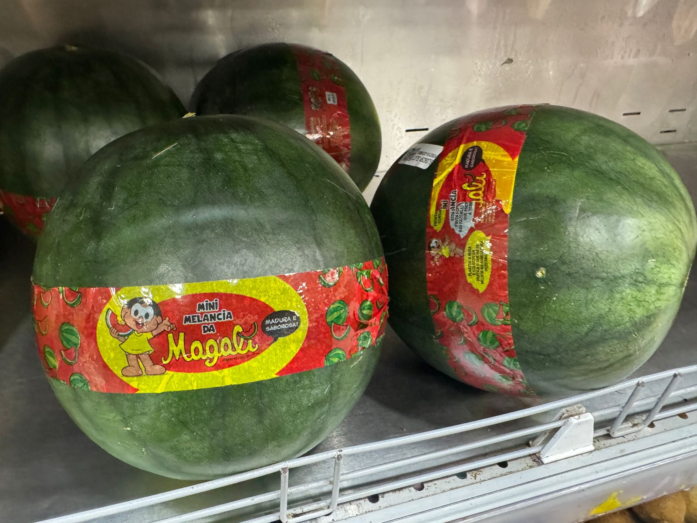

class: top, left

```{r setup, include=FALSE}
# Dependências dos slides/aula
library(knitr)          # CRAN v1.33
library(rmarkdown)      # CRAN v2.10
library(xaringan)       # CRAN v0.22
library(xaringanthemer) # CRAN v0.3.0
library(xaringanExtra)  # [github::gadenbuie/xaringanExtra] v0.5.5
library(RefManageR)     # CRAN v1.3.0
library(ggplot2)        # CRAN v3.3.5
library(fontawesome)    # [github::rstudio/fontawesome] v0.1.0
library(pagedown)
library(dplyr)
library(ggimage)
library(ggtext)
library(glue)

# Opções de chunks
options(htmltools.dir.version = FALSE)
knitr::opts_chunk$set(
  echo       = FALSE,
  warning    = FALSE,
  message    = FALSE,
  fig.retina = 3,
  fig.width  = 11,
  fig.asp    = 0.618,
  out.width  = "100%",
  fig.align  = "center",
  comment    = "#"
  )

# Cores para gráficos
colors <- c(
  blue       = "#282f6b",
  red        = "#b22200",
  yellow     = "#eace3f",
  green      = "#224f20",
  purple     = "#5f487c",
  orange     = "#b35c1e",
  turquoise  = "#419391",
  green_two  = "#839c56",
  light_blue = "#3b89bc",
  gray       = "#666666"
  )
```

```{r xaringan, echo=FALSE}
# Tema da apresentação
xaringanthemer::style_mono_light(
  base_color                      = unname(colors["blue"]),
  title_slide_background_image    = params$logo_slides, 
  title_slide_background_size     = 10,
  title_slide_background_position = "bottom 10px right 20px",
  title_slide_background_color    = "white",
  title_slide_text_color          = unname(colors["blue"]),
  footnote_position_bottom        = "15px"
  )

# Opções extras do tema
xaringanExtra::use_progress_bar(
  color    = colors["blue"], 
  location = "bottom"
  )
xaringanExtra::use_extra_styles(
  hover_code_line         = TRUE,
  mute_unhighlighted_code = FALSE
  )
xaringanExtra::use_panelset()
```

```{css, echo=FALSE}
pre {
  white-space: pre-wrap;
  overflow-y: scroll !important;
  max-height: 45vh !important;
  overflow-x: auto;
  max-width: 100%;
}
```

```{css}
/* Add this to your xaringan-themer.css file or within a <style> tag in your .Rmd file */
.white-bg {
  background-color: white !important;
  color: black !important; /* Optional: to ensure text is visible against a white background */
}
```

```{r load_refs, echo=FALSE, eval=params$references}
# Configuração de citações
RefManageR::BibOptions(
  check.entries = FALSE,
  bib.style     = "authoryear",
  cite.style    = "authoryear",
  style         = "markdown",
  hyperlink     = FALSE,
  dashed        = FALSE
  )
if(params$references){
  temp_refbib <- tempdir()
  download.file(
    url      = params$references_path, 
    destfile = paste0(temp_refbib, "/references.bib"), 
    mode     = "wb"
    )
  myBib <- RefManageR::ReadBib(paste0(temp_refbib, "/references.bib"), check = FALSE)
  }

# Como citar?
# RefManageR::TextCite(myBib, "id_da_citacao")
```

```{r utils, echo=FALSE}
# Função que pega um arquivo .Rmd, condicionalmente o renderiza, 
# e embute o conteúdo do mesmo formatado como Markdown puro 
# no output do documento atual
print_rmd <- function(file, encoding = "UTF-8", render = TRUE){
  if(render){rmarkdown::render(input = file, quiet = TRUE)}
  rmd <- readLines(con = file, encoding = encoding)
  cat("```md\n")
  cat(rmd, sep = "\n")
  cat("```\n")
}
```

### TÓPICOS DA APRESENTAÇÃO

1) ATUALIZAR OS DADOS DA PAM/IBGE

2) MOSTRAR OS CUSTOS DE PRODUÇÃO DE UMA PEQUENA PROPRIEDADE (CNA)

3) O MERCADO EXTERNO

4) COMPORTAMENTO DOS PREÇOS AO PRODUTOR

5) CONSUMO DE MANGA

6) COMERCIALIZAÇÃO DE MANGAS

7) O MERCADO DE TRABALHO

---
class: top, left

### OS DADOS ATUALIZADOS DO IBGE ATÉ 2023.

#### Área com Manga no Brasil e regiões

```{r ibge_manga1, out.width="72%"}
#Direcionado o R para o Diretorio a ser trabalhado
setwd('/Users/jricardofl/Dropbox/tempecon/dados_manga/2024')

#Inicio do Script
#Pacotes a serem utilizados 
library(ggplot2)
library(ggthemes)
library(dplyr)
library(tidyverse)
library(scales)
library(kableExtra)# complex tables
library(magrittr)# pipe operations
library(readxl)
library(reshape2)
library(plotly)
library(DT)

mycolors2 <- c("darkgray", "lightblue3", "orange", "darkblue", "red", "darkgreen", "gold", "#0A6269", "#690F0A", "#6675E6" )
mycolors3 <- c("orange")

#Entrando dados no R
#dados1 <- read_excel("area_regioes.xlsx", col_names = TRUE)
#dados1 <- dados1[c(1,3,4),]
dados1 <- read_excel("area_regioes.xlsx", col_names = TRUE, skip = 4, col_types = c('text', "numeric", "numeric", "numeric", "numeric", "numeric", "numeric", "numeric", "numeric", "numeric", "numeric"), na="-")
colnames(dados1)[1] <- 'regiao'
dados1 <- dados1[-nrow(dados1),]

dados1m <- melt(dados1, id.var='regiao')
dados1m_area <- dados1m

g1 <- ggplot()+
  geom_col(data=dados1m, aes(x=reorder(regiao, -value), y=value/1000, fill=variable), lwd=1, position = "dodge")+ scale_fill_manual(values=mycolors2)+
  labs(y= "Área Plantada de Manga (1000 ha)", x= "Brasil e Regiões", title='',
       caption = "Fonte: PAM/IBGE (2024) reprocessado pelo Observatório de Mercado de Manga da Embrapa")+
  theme_minimal()+
  theme(axis.text.x=element_text(angle=0, hjust=0.5, size=12, margin = margin(b=20)),
        axis.text.y=element_text(hjust=0.5, size=12, margin = margin(l=20)),
        axis.title.y = element_text(size=12, face = "bold"),
        axis.title.x = element_text(size=12, face = "bold"),
        panel.grid.major = element_blank(),
        panel.grid.minor = element_blank(),
        plot.title = element_text(hjust = 0.5, size=12),
        plot.caption = element_text(hjust = 0, size=12),
        legend.position = "right", legend.title = element_blank(),
        legend.text=element_text(size=10)) # Definindo posição da legenda

g1
```

---
class: top, left

### OS DADOS ATUALIZADOS DO IBGE ATÉ 2023.

#### Área com Manga por estados

```{r ibge_manga2, out.width="72%"}
#Direcionado o R para o Diretorio a ser trabalhado
setwd('/Users/jricardofl/Dropbox/tempecon/dados_manga/2024')

#Entrando dados no R
#dados2 <- read_excel("area_estados.xlsx", col_names = TRUE)
dados2 <- read_excel("area_estados.xlsx", col_names = TRUE, skip = 4, col_types = c('text', "numeric", "numeric", "numeric", "numeric", "numeric", "numeric", "numeric", "numeric", "numeric", "numeric"), na="-")
colnames(dados2)[1] <- 'estados'
dados2 <- dados2[-nrow(dados2),]
dados2 <- na.exclude(dados2)
dados2 <- arrange(dados2, desc(dados2$"2023"))
dados2 <- dados2[c(1:6),]
dados2$estados[6] <- "Rio G. do Norte"
dados2m <- melt(dados2, id.var='estados')

g2 <- ggplot()+
  geom_col(data=dados2m, aes(x=reorder(estados, -value), y=value/1000, fill=variable), lwd=1, position = "dodge")+ scale_fill_manual(values=mycolors2)+
  labs(y= "Área Plantada de Manga (1000 ha)", x= "Estados do Brasil", title='',
       caption = "Fonte: PAM/IBGE (2024) reprocessado pelo Observatório de Mercado de Manga da Embrapa")+
  theme_minimal()+
  theme(axis.text.x=element_text(angle=0, hjust=0.5, size=10, margin = margin(b=20)),
        axis.text.y=element_text(hjust=0.5, size=12, margin = margin(l=20)),
        axis.title.y = element_text(size=12, face = "bold"),
        axis.title.x = element_text(size=12, face = "bold"),
        panel.grid.major = element_blank(),
        panel.grid.minor = element_blank(),
        plot.title = element_text(hjust = 0.5, size=12),
        plot.caption = element_text(hjust = 0, size=12),
        legend.position = "right", legend.title = element_blank(),
        legend.text=element_text(size=10)) # Definindo posição da legenda

g2
```


---
class: top, left

### OS DADOS ATUALIZADOS DO IBGE ATÉ 2023.

#### Área com Manga por cidades

```{r ibge_manga3, out.width="72%"}
#Direcionado o R para o Diretorio a ser trabalhado
#Entrando dados no R
setwd('/Users/jricardofl/Dropbox/tempecon/dados_manga/2024')

dados3 <- read_excel("area_cidades.xlsx", col_names = TRUE, skip = 4, col_types = c('text', rep("numeric", 10)), na = "-")
colnames(dados3)[1] <- 'cidades'
dados3 <- dados3[-nrow(dados3),]
#dados3$"2013"[dados3$cidades == "Belém do São Francisco (PE)"] <- 600
dados3 <- dados3 |>
  na.exclude() |>
  arrange(desc(`2023`)) 

# Select the top 16 rows and remove columns 2 to 10 (unnecessary columns)
dados3a <- dados3 |>
  slice_head(n = 20) |>
  select(-c(2:10))

dados3m <- melt(dados3a, id.var='cidades')
dados3m_area <- dados3m

g3 <- ggplot()+
  geom_col(data=dados3m, aes(x=reorder(cidades, -value), y=value, fill=variable), lwd=1, position = "dodge")+ scale_fill_manual(values=mycolors3)+
  labs(y= "Área Plantada de Manga (ha)", x= "Cidades do Brasil", title='',
       caption = "Fonte: PAM/IBGE (2024) reprocessado pelo Observatório de Mercado de Manga da Embrapa")+
  theme_minimal()+
  theme(axis.text.x=element_text(angle=20, hjust=1, size=8, margin = margin(b=20)),
        axis.text.y=element_text(hjust=0.5, size=8, margin = margin(l=20)),
        axis.title.y = element_text(size=10, face = "bold"),
        axis.title.x = element_text(size=10, face = "bold"),
        panel.grid.major = element_blank(),
        panel.grid.minor = element_blank(),
        plot.title = element_text(hjust = 0.5, size=12),
        plot.caption = element_text(hjust = 0, size=12),
        legend.position = "bottom", legend.title = element_blank(),
        legend.text=element_text(size=12)) # Definindo posição da legenda

g3
```

---
class: top, left

### OS DADOS ATUALIZADOS DO IBGE ATÉ 2023.

#### Área com Manga no Vale do São Francisco.

```{r ibge_manga4, out.width="72%"}
#Direcionado o R para o Diretorio a ser trabalhado
#Entrando dados no R
setwd('/Users/jricardofl/Dropbox/tempecon/dados_manga/2024')

dados4 <- read_excel("area_vale.xlsx", col_names = TRUE, skip = 4, 
                     col_types = c('text', rep("numeric", 10)), na = "-")

colnames(dados4)[1] <- 'mesorregiao'
dados4 <- dados4[-nrow(dados4),]

dados4a <- dados4[,-1] %>%
  summarise_all(sum)

dados4a$mesorregiao <- "Vale do São Francisco"
dados4a <- dados4a %>% select(mesorregiao, everything())
dados4m <- melt(dados4a, id.var='mesorregiao')
dados4m_area <- dados4m
mycolors4 <- "blue"

g4 <- ggplot()+
  geom_col(data=dados4m, aes(x=variable, y=value/1000, fill="Area Manga (Hectares)"), lwd=1)+
  scale_fill_manual(values=mycolors4)+
  labs(y= "Área Plantada de Manga (mil ha)", x= "Vale do São Francisco", title='',
       caption = "Fonte: PAM/IBGE (2024) reprocessado pelo Observatório de Mercado de Manga da Embrapa")+
  theme_minimal()+
  theme(axis.text.x=element_text(angle=0, hjust=0.5, size=12, margin = margin(b=20)),
        axis.text.y=element_text(hjust=0.5, size=12, margin = margin(l=20)),
        axis.title.y = element_text(size=12, face = "bold"),
        axis.title.x = element_text(size=12, face = "bold"),
        panel.grid.major = element_blank(),
        panel.grid.minor = element_blank(),
        plot.title = element_text(hjust = 0.5, size=12),
        plot.caption = element_text(hjust = 0, size=12),
        legend.position = "bottom", legend.title = element_blank(),
        legend.text=element_text(size=12)) # Definindo posição da legenda

g4
```

---
class: top, left

### OS DADOS ATUALIZADOS DO IBGE ATÉ 2023.

#### Produtividade da Manga no Vale do São Francisco.

```{r ibge_manga12, out.width="72%"}
#Direcionado o R para o Diretório a ser trabalhado
#Entrando dados no R
setwd('/Users/jricardofl/Dropbox/tempecon/dados_manga/2024')

dados4 <- read_excel("quanti_vale.xlsx", col_names = TRUE, skip = 4, 
                     col_types = c('text', rep("numeric", 10)), na = "-")

colnames(dados4)[1] <- 'mesorregiao'
dados4 <- dados4[-nrow(dados4),]

dados4a <- dados4[,-1] %>%
  summarise_all(sum)

dados4a$mesorregiao <- "Vale do São Francisco"
dados4a <- dados4a %>% select(mesorregiao, everything())
dados4m <- melt(dados4a, id.var='mesorregiao')
dados4m_quanti <- dados4m

dados4 <- read_excel("area_vale.xlsx", col_names = TRUE, skip = 4, 
                     col_types = c('text', rep("numeric", 10)), na = "-")

colnames(dados4)[1] <- 'mesorregiao'
dados4 <- dados4[-nrow(dados4),]

dados4a <- dados4[,-1] %>%
  summarise_all(sum)

dados4a$mesorregiao <- "Vale do São Francisco"
dados4a <- dados4a %>% select(mesorregiao, everything())
dados4m <- melt(dados4a, id.var='mesorregiao')
dados4m_area <- dados4m

dados4m <- inner_join(dados4m_quanti, dados4m_area, by="variable")
dados4m$value <- dados4m$value.x/dados4m$value.y
dados4m$value <- round(dados4m$value,1)
dados4m <- dados4m[,-c(3:5)]
colnames(dados4m)[1] <- "mesorregiao"

g5 <- ggplot()+
  geom_col(data=dados4m, aes(x=variable, y=value, fill="Produtividade manga"), lwd=1)+
  scale_fill_manual(values=mycolors4)+
  labs(y= "Produtividade da Manga (t/ha)", x= "Vale do São Francisco", title='',
       caption = "Fonte: PAM/IBGE (2024) reprocessado pelo Observatório de Mercado de Manga da Embrapa")+
  theme_minimal()+
  theme(axis.text.x=element_text(angle=0, hjust=0.5, size=12, margin = margin(b=20)),
        axis.text.y=element_text(hjust=0.5, size=12, margin = margin(l=20)),
        axis.title.y = element_text(size=12, face = "bold"),
        axis.title.x = element_text(size=12, face = "bold"),
        panel.grid.major = element_blank(),
        panel.grid.minor = element_blank(),
        plot.title = element_text(hjust = 0.5, size=12),
        plot.caption = element_text(hjust = 0, size=12),
        legend.position = "bottom", legend.title = element_blank(),
        legend.text=element_text(size=12)) # Definindo posição da legenda

g5
```

---
class: top, left

### OS CUSTOS DE PRODUÇÃO DE MANGA - CNA/CAMPO FUTURO.

.pull-left[

| Descrição                             | R$/ha     | R$/Kg    | R$ Total     |
|:---------------------------------------|:---------:|:--------:|:------------:|
| Condução da Lavoura                    | 21,820.35 | 1.46  | 130,922.09   |
| Colheita/Pós-Col                | 581.07    | 0.04  | 3,486.43     |
| Gastos Gerais                          | 2,796.12  | 0.19  | 16,776.73    |
| Juros de Custeio                       | 651.36    | 0.05  | 3,908.14     |
| **COE**    | 25,848.00  | **1.72**  | 155,093.38    |
| Depreciação                            | 3,639.13  | 0.24  | 21,834.75    |
| Pró-labore                             | 4,350.00  | 0.29  | 26,100.00    |
|  **COT**  | 33,838.02  | **2.26**  | 203,028.13    |
| Remun. K Circ. Prop. | 400.64    | 0.03  | 2,403.84     |
| Remuneração Terra                      | 12,000.00 | 0.80  | 72,000.00    |
| Remun. Bens K            | 2,453.43  | 0.16  | 14,720.59    |
| **CT**           | 48,692.09  | **3.25**  | 292,152.57    |
]

.pull-right[

| Descrição                             |      |     |      |
|:---------------------------------------|:---------:|:--------:|:------------:|
| Área Produtiva (ha)                    | 6.00      | Produtividade (ton/ha)         |  15.00             |
| Preço Médio (R$/Kg)                  | **3.91**    | Receita Total (R$)          | 351,255.00           | 
|      |   |          |              |
|                    | **R$/ha**  | **R$/Kg**  | **R$ Total**   |
| Margem Bruta                   | 32,693.60  | 2.18  | 196,161.62   |
| Margem Líquida                 | 24,704.48  | 1.65  | 148,226.87   |
| Lucro/Prejuízo                 | 9,850.41   | 0.66  | 59,102.43    |

Fonte: CNA/CAMPO FUTURO, 2024.
]

---
class: top, left

### O MERCADO EXTERNO

```{r paraguai1, out.width  = "80%"}
library(lubridate)
anterior <- as.Date("2024-08-01")
atual <-  as.Date("2024-09-01") #ultimo mes disponibilizado
today <- as.Date("2024-11-01") #data para o IGPI - ultima semana do preço
mes <- 9

#Direcionado o R para o Diretorio a ser trabalhado
#setwd('c:/Users/Joao Ricardo Lima/Dropbox/tempecon/dados_manga')
setwd('/Users/jricardofl/Dropbox/tempecon/dados_manga')

#Inicio do Script
#Pacotes a serem utilizados 
library(mFilter)
library(forecast)
library(tsutils)
library(seasonal)
library(uroot)
library(tseries)
library(ggthemes)
library(dplyr)
library(quantmod)
library(scales)
library(lmtest)
library(FinTS)
library(rbcb)
library(plotly)
library(DT)
library(magrittr)
library(rmarkdown)
library(reshape2)
library(rbcb)
library(tidyverse)
library(lubridate)
library(zoo)

checkX13()

options(digits=4)

#Entrando dados no R
dados1 <- read.csv2('exportacoes_2012_2024.csv', header=T, sep=";", dec = ".")
dados1 <- dados1/1000
dados1[,1] <- seq(2012, 2024, by = 1)
colnames(dados1) = c('Ano', 'Valor', 'Toneladas')
dados1 <- tibble(dados1)


#Entrando dados no R
dados2 <- read.csv2('total_exporta_br.csv', header=T, sep=";", dec = ".")
#dados <- dados[,-c(9:10)] #retirar as ultimas colunas
colnames(dados2)[1]<-'ano'


#Entrando dados no R
dados3 <- read.csv2('destinos_2024.csv', header=T, sep=";", dec = ".")
colnames(dados3)[1]<-'Paises'

#Entrando dados no R
dados4 <- read.csv2('via_2024.csv', header=T, sep=";", dec = ".")
colnames(dados4)[1]<-'Vias'

#dados5 <- read.csv2('uf_2024.csv', header=T, sep=";" , dec = ".")
#colnames(dados5)[1]<-'UF'

#Ajusta para Valor
#Analise de Serie Temporal
exporta_manga_valor <- dados2[,3]
exporta_manga_valor<-exporta_manga_valor/1000000
exporta_manga_valor <- ts(exporta_manga_valor, start=c(2012,1), freq=12)

#Tendencia
trend_valor <- cmav(exporta_manga_valor, outplot=F)
date <- seq(as.Date('2012-01-01'),to=atual,by='1 month')
trend_valor <- tibble(date, trend_valor)

#Sazonalidade
decompa<-decompose(exporta_manga_valor, type = 'multiplicative')
sazonal_valor <- decompa$figure
#meses <- seq(1:12)
meses <- seq(as.Date("2021/1/1"), by = "month", length.out = 12) 
sazonal_graph <- tibble(meses, sazonal_valor)

#Comparações com os anos e entre as médias/max/min

exporta_manga_valor_2023 <- window(exporta_manga_valor, end=c(2023,12))
seas23 <- seasplot(exporta_manga_valor_2023, trend=F, outplot = F)
medias23 <- colMeans(seas23$season)

#exporta_manga_valor_2021 <- window(exporta_manga_valor, end=c(2021,12))
exporta_manga_valor_2022 <- window(exporta_manga_valor, end=c(2022,12))
#seas21<-seasplot(preco_palmer_2021, trend=F, outplot = F)
#medias21 <- colMeans(seas21$season)

exporta_manga_valor_24 <- as.matrix(tail(exporta_manga_valor,mes)) #ajustar mensalmente
exporta_manga_valor_2024 <- matrix(NA, nrow=12, ncol=1)

for(i in 1:mes){
  exporta_manga_valor_2024[i,1] = exporta_manga_valor_24[i,1]
}
  
#Como só se tem até a semana 12
medias23 <- medias23[1:12]

matrix = matrix(NA, nrow=12, ncol=2)

for(i in 1:12){
  matrix[i,1] = min(seas23$season[,i])
  matrix[i,2] = max(seas23$season[,i])
}

#time <- c("Janeiro", "Fevereiro", "Março", "Abril", "Maio", "Junho", "Julho", "Agosto", "Setembro", "Outubro", "Novembro", #"Dezembro")
#time <-seq(1:12)
table <- data.frame(meses, matrix[,1], round(medias23,3), matrix[,2], round(tail(exporta_manga_valor_2022,12),3), round(tail(exporta_manga_valor_2023,12),3), exporta_manga_valor_2024[,1])
colnames(table) = c('Meses', 'Mínimo', 'Média', 'Máximo', '2022', '2023', '2024')

tablea <- table[,-c(5:7)]
tableb <- table[,-c(2,3,4)]

tablea2 <- melt(tablea, id.var='Meses')
tableb2 <- melt(tableb, id.var='Meses')
mycolors <- c("lightblue3", "gray44", "gold")

#Ajusta para Volume
#Analise de Serie Temporal
exporta_manga_volume <- dados2[,4]
exporta_manga_volume<-exporta_manga_volume/1000  #passando de quilo para tonelada

#Ajuste para a variação Mensal do Volume


variacao_volume_22 <-  dados2 %>% filter(ano=='2022')
variacao_volume_23 <-  dados2 %>% filter(ano=='2023')
variacao_volume_24 <-  dados2 %>% filter(ano=='2024')

variacao_volume_22 <-  variacao_volume_22[,4]/1000
variacao_volume_23 <-  variacao_volume_23[,4]/1000
variacao_volume_24 <-  variacao_volume_24[,4]/1000

#Setando como uma série temporal
exporta_manga_volume <- ts(exporta_manga_volume, start=c(2012,1), freq=12)

#Tendencia
trend_volume <- cmav(exporta_manga_volume, outplot=F)
trend_volume <- tibble(date, trend_volume)

#Sazonalidade
decompa<-decompose(exporta_manga_volume, type = 'multiplicative')
sazonal_volume <- decompa$figure
sazonal_graph_volume <- tibble(meses, sazonal_volume)

#Comparações com os anos e entre as médias/max/min

exporta_manga_volume_2023 <- window(exporta_manga_volume, end=c(2023,12))
seas23_vol <- seasplot(exporta_manga_volume_2023, trend=F, outplot = F)
medias23_vol <- colMeans(seas23_vol$season)

#exporta_manga_volume_2021 <- window(exporta_manga_volume, end=c(2021,12))

exporta_manga_volume_2022 <- window(exporta_manga_volume, end=c(2022,12))

exporta_manga_volume_24 <- as.matrix(tail(exporta_manga_volume,mes)) #ajustar mensalmente
exporta_manga_volume_2024 <- matrix(NA, nrow=12, ncol=1)

for(i in 1:mes){
  exporta_manga_volume_2024[i,1] = exporta_manga_volume_24[i,1]
}
  
#Como só se tem até a semana 12
medias23_vol <- medias23_vol[1:12]

matrix_vol = matrix(NA, nrow=12, ncol=2)

for(i in 1:12){
  matrix_vol[i,1] = min(seas23_vol$season[,i])
  matrix_vol[i,2] = max(seas23_vol$season[,i])
}

#time <- c("Janeiro", "Fevereiro", "Março", "Abril", "Maio", "Junho", "Julho", "Agosto", "Setembro", "Outubro", "Novembro", #"Dezembro")
#time <-seq(1:12)
table_volume <- data.frame(meses, round(matrix_vol[,1],0), round(medias23_vol,0), round(matrix_vol[,2],0), round(tail(exporta_manga_volume_2022,12),0),
round(tail(exporta_manga_volume_2023,12),0), round(exporta_manga_volume_2024[,1],0))
colnames(table_volume) = c('Meses', 'Mínimo', 'Média', 'Máximo', '2022', '2023', '2024')

tablea_vol <- table_volume[,-c(5:7)]
tableb_vol <- table_volume[,-c(2,3,4)]

tablea2_vol <- melt(tablea_vol, id.var='Meses')
tableb2_vol <- melt(tableb_vol, id.var='Meses')


#Variação Mensal 2021

variacao_volume_2022 <- as.matrix(variacao_volume_22)
variacao_volume_2023 <- as.matrix(variacao_volume_23)
variacao_volume_2024 <- matrix(NA, nrow=12, ncol=1)
variacao_volume_24 <- as.matrix(variacao_volume_24)

for(i in 1:mes){
  variacao_volume_2024[i,1] = variacao_volume_24[i,1] 
}


variacao_23 <- ((variacao_volume_2023/variacao_volume_2022) - 1)*100
variacao_24 <- ((variacao_volume_2024/variacao_volume_2023) - 1)*100

variacao <- data.frame(meses, variacao_23, variacao_24)
colnames(variacao) = c('Meses', 'Variação 2023 e 2022', 'Variação 2024 e 2023')

variacaom <- melt(variacao, id.var='Meses')

mycolors2 <- c("orange", "lightblue3")

#Preço Exportação

#Entrando dados no R
dadosexp <- read.csv2('manga_export_medias_deflacionados.csv', header=T, sep=";", dec=".")
#colnames(dadosexp)[1]<-'Palmer'

#Entrando dados no R - Deflator
igpdi <- read.csv2('igpdi.csv', 
                   header=T, sep=";",
                   dec=".")
colnames(igpdi)[1]<-'Ano'

igpdi2 <- igpdi %>% filter (Ano >= 2021) 
igpdi2$date <- seq(as.Date('2021-01-05'),to=today,by='1 week') 
igpdi2 <- igpdi2 %>% filter(date > "2021-07-27")

dadosexp_comb<-cbind(dadosexp, igpdi2)
dadosexp_comb<-dadosexp_comb[,-c(1:2)]

#Deflacionar a serie de manga de exportação
dadosexp_comb$Palmer <- dadosexp_comb[,1]*(tail(dadosexp_comb[,8],1)/dadosexp_comb[,8])
dadosexp_comb$Tommy_USA <- dadosexp_comb[,2]*(tail(dadosexp_comb[,8],1)/dadosexp_comb[,8])
dadosexp_comb$Tommy_Europa <- dadosexp_comb[,3]*(tail(dadosexp_comb[,8],1)/dadosexp_comb[,8])
dadosexp_comb$Kent <- dadosexp_comb[,4]*(tail(dadosexp_comb[,8],1)/dadosexp_comb[,8])
dadosexp_comb$Keitt <- dadosexp_comb[,5]*(tail(dadosexp_comb[,8],1)/dadosexp_comb[,8])

dadosexp_table <- dadosexp_comb %<>%
  select(c(date, Palmer, Tommy_USA, Tommy_Europa, Kent, Keitt))

dadosexp_comb <- melt(dadosexp_comb, id.var='date')

#Gráfico com Ggplot2

mycolor1 <- "gold"
mycolor2 <- "red"

g1 <- ggplot(data=dados1) +  #estetica vai valer para todos os geom's
  geom_col(aes(x=Ano, y=Toneladas, fill="Mil Toneladas"), lwd=1)+
    scale_fill_manual(values=mycolor1)+
  geom_line(aes(x=Ano, y=Valor, colour="Milhões de Dólares"), size=2)+
  scale_colour_manual(values=mycolor2)+
  labs(y= "US$ Milhões / Mil Ton", x= "Anos", title='',
       caption = "Fonte: COMEXSTAT reprocessado pelo Observatório de Mercado de Manga da Embrapa. Dados até o mês de setembro de 24.") +
  scale_y_continuous(limits=c(0, 320), n.breaks = 10, expand = expansion(add=c(0,0.5)))+
  scale_x_continuous(breaks = seq(2012, 2024, by = 1))+
  theme_classic()+ #Definindo tema
  theme(axis.text.x=element_text(angle=0, hjust=0.5, size=14, margin = margin(b=5)),
        axis.text.y=element_text(hjust=1, size=14, margin = margin(l=5)),
        axis.title.x = element_text(size=14, face = "bold", margin = margin(b=5)),
        axis.title.y = element_text(size=14, face = "bold", margin = margin(l=5)),
        plot.title = element_text(hjust = 0.5, size=16, face="italic"),
        plot.caption = element_text(hjust = 0, size=11),
        legend.position = "bottom", legend.title = element_blank(),
        legend.text=element_text(size=12)) # Definindo posição da legenda

g1
```

---
class: top, left

### O MERCADO EXTERNO

```{r exporta9, out.width  = "80%"}
g7 <- ggplot()+
  geom_col(data=tableb2_vol, aes(x=Meses, y=value, fill=variable), lwd=1,
           position = "dodge")+
  scale_fill_manual(values=mycolors)+
  geom_line(data=tablea2_vol, aes(x=Meses, y=value, colour=variable), linetype = "solid",
            size = 1)+
    scale_colour_manual(values = c("red", "chocolate", "darkgreen")) +
    scale_y_continuous(limits = c(0, 52000), n.breaks = 10)+
    scale_x_date(date_breaks = "1 month",
               labels = date_format("%B"))+
  labs(y= "Toneladas", x= "Meses do Ano", title='',
       caption = "Fonte: COMEXSTAT reprocessado pelo Observatório de Mercado de Manga da Embrapa. Dados até o mês de setembro de 24.")+
  theme_minimal()+
  theme(axis.text.x=element_text(angle=25, hjust=0.5, size=11, margin = margin(b=5)),
        axis.text.y=element_text(hjust=0.5, size=14, margin = margin(l=5)),
        axis.title.y = element_text(size=14, face = "bold"),
        axis.title.x = element_text(size=14, face = "bold"),
        panel.grid.major = element_blank(),
        panel.grid.minor = element_blank(),
        plot.caption = element_text(hjust = 0, size=11),
        legend.position = "bottom", legend.title = element_blank(),
        legend.text=element_text(size=12)) # Definindo posição da legenda

g7
```

---
class: top, left

### O MERCADO EXTERNO

```{r exporta15, out.width  = "80%"}

#Gráfico com Ggplot2

mycolor1 <- "gold"

g10 <- ggplot(data=dados3) +  #estetica vai valer para todos os geom's
  geom_col(aes(x = reorder(Paises, -Participacao), y= Participacao, fill="% do Total"), lwd=1)+
    scale_fill_manual(values=mycolor1) +
  labs(y= "% do Volume Total Exportados", x= "Países", title='',
       caption = "Fonte: COMEXSTAT reprocessado pelo Observatório de Mercado de Manga da Embrapa. Dados até o mês de setembro de 24.")+
  scale_y_continuous(limits=c(0, 50), n.breaks = 10, expand = expansion(add=c(0,0.5)))+
   theme_classic()+ #Definindo tema
  theme(axis.text.x=element_text(angle=0, hjust=0.5, size=10, margin = margin(b=5)),
        axis.text.y=element_text(hjust=1, size=14, margin = margin(l=5)),
        axis.title.x = element_text(size=14, face = "bold", margin = margin(b=5)),
        axis.title.y = element_text(size=14, face = "bold", margin = margin(l=5)),
        plot.title = element_text(hjust = 0.5, size=16, face="italic"),
        plot.caption = element_text(hjust = 0, size=12),
        legend.position = "bottom", legend.title = element_blank(),
        legend.text=element_text(size=12)) # Definindo posição da legenda

g10
```


---
class: top, left
### O MERCADO EXTERNO: PREÇOS AO PRODUTOR

``` {r exporta4, out.width="80%"}
mycolors3 <- c("orange", "lightblue3", "red", "darkgreen", "blue")

g9 <- ggplot()+
  geom_col(data=dadosexp_comb, aes(x=date, y=value, fill=variable), size=2,
           width = 5, position = "dodge")+
  scale_fill_manual(values=mycolors3)+
  scale_y_continuous(limits = c(0, 6), n.breaks = 4, labels = number_format(accuracy = 0.01,
                                                                            decimal.mark = ","))+
  scale_x_date(breaks = date_breaks("3 weeks"), expand=c(0,0),
               labels = date_format("%W-%y"))+
  labs(y= "Preços R$", x= "Semanas do Ano", title='',
       caption = "Fonte: CEPEA reprocessado pelo Observatório de Mercado de Manga da Embrapa. Dados até a semana 44 de 2024.")+
  theme_minimal()+
  theme(axis.text.x=element_text(angle=45, hjust=0.5, size=11, margin = margin(b=10)),
        axis.text.y=element_text(hjust=0.5, size=14, margin = margin(l=20)),
        axis.title.y = element_text(size=14, face = "bold"),
        axis.title.x = element_text(size=14, face = "bold"),
        panel.grid.major = element_blank(),
        panel.grid.minor = element_blank(),
        plot.caption = element_text(hjust = 0, size=12),
        legend.position = "bottom", legend.title = element_blank(),
        legend.text=element_text(size=12)) # Definindo posição da legenda

g9
#ggplotly(g9) %>%
#  layout(legend = list(
#                      orientation = "h", 
#                      x=0.20, 
#                      y=-0.2,
#                      title=''))
```

---
class: top, left
### O MERCADO INTERNO: PREÇOS PALMER AO PRODUTOR

```{r tratamento_base, out.width="80%"}
#Direcionado o R para o Diretorio a ser trabalhado
#setwd('c:/Users/Joao Ricardo Lima/Dropbox/tempecon/dados_manga')
setwd('/Users/jricardofl/Dropbox/tempecon/dados_manga')

#Inicio do Script
#Pacotes a serem utilizados 
library(foreign)
library(mFilter)
library(forecast)
library(dplyr)
library(tsutils)
library(xts)
library(ggthemes)
library(FinTS)
library(scales)
library(ggplot2)
#library(easyGgplot2)
library(reshape)
library(reshape2)
library(imputeTS)
library(seasonal)
library(uroot)
library(tseries)
library(quantmod)
library(kableExtra)# complex tables
library(lmtest)
#library(plotly)
library(DT)
library(magrittr)

options(digits=4)

today <- as.Date('2024-11-01')
sem_ano <- 44

#Entrando dados no R
dados <- read.csv2('dados_manga_palmer_semana.csv', header=T, sep=";", dec=".")
#dados <- dados[,-c(9:10)] #retirar as ultimas colunas
colnames(dados)[1]<-'produto'

#Entrando dados no R - Deflator
igpdi <- read.csv2('igpdi.csv', 
                   header=T, sep=";",
                   dec=".")

dados_comb<-cbind(dados, igpdi)

#teste<-dados_comb[,4]-dados_comb[,7]

dadosp<-dados_comb[,-c(1,2,6,7)]

#Deflacionar a serie de manga
dadosp$preco_def <- dadosp[,3]*(tail(dadosp[,4],1)/dadosp[,4])
#dadosp<-dadosp[,-2]

#Criando uma variável com as datas semanais
date <- seq(as.Date('2012-01-07'),to=today,by='1 week')
date <- date[date != as.Date('2016-12-31')]
date[date == as.Date('2022-12-31')] <- as.Date('2023-01-01')
date <- date[date != as.Date('2023-12-30')]
date <- c(date, as.Date(today))
dadosp$date <- date

#Analise de Serie Temporal
preco_palmer <- dadosp[,5]
preco_palmer <- ts(preco_palmer, start=c(2012,1), freq=52)

preco_palmer_2021_3 <- window(preco_palmer, start=c(2021,1), end=c(2023,52))
seas21_3 <- seasplot(preco_palmer_2021_3, trend=F, outplot = F)
medias21_3 <- colMeans(seas21_3$season)

preco_palmer_2022 <- window(preco_palmer, start=c(2022,1), end=c(2022,52))

preco_palmer_2023 <- window(preco_palmer, start=c(2023,1), end=c(2023,52))

preco_palmer_24 <- as.matrix(tail(dadosp$preco_def,sem_ano)) 
preco_palmer_2024 <- matrix(NA, nrow=52, ncol=1)

for(i in 1:sem_ano){
  preco_palmer_2024[i,1] = preco_palmer_24[i,1]
}

matrix = matrix(NA, nrow=52, ncol=2)

for(i in 1:52){
  matrix[i,1] = min(seas21_3$season[,i])
  matrix[i,2] = max(seas21_3$season[,i])
}

time <- seq(1:52)
table <- data.frame(time, round(medias21_3,2), round(tail(preco_palmer_2022,52),2),
                    round(tail(preco_palmer_2023,52),2), preco_palmer_2024[,1])
colnames(table) = c('Semanas', 'Média 21_23', 'Ano 2022', 'Ano 2023', 
                    'Ano 2024')
tablea <- table[,-c(3:5)]
tableb <- table[,-c(2)]

tableb <- as.data.frame(lapply(tableb, as.numeric))
tableb$Semanas <- as.numeric(1:nrow(tableb)) # Ensure 'Semanas' remains numeric if neede

tablea2 <- melt(tablea, id.var='Semanas')
tableb2 <- melt(tableb, id.var='Semanas')
mycolors <- c("lightblue3", "gray44", "gold")

g3 <- ggplot()+
  geom_col(data=tableb2, aes(x=Semanas, y=value, fill=variable), size=2, width = 0.7,
           position = "dodge")+
  scale_fill_manual(values=mycolors)+
    geom_line(data=tablea2, aes(x=Semanas, y=value, colour=variable), linetype = "solid",
            size = 1)+
  scale_colour_manual(values = c("chocolate")) +
  scale_y_continuous(limits = c(0, 5.5), n.breaks = 10, labels = number_format(accuracy = 0.01,
                                                       decimal.mark = ","))+
  scale_x_continuous(breaks = seq(1, 52, by = 3))+
  labs(y= "Preço Palmer (R$)", x= "Semanas de cada Ano", title='',
       caption = "Fonte: CEPEA (2024) reprocessado pelo Observatório de Mercado de Manga da Embrapa")+
  theme_minimal()+
  theme(axis.text.x=element_text(angle=0, hjust=0.5, size=10, margin = margin(b=20)),
        axis.text.y=element_text(hjust=0.5, size=10, margin = margin(l=20)),
        axis.title.y = element_text(size=10, face = "bold"),
        axis.title.x = element_text(size=10, face = "bold"),
        panel.grid.major = element_blank(),
        panel.grid.minor = element_blank(),
        plot.caption = element_text(hjust = 0, size=14),
        legend.position = "bottom", legend.title = element_blank(),
        legend.text=element_text(size=8)) # Definindo posição da legenda

g3
```

---
class: top, left
### O MERCADO INTERNO: PREÇOS TOMMY AO PRODUTOR

```{r setupt, out.width="80%"}
# Direcionado o R para o Diretorio a ser trabalhado
#setwd('c:/Users/Joao Ricardo Lima/Dropbox/tempecon/dados_manga')
setwd('/Users/jricardofl/Dropbox/tempecon/dados_manga')

# Entrando dados no R
dados <- read.csv2('dados_manga_tommy_semana.csv', header = TRUE, sep = ";", dec = ".")
# dados <- dados[,-c(9:10)] # retirar as ultimas colunas
colnames(dados)[1] <- 'produto'

# Entrando dados no R - Deflator
igpdi <- read.csv2('igpdi.csv', header = TRUE, sep = ";", dec = ".")

dados_comb <- cbind(dados, igpdi)

teste <- dados_comb[, 4] - dados_comb[, 7]

dadosp <- dados_comb[, -c(1, 2, 6, 7)]

# Deflacionar a serie de manga
dadosp$preco_def <- dadosp[, 3] * (tail(dadosp[, 4], 1) / dadosp[, 4])
# dadosp <- dadosp[,-2]

# Criando uma variável com as datas semanais
date <- seq(as.Date('2012-01-07'), to = today, by = '1 week')
date <- date[date != as.Date('2016-12-31')]
date[date == as.Date('2022-12-31')] <- as.Date('2023-01-01')
date <- date[date != as.Date('2023-12-30')]
date <- c(date, as.Date(today))
dadosp$date <- date

# Analise de Serie Temporal
preco_tommy <- dadosp[, 5]
preco_tommy <- ts(preco_tommy, start = c(2012, 1), freq = 52)

preco_tommy_2023 <- window(preco_tommy, end = c(2023, 52))
preco_tommy_2022 <- window(preco_tommy, end = c(2022, 52))

# Analise das comparações entre as médias
preco_tommy_2021_3 <- window(preco_tommy, start = c(2021, 1), end = c(2023, 52))
seas21_3 <- seasplot(preco_tommy_2021_3, trend = FALSE, outplot = FALSE)
medias21_3 <- colMeans(seas21_3$season)

# Como só se tem até a semana 52
medias21_3 <- medias21_3[1:52]

preco_tommy_24 <- as.matrix(tail(dadosp$preco_def, sem_ano)) 
preco_tommy_2024 <- matrix(NA, nrow = 52, ncol = 1)

for (i in 1:sem_ano) {
  preco_tommy_2024[i, 1] <- preco_tommy_24[i, 1]
}

time <- seq(1:52)
table <- data.frame(time, round(medias21_3, 2), round(tail(preco_tommy_2022, 52), 2),
                    round(tail(preco_tommy_2023, 52), 2), preco_tommy_2024[, 1])
colnames(table) <- c('Semanas', 'Média 21_23', 'Ano 2022', 'Ano 2023', 'Ano 2024')
tablea <- table[, -c(3:5)]
tableb <- table[, -c(2)]

# Convert tableb to a data frame with numeric columns to avoid issues with melt
tableb <- as.data.frame(lapply(tableb, as.numeric))
tableb$Semanas <- as.numeric(1:nrow(tableb))

tablea2 <- melt(tablea, id.var = 'Semanas')
tableb2 <- melt(tableb, id.var = 'Semanas')
mycolors <- c("lightblue3", "gray44", "gold")

g4 <- ggplot() +
  geom_col(data = tableb2, aes(x = Semanas, y = value, fill = variable), size = 2, width = 0.7,
           position = "dodge") +
  scale_fill_manual(values = mycolors) +
  geom_line(data = tablea2, aes(x = Semanas, y = value, colour = variable), linetype = "solid",
            size = 1) +
  scale_colour_manual(values = c("chocolate")) +
  scale_y_continuous(limits = c(0, 5.5), n.breaks = 10, labels = number_format(accuracy = 0.01,
                                                        decimal.mark = ",")) +
  scale_x_continuous(breaks = seq(1, 52, by = 3)) +
  labs(y = "Preço Tommy (R$)", x = "Semanas de cada Ano", title = '',
       caption = "Fonte: CEPEA (2024) reprocessado pelo Observatório de Mercado de Manga da Embrapa") +
  theme_minimal() +
  theme(axis.text.x = element_text(angle = 0, hjust = 0.5, size = 10, margin = margin(b = 20)),
        axis.text.y = element_text(hjust = 0.5, size = 10, margin = margin(l = 20)),
        axis.title.y = element_text(size = 10, face = "bold"),
        axis.title.x = element_text(size = 10, face = "bold"),
        panel.grid.major = element_blank(),
        panel.grid.minor = element_blank(),
        plot.caption = element_text(hjust = 0, size = 14),
        legend.position = "bottom", legend.title = element_blank(),
        legend.text = element_text(size = 8)) # Definindo posição da legenda

g4
```

---
class: top, left

### FALTA PLANEJAMENTO, MAS PRECISAMOS DE DADOS.

.left-column[

- Precisamos saber quantos hectares tem no Vale por variedade. 

- ... Os volumes previstos por semana do ano, por variedade.

- ... acompanhar o que acontece em Livramento/Dom Basílio (BA) e em São Paulo (SP).

- ... Planejar para reduzir volatilidade de preços.

]

.right-column[

```{r palmer5}

preco_palmer_23 <- dadosp %>% filter(ano=='2023')
preco_palmer_2023 <- as.matrix(preco_palmer_23$preco_def)
variacao_23 <- (preco_palmer_2023/lag(preco_palmer_2023, 1) - 1)*100

variacao_24 <- (preco_palmer_2024/lag(preco_palmer_2024, 1) - 1)*100

semanas <- seq(1:52)
variacao <- data.frame(semanas, variacao_23[,1], variacao_24[,1])
colnames(variacao) = c('Semanas', 'Ano 2023', 'Ano 2024')

#Ajuste para a Tabela da Variação
variacaot <- variacao[,-1]
colnames(variacaot) = c('Variação em 2023', 'Variação em 2024')

#Ajuste para o Gráfico
variacao <- melt(variacao, id.var='Semanas')
mycolors2 <- c("orange", "lightblue3")


g4 <- ggplot()+
  geom_col(data=variacao, aes(x=Semanas, y=value, fill=variable), size=2, width = 0.9, position = "dodge")+
  scale_fill_manual(values=mycolors2)+
  scale_y_continuous(labels = number_format(accuracy = 0.01, decimal.mark = ","))+
  scale_x_continuous(breaks = seq(1, 52, by = 3))+
  labs(y= "Variação Percentual", x= "Semanas do Ano", title='',
       caption = "Fonte: Observatório de Mercado de Manga da Embrapa.")+
  theme_minimal()+
   theme(axis.text.x=element_text(angle=0, hjust=0.5, size=10, margin = margin(b=20)),
        axis.text.y=element_text(hjust=0.5, size=10, margin = margin(l=20)),
        axis.title.y = element_text(size=10, face = "bold"),
        axis.title.x = element_text(size=10, face = "bold"),
        panel.grid.major = element_blank(),
        panel.grid.minor = element_blank(),
        plot.caption = element_text(hjust = 0, size=14),
        legend.position = "bottom", legend.title = element_blank(),
        legend.text=element_text(size=10)) # Definindo posição da legenda

g4
```
 
]

---
class: top, left

### O CONSUMO DE MANGA

```{python conecta1, echo=FALSE, message=FALSE, out.width="82%"}
import numpy as np
import pandas as pd
from plotnine import ggplot, aes, geom_line, labs, scale_x_datetime, theme_minimal, theme, element_text

# Load the CSV files
data = pd.read_csv('dados/ipca_manga.csv', sep=';', decimal='.')

# Convert 'mes' to a datetime format
data['mes'] = pd.to_datetime(data['mes'], format='%b/%y')

# Create the line graph using plotnine
plot = (
    ggplot(data, aes(x='mes', y='pe_manga')) +
    geom_line(color='darkblue', size=1.5) +
    labs(title='', x='Meses do Ano', y='Peso no orçamento', caption = 'Dados: IPCA/IBGE (2024) Reprocessados pelo Observatório de Manga da Embrapa.') +
    scale_x_datetime(date_breaks='6 months', date_labels='%b/%y') +
    theme_minimal()+
    theme(
        figure_size=(14, 8),
        legend_position="bottom",
        axis_title_y = element_text(size=14, face = "bold"),
        axis_title_x = element_text(size=14, face = "bold"),
        axis_text_x=element_text(rotation=45, hjust=1, size=14),
        axis_text_y=element_text(size=18),
        plot_caption=element_text(size=12)
    ) 
)

# Display the plot
plot.show()
```


---
class: top, left

### O CONSUMO DE MANGA

| Frequência de compra                             | Raramente | Diariamente | Semanalmente | Quinzenalmente | Mensalmente |
|--------------------------------------|-----------|-------------|--------------|----------------|-------------|
|                  | 1,8%      | 2,8%        | 69,7%        | 12,8%          | 12,8%       |
|  **Preferência de variedade**             | **Palmer** | **Tommy** | **Espada** | **Rosa** |  |
|  | 61,4% | 43,1% | 31,1%  | 33,9%| |
|  **Quantidade de variedades que costuma comprar por vez** | **01 variedade** | **02 variedades** | **03 variedades** | | | 
|  | 65,1%         | 31,2%         | 3,7%         | | | 
| **Quantidade média da compra ** | **01 unidade** | **02 a 03 unidades **| **04 a 05 unidades** | **05 a 10 unidades** | **Mais de 10 unidades** |
|       | 0,9%       | 30,3%            | 46,8%            | 17,4%            | 4,6%                |

Fonte: MANGABEIRA, 2024.

---
class: top, left

### O CONSUMO DE MANGA

| **Se a qualidade fosse melhor, você compraria...**| **Muito mais** | **Um pouco a mais** | **Mesma a quantidade** |                |             |
|--------------------------------------------------|---------------|---------|------------|----------|-------------|
|                                                  | 19,2%          | 35,8%               | 45%                    |                |             |
| **Critério escolha manga**                        | **Aparência** | **Preço** | **Maturação** | **Cheiro** | **Cor**      |
|                                                  | 85,3%         | 35,8%     | 28,4%         | 15,6%      | 12,8%        |
| **Preferência de maturação**                      | **Verde**     | **De vez** | **Madura**    |                |             |
|                                                  | 3,7%          | 75,2%      | 21,1%         |                |             |
| **Você pagaria mais por uma qualidade melhor de manga?**                      | **Com Certeza Não**     | **Talvez** | **Com Certeza Sim**    |                |             |
|                                                  | 8,3%          | 21,1%      | 70,6%         |                |             |
| **Se a qualidade aumentar, e o preço também, você vai comprar**                      | **Menos**     | **Mesma Quantidade** | **Mais**    |                |             |
|                                                  | 10,1%          | 78%      | 11,9%         |                |             |

Fonte: MANGABEIRA, 2024.

---
class: top, left

### RESULTADOS DO LOGIT ESTIMADO PARA COMPRAR MAIS.

.left-column[

- Mulheres com escolaridade mais elevada e que compram manga toda a semana tem elevada probabilidade de comprar mais mangas se a qualidade aumentar. 

- Pessoas com preferencia de manga com fibra tem baixa probabilidade de comprar mais. 

]

.right-column[

| **Variáveis**                       | **Odd-Ratio** | **Erro-Padrão** | **Valor Z** | **Prob.** |
|------------------------------------|---------------|----------------|------------|-----------|
| Intercepto                         | 0,000         | 2,833          | -3,483     | 0,000     |
| Feminino                            | 3,955         | 0,486          | 2,830      | 0,005     |
| Escolaridade                       | 4,091         | 0,505          | 2,788      | 0,005     |
| Faixa Etária                       | 6,805         | 0,652          | 2,941      | 0,003     |
| Renda Familiar                     | 0,877         | 0,274          | -0,479     | 0,632     |
| Num de pessoas na casa            | 2,072         | 0,395          | 1,845      | 0,065     |
| Frequência Compra Manga           | 1,814         | 0,263          | 2,266      | 0,023     |
| Escolaridade:Faixa Etária         | 0,696         | 0,131          | -2,767     | 0,006     |
| Faixa Etária:Num Pessoas Casa     | 0,850         | 0,110          | -1,470     | 0,142     |
| **R² Mc Fadden**                   | **0,12857**   | **Nagelkerke's R²** | **0,21718** |           |
| **Fonte:** MANGABEIRA (2024). |               |                |            |           |

]

---
class: top, left

### PRECISAMOS REPENSAR A FORMA DE VENDER MANGAS

```{r, echo=FALSE, out.width="65%"}

```

---
class: top, left

### PRECISAMOS REPENSAR A FORMA DE VENDER MANGAS

```{r, echo=FALSE, out.width="65%"}

```

---
class: top, left

### PRECISAMOS REPENSAR A FORMA DE VENDER MANGAS

```{r, echo=FALSE, out.width="65%"}

```

---
class: top, left

### PRECISAMOS REPENSAR A FORMA DE VENDER MANGAS

```{r, echo=FALSE, out.width="65%"}

```

---
class: top, left

### PRECISAMOS REPENSAR A FORMA DE VENDER MANGAS

```{r, echo=FALSE, out.width="65%"}

```

---
class: top, left

### PRECISAMOS REPENSAR A FORMA DE VENDER MANGAS

```{r, echo=FALSE, out.width="65%"}

```

---
class: top, left

### PRECISAMOS REPENSAR A FORMA DE VENDER MANGAS

```{r, echo=FALSE, out.width="65%"}
knitr::include_graphics("imgs/embala7.jpg")
```

---
class: top, left

### PRECISAMOS REPENSAR A FORMA DE VENDER MANGAS

```{r, echo=FALSE, out.width="100%"}

```

---
class: top, left

### PRECISAMOS REPENSAR A FORMA DE VENDER MANGAS

```{r, echo=FALSE, out.width="65%"}

```

---
class: top, left

### PRECISAMOS REPENSAR A FORMA DE VENDER MANGAS

```{r, echo=FALSE, out.width="65%"}
knitr::include_graphics("imgs/embala12.jpg")
```

---
class: top, left

### PRECISAMOS REPENSAR A FORMA DE VENDER MANGAS

```{r, echo=FALSE, out.width="65%"}

```

---
class: top, left

### PRECISAMOS REPENSAR A FORMA DE VENDER MANGAS

```{r, echo=FALSE, out.width="65%"}
knitr::include_graphics("imgs/embala13.jpg")
```

---
class: top, left

### PRECISAMOS REPENSAR A FORMA DE VENDER MANGAS

```{r, echo=FALSE, out.width="65%"}
knitr::include_graphics("imgs/embala14.jpg")
```

---
class: top, left

### PRECISAMOS REPENSAR A FORMA DE VENDER MANGAS

```{r, echo=FALSE, out.width="65%"}
knitr::include_graphics("imgs/embala15.jpg")
```

---
class: top, left

### PRECISAMOS REPENSAR A FORMA DE VENDER MANGAS

```{r, echo=FALSE, out.width="65%"}
knitr::include_graphics("imgs/embala16.jpg")
```

---
class: top, left

### PRECISAMOS REPENSAR A FORMA DE VENDER MANGAS

```{r, echo=FALSE, out.width="65%"}
knitr::include_graphics("imgs/embala17.jpg")
```

---
class: top, left

### PRECISAMOS REPENSAR A FORMA DE VENDER MANGAS

```{r, echo=FALSE, out.width="65%"}
knitr::include_graphics("imgs/embala18.jpg")
```

---
class: top, left

### PRECISAMOS REPENSAR A FORMA DE VENDER MANGAS

```{r, echo=FALSE, out.width="65%"}

```

---
class: top, left

### PRECISAMOS REPENSAR A FORMA DE VENDER MANGAS

```{r, echo=FALSE, out.width="65%"}
knitr::include_graphics("imgs/embala20.jpg")
```

---
class: top, left

### PRECISAMOS REPENSAR A FORMA DE VENDER MANGAS

```{r, echo=FALSE, out.width="65%"}

```

---
class: top, left

### PRECISAMOS REPENSAR A FORMA DE VENDER MANGAS

```{r, echo=FALSE, out.width="65%"}
knitr::include_graphics("imgs/embala22.jpg")
```

---
class: top, left

### PRECISAMOS REPENSAR A FORMA DE VENDER MANGAS

```{r, echo=FALSE, out.width="65%"}
knitr::include_graphics("imgs/embala23.jpg")
```

---
class: top, left

### PRECISAMOS REPENSAR A FORMA DE VENDER MANGAS

```{r, echo=FALSE, out.width="65%"}
knitr::include_graphics("imgs/embala24.jpg")
```

---
class: top, left

### PRECISAMOS REPENSAR A FORMA DE VENDER MANGAS

```{r, echo=FALSE, out.width="65%"}
knitr::include_graphics("imgs/embala25.jpg")
```

---
class: top, left

### PRECISAMOS REPENSAR A FORMA DE VENDER MANGAS

```{r, echo=FALSE, out.width="65%"}

```

---
class: top, left

### PRECISAMOS REPENSAR A FORMA DE VENDER MANGAS

```{r, echo=FALSE, out.width="65%"}

```

---
class: top, left

### PRECISAMOS REPENSAR A FORMA DE VENDER MANGAS

```{r, echo=FALSE, out.width="65%"}

```

---
class: top, left

### TEM QUE DIFERENCIAR O SEU PRODUTO DOS DEMAIS

```{r, echo=FALSE, out.width="70%"}
knitr::include_graphics("imgs/embala29.png")
```


---
class: top, left

### TEM QUE DIFERENCIAR O SEU PRODUTO DOS DEMAIS

```{r, echo=FALSE, out.width="60%"}
knitr::include_graphics("imgs/embala30.png")
```


---
class: top, left

### TEM QUE DIFERENCIAR O SEU PRODUTO DOS DEMAIS

```{r, echo=FALSE, out.width="70%"}
knitr::include_graphics("imgs/embala31.png")
```

---
class: top, left

### TEM QUE DIFERENCIAR O SEU PRODUTO DOS DEMAIS

```{r, echo=FALSE, out.width="85%"}
knitr::include_graphics("imgs/embala32.png")
```

---
class: top, left

### TEM QUE DIFERENCIAR O SEU PRODUTO DOS DEMAIS

```{r, echo=FALSE, out.width="60%"}
knitr::include_graphics("imgs/embala33.png")
```


---
class: top, left

### TEM QUE DIFERENCIAR O SEU PRODUTO DOS DEMAIS

```{r, echo=FALSE, out.width="70%"}
knitr::include_graphics("imgs/manga_embalada.png")
```

---
class: top, left

### TEM QUE DIFERENCIAR PARA SOBREVIVER NO NEGÓCIO

```{r, echo=FALSE, out.width="80%"}
knitr::include_graphics("imgs/cadeia_manga.png")
```
Fonte: LIMA et al, 2023.

---
class: top, left

## O Mercado de Trabalho - A População Ocupada

```{python trab1, echo=FALSE, message=FALSE, out.width="82%"}
import numpy as np
import pandas as pd
from plotnine import ggplot, aes, geom_line, labs, scale_x_datetime, theme_minimal, theme, element_text

# Load the CSV files
dataa = pd.read_csv('dados/arquivo12a.csv', sep=';')
data = pd.read_csv('dados/arquivo12.csv', sep=';', skiprows=4)

# Remove rows with NaN values
data = data.dropna()
data = data.iloc[:, 1:]

# Assuming 'Valor' is the 6th column in 'dataa', based on your previous R code
populacao = dataa.iloc[:, 5]  # Select the 6th column (Python is 0-indexed)

# Add the 'populacao' column to the 'data' DataFrame
data = pd.concat([data, populacao], axis=1)

# Rename the 'populacao' column for clarity (optional but recommended)
data = data.rename(columns={data.columns[-1]: 'populacao'})

# Assuming 'populacao' is now the last column, reorder the columns
columns = ['populacao'] + [col for col in data.columns if col != 'populacao']

# Reorganize the DataFrame to move 'populacao' to the first position
data = data[columns]

# Calculate the required columns
pnea = data.iloc[:, 1] - data.iloc[:, 2]  # PNEA: PIA - PEA
pia_pop = (data.iloc[:, 1] / data.iloc[:, 0]) * 100  # PIA/Populacao
participacao = (data.iloc[:, 2] / data.iloc[:, 1]) * 100  # PEA/PIA
ocupacao_pia = (data.iloc[:, 3] / data.iloc[:, 1]) * 100  # PO/PIA
desemprego = (data.iloc[:, 4] / data.iloc[:, 2]) * 100  # PD/PEA

# Create the 'macro' DataFrame with the new calculated columns
macro = pd.concat([data.iloc[:, :5], pnea, pia_pop, participacao, ocupacao_pia, desemprego], axis=1)

# Rename the columns
macro.columns = ['Populacao', 'PIA', 'PEA', 'PO', 'PD', 'PNEA', 'PIA/POP', 'PARTICIPACAO', 'PO/PIA', 'DESEMPREGO']

# Now the 'macro' DataFrame contains the original and calculated columns

# Create a date range starting from March 2012 with a monthly frequency
macro['DATE'] = pd.date_range(start='2012-03-01', periods=len(macro), freq='ME')

# Graph 1: População Ocupada (PO)
plot1 = (
    ggplot(macro, aes(x='DATE', y='PO')) +
    geom_line(color="darkblue", size=1.5) +
    labs(title='', x='Anos', y='Pop. Ocupada') +
    scale_x_datetime(date_breaks='1 year', date_labels='%Y') +  # Yearly breaks on x-axis
    theme_minimal() +
    theme(
        figure_size=(14, 8),
        legend_position="bottom",
        axis_text_x=element_text(size=18),
        axis_text_y=element_text(size=18)
    ) +
    labs(title="",
         caption = 'Dados: PNADc IBGE')
)

print(plot1)
```

---
class: left, top

## O Mercado de Trabalho - A Taxa de Desemprego

```{python trab2, echo=FALSE, message=FALSE, out.width="82%"}
# Graph 2: Desemprego
plot2 = (
    ggplot(macro, aes(x='DATE', y='DESEMPREGO')) +
    geom_line(color="red", size=1.5) +
    labs(title='', x='Anos', y='Taxa de Desemprego (%)') +
    scale_x_datetime(date_breaks='1 year', date_labels='%Y') +  # Yearly breaks on x-axis
    theme_minimal() +
    theme(
        figure_size=(14, 8),
        legend_position="bottom",
        axis_text_x=element_text(size=18),
        axis_text_y=element_text(size=18)
    ) +
    labs(title="",
         caption = 'Dados: PNADc IBGE')
)

print(plot2)
```

---
class: left, top

## O Mercado de Trabalho - Antes da Pandemia

### População Ocupada Desagregada % 

.pull-left[

```{python trab3, echo=FALSE, message=FALSE}
import pandas as pd
from plotnine import ggplot, aes, geom_bar, labs, theme_minimal, theme, element_text


datab = pd.read_csv('dados/arquivo12b.csv', sep=';', skiprows=4)

# Remove rows with NaN values
datab = datab.dropna()
datab = datab.iloc[:, 1:]

pesos_po1 = (datab.div(macro['PO'], axis=0)) * 100 # Divide all values of 'datab' by the 'PO' column of 'macro' and multiply by 100

# Rename the columns of pesos_po1 DataFrame
pesos_po1.columns = [
    "Privado com Carteira",
    "Privado sem Carteira",
    "Trabalhador Domestico",
    "Setor Publico",
    "Empregador",
    "Conta Propria",
    "Trabalhador Familiar Auxiliar"
]

# Get the mean values for each category (similar to colMeans in R)

#pesos_po1.to_csv('dados/pesos_po1.csv', index=False)

#mean_values = pesos_po1.mean()

pesos_po1_last5 = pesos_po1.tail(5)
mean_values_last5 = pesos_po1_last5.mean().reset_index()
mean_values_last5.columns = ['Category', 'Mean']

# Calculate the percentage for each category
mean_values_last5['Percentage'] = mean_values_last5['Mean'] / mean_values_last5['Mean'].sum() * 100

mean_values_last5.to_csv('dados/mean_values_last5.csv', index=False) 
```

```{python trab4, echo=FALSE, message=FALSE}
import pandas as pd
from plotnine import ggplot, aes, geom_bar, labs, theme_minimal, theme, element_text

datab = pd.read_csv('dados/arquivo12b.csv', sep=';', skiprows=4)

# Convert the "Unnamed: 0" column to datetime
datab['period'] = pd.to_datetime(datab['Unnamed: 0'].str[:3] + ' ' + datab['Unnamed: 0'].str[-4:], format='%b %Y')

# Drop rows where the year is greater than 2020
datab_filtered = datab[datab['period'].dt.year <= 2020]

# Drop the original "Unnamed: 0" column
datab_filtered = datab_filtered.drop(columns=['Unnamed: 0'])

# Display the filtered DataFrame
#print(datab_filtered)

# Filtrar Macro antes da Pandemia
macro2 = macro

# Drop rows where the year is greater than 2020
macro2_filtered = macro2[macro2['DATE'].dt.year <= 2020]

# Select all columns from datab_filtered except the last one
datab_filtered_no_period = datab_filtered.iloc[:, :-1]

# Ensure that the index of both DataFrames matches; you can reset the index if needed
datab_filtered_no_period = datab_filtered_no_period.reset_index(drop=True)
macro2_filtered_po = macro2_filtered['PO'].reset_index(drop=True)  # Assuming "PO" refers to the PIA column

# Perform the division and multiply by 100
pesos_po2 = datab_filtered_no_period.div(macro2_filtered_po, axis=0) * 100

# Display the resulting DataFrame
#print(pesos_po2)


# Rename the columns of pesos_po1 DataFrame
pesos_po2.columns = [
    "Privado com Carteira",
    "Privado sem Carteira",
    "Trabalhador Domestico",
    "Setor Publico",
    "Empregador",
    "Conta Propria",
    "Trabalhador Familiar Auxiliar"
]

#pesos_po2.to_csv('dados/pesos_po2.csv', index=False) 

```

```{r trab5, echo=FALSE, message=FALSE, out.width="120%"}
pesos_po2 <- read.csv2('dados/pesos_po2.csv',
                       header=T, sep=',', dec='.')

# Adjust the margins and text size
par(mar = c(2, 2, 2, 2), cex = 1.5)  # Adjust margins and increase text size

### Gerar Grafico
pie(colMeans(pesos_po2), col=c('red','black','blue','darkblue',
                               'darkgreen', '367', '556'),
    main='')
```

]

.pull-right[

| Categorias                      | Porcentagem |
|:------------------------------|:----------:|
| Privado com Carteira           |   38.53    |
| Privado sem Carteira           |   11.92    |
| Trabalhador Domestico          |    6.41    |
| Setor Publico                  |   12.25    |
| Empregador                     |    4.33    |
| Conta Propria                  |   24.01    |
| Trabalhador Familiar Auxiliar   |    2.55    |

**Fonte**: PNADc/IBGE.

]

---
class: left, top

## O Mercado de Trabalho - Atual

### População Ocupada Desagregada % 

.pull-left[

```{r trab6, echo=FALSE, message=FALSE, out.width="120%"}
mean_values_last5 <- read.csv2('dados/mean_values_last5.csv',
                       header=T, sep=',', dec=',')

# Ensure Percentage column is numeric
mean_values_last5$Percentage <- as.numeric(mean_values_last5$Percentage)

# Adjust the margins and text size
par(mar = c(2, 2, 2, 2), cex = 1.5)  # Adjust margins and increase text size

# Create the pie chart
pie(mean_values_last5$Percentage, 
    col=c('red','black','blue','darkblue', 'darkgreen', 'yellow', 'pink'),  # Colors for each category
    labels=mean_values_last5$Category, 
    main='')
```

]

.pull-right[

| Categorias                    | Porcentagem | % Var. |
|:------------------------------|:-----------:|:--------:|
| Privado com Carteira           |    37.76    |  -0.77%  |
| Privado sem Carteira           |    13.70    | +1.78%  |
| Trabalhador Domestico          |     5.72    |  -0.69%  |
| Setor Publico                  |    12.42    |  +0.17%  |
| Empregador                     |     4.18    |  -0.15%  |
| Conta Propria                  |    24.91    |  +0.90%  |
| Trabalhador Familiar Auxiliar  |     1.32    | -1.23%  |

**Fonte**: PNADc/IBGE.

]

---
class: left, top

## Estoque de Empregos na Manga: Bahia e Pernambuco

```{python trab9, echo=FALSE, message=FALSE, out.width="82%"}

import pandas as pd
import numpy as np
from plotnine import *

trab_ano = (
    pd.read_csv(filepath_or_buffer="dados/estoque_ano.csv", parse_dates=['anos'], sep=";")
    )
    
# Create the 'sum_uva' column for the line plot (sum of uva_pe and uva_ba)
trab_ano['sum_manga'] = trab_ano['manga_pe'] + trab_ano['manga_ba']

# Melt the DataFrame for uva_pe and uva_ba
df_melted = pd.melt(trab_ano[['anos', 'manga_pe', 'manga_ba']], id_vars='anos', 
                    var_name='category', value_name='value')

# Define the plot
p = (ggplot() +
     # Bar plot for manga_pe and manga_ba side by side
     geom_col(df_melted, aes(x='anos', y='value', fill='category'), position='dodge', alpha=0.7) +
     # Line plot for the sum of manga_pe and manga_ba
     geom_line(trab_ano, aes(x='anos', y='sum_manga', color='"Total Manga"'), size=1.5) +
     # Colors for the columns and line
     scale_fill_manual(values=['darkblue', 'darkgreen'], labels=['Manga BA', 'Manga PE']) +
     scale_color_manual(values=['Red']) +
     scale_x_datetime(date_breaks='1 year', date_labels='%Y') +
     # Labels
     labs(y='Quantidade de Empregos',
          x='Anos',
          fill='Estados',
          color='Quantidade Total',
          caption="FONTE: CAGED reprocessados pelos Obsrevatórios de Mercado da Embrapa") +
     # Theme
     theme_minimal()+
    theme(
        figure_size=(14, 8),
        legend_position="bottom",
        axis_text_x=element_text(size=16),
        axis_text_y=element_text(size=16)
    )
 )

# Display the plot
print(p)

```

---
class: center

### Empregos no Agronegócio do Vale sobre o Total

```{python trab10a, echo=FALSE, message=FALSE, out.width="85%"}
import pandas as pd
from plotnine import (
    ggplot, aes, geom_col, geom_text, labs, scale_fill_manual, scale_y_continuous, scale_x_date, 
    theme_minimal, theme, element_text
)
from mizani.formatters import date_format
from mizani.formatters import date_format
from pandas.plotting import register_matplotlib_converters
import matplotlib.pyplot as plt

register_matplotlib_converters()

# Reading the CSV file
dados1 = pd.read_csv('dados/setembro_2024.csv', sep=";")

# Adding the date column
dados1['date'] = pd.date_range(start='2021-01-01', periods=len(dados1), freq='MS')

# Selecting the necessary columns and renaming them to match the R code
dados1a = dados1[['date', 'Variavel', 'Proporcao']].rename(columns={'Variavel': 'variable', 'Proporcao': 'value'})

# Creating the column plot
g1a = (
    ggplot(dados1a, aes(x='date', y='value', fill='variable')) +
    geom_col() +
    geom_text(
        aes(label='value'),
        nudge_y=2,  # Nudges the text above the columns; adjust this value as needed
        va='bottom',  # Vertical alignment of text
        size=13  # Adjust text size if necessary
    ) +
    scale_fill_manual(values=['blue']) +
    labs(
        y="Proporção Agro/Total (%)",
        x="Meses do Ano",
        caption="Fonte: CAGED reprocessado pelos Observatórios de Manga da Embrapa, 2024."
    ) +
    scale_y_continuous(breaks=range(0, 110, 10)) +
    scale_x_date(date_breaks="1 month", labels=date_format("%m/%Y"), expand=(0, 0)) +
    theme_minimal() +
    theme(
        figure_size=(14, 8),
        legend_position="none",
        axis_text_x=element_text(angle=45, size=12, ha='right'),
        axis_text_y=element_text(size=14),
        axis_title_x=element_text(size=14, weight='bold'),
        axis_title_y=element_text(size=14, weight='bold')
    )
)

print(g1a)
```

---
class: center

### Empregos gerados na Manga por Idade em 2023

```{r echo=FALSE, message=FALSE, out.width="80%"}
subclasse_positivos <- read.csv2('dados/subclasse_positivos.csv',
                       header=T, sep=';', dec=',')

# Creating the histogram for the age distribution
g3 <- ggplot(data=subclasse_positivos, aes(x=idade)) +
  geom_histogram(binwidth=3, fill="#69b3a2", color="#e9ecef", alpha=0.9) +
  scale_x_continuous(limits=c(18, 65), n.breaks=10, expand=expansion(add=c(0,0.5))) +
  labs(y="Contratados Manga - VSF", x="Faixa de Idades", 
       title="", 
       caption="Fonte: CAGED reprocessado pelos Observatórios de Manga da Embrapa, 2024.") +
  theme_minimal() +
  theme(axis.text.x = element_text(angle=0, hjust=0.5, size=10, margin=margin(b=20)),
        axis.text.y = element_text(hjust=1, size=10, margin=margin(l=20)),
        axis.title.x = element_text(size=10, face="bold", margin=margin(b=20)),
        axis.title.y = element_text(size=10, face="bold", margin=margin(l=20)),
        panel.grid.major = element_blank(),
        panel.grid.minor = element_blank(),
        plot.title = element_text(hjust=0.5, size=12),
        plot.caption = element_text(hjust=0, size=12),
        legend.position = "bottom", 
        legend.title = element_blank(),
        legend.text = element_text(size=12)) # Definindo posição da legenda

g3

```

---
class: center

### Empregos gerados na Manga por Escolaridade em 2023

```{r echo=FALSE, message=FALSE, out.width="80%"}

# Convert 'grau_instrucao' back to an ordered factor
subclasse_positivos <- mutate(subclasse_positivos,
                grau_instrucao = factor(grau_instrucao, 
                                        levels = c("Analfabeto", "Até 5ª Incompleto", 
                                                   "5ª Completo Fundamental", "6ª a 9ª Fundamental", 
                                                   "Fundamental Completo", "Médio Incompleto", 
                                                   "Médio Completo", "Superior Incompleto", 
                                                   "Superior Completo", "Mestrado", "Doutorado", 
                                                   "Pós-Graduação completa"),
                                        ordered = TRUE))

g4 <- ggplot(data = subclasse_positivos, aes(x = grau_instrucao, y = after_stat(count))) +
  geom_bar(fill='steelblue') +
  scale_y_continuous(limits=c(0, 5000), n.breaks=10, expand=expansion(add=c(0,0.5))) +
  labs(y= "Contratados Manga - VSF", x= "Graus de Instrução", title='', caption = "Fonte: CAGED reprocessado pelos Observatórios de Manga da Embrapa, 2024.") +
  theme_minimal() +
  theme(axis.text.x = element_text(angle=30, hjust=1, size=10, margin=margin(b=20)),
        axis.text.y = element_text(hjust=1, size=14, margin=margin(l=20)),
        axis.title.x = element_text(size=14, face="bold", margin=margin(b=20)),
        axis.title.y = element_text(size=14, face="bold", margin=margin(l=20)),
        panel.grid.major = element_blank(),
        panel.grid.minor = element_blank(),
        plot.title = element_text(hjust=0.5, size=16, face="italic"),
        plot.caption = element_text(hjust=0, size=12),
        legend.position = "bottom", legend.title = element_blank(),
        legend.text = element_text(size=12)) # Definindo posição da legenda

g4
```

---
class: center, middle, white-bg

```{r, echo=FALSE, out.width="26%"}
knitr::include_graphics("imgs/logo_manga.png")
```

# OBRIGADO!

João Ricardo F. de Lima <br>
Email: joao.ricardo@embrapa.br

https://www.embrapa.br/observatorio-da-manga


Telefones:<br>
87-99961-5799

```{r, echo=FALSE, out.width="20%"}
knitr::include_graphics("imgs/apoio1.png")
```
