class: center

```{r setup, include=FALSE}
# Dependências dos slides/aula
library(knitr)          # CRAN v1.33
library(rmarkdown)      # CRAN v2.10
library(xaringan)       # CRAN v0.22
library(xaringanthemer) # CRAN v0.3.0
library(xaringanExtra)  # [github::gadenbuie/xaringanExtra] v0.5.5
library(RefManageR)     # CRAN v1.3.0
library(ggplot2)        # CRAN v3.3.5
library(fontawesome)    # [github::rstudio/fontawesome] v0.1.0
library(pagedown)
library(dplyr)
library(ggimage)
library(ggtext)
library(glue)

# Opções de chunks
options(htmltools.dir.version = FALSE)
knitr::opts_chunk$set(
  echo       = FALSE,
  warning    = FALSE,
  message    = FALSE,
  fig.retina = 3,
  fig.width  = 11,
  fig.asp    = 0.618,
  out.width  = "100%",
  fig.align  = "center",
  comment    = "#"
  )

# Cores para gráficos
colors <- c(
  blue       = "#282f6b",
  red        = "#b22200",
  yellow     = "#eace3f",
  green      = "#224f20",
  purple     = "#5f487c",
  orange     = "#b35c1e",
  turquoise  = "#419391",
  green_two  = "#839c56",
  light_blue = "#3b89bc",
  gray       = "#666666"
  )
```

```{r xaringan, echo=FALSE}
# Tema da apresentação
xaringanthemer::style_mono_light(
  base_color                      = unname(colors["blue"]),
  title_slide_background_image    = params$logo_slides, 
  title_slide_background_size     = 10,
  title_slide_background_position = "bottom 10px right 20px",
  title_slide_background_color    = "white",
  title_slide_text_color          = unname(colors["blue"]),
  footnote_position_bottom        = "15px"
  )

# Opções extras do tema
xaringanExtra::use_progress_bar(
  color    = colors["blue"], 
  location = "bottom"
  )
xaringanExtra::use_extra_styles(
  hover_code_line         = TRUE,
  mute_unhighlighted_code = FALSE
  )
xaringanExtra::use_panelset()
```

```{css, echo=FALSE}
pre {
  white-space: pre-wrap;
  overflow-y: scroll !important;
  max-height: 45vh !important;
  overflow-x: auto;
  max-width: 100%;
}
```

```{css}
/* Add this to your xaringan-themer.css file or within a <style> tag in your .Rmd file */
.white-bg {
  background-color: white !important;
  color: black !important; /* Optional: to ensure text is visible against a white background */
}
```

```{r load_refs, echo=FALSE, eval=params$references}
# Configuração de citações
RefManageR::BibOptions(
  check.entries = FALSE,
  bib.style     = "authoryear",
  cite.style    = "authoryear",
  style         = "markdown",
  hyperlink     = FALSE,
  dashed        = FALSE
  )
if(params$references){
  temp_refbib <- tempdir()
  download.file(
    url      = params$references_path, 
    destfile = paste0(temp_refbib, "/references.bib"), 
    mode     = "wb"
    )
  myBib <- RefManageR::ReadBib(paste0(temp_refbib, "/references.bib"), check = FALSE)
  }

# Como citar?
# RefManageR::TextCite(myBib, "id_da_citacao")
```

```{r utils, echo=FALSE}
# Função que pega um arquivo .Rmd, condicionalmente o renderiza, 
# e embute o conteúdo do mesmo formatado como Markdown puro 
# no output do documento atual
print_rmd <- function(file, encoding = "UTF-8", render = TRUE){
  if(render){rmarkdown::render(input = file, quiet = TRUE)}
  rmd <- readLines(con = file, encoding = encoding)
  cat("```md\n")
  cat(rmd, sep = "\n")
  cat("```\n")
}
```


### REPRESENTATIVIDADE DO VALE NA OFERTA NACIONAL EM 2022.

```{r, echo=FALSE, out.width="80%"}
#Direcionado o R para o Diretorio a ser trabalhado
setwd('/Users/jricardofl/Dropbox/Embrapa/2024/Eventos/mpo')

#Inicio do Script
#Pacotes a serem utilizados 
library(reshape2)

#Entrando dados no R
dados2 <- read.csv2('dados/volume.csv', header=T, sep=";", dec = ".")

dados2a <- melt(dados2, id.var='Fruta')

mycolors <- c("lightblue3", "darkgreen")

g2 <- ggplot() +
  geom_col(data=dados2a, aes(x=Fruta, y=value, fill=variable), size=2, width = 0.7, position = position_dodge(width = .5, preserve = "total"))+
  scale_fill_manual(values=mycolors) +
  scale_y_continuous(n.breaks = 10)+
  labs(y= "Vale sobre o Total Nacional (%)", x= "Frutas",
       caption = "Fonte: IBGE reprocessado pelos Observatórios de Manga e Uva da Embrapa, 2024.")+
  geom_text(data=dados2a, aes(y=value, x=Fruta, group=variable, label=value), 
    position = position_dodge(width = .5, preserve = "total"), 
    size=4, 
    hjust=0.5, 
    vjust=-1.0)+
  theme_minimal() + #Definindo tema
  theme(axis.text.x = element_text(margin = margin(b=10), size=14), 
        axis.text.y = element_text(margin = margin(b=10), size=14), 
        axis.title.x = element_text(size=14, face = "bold", margin = margin(b=10)),
        axis.title.y = element_text(size=14, face = "bold", margin = margin(l=20)),
        panel.grid.major = element_blank(),
        panel.grid.minor = element_blank(), # retirando as linhas
        plot.caption = element_text(hjust = 0, size=14), #ajuste Fonte
        legend.title = element_blank(),
        legend.text=element_text(size=14),
        legend.position = "bottom") # Definindo posição da legenda
# Nome do eixo mais para baixo
g2
```

---
class: center

### VALOR BRUTO DA PRODUÇÃO DA FRUTICULTURA DO VALE.

```{r, echo=FALSE, out.width="80%"}
#Direcionado o R para o Diretorio a ser trabalhado
setwd('/Users/jricardofl/Dropbox/Embrapa/2024/Eventos/mpo')

#Inicio do Script
#Pacotes a serem utilizados 
library(reshape2)

#Entrando dados no R
dados21 <- read.csv2('dados/vbp.csv', header=T, sep=";", dec = ".")

dados21a <- melt(dados21, id.var='Fruta')

mycolors <- "darkblue"

g2a <- ggplot() +
  geom_col(data=dados21a, aes(x=Fruta, y=value, fill=variable), size=2, width = 0.7, position = position_dodge(width = .5, preserve = "total"))+
  scale_fill_manual(values=mycolors) +
  scale_y_continuous(n.breaks = 10)+
  labs(y= "Vale Bruto da Produção (mil R$)", x= "Frutas",
       caption = "Fonte: IBGE reprocessado pelos Observatórios de Manga e Uva da Embrapa, 2024.")+
  geom_text(data=dados21a, aes(y=value, x=Fruta, group=variable, label=value), 
    position = position_dodge(width = .5, preserve = "total"), 
    size=4, 
    hjust=0.5, 
    vjust=-1.0)+
  theme_minimal() + #Definindo tema
  theme(axis.text.x = element_text(margin = margin(b=10), size=14), 
        axis.text.y = element_text(margin = margin(b=10), size=14), 
        axis.title.x = element_text(size=14, face = "bold", margin = margin(b=10)),
        axis.title.y = element_text(size=14, face = "bold", margin = margin(l=20)),
        panel.grid.major = element_blank(),
        panel.grid.minor = element_blank(), # retirando as linhas
        plot.caption = element_text(hjust = 0, size=14), #ajuste Fonte
        legend.title = element_blank(),
        legend.text=element_text(size=14),
        legend.position = "bottom") +  # Define legend position
  # Add annotation box with the desired text
  annotate("text", x = -Inf, y = Inf, label = "Estas frutas selecionadas, somadas,\ngeraram cerca de 4,5 bilhões de reais em 2022", 
           hjust = -0.3, vjust = 2, size = 5, color = "black", fontface = "italic", 
           box.colour = "black", fill = "white") # Text properties and box style
# Nome do eixo mais para baixo
g2a
```

---
class: center

### A COMPLEXA CADEIA PRODUTIVA DA FRUTICULTURA.

```{r, echo=FALSE, out.width="90%"}
knitr::include_graphics("imgs/cadeia_manga.png")
```
Fonte: LIMA et al, 2023.

---
class: center

### A IMPORTANTE FUNÇÃO DO MERCADO EXTERNO.

- 99% DE TODA A UVA EXPORTADA PELO BRASIL, EM 2023, FOI PRODUZIDA NO VALE DO SÃO FRANCISCO. 

.pull-left[
```{r, echo=FALSE, out.width="110%"}
#Entrando dados no R
dados3 <- read.csv2('dados/uva_exportacoes_2004_2023.csv', header=T, sep=";", dec = ".")
dados3 <- dados3/1000
dados3[,1] <- seq(2004, 2023, by = 1)
colnames(dados3) = c('Ano', 'Valor', "Toneladas")
dados3 <- dplyr::tibble(dados3)

mycolor1 <- "purple"

g3 <- ggplot(data=dados3) +  #estetica vai valer para todos os geom's
  geom_col(aes(x=Ano, y=Toneladas, fill="Toneladas"), lwd=1)+
    scale_fill_manual(values=mycolor1)+
  labs(y= "Toneladas", x= "Anos", title='',
       caption = "Fonte: COMEXSTAT reprocessado pelo Observatório de Mercado de uva da Embrapa") +
  scale_y_continuous(limits=c(0, 85000), n.breaks = 10, expand = expansion(add=c(0,0.5)))+
  scale_x_continuous(breaks = seq(2004, 2023, by = 1))+
  theme_classic()+ #Definindo tema
  theme(axis.text.x=element_text(angle=45, hjust=1, size=14, margin = margin(b=10)),
        axis.text.y=element_text(hjust=1, size=14, margin = margin(l=20)),
        axis.title.x = element_text(size=14, face = "bold", margin = margin(b=5)),
        axis.title.y = element_text(size=14, face = "bold", margin = margin(l=20)),
        plot.caption = element_text(hjust = 0, size=16),
        legend.position = "bottom", legend.title = element_blank(),
        legend.text=element_text(size=20)) # Definindo posição da legenda
g3
```
]

.pull-right[
```{r, echo=FALSE, out.width="110%"}
g4 <- ggplot(data=dados3) +  #estetica vai valer para todos os geom's
  geom_col(aes(x=Ano, y=Valor, fill="Valor em $ mil dólares"), lwd=1)+
    scale_fill_manual(values=mycolor1)+
  labs(y= "US$ Mil", x= "Anos", title='',
       caption = "Fonte: COMEXSTAT reprocessado pelo Observatório de Mercado de uva da Embrapa") +
  scale_y_continuous(limits=c(0, 185000), n.breaks = 10, expand = expansion(add=c(0,0.5)))+
  scale_x_continuous(breaks = seq(2004, 2023, by = 1))+
  theme_classic()+ #Definindo tema
  theme(axis.text.x=element_text(angle=45, hjust=1, size=14, margin = margin(b=10)),
        axis.text.y=element_text(hjust=1, size=14, margin = margin(l=20)),
        axis.title.x = element_text(size=14, face = "bold", margin = margin(b=5)),
        axis.title.y = element_text(size=14, face = "bold", margin = margin(l=20)),
        plot.caption = element_text(hjust = 0, size=16),
        legend.position = "bottom", legend.title = element_blank(),
        legend.text=element_text(size=20)) # Definindo posição da legenda
g4
```
]

---
class: center

### A IMPORTANTE FUNÇÃO DO MERCADO EXTERNO.

- 93% DE TODA A MANGA EXPORTADA PELO BRASIL, EM 2023, FOI PRODUZIDA NO VALE DO SÃO FRANCISCO. 

.pull-left[
```{r, echo=FALSE, out.width="110%"}
#Entrando dados no R
dados4 <- read.csv2('dados/manga_exportacoes_2004_2023.csv', header=T, sep=";", dec = ".")
dados4[,1] <- seq(2004, 2023, by = 1)
colnames(dados4) = c('Ano', 'Valor', "Toneladas")
#dados1 <- dplyr::tibble(dados1)

mycolor1 <- "gold"

g5 <- ggplot(data=dados4) +  #estetica vai valer para todos os geom's
  geom_col(aes(x=Ano, y=Toneladas/1000, fill="Toneladas"), lwd=1)+
    scale_fill_manual(values=mycolor1)+
  labs(y= "Toneladas", x= "Anos", title='',
       caption = "Fonte: COMEXSTAT reprocessado pelo Observatório de Mercado de Manga da Embrapa") +
  scale_y_continuous(limits=c(0, 250000), n.breaks = 6, expand = expansion(add=c(0,0.5)))+
  scale_x_continuous(breaks = seq(2004, 2023, by = 1))+
  theme_classic()+ #Definindo tema
  theme(axis.text.x=element_text(angle=45, hjust=1, size=14, margin = margin(b=5)),
        axis.text.y=element_text(hjust=1, size=14, margin = margin(l=20)),
        axis.title.x = element_text(size=14, face = "bold", margin = margin(b=5)),
        axis.title.y = element_text(size=14, face = "bold", margin = margin(l=20)),
        plot.caption = element_text(hjust = 0, size=16),
        legend.position = "bottom", legend.title = element_blank(),
        legend.text=element_text(size=20)) # Definindo posição da legenda
g5
```
]

.pull-right[
```{r, echo=FALSE, out.width="110%"}
g6 <- ggplot(data=dados4) +  #estetica vai valer para todos os geom's
  geom_col(aes(x=Ano, y=Valor/1000, fill="Valor em $ mil dólares"), lwd=1)+
    scale_fill_manual(values=mycolor1)+
  labs(y= "US$ Mil", x= "Anos", title='',
       caption = "Fonte: COMEXSTAT reprocessado pelo Observatório de Mercado de Manga da Embrapa") +
  scale_y_continuous(limits=c(0, 300000), n.breaks = 10, expand = expansion(add=c(0,0.5)))+
  scale_x_continuous(breaks = seq(2004, 2023, by = 1))+
  theme_classic()+ #Definindo tema
  theme(axis.text.x=element_text(angle=45, hjust=1, size=14, margin = margin(b=5)),
        axis.text.y=element_text(hjust=1, size=14, margin = margin(l=20)),
        axis.title.x = element_text(size=14, face = "bold", margin = margin(b=5)),
        axis.title.y = element_text(size=14, face = "bold", margin = margin(l=20)),
        plot.caption = element_text(hjust = 0, size=16),
        legend.position = "bottom", legend.title = element_blank(),
        legend.text=element_text(size=20)) # Definindo posição da legenda
g6
```
]

---
class: center

### A IMPORTANTE FUNÇÃO DO MERCADO EXTERNO.

- 95% DE TODO GOAIBA EXPORTADO PELO BRASIL, EM 2023, FOI PRODUZIDO EM SP+ES. 

.pull-left[
```{r, echo=FALSE, out.width="110%"}
#Entrando dados no R
dados4 <- read.csv2('dados/goiaba_exportacoes_2004_2023.csv', header=T, sep=";", dec = ".")
dados4[,1] <- seq(2004, 2023, by = 1)
colnames(dados4) = c('Ano', 'Valor', "Toneladas")
#dados1 <- dplyr::tibble(dados1)

mycolor1 <- "#DE769f"

g5 <- ggplot(data=dados4) +  #estetica vai valer para todos os geom's
  geom_col(aes(x=Ano, y=Toneladas/1000, fill="Toneladas"), lwd=1)+
    scale_fill_manual(values=mycolor1)+
  labs(y= "Toneladas", x= "Anos", title='',
       caption = "Fonte: COMEXSTAT reprocessado pelo Observatório de Mercado da Embrapa") +
  scale_y_continuous(limits=c(0, 550), n.breaks = 10, expand = expansion(add=c(0,0.5)))+
  scale_x_continuous(breaks = seq(2004, 2023, by = 1))+
  theme_classic()+ #Definindo tema
  theme(axis.text.x=element_text(angle=45, hjust=1, size=14, margin = margin(b=5)),
        axis.text.y=element_text(hjust=1, size=14, margin = margin(l=20)),
        axis.title.x = element_text(size=14, face = "bold", margin = margin(b=5)),
        axis.title.y = element_text(size=14, face = "bold", margin = margin(l=20)),
        plot.caption = element_text(hjust = 0, size=16),
        legend.position = "bottom", legend.title = element_blank(),
        legend.text=element_text(size=20)) # Definindo posição da legenda
g5
```
]

.pull-right[
```{r, echo=FALSE, out.width="110%"}
g6 <- ggplot(data=dados4) +  #estetica vai valer para todos os geom's
  geom_col(aes(x=Ano, y=Valor/1000, fill="Valor em $ mil dólares"), lwd=1)+
    scale_fill_manual(values=mycolor1)+
  labs(y= "US$ Mil", x= "Anos", title='',
       caption = "Fonte: COMEXSTAT reprocessado pelo Observatório de Mercado da Embrapa") +
  scale_y_continuous(limits=c(0, 1500), n.breaks = 10, expand = expansion(add=c(0,0.5)))+
  scale_x_continuous(breaks = seq(2004, 2023, by = 1))+
  theme_classic()+ #Definindo tema
  theme(axis.text.x=element_text(angle=45, hjust=1, size=14, margin = margin(b=5)),
        axis.text.y=element_text(hjust=1, size=14, margin = margin(l=20)),
        axis.title.x = element_text(size=14, face = "bold", margin = margin(b=5)),
        axis.title.y = element_text(size=14, face = "bold", margin = margin(l=20)),
        plot.caption = element_text(hjust = 0, size=16),
        legend.position = "bottom", legend.title = element_blank(),
        legend.text=element_text(size=20)) # Definindo posição da legenda
g6
```
]

---
class: center

### VOLUME EXPORTADO UVA POR DESTINO: 2015-2023.

```{r, echo=FALSE, out.width="80%"}
#Entrando dados no R
dados_exporta <- read.csv2('dados/destinos_exporta_uva.csv', header=T, sep=";", stringsAsFactors = FALSE)

# Step 2: Convert 'Date' column to Date format and reorder data
dados_exporta$Ano <- as.Date(paste0(dados_exporta$Ano, "-01-01"), format = "%Y-%m-%d")

# Filter data for the years 2015 to 2023
dados_exporta <- dados_exporta |>
  filter(format(Ano, "%Y") >= 2015 & format(Ano, "%Y") <= 2023) |>
  arrange(Ano) # Arrange in descending order (from 2015 to 2023)

# Step 3: Create the bar graph
ggplot(dados_exporta, aes(x = format(Ano, "%Y"), y = quilo/1000, fill = bloco)) +
  geom_bar(stat = "identity", position = "dodge") +
  labs(x = "Anos", y = "Volume Exportado", 
       title = "",
       fill = "Destino",
       caption = "Fonte: COMEXSTAT reprocessado pelo Observatório de Mercado de Uva da Embrapa") +
  scale_y_continuous(n.breaks = 10)+
  theme_minimal()+ #Definindo tema
  theme(axis.text.x=element_text(angle=0, hjust=0.5, size=14, margin = margin(b=5)),
        axis.text.y=element_text(hjust=1, size=14, margin = margin(l=20)),
        axis.title.x = element_text(size=14, face = "bold", margin = margin(b=5)),
        axis.title.y = element_text(size=14, face = "bold", margin = margin(l=20)),
        plot.caption = element_text(hjust = 0, size=16),
        legend.position = "bottom", legend.title = element_blank(),
        legend.text=element_text(size=10)) # Definindo posição da legenda
```

---
class: center

### VOLUME EXPORTADO MANGA POR DESTINO: 2015-2023.

```{r, echo=FALSE, out.width="80%"}
#Entrando dados no R
dados_exporta <- read.csv2('dados/destinos_exporta.csv', header=T, sep=";", stringsAsFactors = FALSE)

# Step 2: Convert 'Date' column to Date format and reorder data
dados_exporta$Ano <- as.Date(paste0(dados_exporta$Ano, "-01-01"), format = "%Y-%m-%d")

# Filter data for the years 2015 to 2023
dados_exporta <- dados_exporta |>
  filter(format(Ano, "%Y") >= 2015 & format(Ano, "%Y") <= 2023) |>
  arrange(Ano) # Arrange in descending order (from 2015 to 2023)

# Step 3: Create the bar graph
ggplot(dados_exporta, aes(x = format(Ano, "%Y"), y = quilo/1000, fill = bloco)) +
  geom_bar(stat = "identity", position = "dodge") +
  labs(x = "Anos", y = "Volume Exportado", 
       title = "",
       fill = "Destino",
       caption = "Fonte: COMEXSTAT reprocessado pelo Observatório de Mercado de Manga da Embrapa") +
  scale_y_continuous(n.breaks = 10)+
  theme_minimal()+ #Definindo tema
  theme(axis.text.x=element_text(angle=0, hjust=0.5, size=14, margin = margin(b=5)),
        axis.text.y=element_text(hjust=1, size=14, margin = margin(l=20)),
        axis.title.x = element_text(size=14, face = "bold", margin = margin(b=5)),
        axis.title.y = element_text(size=14, face = "bold", margin = margin(l=20)),
        plot.caption = element_text(hjust = 0, size=16),
        legend.position = "bottom", legend.title = element_blank(),
        legend.text=element_text(size=10)) # Definindo posição da legenda
```

---
class: center

### VOLUME EXPORTADO GOIABA POR DESTINO: 2015-2023.

```{r, echo=FALSE, out.width="80%"}
#Entrando dados no R
dados_exporta <- read.csv2('dados/destinos_exporta_goiaba.csv', header=T, sep=";", stringsAsFactors = FALSE)

# Step 2: Convert 'Date' column to Date format and reorder data
dados_exporta$Ano <- as.Date(paste0(dados_exporta$Ano, "-01-01"), format = "%Y-%m-%d")

# Filter data for the years 2015 to 2023
dados_exporta <- dados_exporta |>
  filter(format(Ano, "%Y") >= 2015 & format(Ano, "%Y") <= 2023) |>
  arrange(Ano) # Arrange in descending order (from 2015 to 2023)

# Step 3: Create the bar graph
ggplot(dados_exporta, aes(x = format(Ano, "%Y"), y = quilo/1000, fill = bloco)) +
  geom_bar(stat = "identity", position = "dodge") +
  labs(x = "Anos", y = "Volume Exportado", 
       title = "",
       fill = "Destino",
       caption = "Fonte: COMEXSTAT reprocessado pelo Observatório de Mercado da Embrapa") +
  scale_y_continuous(n.breaks = 10)+
  theme_minimal()+ #Definindo tema
  theme(axis.text.x=element_text(angle=0, hjust=0.5, size=14, margin = margin(b=5)),
        axis.text.y=element_text(hjust=1, size=14, margin = margin(l=20)),
        axis.title.x = element_text(size=14, face = "bold", margin = margin(b=5)),
        axis.title.y = element_text(size=14, face = "bold", margin = margin(l=20)),
        plot.caption = element_text(hjust = 0, size=16),
        legend.position = "bottom", legend.title = element_blank(),
        legend.text=element_text(size=10)) # Definindo posição da legenda
```

---
class: center

### UNIDADES DA RFB DE DESPACHO ADUANEIRO UVA - 2023.

```{r, echo=FALSE, out.width="80%"}
#Direcionado o R para o Diretorio a ser trabalhado
setwd('/Users/jricardofl/Dropbox/Embrapa/2024/Eventos/mpo')

#Inicio do Script
#Pacotes a serem utilizados 
library(reshape2)

#Entrando dados no R
dados21 <- read.csv2('dados/urf_uva.csv', header=T, sep=";", dec = ".")

# Set the custom order for 'regiao' using factor
dados21$URF <- factor(dados21$URF, levels = c("ALF-Salvador", "ALF-Fortaleza", "ALF-Foz", "Outros"))

dados21a <- melt(dados21, id.var='URF')

mycolors <- "purple"

g8 <- ggplot() +
  geom_col(data=dados21a, aes(x=URF, y=value, fill=variable), size=2, width = 0.7, position = position_dodge(width = .5, preserve = "total"))+
  scale_fill_manual(values=mycolors) +
  scale_y_continuous(n.breaks = 10)+
  labs(y= "Percentual Despachado (%)", x= "Unidade da Receita Federal do Brasil",
       caption = "Fonte: COMEXSTAT reprocessado pelos Observatórios de Manga e Uva da Embrapa, 2024.")+
  geom_text(data=dados21a, aes(y=value, x=URF, group=variable, label=value), 
    position = position_dodge(width = .5, preserve = "total"), 
    size=4, 
    hjust=0.5, 
    vjust=-1.0)+
  theme_minimal() + #Definindo tema
  theme(axis.text.x = element_text(angle=45, hjust=1, margin = margin(b=10), size=10), 
        axis.text.y = element_text(margin = margin(b=10), size=14), 
        axis.title.x = element_text(size=14, face = "bold", margin = margin(b=10)),
        axis.title.y = element_text(size=14, face = "bold", margin = margin(l=20)),
        panel.grid.major = element_blank(),
        panel.grid.minor = element_blank(), # retirando as linhas
        plot.caption = element_text(hjust = 0, size=14), #ajuste Fonte
        legend.title = element_blank(),
        legend.text=element_text(size=14),
        legend.position = "none")  # Define legend 
g8
```

---
class: center

### UNIDADES DA RFB DE DESPACHO ADUANEIRO MANGA - 2023.

```{r, echo=FALSE, out.width="80%"}
#Direcionado o R para o Diretorio a ser trabalhado
setwd('/Users/jricardofl/Dropbox/Embrapa/2024/Eventos/mpo')

#Inicio do Script
#Pacotes a serem utilizados 
library(reshape2)

#Entrando dados no R
dados21 <- read.csv2('dados/urf_manga.csv', header=T, sep=";", dec = ".")

# Set the custom order for 'regiao' using factor
dados21$URF <- factor(dados21$URF, levels = c("ALF-Fortaleza", "ALF-Natal", "ALF-Salvador", "Aeroporto de GRU", "ALF-Foz", "Aeroporto de VCP", "Aeroporto de SSA", "Outros"))

dados21a <- melt(dados21, id.var='URF')

mycolors <- "gold"

g7 <- ggplot() +
  geom_col(data=dados21a, aes(x=URF, y=value, fill=variable), size=2, width = 0.7, position = position_dodge(width = .5, preserve = "total"))+
  scale_fill_manual(values=mycolors) +
  scale_y_continuous(n.breaks = 10)+
  labs(y= "Percentual Despachado (%)", x= "Unidade da Receita Federal do Brasil",
       caption = "Fonte: COMEXSTAT reprocessado pelos Observatórios de Manga e Uva da Embrapa, 2024.")+
  geom_text(data=dados21a, aes(y=value, x=URF, group=variable, label=value), 
    position = position_dodge(width = .5, preserve = "total"), 
    size=4, 
    hjust=0.5, 
    vjust=-1.0)+
  theme_minimal() + #Definindo tema
  theme(axis.text.x = element_text(angle=45, hjust=1, margin = margin(b=10), size=10), 
        axis.text.y = element_text(margin = margin(b=10), size=14), 
        axis.title.x = element_text(size=14, face = "bold", margin = margin(b=10)),
        axis.title.y = element_text(size=14, face = "bold", margin = margin(l=20)),
        panel.grid.major = element_blank(),
        panel.grid.minor = element_blank(), # retirando as linhas
        plot.caption = element_text(hjust = 0, size=14), #ajuste Fonte
        legend.title = element_blank(),
        legend.text=element_text(size=14),
        legend.position = "none")  # Define legend 
g7
```


---
class: center

### OS PREÇOS PAGOS AOS PRODUTORES

```{r, echo=FALSE, out.width="95%"}
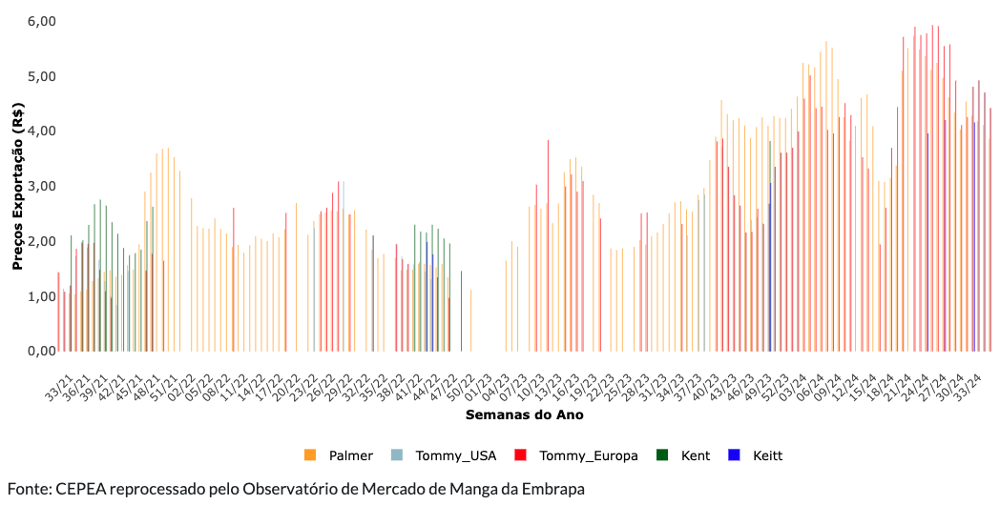
```

---
class: center

### OS PREÇOS PAGOS AOS PRODUTORES

```{r, echo=FALSE, out.width="95%"}
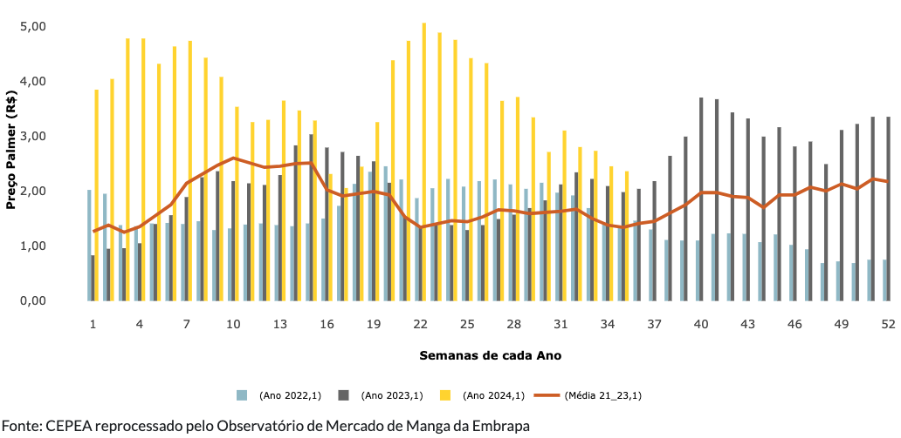
```

---
class: center

### OS PREÇOS PAGOS AOS PRODUTORES

```{r, echo=FALSE, out.width="105%"}
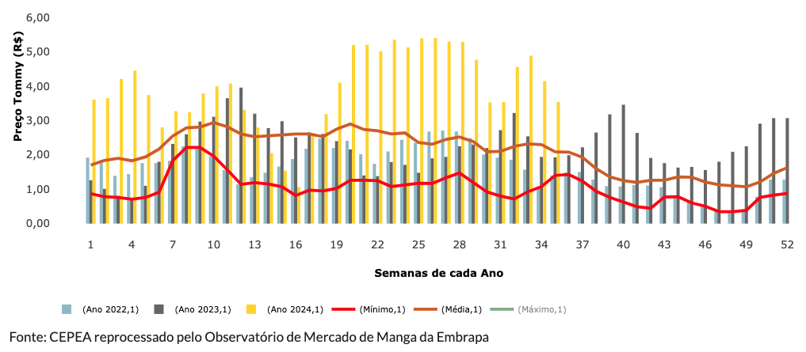
```

---
class: center

### OS PREÇOS PAGOS AOS PRODUTORES

```{r, echo=FALSE, out.width="95%"}
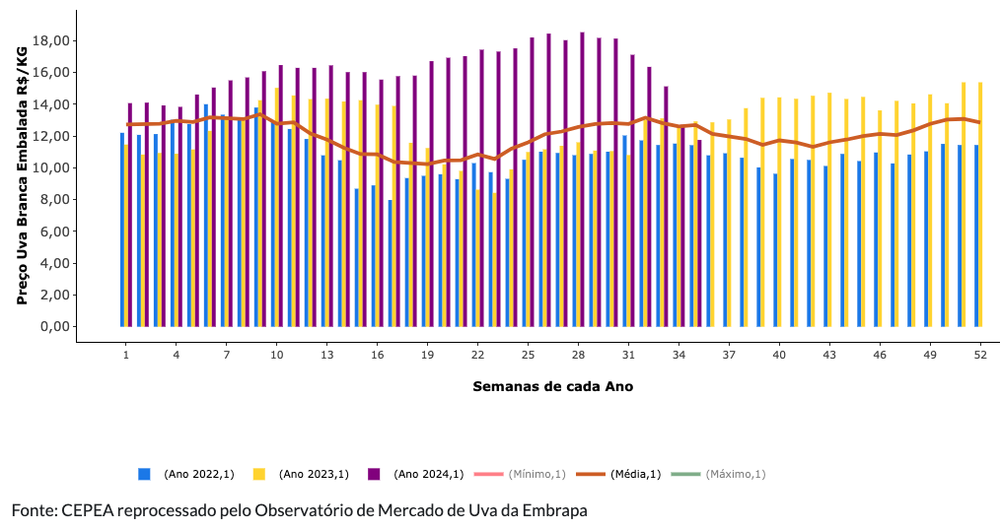
```

---
class: center

### OS PREÇOS PAGOS AOS PRODUTORES

```{r, echo=FALSE, out.width="95%"}
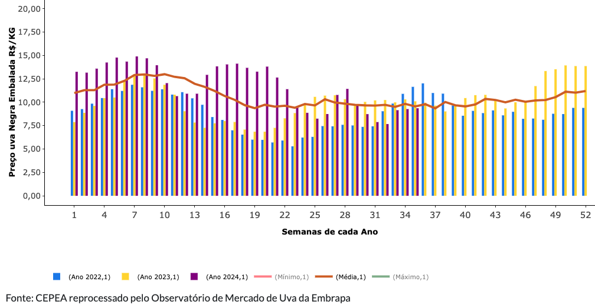
```

---
class: center, middle
### FORTE IMPACTO NA PRODUÇÃO DE PAÍSES CONCORRENTES

```{r, echo=FALSE, out.width="85%"}
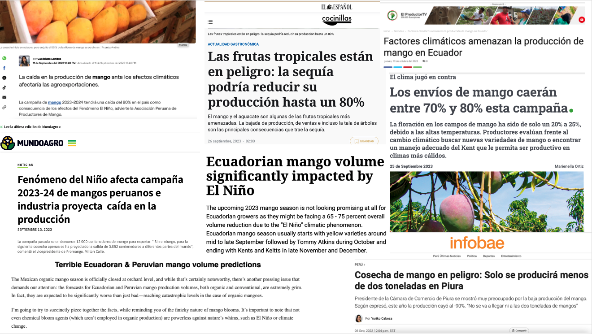
```

---
class: center

### EXPORTAÇÕES DE MANGAS NO BRASIL E NO PERU: 1980-2022

```{r, echo=FALSE, out.width="80%"}
#Direcionado o R para o Diretorio a ser trabalhado
setwd('/Users/jricardofl/Dropbox/Embrapa/2024/Eventos/mpo')

# Sample dataset
#Entrando dados no R
df <- read.csv2('dados/brasil_peru.csv', header=T, sep=";", dec = ".")

df <- df %>%
  mutate(
    flag_brasil = "https://upload.wikimedia.org/wikipedia/en/0/05/Flag_of_Brazil.svg",
    flag_peru = "https://upload.wikimedia.org/wikipedia/commons/c/cf/Flag_of_Peru.svg"
  )

# Create the plot
g9 <- ggplot(df, aes(x = ano)) +
  geom_line(aes(y = Brasil, color = "Brasil"), size = 2) +   # Line for Brazil
  geom_line(aes(y = Peru, color = "Peru"), size = 2) +       # Line for Peru
  scale_color_manual(values = c("Brasil" = "darkgreen", "Peru" = "red")) +  # Custom colors
  labs(title = "",
       x = "Ano",
       y = "Toneladas",
       color = "País",
       caption = "Fonte: FAOSTAT reprocessado pelo Observatório de Manga da Embrapa, 2024.") +  # Title and axis labels
   scale_y_continuous(n.breaks = 20)+
  scale_x_continuous(breaks = seq(1980, 2022, by = 5))+
  theme_minimal() + #Definindo tema
  theme(axis.text.x = element_text(angle=0, hjust=0.5, margin = margin(b=10), size=10), 
        axis.text.y = element_text(margin = margin(b=10), size=14), 
        axis.title.x = element_text(size=14, face = "bold", margin = margin(b=10)),
        axis.title.y = element_text(size=14, face = "bold", margin = margin(l=20)),
        panel.grid.major = element_blank(),
        panel.grid.minor = element_blank(), # retirando as linhas
        plot.caption = element_text(hjust = 0, size=14), #ajuste Fonte
        legend.title = element_blank(),
        legend.text=element_text(size=14),
        legend.position = "none")  # Define legend 

g9   +
    ggimage::geom_image(
    data = df %>% filter(ano == 2022),
    aes(x = ano, y = Brasil, image = flag_brasil),
    size = 0.05
  ) +
  ggimage::geom_image(
    data = df %>% filter(ano == 2022),
    aes(x = ano, y = Peru, image = flag_peru),
    size = 0.05
  )
```

---
class: center

### EXPORTAÇÕES DE UVAS NO BRASIL E NO PERU: 1980-2022

```{r, echo=FALSE, out.width="80%"}
#Direcionado o R para o Diretorio a ser trabalhado
setwd('/Users/jricardofl/Dropbox/Embrapa/2024/Eventos/mpo')

# Sample dataset
#Entrando dados no R
df <- read.csv2('dados/brasil_peru_uva.csv', header=T, sep=";", dec = ".")

df <- df %>%
  mutate(
    flag_brasil = "https://upload.wikimedia.org/wikipedia/en/0/05/Flag_of_Brazil.svg",
    flag_peru = "https://upload.wikimedia.org/wikipedia/commons/c/cf/Flag_of_Peru.svg"
  )

# Create the plot
g10 <- ggplot(df, aes(x = ano)) +
  geom_line(aes(y = Brasil, color = "Brasil"), size = 2) +   # Line for Brazil
  geom_line(aes(y = Peru, color = "Peru"), size = 2) +       # Line for Peru
  scale_color_manual(values = c("Brasil" = "darkgreen", "Peru" = "red")) +  # Custom colors
  labs(title = "",
       x = "Ano",
       y = "Toneladas",
       color = "País",
       caption = "Fonte: FAOSTAT reprocessado pelo Observatório de Uva da Embrapa, 2024.") +  # Title and axis labels
   scale_y_continuous(n.breaks = 10)+
  scale_x_continuous(breaks = seq(1980, 2022, by = 5))+
  theme_minimal() + #Definindo tema
  theme(axis.text.x = element_text(angle=0, hjust=0.5, margin = margin(b=10), size=10), 
        axis.text.y = element_text(margin = margin(b=10), size=14), 
        axis.title.x = element_text(size=14, face = "bold", margin = margin(b=10)),
        axis.title.y = element_text(size=14, face = "bold", margin = margin(l=20)),
        panel.grid.major = element_blank(),
        panel.grid.minor = element_blank(), # retirando as linhas
        plot.caption = element_text(hjust = 0, size=14), #ajuste Fonte
        legend.title = element_blank(),
        legend.text=element_text(size=14),
        legend.position = "none")  # Define legend 

g10 + 
  ggimage::geom_image(
    data = df %>% filter(ano == 2022),
    aes(x = ano, y = Brasil, image = flag_brasil),
    size = 0.10
  ) +
  ggimage::geom_image(
    data = df %>% filter(ano == 2022),
    aes(x = ano, y = Peru, image = flag_peru),
    size = 0.10
  )
```

---
class: center, middle
### FRUTAS DO BRASIL NA ALEMANHA

```{r, echo=FALSE, out.width="85%"}
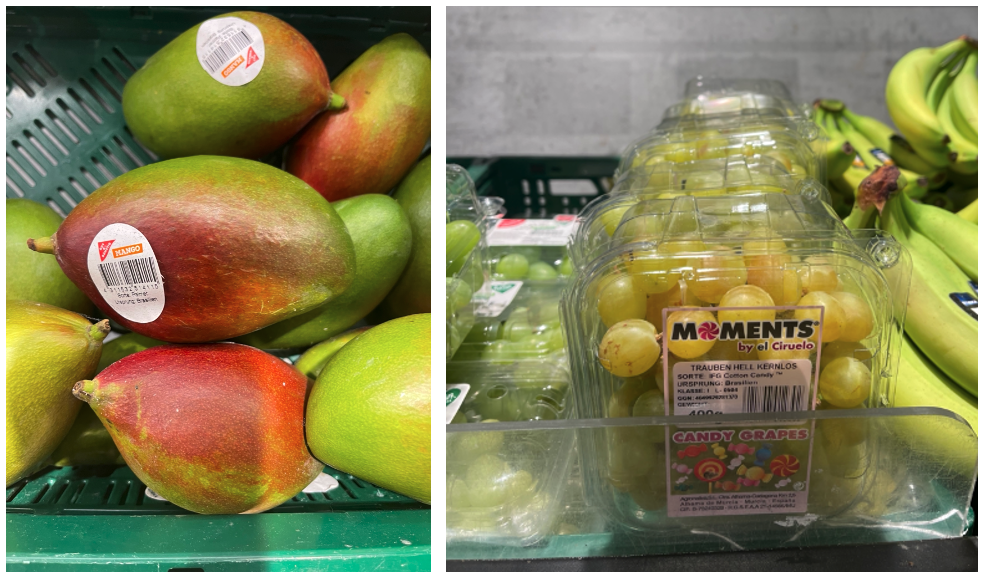
```

---
class: center
### FRUTAS DA INDIA NA ALEMANHA

```{r, echo=FALSE, out.width="100%"}
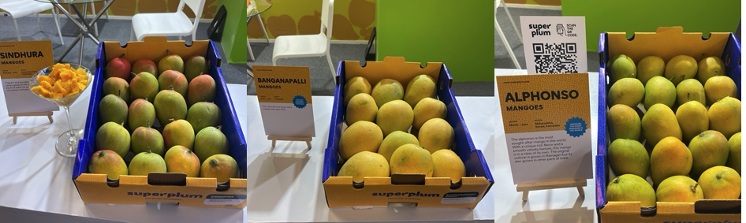
```

---
class: center
### FRUTAS DA ÁFRICA NA ALEMANHA

```{r, echo=FALSE, out.width="70%"}
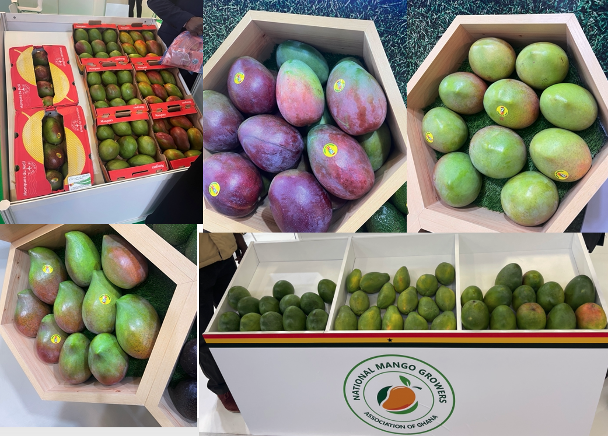
```

---
class: center
### TENDENCIA DE CONSUMO

```{r, echo=FALSE, out.width="65%"}
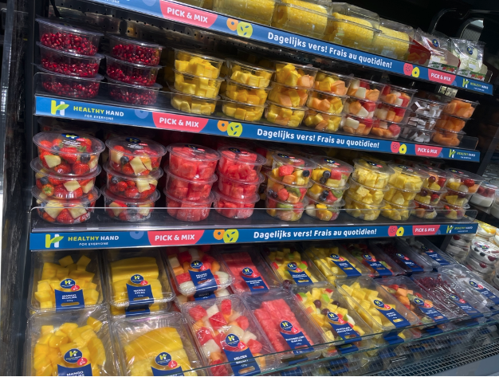
```

---
class: center
### DESESTIMULO AO CONSUMO

```{r, echo=FALSE, out.width="78%"}
knitr::include_graphics("imgs/manga1.png")
```

---
class: center, middle
### PERSPECTIVAS 2024.2/2025.1

```{r, echo=FALSE, out.width="85%"}
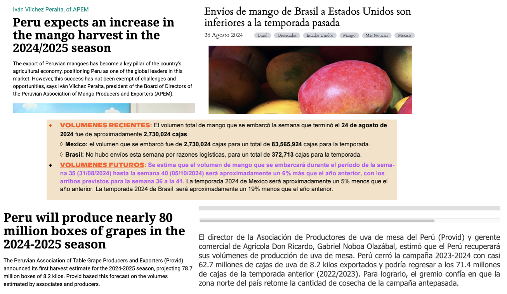
```

---
class: center

### LOGÍSTICA DE EXPORTAÇÃO 

.pull-left[

- Atualmente, navios levam 17 dias para chegar em Roterdã e 21 dias para chegar em Londres. É o mesmo tempo que os Peruanos gastam passando pelo Canal do Panamá. O *transit-time* aumentou pois os navios estão indo com velocidades menores que antes, para reduzir a emissão de CO2;

- Para os EUA, os navios levam 12/13 dias para chegar na Filadélfia. O Leste é o grande mercado consumidor e não produz. O Oeste também consume bastante, mas produz muita fruta e cria barreiras a entrada de conteineres. O Leste é mais flexível.

- Os Peruanos conseguem chegar na China em cerca de 23 dias. O Brasil recentemente conseguiu uma rota para chegar por Salvador no mesmo tempo de navio.

]

.pull-right[

Basicamente hoje é a Mesk e a Hapag-Lloyd fazendo os Estados Unidos e a MSC e a Hapag-Lloyd fazendo Europa. Não concorrem, trabalham em conjunto. 

- Os navios estão cada vez mais abarrotados de proteína animal congelada, sobrando pouco espaço para as frutas. 

- Frete Europa US\$ 4.400; EUA US\$ 8000, custo rodoviário para Salvador US\$ 1.200 e para Fortaleza US\$ 1.600. 

- Em situação de normalidade, a situação é de excesso de frutas, gerando a necessidade de mais mercados. A mercado interno é grande, com potencial de aumento, mas os valores pagos aos produtores são menores do que as frutas exportadas. 
]

---
class: center, middle, white-bg

```{r, echo=FALSE, out.width="30%"}

```

# OBRIGADO!

João Ricardo F. de Lima <br>
Email: joao.ricardo@embrapa.br

https://www.embrapa.br/observatorio-da-manga<br>
https://www.embrapa.br/observatorio-da-uva


Telefones:<br>
87-99961-5799<br>
87-98115-2404
