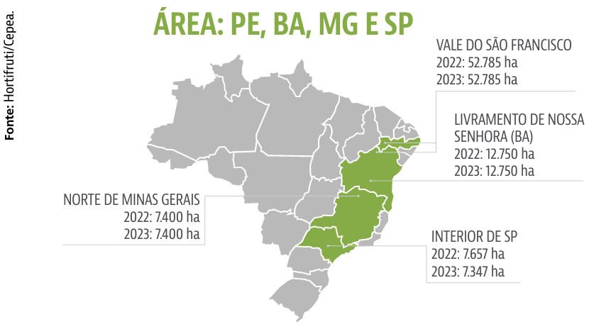
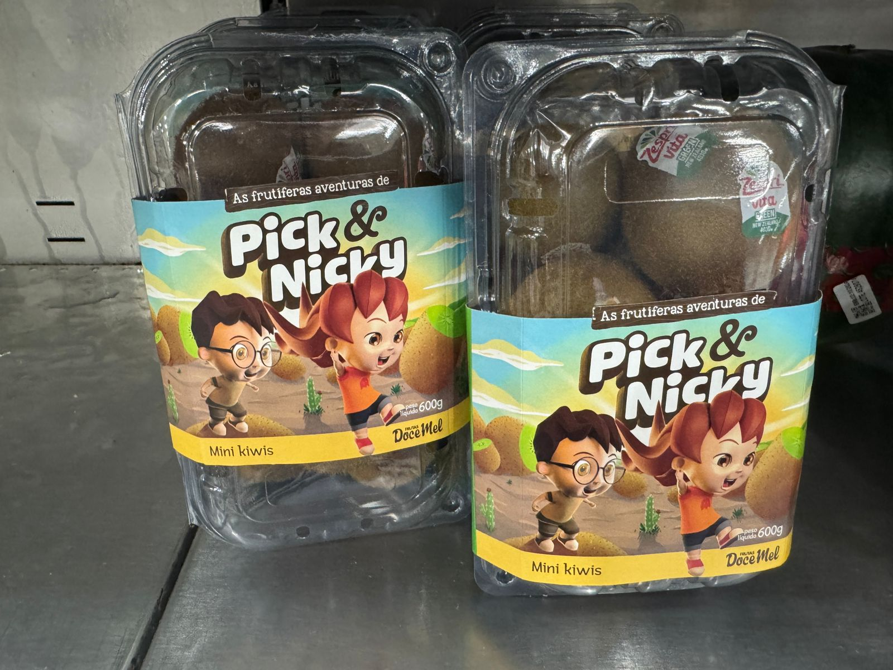
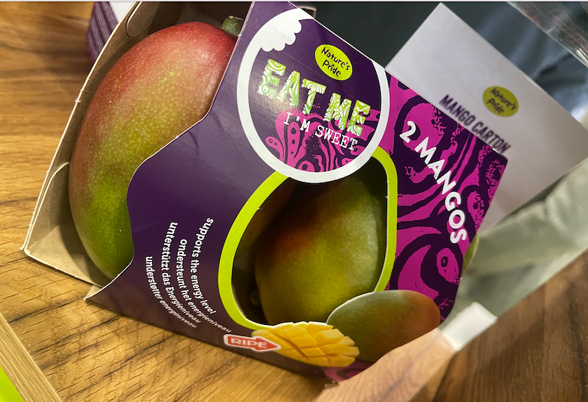
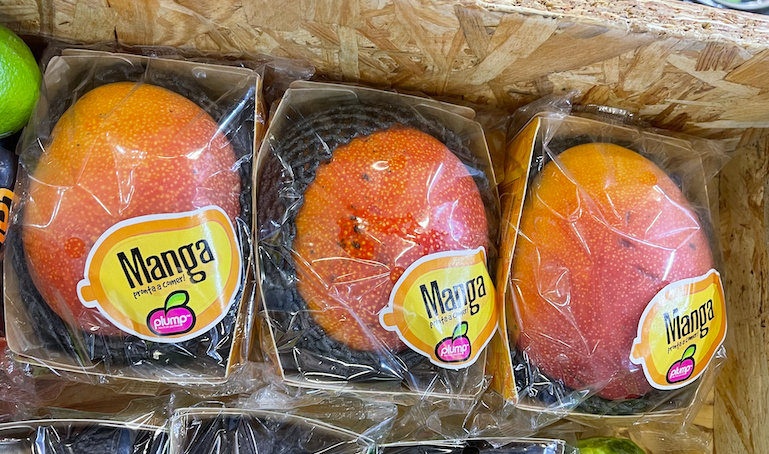

class: top, left

```{r setup, include=FALSE}
#renderthis::build_pdf("index.html", complex_slides = TRUE, partial_slides = TRUE)

# Dependências dos slides/aula
library(knitr)          # CRAN v1.33
library(rmarkdown)      # CRAN v2.10
library(xaringan)       # CRAN v0.22
library(xaringanthemer) # CRAN v0.3.0
library(xaringanExtra)  # [github::gadenbuie/xaringanExtra] v0.5.5
library(RefManageR)     # CRAN v1.3.0
library(ggplot2)        # CRAN v3.3.5
library(fontawesome)    # [github::rstudio/fontawesome] v0.1.0
library(pagedown)
library(dplyr)
library(ggimage)
library(ggtext)
library(glue)
library(tidyr)

# Opções de chunks
options(htmltools.dir.version = FALSE)
knitr::opts_chunk$set(
  echo       = FALSE,
  warning    = FALSE,
  message    = FALSE,
  fig.retina = 3,
  fig.width  = 11,
  fig.asp    = 0.618,
  out.width  = "100%",
  fig.align  = "center",
  comment    = "#"
  )

# Cores para gráficos
colors <- c(
  blue       = "#282f6b",
  red        = "#b22200",
  yellow     = "#eace3f",
  green      = "#224f20",
  purple     = "#5f487c",
  orange     = "#b35c1e",
  turquoise  = "#419391",
  green_two  = "#839c56",
  light_blue = "#3b89bc",
  gray       = "#666666"
  )
```

```{r xaringan, echo=FALSE}
# Tema da apresentação
xaringanthemer::style_mono_light(
  base_color                      = unname(colors["blue"]),
  title_slide_background_image    = params$logo_slides, 
  title_slide_background_size     = 10,
  title_slide_background_position = "bottom 10px right 20px",
  title_slide_background_color    = "white",
  title_slide_text_color          = unname(colors["blue"]),
  footnote_position_bottom        = "15px"
  )

# Opções extras do tema
xaringanExtra::use_progress_bar(
  color    = colors["blue"], 
  location = "bottom"
  )
xaringanExtra::use_extra_styles(
  hover_code_line         = TRUE,
  mute_unhighlighted_code = FALSE
  )
xaringanExtra::use_panelset()
```

```{css, echo=FALSE}
pre {
  white-space: pre-wrap;
  overflow-y: scroll !important;
  max-height: 45vh !important;
  overflow-x: auto;
  max-width: 100%;
}
```

```{css}
/* Add this to your xaringan-themer.css file or within a <style> tag in your .Rmd file */
.white-bg {
  background-color: white !important;
  color: black !important; /* Optional: to ensure text is visible against a white background */
}
```

```{r load_refs, echo=FALSE, eval=params$references}
# Configuração de citações
RefManageR::BibOptions(
  check.entries = FALSE,
  bib.style     = "authoryear",
  cite.style    = "authoryear",
  style         = "markdown",
  hyperlink     = FALSE,
  dashed        = FALSE
  )
if(params$references){
  temp_refbib <- tempdir()
  download.file(
    url      = params$references_path, 
    destfile = paste0(temp_refbib, "/references.bib"), 
    mode     = "wb"
    )
  myBib <- RefManageR::ReadBib(paste0(temp_refbib, "/references.bib"), check = FALSE)
  }

# Como citar?
# RefManageR::TextCite(myBib, "id_da_citacao")
```

```{r utils, echo=FALSE}
# Função que pega um arquivo .Rmd, condicionalmente o renderiza, 
# e embute o conteúdo do mesmo formatado como Markdown puro 
# no output do documento atual
print_rmd <- function(file, encoding = "UTF-8", render = TRUE){
  if(render){rmarkdown::render(input = file, quiet = TRUE)}
  rmd <- readLines(con = file, encoding = encoding)
  cat("```md\n")
  cat(rmd, sep = "\n")
  cat("```\n")
}
```

### A COMPLEXA CADEIA PRODUTIVA DA MANGICULTURA.

```{r, echo=FALSE, out.width="90%"}
knitr::include_graphics("imgs/seacon15.png")
```
Fonte: LIMA et al, 2023.

---
class: top, left

### OS DADOS ATUALIZADOS DO IBGE ATÉ 2023.

#### Área com Manga no Brasil e regiões

```{r ibge_manga1, out.width="72%"}
#Direcionado o R para o Diretorio a ser trabalhado
setwd('/Users/jricardofl/Dropbox/tempecon/dados_manga/2024')

#Inicio do Script
#Pacotes a serem utilizados 
library(ggplot2)
library(ggthemes)
library(dplyr)
library(tidyverse)
library(scales)
library(kableExtra)# complex tables
library(magrittr)# pipe operations
library(readxl)
library(reshape2)
library(plotly)
library(DT)

mycolors2 <- c("darkgray", "lightblue3", "orange", "darkblue", "red", "darkgreen", "gold", "#0A6269", "#690F0A", "#6675E6" )
mycolors3 <- c("orange")

#Entrando dados no R
#dados1 <- read_excel("area_regioes.xlsx", col_names = TRUE)
#dados1 <- dados1[c(1,3,4),]
dados1 <- read_excel("area_regioes.xlsx", col_names = TRUE, skip = 4, col_types = c('text', "numeric", "numeric", "numeric", "numeric", "numeric", "numeric", "numeric", "numeric", "numeric", "numeric"), na="-")
colnames(dados1)[1] <- 'regiao'
dados1 <- dados1[-nrow(dados1),]

dados1m <- melt(dados1, id.var='regiao')
dados1m_area <- dados1m

g1 <- ggplot()+
  geom_col(data=dados1m, aes(x=reorder(regiao, -value), y=value/1000, fill=variable), lwd=1, position = "dodge")+ scale_fill_manual(values=mycolors2)+
  labs(y= "Área Plantada de Manga (1000 ha)", x= "Brasil e Regiões", title='',
       caption = "Fonte: PAM/IBGE (2024) reprocessado pelo Observatório de Mercado de Manga da Embrapa")+
  theme_minimal()+
  theme(axis.text.x=element_text(angle=0, hjust=0.5, size=12, margin = margin(b=20)),
        axis.text.y=element_text(hjust=0.5, size=12, margin = margin(l=20)),
        axis.title.y = element_text(size=12, face = "bold"),
        axis.title.x = element_text(size=12, face = "bold"),
        panel.grid.major = element_blank(),
        panel.grid.minor = element_blank(),
        plot.title = element_text(hjust = 0.5, size=12),
        plot.caption = element_text(hjust = 0, size=12),
        legend.position = "right", legend.title = element_blank(),
        legend.text=element_text(size=10)) # Definindo posição da legenda

g1
```

---
class: top, left

### OS DADOS ATUALIZADOS DO IBGE ATÉ 2023.

#### Área com Manga por estados

```{r ibge_manga2, out.width="72%"}
#Direcionado o R para o Diretorio a ser trabalhado
setwd('/Users/jricardofl/Dropbox/tempecon/dados_manga/2024')

#Entrando dados no R
#dados2 <- read_excel("area_estados.xlsx", col_names = TRUE)
dados2 <- read_excel("area_estados.xlsx", col_names = TRUE, skip = 4, col_types = c('text', "numeric", "numeric", "numeric", "numeric", "numeric", "numeric", "numeric", "numeric", "numeric", "numeric"), na="-")
colnames(dados2)[1] <- 'estados'
dados2 <- dados2[-nrow(dados2),]
dados2 <- na.exclude(dados2)
dados2 <- arrange(dados2, desc(dados2$"2023"))
dados2 <- dados2[c(1:6),]
dados2$estados[6] <- "Rio G. do Norte"
dados2m <- melt(dados2, id.var='estados')

g2 <- ggplot()+
  geom_col(data=dados2m, aes(x=reorder(estados, -value), y=value/1000, fill=variable), lwd=1, position = "dodge")+ scale_fill_manual(values=mycolors2)+
  labs(y= "Área Plantada de Manga (1000 ha)", x= "Estados do Brasil", title='',
       caption = "Fonte: PAM/IBGE (2024) reprocessado pelo Observatório de Mercado de Manga da Embrapa")+
  theme_minimal()+
  theme(axis.text.x=element_text(angle=0, hjust=0.5, size=10, margin = margin(b=20)),
        axis.text.y=element_text(hjust=0.5, size=12, margin = margin(l=20)),
        axis.title.y = element_text(size=12, face = "bold"),
        axis.title.x = element_text(size=12, face = "bold"),
        panel.grid.major = element_blank(),
        panel.grid.minor = element_blank(),
        plot.title = element_text(hjust = 0.5, size=12),
        plot.caption = element_text(hjust = 0, size=12),
        legend.position = "right", legend.title = element_blank(),
        legend.text=element_text(size=10)) # Definindo posição da legenda

g2
```


---
class: top, left

### OS DADOS ATUALIZADOS DO IBGE ATÉ 2023.

#### Área com Manga por cidades

```{r ibge_manga3, out.width="72%"}
#Direcionado o R para o Diretorio a ser trabalhado
#Entrando dados no R
setwd('/Users/jricardofl/Dropbox/tempecon/dados_manga/2024')

dados3 <- read_excel("area_cidades.xlsx", col_names = TRUE, skip = 4, col_types = c('text', rep("numeric", 10)), na = "-")
colnames(dados3)[1] <- 'cidades'
dados3 <- dados3[-nrow(dados3),]
#dados3$"2013"[dados3$cidades == "Belém do São Francisco (PE)"] <- 600
dados3 <- dados3 |>
  na.exclude() |>
  arrange(desc(`2023`)) 

# Select the top 16 rows and remove columns 2 to 10 (unnecessary columns)
dados3a <- dados3 |>
  slice_head(n = 20) |>
  select(-c(2:10))

dados3m <- melt(dados3a, id.var='cidades')
dados3m_area <- dados3m

g3 <- ggplot()+
  geom_col(data=dados3m, aes(x=reorder(cidades, -value), y=value, fill=variable), lwd=1, position = "dodge")+ scale_fill_manual(values=mycolors3)+
  labs(y= "Área Plantada de Manga (ha)", x= "Cidades do Brasil", title='',
       caption = "Fonte: PAM/IBGE (2024) reprocessado pelo Observatório de Mercado de Manga da Embrapa")+
  theme_minimal()+
  theme(axis.text.x=element_text(angle=20, hjust=1, size=8, margin = margin(b=20)),
        axis.text.y=element_text(hjust=0.5, size=8, margin = margin(l=20)),
        axis.title.y = element_text(size=10, face = "bold"),
        axis.title.x = element_text(size=10, face = "bold"),
        panel.grid.major = element_blank(),
        panel.grid.minor = element_blank(),
        plot.title = element_text(hjust = 0.5, size=12),
        plot.caption = element_text(hjust = 0, size=12),
        legend.position = "bottom", legend.title = element_blank(),
        legend.text=element_text(size=12)) # Definindo posição da legenda

g3
```

---
class: top, left

### OS DADOS ATUALIZADOS DO IBGE ATÉ 2023.

#### Área com Manga no Vale do São Francisco.

```{r ibge_manga4, out.width="72%"}
#Direcionado o R para o Diretorio a ser trabalhado
#Entrando dados no R
setwd('/Users/jricardofl/Dropbox/tempecon/dados_manga/2024')

dados4 <- read_excel("area_vale.xlsx", col_names = TRUE, skip = 4, 
                     col_types = c('text', rep("numeric", 10)), na = "-")

colnames(dados4)[1] <- 'mesorregiao'
dados4 <- dados4[-nrow(dados4),]

dados4a <- dados4[,-1] %>%
  summarise_all(sum)

dados4a$mesorregiao <- "Vale do São Francisco"
dados4a <- dados4a %>% select(mesorregiao, everything())
dados4m <- melt(dados4a, id.var='mesorregiao')
dados4m_area <- dados4m
mycolors4 <- "blue"

g4 <- ggplot()+
  geom_col(data=dados4m, aes(x=variable, y=value/1000, fill="Area Manga (Hectares)"), lwd=1)+
  scale_fill_manual(values=mycolors4)+
  labs(y= "Área Plantada de Manga (mil ha)", x= "Vale do São Francisco", title='',
       caption = "Fonte: PAM/IBGE (2024) reprocessado pelo Observatório de Mercado de Manga da Embrapa")+
  theme_minimal()+
  theme(axis.text.x=element_text(angle=0, hjust=0.5, size=12, margin = margin(b=20)),
        axis.text.y=element_text(hjust=0.5, size=12, margin = margin(l=20)),
        axis.title.y = element_text(size=12, face = "bold"),
        axis.title.x = element_text(size=12, face = "bold"),
        panel.grid.major = element_blank(),
        panel.grid.minor = element_blank(),
        plot.title = element_text(hjust = 0.5, size=12),
        plot.caption = element_text(hjust = 0, size=12),
        legend.position = "bottom", legend.title = element_blank(),
        legend.text=element_text(size=12)) # Definindo posição da legenda

g4
```

---
class: top, left

### OS DADOS ATUALIZADOS DO IBGE ATÉ 2023.

#### Área com Manga no Centro-Sul Baiano.

```{r ibge_manga4a, out.width="72%"}
#Direcionado o R para o Diretorio a ser trabalhado
#Entrando dados no R
#setwd('/Users/jricardofl/Dropbox/tempecon/dados_manga/2024')

dados5 <- read_excel("dados/dados_centrosul.xlsx", col_names = TRUE, skip = 4, 
                     col_types = c('text', rep("numeric", 10)), na = "-")

colnames(dados5)[1] <- 'variaveis'
dados5 <- dados5[-nrow(dados5),]

# Melt the dataset to a long format
dados_long <- dados5 |>
  pivot_longer(
    cols = -variaveis,        # All columns except 'variaveis'
    names_to = "year",        # New column for years
    values_to = "value"       # New column for values
  )

# Rename and transform the variables
dados_long <- dados_long |>
  mutate(
    variaveis = case_when(
      variaveis == "Área plantada ou destinada à colheita (Hectares)" ~ "area",
      variaveis == "Quantidade produzida (Toneladas)" ~ "toneladas",
      variaveis == "Rendimento médio da produção (Quilogramas por Hectare)" ~ "produtividade",
      variaveis == "Valor da produção (Mil Reais)" ~ "valor",
      TRUE ~ variaveis
    ),
    # Transform values for 'toneladas' and 'produtividade' by dividing by 1000
    value = case_when(
      variaveis == "toneladas" ~ value / 1000,
      variaveis == "produtividade" ~ value / 1000,
      TRUE ~ value
    )
  )

mycolors4 <- "darkgreen"

# Filter for "area" and plot
g4  <- dados_long |>
  filter(variaveis == "area") |>
  ggplot()+
  geom_col(aes(x=year, y=value/1000, fill="Area Manga (Hectares)"), lwd=1)+
  scale_fill_manual(values=mycolors4)+
  labs(y= "Área Plantada de Manga (mil ha)", x= "Centro Sul Baiano", title='',
       caption = "Fonte: PAM/IBGE (2024) reprocessado pelo Observatório de Mercado de Manga da Embrapa")+
  theme_minimal()+
  theme(axis.text.x=element_text(angle=0, hjust=0.5, size=12, margin = margin(b=20)),
        axis.text.y=element_text(hjust=0.5, size=12, margin = margin(l=20)),
        axis.title.y = element_text(size=12, face = "bold"),
        axis.title.x = element_text(size=12, face = "bold"),
        panel.grid.major = element_blank(),
        panel.grid.minor = element_blank(),
        plot.title = element_text(hjust = 0.5, size=12),
        plot.caption = element_text(hjust = 0, size=12),
        legend.position = "bottom", legend.title = element_blank(),
        legend.text=element_text(size=12)) # Definindo posição da legenda

g4
```

---
class: center
### ANÁLISE DA OFERTA DE MANGA - CEPEA
```{r, echo=FALSE, out.width="88%"}

```

---
class: top, left

### OS DADOS ATUALIZADOS DO IBGE ATÉ 2023.

#### Produtividade da Manga no Vale do São Francisco.

```{r ibge_manga12, out.width="72%"}
#Direcionado o R para o Diretório a ser trabalhado
#Entrando dados no R
setwd('/Users/jricardofl/Dropbox/tempecon/dados_manga/2024')

dados4 <- read_excel("quanti_vale.xlsx", col_names = TRUE, skip = 4, 
                     col_types = c('text', rep("numeric", 10)), na = "-")

colnames(dados4)[1] <- 'mesorregiao'
dados4 <- dados4[-nrow(dados4),]

dados4a <- dados4[,-1] %>%
  summarise_all(sum)

dados4a$mesorregiao <- "Vale do São Francisco"
dados4a <- dados4a %>% select(mesorregiao, everything())
dados4m <- melt(dados4a, id.var='mesorregiao')
dados4m_quanti <- dados4m

dados4 <- read_excel("area_vale.xlsx", col_names = TRUE, skip = 4, 
                     col_types = c('text', rep("numeric", 10)), na = "-")

colnames(dados4)[1] <- 'mesorregiao'
dados4 <- dados4[-nrow(dados4),]

dados4a <- dados4[,-1] %>%
  summarise_all(sum)

dados4a$mesorregiao <- "Vale do São Francisco"
dados4a <- dados4a %>% select(mesorregiao, everything())
dados4m <- melt(dados4a, id.var='mesorregiao')
dados4m_area <- dados4m

dados4m <- inner_join(dados4m_quanti, dados4m_area, by="variable")
dados4m$value <- dados4m$value.x/dados4m$value.y
dados4m$value <- round(dados4m$value,1)
dados4m <- dados4m[,-c(3:5)]
colnames(dados4m)[1] <- "mesorregiao"

g5 <- ggplot()+
  geom_col(data=dados4m, aes(x=variable, y=value, fill="Produtividade manga"), lwd=1)+
  scale_fill_manual(values=mycolors4)+
  labs(y= "Produtividade da Manga (t/ha)", x= "Vale do São Francisco", title='',
       caption = "Fonte: PAM/IBGE (2024) reprocessado pelo Observatório de Mercado de Manga da Embrapa")+
  theme_minimal()+
  theme(axis.text.x=element_text(angle=0, hjust=0.5, size=12, margin = margin(b=20)),
        axis.text.y=element_text(hjust=0.5, size=12, margin = margin(l=20)),
        axis.title.y = element_text(size=12, face = "bold"),
        axis.title.x = element_text(size=12, face = "bold"),
        panel.grid.major = element_blank(),
        panel.grid.minor = element_blank(),
        plot.title = element_text(hjust = 0.5, size=12),
        plot.caption = element_text(hjust = 0, size=12),
        legend.position = "bottom", legend.title = element_blank(),
        legend.text=element_text(size=12)) # Definindo posição da legenda

g5
```

---
class: top, left

### OS DADOS ATUALIZADOS DO IBGE ATÉ 2023.

#### Produtividade da Manga no Centro-Sul Baiano.

```{r ibge_manga4c, out.width="72%"}
#Direcionado o R para o Diretorio a ser trabalhado
#Entrando dados no R
#setwd('/Users/jricardofl/Dropbox/tempecon/dados_manga/2024')

mycolors4 <- "darkgreen"

# Filter for "area" and plot
g4c  <- dados_long |>
  filter(variaveis == "produtividade") |>
  ggplot()+
  geom_col(aes(x=year, y=value, fill="Produtividade Manga ( Toneladas por Hectare)"), lwd=1)+
  scale_fill_manual(values=mycolors4)+
  labs(y= "Produtividade Manga (Toneladas por Hectare)", x= "Centro Sul Baiano", title='',
       caption = "Fonte: PAM/IBGE (2024) reprocessado pelo Observatório de Mercado de Manga da Embrapa")+
  theme_minimal()+
  theme(axis.text.x=element_text(angle=0, hjust=0.5, size=12, margin = margin(b=20)),
        axis.text.y=element_text(hjust=0.5, size=12, margin = margin(l=20)),
        axis.title.y = element_text(size=12, face = "bold"),
        axis.title.x = element_text(size=12, face = "bold"),
        panel.grid.major = element_blank(),
        panel.grid.minor = element_blank(),
        plot.title = element_text(hjust = 0.5, size=12),
        plot.caption = element_text(hjust = 0, size=12),
        legend.position = "bottom", legend.title = element_blank(),
        legend.text=element_text(size=12)) # Definindo posição da legenda

g4c
```

---
class: top, left

### OS DADOS ATUALIZADOS DO IBGE ATÉ 2023.

#### Volume com Manga no Vale do São Francisco.

```{r ibge_manga8, out.width="72%"}
#Direcionado o R para o Diretorio a ser trabalhado
#Entrando dados no R
setwd('/Users/jricardofl/Dropbox/tempecon/dados_manga/2024')

dados4 <- read_excel("quanti_vale.xlsx", col_names = TRUE, skip = 4, 
                     col_types = c('text', rep("numeric", 10)), na = "-")

colnames(dados4)[1] <- 'mesorregiao'
dados4 <- dados4[-nrow(dados4),]

dados4a <- dados4[,-1] %>%
  summarise_all(sum)

dados4a$mesorregiao <- "Vale do São Francisco"
dados4a <- dados4a %>% select(mesorregiao, everything())
dados4m <- melt(dados4a, id.var='mesorregiao')
dados4m_quanti <- dados4m
mycolors4 <- "blue"

g4 <- ggplot()+
  geom_col(data=dados4m, aes(x=variable, y=value/1000, fill="Quantidade Manga (1000 Toneladas)"), lwd=1)+
  scale_fill_manual(values=mycolors4)+
  labs(y= "Volume de Manga (Mil toneladas)", x= "Vale do São Francisco", title='',
       caption = "Fonte: PAM/IBGE reprocessado pelo Observatório de Mercado de Manga da Embrapa")+
  theme_minimal()+
  theme(axis.text.x=element_text(angle=0, hjust=0.5, size=12, margin = margin(b=20)),
        axis.text.y=element_text(hjust=0.5, size=12, margin = margin(l=20)),
        axis.title.y = element_text(size=12, face = "bold"),
        axis.title.x = element_text(size=12, face = "bold"),
        panel.grid.major = element_blank(),
        panel.grid.minor = element_blank(),
        plot.title = element_text(hjust = 0.5, size=12),
        plot.caption = element_text(hjust = 0, size=12),
        legend.position = "bottom", legend.title = element_blank(),
        legend.text=element_text(size=12)) # Definindo posição da legenda

g4
```

---
class: top, left

### OS DADOS ATUALIZADOS DO IBGE ATÉ 2023.

#### Volume com Manga no Centro-Sul Baiano.

```{r ibge_manga4b, out.width="72%"}
#Direcionado o R para o Diretorio a ser trabalhado
#Entrando dados no R
#setwd('/Users/jricardofl/Dropbox/tempecon/dados_manga/2024')

mycolors4 <- "darkgreen"

# Filter for "area" and plot
g4b  <- dados_long |>
  filter(variaveis == "toneladas") |>
  ggplot()+
  geom_col(aes(x=year, y=value, fill="Volume Manga (Mil Toneladas)"), lwd=1)+
  scale_fill_manual(values=mycolors4)+
  labs(y= "Volume de Manga (Mil toneladas)", x= "Centro Sul Baiano", title='',
       caption = "Fonte: PAM/IBGE (2024) reprocessado pelo Observatório de Mercado de Manga da Embrapa")+
  theme_minimal()+
  theme(axis.text.x=element_text(angle=0, hjust=0.5, size=12, margin = margin(b=20)),
        axis.text.y=element_text(hjust=0.5, size=12, margin = margin(l=20)),
        axis.title.y = element_text(size=12, face = "bold"),
        axis.title.x = element_text(size=12, face = "bold"),
        panel.grid.major = element_blank(),
        panel.grid.minor = element_blank(),
        plot.title = element_text(hjust = 0.5, size=12),
        plot.caption = element_text(hjust = 0, size=12),
        legend.position = "bottom", legend.title = element_blank(),
        legend.text=element_text(size=12)) # Definindo posição da legenda

g4b
```

---
class: top, left

### ANÁLISE DA OFERTA DE MANGA - CEPEA
```{r, echo=FALSE, out.width="86%"}
knitr::include_graphics("imgs/fig7.png")
```


---
class: top, left

### O MERCADO EXTERNO

```{r paraguai1, out.width  = "80%"}
library(lubridate)
anterior <- as.Date("2024-09-01")
atual <-  as.Date("2024-10-01") #ultimo mes disponibilizado
today <- as.Date("2024-11-29") #data para o IGPI - ultima semana do preço
mes <- 10

#Direcionado o R para o Diretorio a ser trabalhado
#setwd('c:/Users/Joao Ricardo Lima/Dropbox/tempecon/dados_manga')
setwd('/Users/jricardofl/Dropbox/tempecon/dados_manga')

#Inicio do Script
#Pacotes a serem utilizados 
library(mFilter)
library(forecast)
library(tsutils)
library(seasonal)
library(uroot)
library(tseries)
library(ggthemes)
library(dplyr)
library(quantmod)
library(scales)
library(lmtest)
library(FinTS)
library(rbcb)
library(plotly)
library(DT)
library(magrittr)
library(rmarkdown)
library(reshape2)
library(rbcb)
library(tidyverse)
library(lubridate)
library(zoo)

#checkX13()

options(digits=4)

#Entrando dados no R
dados1 <- read.csv2('exportacoes_2012_2024.csv', header=T, sep=";", dec = ".")
dados1 <- dados1/1000
dados1[,1] <- seq(2012, 2024, by = 1)
colnames(dados1) = c('Ano', 'Valor', 'Toneladas')
dados1 <- tibble(dados1)


#Entrando dados no R
dados2 <- read.csv2('total_exporta_br.csv', header=T, sep=";", dec = ".")
#dados <- dados[,-c(9:10)] #retirar as ultimas colunas
colnames(dados2)[1]<-'ano'


#Entrando dados no R
dados3 <- read.csv2('destinos_2024.csv', header=T, sep=";", dec = ".")
colnames(dados3)[1]<-'Paises'

#Entrando dados no R
dados4 <- read.csv2('via_2024.csv', header=T, sep=";", dec = ".")
colnames(dados4)[1]<-'Vias'

#dados5 <- read.csv2('uf_2024.csv', header=T, sep=";" , dec = ".")
#colnames(dados5)[1]<-'UF'

#Ajusta para Valor
#Analise de Serie Temporal
exporta_manga_valor <- dados2[,3]
exporta_manga_valor<-exporta_manga_valor/1000000
exporta_manga_valor <- ts(exporta_manga_valor, start=c(2012,1), freq=12)

#Tendencia
trend_valor <- cmav(exporta_manga_valor, outplot=F)
date <- seq(as.Date('2012-01-01'),to=atual,by='1 month')
trend_valor <- tibble(date, trend_valor)

#Sazonalidade
decompa<-decompose(exporta_manga_valor, type = 'multiplicative')
sazonal_valor <- decompa$figure
#meses <- seq(1:12)
meses <- seq(as.Date("2021/1/1"), by = "month", length.out = 12) 
sazonal_graph <- tibble(meses, sazonal_valor)

#Comparações com os anos e entre as médias/max/min

exporta_manga_valor_2023 <- window(exporta_manga_valor, end=c(2023,12))
seas23 <- seasplot(exporta_manga_valor_2023, trend=F, outplot = F)
medias23 <- colMeans(seas23$season)

#exporta_manga_valor_2021 <- window(exporta_manga_valor, end=c(2021,12))
exporta_manga_valor_2022 <- window(exporta_manga_valor, end=c(2022,12))
#seas21<-seasplot(preco_palmer_2021, trend=F, outplot = F)
#medias21 <- colMeans(seas21$season)

exporta_manga_valor_24 <- as.matrix(tail(exporta_manga_valor,mes)) #ajustar mensalmente
exporta_manga_valor_2024 <- matrix(NA, nrow=12, ncol=1)

for(i in 1:mes){
  exporta_manga_valor_2024[i,1] = exporta_manga_valor_24[i,1]
}
  
#Como só se tem até a semana 12
medias23 <- medias23[1:12]

matrix = matrix(NA, nrow=12, ncol=2)

for(i in 1:12){
  matrix[i,1] = min(seas23$season[,i])
  matrix[i,2] = max(seas23$season[,i])
}

#time <- c("Janeiro", "Fevereiro", "Março", "Abril", "Maio", "Junho", "Julho", "Agosto", "Setembro", "Outubro", "Novembro", #"Dezembro")
#time <-seq(1:12)
table <- data.frame(meses, matrix[,1], round(medias23,3), matrix[,2], round(tail(exporta_manga_valor_2022,12),3), round(tail(exporta_manga_valor_2023,12),3), exporta_manga_valor_2024[,1])
colnames(table) = c('Meses', 'Mínimo', 'Média', 'Máximo', '2022', '2023', '2024')

tablea <- table[,-c(5:7)]
tableb <- table[,-c(2,3,4)]

tablea2 <- melt(tablea, id.var='Meses')
tableb2 <- melt(tableb, id.var='Meses')
mycolors <- c("lightblue3", "gray44", "gold")

#Ajusta para Volume
#Analise de Serie Temporal
exporta_manga_volume <- dados2[,4]
exporta_manga_volume<-exporta_manga_volume/1000  #passando de quilo para tonelada

#Ajuste para a variação Mensal do Volume


variacao_volume_22 <-  dados2 %>% filter(ano=='2022')
variacao_volume_23 <-  dados2 %>% filter(ano=='2023')
variacao_volume_24 <-  dados2 %>% filter(ano=='2024')

variacao_volume_22 <-  variacao_volume_22[,4]/1000
variacao_volume_23 <-  variacao_volume_23[,4]/1000
variacao_volume_24 <-  variacao_volume_24[,4]/1000

#Setando como uma série temporal
exporta_manga_volume <- ts(exporta_manga_volume, start=c(2012,1), freq=12)

#Tendencia
trend_volume <- cmav(exporta_manga_volume, outplot=F)
trend_volume <- tibble(date, trend_volume)

#Sazonalidade
decompa<-decompose(exporta_manga_volume, type = 'multiplicative')
sazonal_volume <- decompa$figure
sazonal_graph_volume <- tibble(meses, sazonal_volume)

#Comparações com os anos e entre as médias/max/min

exporta_manga_volume_2023 <- window(exporta_manga_volume, end=c(2023,12))
seas23_vol <- seasplot(exporta_manga_volume_2023, trend=F, outplot = F)
medias23_vol <- colMeans(seas23_vol$season)

#exporta_manga_volume_2021 <- window(exporta_manga_volume, end=c(2021,12))

exporta_manga_volume_2022 <- window(exporta_manga_volume, end=c(2022,12))

exporta_manga_volume_24 <- as.matrix(tail(exporta_manga_volume,mes)) #ajustar mensalmente
exporta_manga_volume_2024 <- matrix(NA, nrow=12, ncol=1)

for(i in 1:mes){
  exporta_manga_volume_2024[i,1] = exporta_manga_volume_24[i,1]
}
  
#Como só se tem até a semana 12
medias23_vol <- medias23_vol[1:12]

matrix_vol = matrix(NA, nrow=12, ncol=2)

for(i in 1:12){
  matrix_vol[i,1] = min(seas23_vol$season[,i])
  matrix_vol[i,2] = max(seas23_vol$season[,i])
}

#time <- c("Janeiro", "Fevereiro", "Março", "Abril", "Maio", "Junho", "Julho", "Agosto", "Setembro", "Outubro", "Novembro", #"Dezembro")
#time <-seq(1:12)
table_volume <- data.frame(meses, round(matrix_vol[,1],0), round(medias23_vol,0), round(matrix_vol[,2],0), round(tail(exporta_manga_volume_2022,12),0),
round(tail(exporta_manga_volume_2023,12),0), round(exporta_manga_volume_2024[,1],0))
colnames(table_volume) = c('Meses', 'Mínimo', 'Média', 'Máximo', '2022', '2023', '2024')

tablea_vol <- table_volume[,-c(5:7)]
tableb_vol <- table_volume[,-c(2,3,4)]

tablea2_vol <- melt(tablea_vol, id.var='Meses')
tableb2_vol <- melt(tableb_vol, id.var='Meses')


#Variação Mensal 2021

variacao_volume_2022 <- as.matrix(variacao_volume_22)
variacao_volume_2023 <- as.matrix(variacao_volume_23)
variacao_volume_2024 <- matrix(NA, nrow=12, ncol=1)
variacao_volume_24 <- as.matrix(variacao_volume_24)

for(i in 1:mes){
  variacao_volume_2024[i,1] = variacao_volume_24[i,1] 
}


variacao_23 <- ((variacao_volume_2023/variacao_volume_2022) - 1)*100
variacao_24 <- ((variacao_volume_2024/variacao_volume_2023) - 1)*100

variacao <- data.frame(meses, variacao_23, variacao_24)
colnames(variacao) = c('Meses', 'Variação 2023 e 2022', 'Variação 2024 e 2023')

variacaom <- melt(variacao, id.var='Meses')

mycolors2 <- c("orange", "lightblue3")

#Preço Exportação

#Entrando dados no R
dadosexp <- read.csv2('manga_export_medias_deflacionados.csv', header=T, sep=";", dec=".")
#colnames(dadosexp)[1]<-'Palmer'

#Entrando dados no R - Deflator
igpdi <- read.csv2('igpdi.csv', 
                   header=T, sep=";",
                   dec=".")
colnames(igpdi)[1]<-'Ano'

igpdi2 <- igpdi %>% filter (Ano >= 2021) 
igpdi2$date <- seq(as.Date('2021-01-05'),to=today,by='1 week') 
igpdi2 <- igpdi2 %>% filter(date > "2021-07-27")

dadosexp_comb<-cbind(dadosexp, igpdi2)
dadosexp_comb<-dadosexp_comb[,-c(1:2)]

#Deflacionar a serie de manga de exportação
dadosexp_comb$Palmer <- dadosexp_comb[,1]*(tail(dadosexp_comb[,8],1)/dadosexp_comb[,8])
dadosexp_comb$Tommy_USA <- dadosexp_comb[,2]*(tail(dadosexp_comb[,8],1)/dadosexp_comb[,8])
dadosexp_comb$Tommy_Europa <- dadosexp_comb[,3]*(tail(dadosexp_comb[,8],1)/dadosexp_comb[,8])
dadosexp_comb$Kent <- dadosexp_comb[,4]*(tail(dadosexp_comb[,8],1)/dadosexp_comb[,8])
dadosexp_comb$Keitt <- dadosexp_comb[,5]*(tail(dadosexp_comb[,8],1)/dadosexp_comb[,8])

dadosexp_table <- dadosexp_comb %<>%
  select(c(date, Palmer, Tommy_USA, Tommy_Europa, Kent, Keitt))

dadosexp_comb <- melt(dadosexp_comb, id.var='date')

#Gráfico com Ggplot2

mycolor1 <- "gold"
mycolor2 <- "red"

g1 <- ggplot(data=dados1) +  #estetica vai valer para todos os geom's
  geom_col(aes(x=Ano, y=Toneladas, fill="Mil Toneladas"), lwd=1)+
    scale_fill_manual(values=mycolor1)+
  geom_line(aes(x=Ano, y=Valor, colour="Milhões de Dólares"), size=2)+
  scale_colour_manual(values=mycolor2)+
  labs(y= "US$ Milhões / Mil Ton", x= "Anos", title='',
       caption = "Fonte: COMEXSTAT reprocessado pelo Observatório de Mercado de Manga da Embrapa. Dados até o mês de Outubro de 24.") +
  scale_y_continuous(limits=c(0, 320), n.breaks = 10, expand = expansion(add=c(0,0.5)))+
  scale_x_continuous(breaks = seq(2012, 2024, by = 1))+
  theme_classic()+ #Definindo tema
  theme(axis.text.x=element_text(angle=0, hjust=0.5, size=14, margin = margin(b=5)),
        axis.text.y=element_text(hjust=1, size=14, margin = margin(l=5)),
        axis.title.x = element_text(size=14, face = "bold", margin = margin(b=5)),
        axis.title.y = element_text(size=14, face = "bold", margin = margin(l=5)),
        plot.title = element_text(hjust = 0.5, size=16, face="italic"),
        plot.caption = element_text(hjust = 0, size=11),
        legend.position = "bottom", legend.title = element_blank(),
        legend.text=element_text(size=12)) # Definindo posição da legenda

g1
```

---
class: top, left

### O MERCADO EXTERNO

```{r exporta9, out.width  = "80%"}
g7 <- ggplot()+
  geom_col(data=tableb2_vol, aes(x=Meses, y=value, fill=variable), lwd=1,
           position = "dodge")+
  scale_fill_manual(values=mycolors)+
  geom_line(data=tablea2_vol, aes(x=Meses, y=value, colour=variable), linetype = "solid",
            size = 1)+
    scale_colour_manual(values = c("red", "chocolate", "darkgreen")) +
    scale_y_continuous(limits = c(0, 52000), n.breaks = 10)+
    scale_x_date(date_breaks = "1 month",
               labels = date_format("%B"))+
  labs(y= "Toneladas", x= "Meses do Ano", title='',
       caption = "Fonte: COMEXSTAT reprocessado pelo Observatório de Mercado de Manga da Embrapa. Dados até o mês de Outubro de 24.")+
  theme_minimal()+
  theme(axis.text.x=element_text(angle=25, hjust=0.5, size=11, margin = margin(b=5)),
        axis.text.y=element_text(hjust=0.5, size=14, margin = margin(l=5)),
        axis.title.y = element_text(size=14, face = "bold"),
        axis.title.x = element_text(size=14, face = "bold"),
        panel.grid.major = element_blank(),
        panel.grid.minor = element_blank(),
        plot.caption = element_text(hjust = 0, size=11),
        legend.position = "bottom", legend.title = element_blank(),
        legend.text=element_text(size=12)) # Definindo posição da legenda

g7
```

---
class: top, left

### O MERCADO EXTERNO

```{r exporta15, out.width  = "80%"}

#Gráfico com Ggplot2

mycolor1 <- "gold"

g10 <- ggplot(data=dados3) +  #estetica vai valer para todos os geom's
  geom_col(aes(x = reorder(Paises, -Participacao), y= Participacao, fill="% do Total"), lwd=1)+
    scale_fill_manual(values=mycolor1) +
  labs(y= "% do Volume Total Exportados", x= "Países", title='',
       caption = "Fonte: COMEXSTAT reprocessado pelo Observatório de Mercado de Manga da Embrapa. Dados até o mês de Outubro de 24.")+
  scale_y_continuous(limits=c(0, 50), n.breaks = 10, expand = expansion(add=c(0,0.5)))+
   theme_classic()+ #Definindo tema
  theme(axis.text.x=element_text(angle=0, hjust=0.5, size=10, margin = margin(b=5)),
        axis.text.y=element_text(hjust=1, size=14, margin = margin(l=5)),
        axis.title.x = element_text(size=14, face = "bold", margin = margin(b=5)),
        axis.title.y = element_text(size=14, face = "bold", margin = margin(l=5)),
        plot.title = element_text(hjust = 0.5, size=16, face="italic"),
        plot.caption = element_text(hjust = 0, size=12),
        legend.position = "bottom", legend.title = element_blank(),
        legend.text=element_text(size=12)) # Definindo posição da legenda

g10
```

---
class: top, left

### O MERCADO EXTERNO: PREÇOS AO PRODUTOR

``` {r exporta4, out.width="80%"}
mycolors3 <- c("orange", "lightblue3", "red", "darkgreen", "blue")

g9 <- ggplot()+
  geom_col(data=dadosexp_comb, aes(x=date, y=value, fill=variable), size=2,
           width = 5, position = "dodge")+
  scale_fill_manual(values=mycolors3)+
  scale_y_continuous(limits = c(0, 6), n.breaks = 4, labels = number_format(accuracy = 0.01,
                                                                            decimal.mark = ","))+
  scale_x_date(breaks = date_breaks("3 weeks"), expand=c(0,0),
               labels = date_format("%W-%y"))+
  labs(y= "Preços R$", x= "Semanas do Ano", title='',
       caption = "Fonte: CEPEA reprocessado pelo Observatório de Mercado de Manga da Embrapa. Dados até a semana 48 de 2024.")+
  theme_minimal()+
  theme(axis.text.x=element_text(angle=45, hjust=0.5, size=11, margin = margin(b=10)),
        axis.text.y=element_text(hjust=0.5, size=14, margin = margin(l=20)),
        axis.title.y = element_text(size=14, face = "bold"),
        axis.title.x = element_text(size=14, face = "bold"),
        panel.grid.major = element_blank(),
        panel.grid.minor = element_blank(),
        plot.caption = element_text(hjust = 0, size=12),
        legend.position = "bottom", legend.title = element_blank(),
        legend.text=element_text(size=12)) # Definindo posição da legenda

g9
#ggplotly(g9) %>%
#  layout(legend = list(
#                      orientation = "h", 
#                      x=0.20, 
#                      y=-0.2,
#                      title=''))
```

---
class: top, left

### ANÁLISE DA DEMANDA DE MANGA

```{r senar_8, out.width="90%"}
#Direcionado o R para o Diretorio a ser trabalhado
#setwd('c:/Users/Joao Ricardo Lima/Dropbox/tempecon/dados_manga')
setwd('/Users/jricardofl/Dropbox/tempecon/dados_manga')

#Inicio do Script
#Pacotes a serem utilizados 
library(ggplot2)
library(scales)
library(plotly)
library(dplyr)
library(readxl)
library(reshape2)
library(kableExtra)# complex tables
library(lmtest)
library(DT)
library(magrittr)

mycolors2 <- c("darkgreen", "lightblue3", "orange")

#Entrando dados no R
dados1 <- read_excel('consumo_brasil.xlsx', col_names = TRUE)
dados1m <- melt(dados1, id.var='Região')

g1 <- ggplot()+
  geom_col(data=dados1m, aes(x=Região, y=value, fill=variable), lwd=1, position = "dodge")+ scale_fill_manual(values=mycolors2)+
  labs(y= "Consumo (kg) per capita anual", x= "Brasil e Regiões", title='Evolução da  aquisição domiciliar per capita anual de manga no Brasil e regiões',
  caption = "Fonte: POF/IBGE reprocessado pelo Observatório de Mercado de Manga da Embrapa")+
  theme_minimal()+
  theme(axis.text.x=element_text(angle=0, hjust=0.5, size=10, margin = margin(b=10)),
        axis.text.y=element_text(hjust=0.5, size=10, margin = margin(l=10)),
        axis.title.y = element_text(size=10, face = "bold"),
        axis.title.x = element_text(size=10, face = "bold"),
        panel.grid.major = element_blank(),
        panel.grid.minor = element_blank(),
        plot.title = element_text(hjust = 0.5, size=10),
        plot.caption = element_text(hjust = 0, size=10),
        legend.position = "bottom", legend.title = element_blank(),
        legend.text=element_text(size=10)) # Definindo posição da legenda

ggplotly(g1) %>%
  layout(legend = list(
                      orientation = "h", 
                      x=0.4, 
                      y=-0.2,
                      title=''))
```

---
class: top, left
### ANÁLISE DA DEMANDA DE MANGA

```{r senar_9, out.width="90%"}
#Direcionado o R para o Diretorio a ser trabalhado
#setwd('c:/Users/Joao Ricardo Lima/Dropbox/tempecon/dados_manga')
setwd('/Users/jricardofl/Dropbox/tempecon/dados_manga')

#Inicio do Script
#Pacotes a serem utilizados 
library(ggplot2)
library(scales)
library(plotly)
library(dplyr)
library(readxl)

mycolors2 <- c("orange", "lightblue3", "darkblue", "gold", "red", "darkgreen")

#Entrando dados no R
dados3 <- read_excel('consrenda_brasil.xlsx', col_names = TRUE)
dados3m <- melt(dados3, id.var='classes')

g4 <- ggplot()+
  geom_col(data=dados3m, aes(x=variable, y=value, fill=classes), lwd=1, position = "dodge")+ scale_fill_manual(values=mycolors2)+
  labs(y= "Consumo (kg) per capita anual", x= "Brasil e Regiões", title='Aquisição domiciliar per capita anual de manga por faixas de renda - 2018',
  caption = "Fonte: POF/IBGE reprocessado pelo Observatório de Mercado de Manga da Embrapa")+
  theme_minimal()+
  theme(axis.text.x=element_text(angle=0, hjust=0.5, size=10, margin = margin(b=10)),
        axis.text.y=element_text(hjust=0.5, size=10, margin = margin(l=10)),
        axis.title.y = element_text(size=10, face = "bold"),
        axis.title.x = element_text(size=10, face = "bold"),
        panel.grid.major = element_blank(),
        panel.grid.minor = element_blank(),
        plot.title = element_text(hjust = 0.5, size=10),
        plot.caption = element_text(hjust = 0, size=10),
        legend.position = "bottom", legend.title = element_blank(),
        legend.text=element_text(size=8)) # Definindo posição da legenda

ggplotly(g4) %>%
  layout(legend = list(
                      orientation = "h", 
                      x=0.0, 
                      y=-0.2,
                      title=''))
```

---
class: top, left

### ANÁLISE DA DEMANDA DE MANGA

```{python conecta1, echo=FALSE, message=FALSE, out.width="88%"}
import numpy as np
import pandas as pd
from plotnine import ggplot, aes, geom_line, labs, scale_x_datetime, theme_minimal, theme, element_text

# Load the CSV files
data = pd.read_csv('dados/ipca_manga.csv', sep=';', decimal='.')

# Convert 'mes' to a datetime format
data['mes'] = pd.to_datetime(data['mes'], format='%b/%y')

# Create the line graph using plotnine
plot = (
    ggplot(data, aes(x='mes', y='pe_manga')) +
    geom_line(color='darkblue', size=1.5) +
    labs(title='', x='Meses do Ano', y='Peso no orçamento', caption = 'Dados: IPCA/IBGE (2024) Reprocessados pelo Observatório de Manga da Embrapa.') +
    scale_x_datetime(date_breaks='6 months', date_labels='%b/%y') +
    theme_minimal()+
    theme(
        figure_size=(14, 8),
        legend_position="bottom",
        axis_title_y = element_text(size=14, face = "bold"),
        axis_title_x = element_text(size=14, face = "bold"),
        axis_text_x=element_text(rotation=45, hjust=1, size=14),
        axis_text_y=element_text(size=18),
        plot_caption=element_text(size=12)
    ) 
)

# Display the plot
plot.show()
```


---
class: top, left
### O MERCADO INTERNO: PREÇOS PALMER AO PRODUTOR NO VALE

```{r tratamento_base, out.width="80%"}
#Direcionado o R para o Diretorio a ser trabalhado
#setwd('c:/Users/Joao Ricardo Lima/Dropbox/tempecon/dados_manga')
setwd('/Users/jricardofl/Dropbox/tempecon/dados_manga')

#Inicio do Script
#Pacotes a serem utilizados 
library(foreign)
library(mFilter)
library(forecast)
library(dplyr)
library(tsutils)
library(xts)
library(ggthemes)
library(FinTS)
library(scales)
library(ggplot2)
#library(easyGgplot2)
library(reshape)
library(reshape2)
library(imputeTS)
library(seasonal)
library(uroot)
library(tseries)
library(quantmod)
library(kableExtra)# complex tables
library(lmtest)
#library(plotly)
library(DT)
library(magrittr)

options(digits=4)

today <- as.Date('2024-11-29')
sem_ano <- 48

#Entrando dados no R
dados <- read.csv2('dados_manga_palmer_semana.csv', header=T, sep=";", dec=".")
#dados <- dados[,-c(9:10)] #retirar as ultimas colunas
colnames(dados)[1]<-'produto'

#Entrando dados no R - Deflator
igpdi <- read.csv2('igpdi.csv', 
                   header=T, sep=";",
                   dec=".")

dados_comb<-cbind(dados, igpdi)

#teste<-dados_comb[,4]-dados_comb[,7]

dadosp<-dados_comb[,-c(1,2,6,7)]

#Deflacionar a serie de manga
dadosp$preco_def <- dadosp[,3]*(tail(dadosp[,4],1)/dadosp[,4])
#dadosp<-dadosp[,-2]

#Criando uma variável com as datas semanais
date <- seq(as.Date('2012-01-07'),to=today,by='1 week')
date <- date[date != as.Date('2016-12-31')]
date[date == as.Date('2022-12-31')] <- as.Date('2023-01-01')
date <- date[date != as.Date('2023-12-30')]
date <- c(date, as.Date(today))
dadosp$date <- date

#Analise de Serie Temporal
preco_palmer <- dadosp[,5]
preco_palmer <- ts(preco_palmer, start=c(2012,1), freq=52)

preco_palmer_2021_3 <- window(preco_palmer, start=c(2021,1), end=c(2023,52))
seas21_3 <- seasplot(preco_palmer_2021_3, trend=F, outplot = F)
medias21_3 <- colMeans(seas21_3$season)

preco_palmer_2022 <- window(preco_palmer, start=c(2022,1), end=c(2022,52))

preco_palmer_2023 <- window(preco_palmer, start=c(2023,1), end=c(2023,52))

preco_palmer_24 <- as.matrix(tail(dadosp$preco_def,sem_ano)) 
preco_palmer_2024 <- matrix(NA, nrow=52, ncol=1)

for(i in 1:sem_ano){
  preco_palmer_2024[i,1] = preco_palmer_24[i,1]
}

matrix = matrix(NA, nrow=52, ncol=2)

for(i in 1:52){
  matrix[i,1] = min(seas21_3$season[,i])
  matrix[i,2] = max(seas21_3$season[,i])
}

time <- seq(1:52)
table <- data.frame(time, round(medias21_3,2), round(tail(preco_palmer_2022,52),2),
                    round(tail(preco_palmer_2023,52),2), preco_palmer_2024[,1])
colnames(table) = c('Semanas', 'Média 21_23', 'Ano 2022', 'Ano 2023', 
                    'Ano 2024')
tablea <- table[,-c(3:5)]
tableb <- table[,-c(2)]

tableb <- as.data.frame(lapply(tableb, as.numeric))
tableb$Semanas <- as.numeric(1:nrow(tableb)) # Ensure 'Semanas' remains numeric if neede

tablea2 <- melt(tablea, id.var='Semanas')
tableb2 <- melt(tableb, id.var='Semanas')
mycolors <- c("lightblue3", "gray44", "gold")

g3 <- ggplot()+
  geom_col(data=tableb2, aes(x=Semanas, y=value, fill=variable), size=2, width = 0.7,
           position = "dodge")+
  scale_fill_manual(values=mycolors)+
    geom_line(data=tablea2, aes(x=Semanas, y=value, colour=variable), linetype = "solid",
            size = 1)+
  scale_colour_manual(values = c("chocolate")) +
  scale_y_continuous(limits = c(0, 5.5), n.breaks = 10, labels = number_format(accuracy = 0.01,
                                                       decimal.mark = ","))+
  scale_x_continuous(breaks = seq(1, 52, by = 3))+
  labs(y= "Preço Palmer (R$) no Vale do S. Francisco", x= "Semanas de cada Ano", title='',
       caption = "Fonte: CEPEA (2024) reprocessado pelo Observatório de Mercado de Manga da Embrapa")+
  theme_minimal()+
  theme(axis.text.x=element_text(angle=0, hjust=0.5, size=10, margin = margin(b=20)),
        axis.text.y=element_text(hjust=0.5, size=10, margin = margin(l=20)),
        axis.title.y = element_text(size=10, face = "bold"),
        axis.title.x = element_text(size=10, face = "bold"),
        panel.grid.major = element_blank(),
        panel.grid.minor = element_blank(),
        plot.caption = element_text(hjust = 0, size=14),
        legend.position = "bottom", legend.title = element_blank(),
        legend.text=element_text(size=8)) # Definindo posição da legenda

g3
```

---
class: top, left
### O MERCADO INTERNO: PREÇOS TOMMY AO PRODUTOR NO VALE

```{r setupt, out.width="80%"}
# Direcionado o R para o Diretorio a ser trabalhado
#setwd('c:/Users/Joao Ricardo Lima/Dropbox/tempecon/dados_manga')
setwd('/Users/jricardofl/Dropbox/tempecon/dados_manga')

# Entrando dados no R
dados <- read.csv2('dados_manga_tommy_semana.csv', header = TRUE, sep = ";", dec = ".")
# dados <- dados[,-c(9:10)] # retirar as ultimas colunas
colnames(dados)[1] <- 'produto'

# Entrando dados no R - Deflator
igpdi <- read.csv2('igpdi.csv', header = TRUE, sep = ";", dec = ".")

dados_comb <- cbind(dados, igpdi)

teste <- dados_comb[, 4] - dados_comb[, 7]

dadosp <- dados_comb[, -c(1, 2, 6, 7)]

# Deflacionar a serie de manga
dadosp$preco_def <- dadosp[, 3] * (tail(dadosp[, 4], 1) / dadosp[, 4])
# dadosp <- dadosp[,-2]

# Criando uma variável com as datas semanais
date <- seq(as.Date('2012-01-07'), to = today, by = '1 week')
date <- date[date != as.Date('2016-12-31')]
date[date == as.Date('2022-12-31')] <- as.Date('2023-01-01')
date <- date[date != as.Date('2023-12-30')]
date <- c(date, as.Date(today))
dadosp$date <- date

# Analise de Serie Temporal
preco_tommy <- dadosp[, 5]
preco_tommy <- ts(preco_tommy, start = c(2012, 1), freq = 52)

preco_tommy_2023 <- window(preco_tommy, end = c(2023, 52))
preco_tommy_2022 <- window(preco_tommy, end = c(2022, 52))

# Analise das comparações entre as médias
preco_tommy_2021_3 <- window(preco_tommy, start = c(2021, 1), end = c(2023, 52))
seas21_3 <- seasplot(preco_tommy_2021_3, trend = FALSE, outplot = FALSE)
medias21_3 <- colMeans(seas21_3$season)

# Como só se tem até a semana 52
medias21_3 <- medias21_3[1:52]

preco_tommy_24 <- as.matrix(tail(dadosp$preco_def, sem_ano)) 
preco_tommy_2024 <- matrix(NA, nrow = 52, ncol = 1)

for (i in 1:sem_ano) {
  preco_tommy_2024[i, 1] <- preco_tommy_24[i, 1]
}

time <- seq(1:52)
table <- data.frame(time, round(medias21_3, 2), round(tail(preco_tommy_2022, 52), 2),
                    round(tail(preco_tommy_2023, 52), 2), preco_tommy_2024[, 1])
colnames(table) <- c('Semanas', 'Média 21_23', 'Ano 2022', 'Ano 2023', 'Ano 2024')
tablea <- table[, -c(3:5)]
tableb <- table[, -c(2)]

# Convert tableb to a data frame with numeric columns to avoid issues with melt
tableb <- as.data.frame(lapply(tableb, as.numeric))
tableb$Semanas <- as.numeric(1:nrow(tableb))

tablea2 <- melt(tablea, id.var = 'Semanas')
tableb2 <- melt(tableb, id.var = 'Semanas')
mycolors <- c("lightblue3", "gray44", "gold")

g4 <- ggplot() +
  geom_col(data = tableb2, aes(x = Semanas, y = value, fill = variable), size = 2, width = 0.7,
           position = "dodge") +
  scale_fill_manual(values = mycolors) +
  geom_line(data = tablea2, aes(x = Semanas, y = value, colour = variable), linetype = "solid",
            size = 1) +
  scale_colour_manual(values = c("chocolate")) +
  scale_y_continuous(limits = c(0, 6), n.breaks = 10, labels = number_format(accuracy = 0.01,
                                                        decimal.mark = ",")) +
  scale_x_continuous(breaks = seq(1, 52, by = 3)) +
  labs(y = "Preço Tommy (R$) no Vale do S. Francisco", x = "Semanas de cada Ano", title = '',
       caption = "Fonte: CEPEA (2024) reprocessado pelo Observatório de Mercado de Manga da Embrapa") +
  theme_minimal() +
  theme(axis.text.x = element_text(angle = 0, hjust = 0.5, size = 10, margin = margin(b = 20)),
        axis.text.y = element_text(hjust = 0.5, size = 10, margin = margin(l = 20)),
        axis.title.y = element_text(size = 10, face = "bold"),
        axis.title.x = element_text(size = 10, face = "bold"),
        panel.grid.major = element_blank(),
        panel.grid.minor = element_blank(),
        plot.caption = element_text(hjust = 0, size = 14),
        legend.position = "bottom", legend.title = element_blank(),
        legend.text = element_text(size = 8)) # Definindo posição da legenda

g4
```

---
class: top, left
### O MERCADO INTERNO: PREÇOS PALMER NO CENTRO-SUL BAIANO

```{r livramento1, out.width="80%"} 
setwd('/Users/jricardofl/Dropbox/tempecon/dados_manga')

library(readxl)
#library(ggplot2)
#library(dplyr)
#library(lubridate)

# Load the dataset
data <- read_excel("dados_manga_palmer_semana_livramento.xlsx")
# Load your inflation index dataset (replace 'inflation_data.xlsx' with your file)

inflation_data <- read.csv2('igpdi.csv', header = TRUE, sep = ";", dec = ".")

# Create a date column combining 'ano' and 'semana'
data <- data %>%
  mutate(date = as.Date(paste(ano, semana, 1, sep = "-"), format = "%Y-%U-%u"))

inflation_data <- inflation_data %>%
  mutate(date = as.Date(paste(ano, semana, 1, sep = "-"), format = "%Y-%U-%u"))

# Join the datasets by 'date'
data <- data %>%
  left_join(inflation_data, by = "date")

# Deflate the prices (assuming 'igpdi' is the column with inflation index)
data <- data %>%
  mutate(preco_real = preco * (last(igpdi) / igpdi))

# Create a complete sequence of weekly dates
full_dates <- data.frame(date = seq(min(data$date), max(data$date), by = "week"))

# Merge to ensure missing weeks are included with NA for price and real price
data_full <- full_dates %>%
  left_join(data, by = "date")

#preco_palmer_livra <- ts(data_full$preco_real, start=c(2012,1), freq=52)
#preco_palmer <- window(preco_palmer, end=c(2021,52))

#trend_palmer_livra <- tsutils::cmav(preco_palmer_livra, outplot=F)

# Plot the deflated time series
ggplot(data_full, aes(x = date, y = preco_real)) +
  geom_line(lwd=1, color = "blue") +  # Plot deflated prices
  labs(y= "Preço Palmer (R$) Centro Sul Baiano", x= "Semanas de cada Ano", title='',
       caption = "Fonte: CEPEA reprocessado pelo Observatório de Mercado de Manga da Embrapa") +
  scale_y_continuous(limits=c(0,6), n.breaks = 7, expand = expansion(add=c(0,0.5)), 
                     labels=number_format(accuracy = 0.01, decimal.mark = ","))+
  scale_x_date(date_breaks = "1 year",
               labels = date_format("%Y"))+
  theme_minimal()+ #Definindo tema
  theme(axis.text.x = element_text(angle = 0, hjust = 0.5, size = 10, margin = margin(b = 20)),
        axis.text.y = element_text(hjust = 0.5, size = 10, margin = margin(l = 20)),
        axis.title.y = element_text(size = 10, face = "bold"),
        axis.title.x = element_text(size = 10, face = "bold"),
        panel.grid.major = element_blank(),
        panel.grid.minor = element_blank(),
        plot.caption = element_text(hjust = 0, size = 14)) 
```

---
class: top, left
### O MERCADO INTERNO: PREÇOS PALMER NO CENTRO-SUL BAIANO

```{r livramento2, out.width="80%"}
library(dplyr)
library(imputeTS)
library(ggplot2)
library(reshape2)
library(scales)
library(tsutils)

sem_ano <- 48

# Step 1: Prepare the Dataset
preco_palmer_livra <- data_full  # Rename the dataset

# Filter out data before 2022 and focus on 2022–2024 (Week 46)
preco_palmer_livra <- preco_palmer_livra %>%
  filter(year(date) >= 2021)

# Filter out the specific date '2024-01-01'
preco_palmer_livra <- preco_palmer_livra %>%
  filter(date != as.Date("2024-01-01"))

# Step 2: Fill Missing Values Using Kalman Filter
# Extract the relevant time series
preco_palmer_livra_ts <- ts(preco_palmer_livra$preco_real, 
                            start = c(2021, 1), frequency = 52)

# Apply Kalman filter to fill missing values
preco_palmer_livra_filled <- na_kalman(preco_palmer_livra_ts)

# Replace missing values in the original dataset
#preco_palmer_livra$preco_real <- as.numeric(preco_palmer_livra_filled)

# Step 3: Calculate Weekly Averages (2021–2023)
# Filter data for 2021–2023
data_2021_2023 <- window(preco_palmer_livra_filled, end=c(2023,52))

seas21_3_livra <- seasplot(data_2021_2023, trend=F, outplot = F)
medias21_3_livra <- colMeans(seas21_3_livra$season)

preco_palmer_2022_livra <- window(preco_palmer_livra_filled, end=c(2022,52))
preco_palmer_2023_livra <- window(preco_palmer_livra_filled, end=c(2023,52))
preco_palmer_24_livra <- as.matrix(tail(data_full$preco_real,sem_ano))
preco_palmer_2024_livra <- matrix(NA, nrow=52, ncol=1)

preco_palmer_2022_livra <- tail(as.numeric(preco_palmer_2022_livra), 52)
preco_palmer_2023_livra <- tail(as.numeric(preco_palmer_2023_livra), 52)

for(i in 1:sem_ano){
  preco_palmer_2024_livra[i,1] = preco_palmer_24_livra[i,1]
}

#Como só se tem até a semana 52
medias21_3_livra <- medias21_3_livra[1:52]

matrix= matrix(NA, nrow=52, ncol=2)

for(i in 1:52){
  matrix[i,1] = min(seas21_3_livra$season[,i])
  matrix[i,2] = max(seas21_3_livra$season[,i])
}

time <- seq(1:52)

table <- data.frame(time, round(medias21_3_livra,2), round(tail(preco_palmer_2022_livra,52),2),
                    round(tail(preco_palmer_2023_livra,52),2), preco_palmer_2024_livra[,1])

colnames(table) = c('Semanas', 'Média', 'Ano 2022', 'Ano 2023', 'Ano 2024')

tablea <- table[,-c(3:5)]
tableb <- table[,-c(2)]

tablea2 <- melt(tablea, id.var='Semanas')
tableb2 <- melt(tableb, id.var='Semanas')
mycolors <- c("lightblue3", "gray44", "gold")

g3_livra <- ggplot()+
  geom_col(data=tableb2, aes(x=Semanas, y=value, fill=variable), size=2, width = 0.7,
           position = "dodge")+
  scale_fill_manual(values=mycolors)+
    geom_line(data=tablea2, aes(x=Semanas, y=value, colour=variable), linetype = "solid",
            size = 1)+
  scale_colour_manual(values = c("red", "chocolate", "darkgreen")) +
  scale_y_continuous(limits = c(0, 5), n.breaks = 6, labels = number_format(accuracy = 0.01,
                                                       decimal.mark = ","))+
  scale_x_continuous(breaks = seq(1, 52, by = 3))+
  labs(y= "Preço Palmer (R$) no Centro Sul Baiano", x= "Semanas de cada Ano", title='',
       caption = "Fonte: CEPEA reprocessado pelo Observatório de Mercado de Manga da Embrapa")+
  theme_minimal()+
  theme(axis.text.x=element_text(angle=0, hjust=0.5, size=10, margin = margin(b=20)),
        axis.text.y=element_text(hjust=0.5, size=10, margin = margin(l=20)),
        axis.title.y = element_text(size=10, face = "bold"),
        axis.title.x = element_text(size=10, face = "bold"),
        panel.grid.major = element_blank(),
        panel.grid.minor = element_blank(),
        plot.caption = element_text(hjust = 0, size=14),
        legend.position = "bottom", legend.title = element_blank(),
        legend.text=element_text(size=8)) # Definindo posição da legenda

g3_livra 
```

---
class: top, left
### O MERCADO INTERNO: PREÇOS TOMMY NO CENTRO-SUL BAIANO

```{r livramento3, out.width="80%"} 
setwd('/Users/jricardofl/Dropbox/tempecon/dados_manga')

#library(readxl)
#library(ggplot2)
#library(dplyr)
#library(lubridate)

# Load the dataset
data <- read_excel("dados_manga_tommy_semana_livramento.xlsx")
# Load your inflation index dataset (replace 'inflation_data.xlsx' with your file)

inflation_data <- read.csv2('igpdi.csv', header = TRUE, sep = ";", dec = ".")

# Create a date column combining 'ano' and 'semana'
data <- data %>%
  mutate(date = as.Date(paste(ano, semana, 1, sep = "-"), format = "%Y-%U-%u"))

inflation_data <- inflation_data %>%
  mutate(date = as.Date(paste(ano, semana, 1, sep = "-"), format = "%Y-%U-%u"))

# Join the datasets by 'date'
data <- data %>%
  left_join(inflation_data, by = "date")

# Deflate the prices (assuming 'igpdi' is the column with inflation index)
data <- data %>%
  mutate(preco_real = preco * (last(igpdi) / igpdi))

# Create a complete sequence of weekly dates
full_dates <- data.frame(date = seq(min(data$date), max(data$date), by = "week"))

# Merge to ensure missing weeks are included with NA for price and real price
data_full <- full_dates %>%
  left_join(data, by = "date")

#preco_palmer_livra <- ts(data_full$preco_real, start=c(2012,1), freq=52)
#preco_palmer <- window(preco_palmer, end=c(2021,52))

#trend_palmer_livra <- tsutils::cmav(preco_palmer_livra, outplot=F)

# Plot the deflated time series
ggplot(data_full, aes(x = date, y = preco_real)) +
  geom_line(lwd=1, color = "blue") +  # Plot deflated prices
  labs(y= "Preço Tommy (R$) Centro Sul Baiano", x= "Semanas de cada Ano", title='',
       caption = "Fonte: CEPEA reprocessado pelo Observatório de Mercado de Manga da Embrapa") +
  scale_y_continuous(limits=c(0,6), n.breaks = 7, expand = expansion(add=c(0,0.5)), 
                     labels=number_format(accuracy = 0.01, decimal.mark = ","))+
  scale_x_date(date_breaks = "1 year",
               labels = date_format("%Y"))+
  theme_minimal()+ #Definindo tema
  theme(axis.text.x = element_text(angle = 0, hjust = 0.5, size = 10, margin = margin(b = 20)),
        axis.text.y = element_text(hjust = 0.5, size = 10, margin = margin(l = 20)),
        axis.title.y = element_text(size = 10, face = "bold"),
        axis.title.x = element_text(size = 10, face = "bold"),
        panel.grid.major = element_blank(),
        panel.grid.minor = element_blank(),
        plot.caption = element_text(hjust = 0, size = 14)) 
```

---
class: top, left
### COMPARAÇÃO DE PREÇOS MÉDIOS PALMER AO PRODUTOR 

```{r livramento4, out.width="80%"}
preco_palmer_2021_4 <- window(preco_palmer, start=c(2021,1))
seas21_4 <- seasplot(preco_palmer_2021_4, trend=F, outplot = F)
medias21_4 <- colMeans(seas21_4$season)
tail_means <- tail(medias21_3, 4)
medias21_4[is.na(medias21_4)] <- tail_means[seq_along(which(is.na(medias21_4)))]

preco_palmer_2021_4_livra <- window(preco_palmer_livra_filled, start=c(2021,1))
seas21_4_livra <- seasplot(preco_palmer_2021_4_livra, trend=F, outplot = F)
medias21_4_livra <- colMeans(seas21_4_livra$season)
tail_means_livra <- tail(medias21_3_livra, 4)
medias21_4_livra[is.na(medias21_4_livra)] <- tail_means_livra[seq_along(which(is.na(medias21_4_livra)))]


#cor(medias21_4, medias21_4_livra, use = "complete.obs")

# Combine the two datasets into a data frame
week <- 1:52
combined_data <- data.frame(
  Week = week,
  Vale_Sao_Francisco = medias21_4,
  Centro_Sul_Bahia = medias21_4_livra
)

# Reshape data to long format
combined_data_long <- combined_data %>%
  pivot_longer(cols = c("Vale_Sao_Francisco", "Centro_Sul_Bahia"),
               names_to = "Regioes",
               values_to = "Precos")

# Check the reshaped data
#print(combined_data_long)

# Generate a Date column based on weeks
#combined_data_long <- combined_data_long %>%
#  mutate(
#    Date = as.Date("2021-01-01") + weeks(Week - 1)
#  )

# Create the line plot
ggplot(combined_data_long, aes(x = Week, y = Precos, color = Regioes)) +
  geom_line(lwd=1) +
  scale_color_manual(values = c("blue", "red")) +
  labs(y= "Preço Médios Palmer (R$) nas regiões", x= "Semanas de cada Ano", title='',
       caption = "Fonte: CEPEA reprocessado pelo Observatório de Mercado de Manga da Embrapa") +
  scale_y_continuous(limits=c(0,4), n.breaks = 6, expand = expansion(add=c(0,0.5)), 
                     labels=number_format(accuracy = 0.01, decimal.mark = ","))+
  scale_x_continuous(breaks = seq(1, 52, by = 3))+
  theme_minimal()+ #Definindo tema
 theme(axis.text.x=element_text(angle=0, hjust=0.5, size=14, margin = margin(b=20)),
        axis.text.y=element_text(hjust=0.5, size=14, margin = margin(l=20)),
        axis.title.y = element_text(size=14, face = "bold"),
        axis.title.x = element_text(size=14, face = "bold"),
        panel.grid.major = element_blank(),
        panel.grid.minor = element_blank(),
        plot.caption = element_text(hjust = 0, size=14),
        legend.position = "bottom", legend.title = element_blank(),
        legend.text=element_text(size=12)) # Definindo posição da legenda

```

---
class: top, left
### COMPARAÇÃO DE PREÇOS PALMER AO PRODUTOR EM 2023

```{r livramento5, out.width="80%"}
preco_palmer_2023 <- window(preco_palmer, start=c(2023,1), end=c(2023,52))

preco_palmer_2023_livra <- window(preco_palmer_livra_filled, start=c(2023,1), end=c(2023,52))

preco_palmer_2023 <- as.numeric(preco_palmer_2023)
preco_palmer_2023_livra <- as.numeric(preco_palmer_2023_livra)

time <- seq(1:52)

table <- data.frame(time, round(preco_palmer_2023,2), round(preco_palmer_2023_livra,2))

colnames(table) = c('Semanas', 'Preco Palmer Vale', 'Preco Palmer Centro-Sul BA')

tablea <- melt(table, id.var='Semanas')
mycolors <- c("lightblue3", "gold")

g6 <- ggplot()+
  geom_col(data=tablea, aes(x=Semanas, y=value, fill=variable), size=2, width = 0.7,
           position = "dodge")+
  scale_fill_manual(values=mycolors) +
  scale_y_continuous(limits = c(0, 4), n.breaks = 6, labels = number_format(accuracy = 0.01, decimal.mark = ","))+
  scale_x_continuous(breaks = seq(1, 52, by = 3))+
  labs(y= "Preço Palmer (R$) no Vale e Centro Sul Baiano", x= "Semanas de cada Ano", title='',
       caption = "Fonte: CEPEA reprocessado pelo Observatório de Mercado de Manga da Embrapa")+
  theme_minimal()+
  theme(axis.text.x=element_text(angle=0, hjust=0.5, size=10, margin = margin(b=20)),
        axis.text.y=element_text(hjust=0.5, size=10, margin = margin(l=20)),
        axis.title.y = element_text(size=10, face = "bold"),
        axis.title.x = element_text(size=10, face = "bold"),
        panel.grid.major = element_blank(),
        panel.grid.minor = element_blank(),
        plot.caption = element_text(hjust = 0, size=14),
        legend.position = "bottom", legend.title = element_blank(),
        legend.text=element_text(size=8)) # Definindo posição da legenda

g6 
```

---
class: top, left
### COMPARAÇÃO DE PREÇOS PALMER AO PRODUTOR EM 2024

```{r livramento6, out.width="80%"}
preco_palmer_2024 <- window(preco_palmer, start=c(2024,1))

preco_palmer_2024_livra <- window(preco_palmer_livra_filled, start=c(2024,1))

preco_palmer_2024 <- as.numeric(preco_palmer_2024)
preco_palmer_2024_livra <- as.numeric(preco_palmer_2024_livra)

time <- seq(1:48)

table <- data.frame(time, round(preco_palmer_2024,2), round(preco_palmer_2024_livra,2))

colnames(table) = c('Semanas', 'Preco Palmer Vale', 'Preco Palmer Centro-Sul BA')

tablea <- melt(table, id.var='Semanas')
mycolors <- c("lightblue3", "gold")

g7 <- ggplot()+
  geom_col(data=tablea, aes(x=Semanas, y=value, fill=variable), size=2, width = 0.7,
           position = "dodge")+
  scale_fill_manual(values=mycolors) +
  scale_y_continuous(limits = c(0, 6), n.breaks = 6, labels = number_format(accuracy = 0.01, decimal.mark = ","))+
  scale_x_continuous(breaks = seq(1, 46, by = 3))+
  labs(y= "Preço Palmer (R$) no Vale e Centro Sul Baiano", x= "Semanas de cada Ano", title='',
       caption = "Fonte: CEPEA reprocessado pelo Observatório de Mercado de Manga da Embrapa")+
  theme_minimal()+
  theme(axis.text.x=element_text(angle=0, hjust=0.5, size=10, margin = margin(b=20)),
        axis.text.y=element_text(hjust=0.5, size=10, margin = margin(l=20)),
        axis.title.y = element_text(size=10, face = "bold"),
        axis.title.x = element_text(size=10, face = "bold"),
        panel.grid.major = element_blank(),
        panel.grid.minor = element_blank(),
        plot.caption = element_text(hjust = 0, size=14),
        legend.position = "bottom", legend.title = element_blank(),
        legend.text=element_text(size=8)) # Definindo posição da legenda

g7 
```

---
class: top, left

### SAZONALIDADE PREÇO DE MANGA PALMER AO PRODUTOR

```{r palmer2, out.width="80%"}
#Decompor a Série
decompa<-decompose(preco_palmer, type = 'multiplicative')

sazonalidade <- decompa$figure
semanas <- seq(1:52)
sazonal_graph <- tibble(cbind(semanas, sazonalidade))

g2 <- ggplot(data=sazonal_graph)+
  geom_line(aes(x=semanas, y=sazonalidade), color="blue", linewidth=1)+
  scale_y_continuous(limits=c(0,1.8), n.breaks = 5, expand = expansion(add=c(0,0.5)), 
                     labels=number_format(accuracy = 0.01, decimal.mark = ","))+
  scale_x_continuous(breaks = seq(1, 52, by = 3))+
  labs(y= "", x= "Semanas de cada Ano", title='',
       caption = "Fonte: Observatório de Mercado de Manga da Embrapa")+
  theme_classic()+
  theme(axis.text.x=element_text(angle=0, hjust=0.5, size=10, margin = margin(b=20)),
        axis.text.y=element_text(hjust=0.5, size=10, margin = margin(l=20)),
        axis.title.y = element_text(size=10, face = "bold"),
        axis.title.x = element_text(size=10, face = "bold"),
        panel.grid.major = element_blank(),
        panel.grid.minor = element_blank(),
        plot.caption = element_text(hjust = 0, size=14),
        legend.position = "bottom", legend.title = element_blank(),
        legend.text=element_text(size=10)) # Definindo posição da legenda
g2
```

---
class: top, left

### FALTA PLANEJAMENTO, MAS PRECISAMOS DE DADOS.

.left-column[

- Precisamos saber quantos hectares tem no Vale por variedade. 

- ... Os volumes previstos por semana do ano, por variedade.

- ... acompanhar o que acontece em Livramento/Dom Basílio (BA) e em São Paulo (SP).

- ... Planejar para reduzir volatilidade de preços.

]

.right-column[

```{r palmer5}

preco_palmer_23 <- dadosp %>% filter(ano=='2023')
preco_palmer_2023 <- as.matrix(preco_palmer_23$preco_def)
variacao_23 <- (preco_palmer_2023/lag(preco_palmer_2023, 1) - 1)*100

variacao_24 <- (preco_palmer_2024/lag(preco_palmer_2024, 1) - 1)*100

variacao_24 <- c(variacao_24, rep(NA, 52 - length(variacao_24)))

semanas <- seq(1:52)
variacao <- data.frame(semanas, variacao_23[,1], variacao_24)
colnames(variacao) = c('Semanas', 'Ano 2023', 'Ano 2024')

#Ajuste para a Tabela da Variação
variacaot <- variacao[,-1]
colnames(variacaot) = c('Variação em 2023', 'Variação em 2024')

#Ajuste para o Gráfico
variacao <- melt(variacao, id.var='Semanas')
mycolors2 <- c("orange", "lightblue3")


g4 <- ggplot()+
  geom_col(data=variacao, aes(x=Semanas, y=value, fill=variable), size=2, width = 0.9, position = "dodge")+
  scale_fill_manual(values=mycolors2)+
  scale_y_continuous(labels = number_format(accuracy = 0.01, decimal.mark = ","))+
  scale_x_continuous(breaks = seq(1, 52, by = 3))+
  labs(y= "Variação Percentual", x= "Semanas do Ano", title='',
       caption = "Fonte: Observatório de Mercado de Manga da Embrapa.")+
  theme_minimal()+
   theme(axis.text.x=element_text(angle=0, hjust=0.5, size=10, margin = margin(b=20)),
        axis.text.y=element_text(hjust=0.5, size=10, margin = margin(l=20)),
        axis.title.y = element_text(size=10, face = "bold"),
        axis.title.x = element_text(size=10, face = "bold"),
        panel.grid.major = element_blank(),
        panel.grid.minor = element_blank(),
        plot.caption = element_text(hjust = 0, size=14),
        legend.position = "bottom", legend.title = element_blank(),
        legend.text=element_text(size=10)) # Definindo posição da legenda

g4
```
 
]

---
### PROFISSIONALIZAR, CUIDAR DA GESTÃO DO NEGÓCIO

```{r, echo=FALSE, out.width="95%"}
knitr::include_graphics("imgs/fig18.png")
```

---
### NECESSIDADE DE **UNIÃO**, FORMAR **COOPERATIVAS**

```{r, echo=FALSE, out.width="75%"}
knitr::include_graphics("imgs/cooperativa3.png")
```
Fonte: Anuário do Cooperativismo reprocessado por Lima (2021).

---
### CONSEGUIR **AGREGAR VALOR** AS FRUTAS

```{r, echo=FALSE, out.width="100%"}

```

---
### NECESSIDADE DE AUMENTAR A **DEMANDA** INTERNA E EXTERNA

```{r, echo=FALSE, out.width="80%"}
knitr::include_graphics("imgs/fig14.png")
```

---
class: top, center

### OFERTA E DEMANDA POR MANGA: VISÃO DO CONSUMIDOR

<video controls autoplay width="300">
  <source src="video/manga.mp4" type="video/mp4">
  Your browser does not support the video tag.
</video>

---
class: center, middle
### SERÁ QUE ESSAS MANGAS AUMENTAM A DEMANDA? 

```{r, echo=FALSE, out.width="78%"}

```

---
class: top, left

### O CONSUMO DE MANGA

| Frequência de compra                             | Raramente | Diariamente | Semanalmente | Quinzenalmente | Mensalmente |
|--------------------------------------|-----------|-------------|--------------|----------------|-------------|
|                  | 1,8%      | 2,8%        | 69,7%        | 12,8%          | 12,8%       |
|  **Preferência de variedade**             | **Palmer** | **Tommy** | **Espada** | **Rosa** |  |
|  | 61,4% | 43,1% | 31,1%  | 33,9%| |
|  **Quantidade de variedades que costuma comprar por vez** | **01 variedade** | **02 variedades** | **03 variedades** | | | 
|  | 65,1%         | 31,2%         | 3,7%         | | | 
| **Quantidade média da compra ** | **01 unidade** | **02 a 03 unidades **| **04 a 05 unidades** | **05 a 10 unidades** | **Mais de 10 unidades** |
|       | 0,9%       | 30,3%            | 46,8%            | 17,4%            | 4,6%                |

Fonte: MANGABEIRA, 2024.

---
class: top, left

### O CONSUMO DE MANGA

| **Se a qualidade fosse melhor, você compraria...**| **Muito mais** | **Um pouco a mais** | **Mesma a quantidade** |                |             |
|--------------------------------------------------|---------------|---------|------------|----------|-------------|
|                                                  | 19,2%          | 35,8%               | 45%                    |                |             |
| **Critério escolha manga**                        | **Aparência** | **Preço** | **Maturação** | **Cheiro** | **Cor**      |
|                                                  | 85,3%         | 35,8%     | 28,4%         | 15,6%      | 12,8%        |
| **Preferência de maturação**                      | **Verde**     | **De vez** | **Madura**    |                |             |
|                                                  | 3,7%          | 75,2%      | 21,1%         |                |             |
| **Você pagaria mais por uma qualidade melhor de manga?**                      | **Com Certeza Não**     | **Talvez** | **Com Certeza Sim**    |                |             |
|                                                  | 8,3%          | 21,1%      | 70,6%         |                |             |
| **Se a qualidade aumentar, e o preço também, você vai comprar**                      | **Menos**     | **Mesma Quantidade** | **Mais**    |                |             |
|                                                  | 10,1%          | 78%      | 11,9%         |                |             |

Fonte: MANGABEIRA, 2024.

---
class: top, left
### TENDENCIA DE CONSUMO

```{r, echo=FALSE, out.width="65%"}
knitr::include_graphics("imgs/campo4.png")
```

---
class: top, left

### PRECISAMOS REPENSAR A FORMA DE VENDER MANGAS

```{r, echo=FALSE, out.width="65%"}
knitr::include_graphics("imgs/embala6.jpg")
```

---
class: top, left

### PRECISAMOS REPENSAR A FORMA DE VENDER MANGAS

```{r, echo=FALSE, out.width="65%"}
knitr::include_graphics("imgs/embala7.jpg")
```

---
class: top, left

### PRECISAMOS REPENSAR A FORMA DE VENDER MANGAS

```{r, echo=FALSE, out.width="65%"}
knitr::include_graphics("imgs/embala1.jpg")
```

---
class: top, left

### PRECISAMOS REPENSAR A FORMA DE VENDER MANGAS

```{r, echo=FALSE, out.width="65%"}
knitr::include_graphics("imgs/embala2.jpg")
```

---
class: top, left

### PRECISAMOS REPENSAR A FORMA DE VENDER MANGAS

```{r, echo=FALSE, out.width="65%"}
knitr::include_graphics("imgs/embala3.jpg")
```

---
class: top, left

### PRECISAMOS REPENSAR A FORMA DE VENDER MANGAS

```{r, echo=FALSE, out.width="65%"}

```

---
class: top, left

### PRECISAMOS REPENSAR A FORMA DE VENDER MANGAS

```{r, echo=FALSE, out.width="65%"}
knitr::include_graphics("imgs/embala11.jpg")
```

---
class: top, left

### PRECISAMOS REPENSAR A FORMA DE VENDER MANGAS

```{r, echo=FALSE, out.width="65%"}
knitr::include_graphics("imgs/embala13.jpg")
```

---
class: top, left

### PRECISAMOS REPENSAR A FORMA DE VENDER MANGAS

```{r, echo=FALSE, out.width="65%"}
knitr::include_graphics("imgs/embala14.jpg")
```

---
class: top, left

### PRECISAMOS REPENSAR A FORMA DE VENDER MANGAS

```{r, echo=FALSE, out.width="65%"}
knitr::include_graphics("imgs/embala15.jpg")
```

---
class: top, left

### PRECISAMOS REPENSAR A FORMA DE VENDER MANGAS

```{r, echo=FALSE, out.width="65%"}

```

---
class: top, left

### PRECISAMOS REPENSAR A FORMA DE VENDER MANGAS

```{r, echo=FALSE, out.width="65%"}
knitr::include_graphics("imgs/embala17.jpg")
```

---
class: top, left

### PRECISAMOS REPENSAR A FORMA DE VENDER MANGAS

```{r, echo=FALSE, out.width="65%"}
knitr::include_graphics("imgs/embala18.jpg")
```

---
class: top, left

### PRECISAMOS REPENSAR A FORMA DE VENDER MANGAS

```{r, echo=FALSE, out.width="65%"}
knitr::include_graphics("imgs/embala19.jpg")
```

---
class: top, left

### PRECISAMOS REPENSAR A FORMA DE VENDER MANGAS

```{r, echo=FALSE, out.width="65%"}
knitr::include_graphics("imgs/embala20.jpg")
```

---
class: top, left

### PRECISAMOS REPENSAR A FORMA DE VENDER MANGAS

```{r, echo=FALSE, out.width="65%"}
knitr::include_graphics("imgs/embala21.jpg")
```

---
class: top, left

### PRECISAMOS REPENSAR A FORMA DE VENDER MANGAS

```{r, echo=FALSE, out.width="65%"}
knitr::include_graphics("imgs/embala22.jpg")
```

---
class: top, left

### PRECISAMOS REPENSAR A FORMA DE VENDER MANGAS

```{r, echo=FALSE, out.width="65%"}

```

---
class: top, left

### PRECISAMOS REPENSAR A FORMA DE VENDER MANGAS

```{r, echo=FALSE, out.width="65%"}

```

---
class: top, left

### PRECISAMOS REPENSAR A FORMA DE VENDER MANGAS

```{r, echo=FALSE, out.width="65%"}

```

---
class: top, left

### PRECISAMOS REPENSAR A FORMA DE VENDER MANGAS

```{r, echo=FALSE, out.width="65%"}
knitr::include_graphics("imgs/embala26.jpg")
```

---
class: top, left

### PRECISAMOS REPENSAR A FORMA DE VENDER MANGAS

```{r, echo=FALSE, out.width="65%"}
knitr::include_graphics("imgs/embala28.jpg")
```

---
class: top, left

### PRECISAMOS REPENSAR A FORMA DE VENDER MANGAS

```{r, echo=FALSE, out.width="65%"}
knitr::include_graphics("imgs/embala27.jpg")
```

---
class: top, left

### TEM QUE DIFERENCIAR O SEU PRODUTO DOS DEMAIS

```{r, echo=FALSE, out.width="70%"}

```

---
class: top, left

### TEM QUE DIFERENCIAR O SEU PRODUTO DOS DEMAIS

```{r, echo=FALSE, out.width="70%"}

```


---
class: top, left

### TEM QUE DIFERENCIAR O SEU PRODUTO DOS DEMAIS

```{r, echo=FALSE, out.width="60%"}
knitr::include_graphics("imgs/embala30.png")
```


---
class: top, left

### TEM QUE DIFERENCIAR O SEU PRODUTO DOS DEMAIS

```{r, echo=FALSE, out.width="70%"}

```

---
class: top, left

### TEM QUE DIFERENCIAR O SEU PRODUTO DOS DEMAIS

```{r, echo=FALSE, out.width="85%"}

```

---
class: top, left

### TEM QUE DIFERENCIAR O SEU PRODUTO DOS DEMAIS

```{r, echo=FALSE, out.width="60%"}

```


---
class: top, left

### TEM QUE DIFERENCIAR O SEU PRODUTO DOS DEMAIS

```{r, echo=FALSE, out.width="70%"}
knitr::include_graphics("imgs/manga_embalada.png")
```

---
class: center, middle, white-bg

```{r, echo=FALSE, out.width="26%"}
knitr::include_graphics("imgs/logo_manga.png")
```

## "NO HAY NINGUNA INDUSTRIA PODEROSA DE FRUTAS QUE NO TENGA UNA ASOCIACIÓN ACTIVA E INFORMANTE" (Oscar Salgado, 2024).


---
class: center, middle, white-bg

```{r, echo=FALSE, out.width="20%"}
knitr::include_graphics("imgs/logo_manga.png")
```

# OBRIGADO!

```{r, echo=FALSE, out.width="15%"}

```

João Ricardo F. de Lima <br>
Email: joao.ricardo@embrapa.br

http://www.embrapa.br/observatorio-da-manga


Telefones:<br>
87-99961-5799

```{r, echo=FALSE, out.width="13%"}
knitr::include_graphics("imgs/apoio1.png")
```

