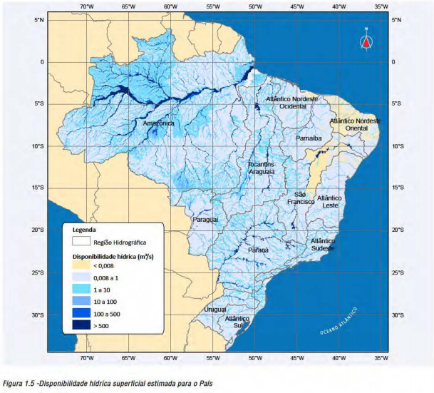
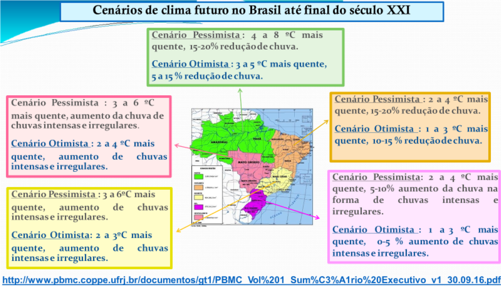
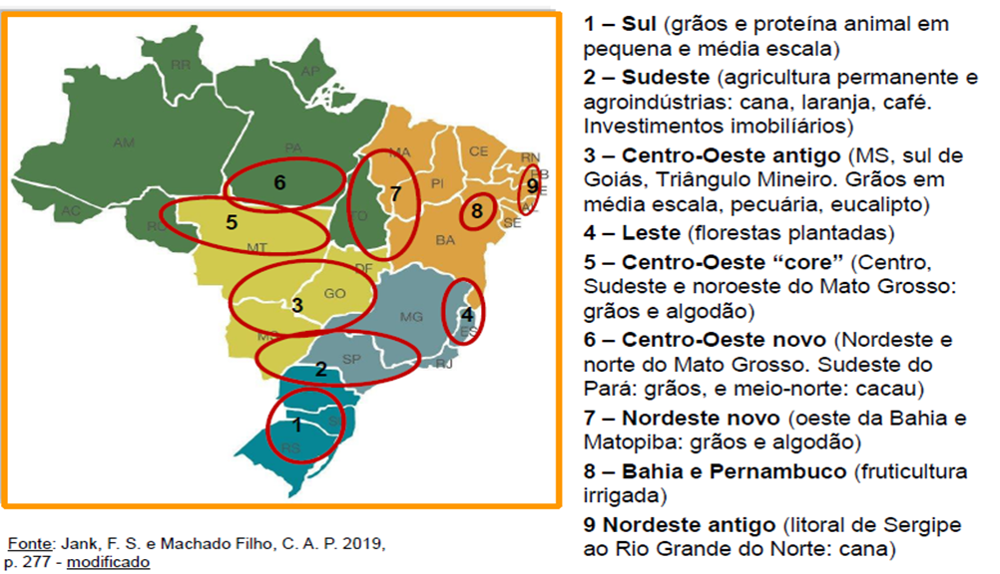

class: center

```{r setup, include=FALSE}
# Dependências dos slides/aula
library(knitr)          # CRAN v1.33
library(rmarkdown)      # CRAN v2.10
library(xaringan)       # CRAN v0.22
library(xaringanthemer) # CRAN v0.3.0
library(xaringanExtra)  # [github::gadenbuie/xaringanExtra] v0.5.5
library(RefManageR)     # CRAN v1.3.0
library(ggplot2)        # CRAN v3.3.5
library(fontawesome)    # [github::rstudio/fontawesome] v0.1.0
library(pagedown)

# Opções de chunks
options(htmltools.dir.version = FALSE)
knitr::opts_chunk$set(
  echo       = FALSE,
  warning    = FALSE,
  message    = FALSE,
  fig.retina = 3,
  fig.width  = 11,
  fig.asp    = 0.618,
  out.width  = "100%",
  fig.align  = "center",
  comment    = "#"
  )

# Cores para gráficos
colors <- c(
  blue       = "#282f6b",
  red        = "#b22200",
  yellow     = "#eace3f",
  green      = "#224f20",
  purple     = "#5f487c",
  orange     = "#b35c1e",
  turquoise  = "#419391",
  green_two  = "#839c56",
  light_blue = "#3b89bc",
  gray       = "#666666"
  )
```

```{r xaringan, echo=FALSE}
# Tema da apresentação
xaringanthemer::style_mono_light(
  base_color                      = unname(colors["blue"]),
  title_slide_background_image    = params$logo_slides, 
  title_slide_background_size     = 10,
  title_slide_background_position = "bottom 10px right 20px",
  title_slide_background_color    = "white",
  title_slide_text_color          = unname(colors["blue"]),
  footnote_position_bottom        = "15px"
  )

# Opções extras do tema
xaringanExtra::use_progress_bar(
  color    = colors["blue"], 
  location = "bottom"
  )
xaringanExtra::use_extra_styles(
  hover_code_line         = TRUE,
  mute_unhighlighted_code = FALSE
  )
xaringanExtra::use_panelset()
```

```{css, echo=FALSE}
pre {
  white-space: pre-wrap;
  overflow-y: scroll !important;
  max-height: 45vh !important;
  overflow-x: auto;
  max-width: 100%;
}
```

```{r load_refs, echo=FALSE, eval=params$references}
# Configuração de citações
RefManageR::BibOptions(
  check.entries = FALSE,
  bib.style     = "authoryear",
  cite.style    = "authoryear",
  style         = "markdown",
  hyperlink     = FALSE,
  dashed        = FALSE
  )
if(params$references){
  temp_refbib <- tempdir()
  download.file(
    url      = params$references_path, 
    destfile = paste0(temp_refbib, "/references.bib"), 
    mode     = "wb"
    )
  myBib <- RefManageR::ReadBib(paste0(temp_refbib, "/references.bib"), check = FALSE)
  }

# Como citar?
# RefManageR::TextCite(myBib, "id_da_citacao")
```

```{r utils, echo=FALSE}
# Função que pega um arquivo .Rmd, condicionalmente o renderiza, 
# e embute o conteúdo do mesmo formatado como Markdown puro 
# no output do documento atual
print_rmd <- function(file, encoding = "UTF-8", render = TRUE){
  if(render){rmarkdown::render(input = file, quiet = TRUE)}
  rmd <- readLines(con = file, encoding = encoding)
  cat("```md\n")
  cat(rmd, sep = "\n")
  cat("```\n")
}
```

### O SEMIÁRIDO BRASILEIRO

.pull-left[
```{r, echo=FALSE, out.width="73%"}
knitr::include_graphics("imgs/semiarido1.jpg")
```
]

.pull-right[
```{r, echo=FALSE, out.width="110%"}

```
]

---
class: center

### AS MUDANÇAS CLIMÁTICAS

```{r, echo=FALSE, out.width="85%"}

```

---
class: center

### A PRODUÇÃO DE RIQUEZA NO SEMIÁRIDO

```{r, echo=FALSE, out.width="85%"}

```

---
class: center

### A PRODUÇÃO DE RIQUEZA NO SEMIÁRIDO

.pull-left[
```{r, echo=FALSE, out.width="75%"}

```
]

.pull-right[
```{r, echo=FALSE, out.width="75%"}

```
]

---
class: center

### A PRODUÇÃO DE RIQUEZA NO SEMIÁRIDO

```{r, echo=FALSE, out.width="65%"}

```

---
class: center

### A PRODUÇÃO DE RIQUEZA NO SEMIÁRIDO

```{r, echo=FALSE, out.width="120%"}
knitr::include_graphics("imgs/seacon5.png")
```

### ÁGUA IRRIGAÇÃO + MUITAS HORAS DE SOL + TECNOLOGIA = FRUTICULTURA DO VALE 

---
class: center

### A PRODUÇÃO DE RIQUEZA NO SEMIÁRIDO

```{r, echo=FALSE, out.width="120%"}
knitr::include_graphics("imgs/seacon6.png")
```

---
class: center

### TAXA DE CRESCIMENTO POPULACIONAL: 2001 E 2021

```{r, echo=FALSE, out.width="100%"}

```

---
class: center

### GERAÇÃO DE EMPREGOS NA FRUTICULTURA

```{r, echo=FALSE, out.width="80%"}
knitr::include_graphics("imgs/seacon8.png")
```

---
class: center

### GERAÇÃO DE EMPREGOS NA FRUTICULTURA

```{r, echo=FALSE, out.width="80%"}
#Direcionado o R para o Diretorio a ser trabalhado
setwd('/Users/jricardofl/Dropbox/Embrapa/2024/Eventos/SEACON/seacon')

#Inicio do Script
#Pacotes a serem utilizados 
library(ggplot2)
library(scales)
library(plotly)
library(dplyr)

#Entrando dados no R
dados1 <- read.csv2('fevereiro_2024.csv', header=T, sep=";", dec = ".")
dados1$date <- seq(as.Date('2021-01-01'),to=as.Date('2024-02-01'),by='1 month')

dados1a <- dados1 |> 
  dplyr::select(
    "date"     = `date`,
    "variable" = `Variavel`,
    "value"    = `Proporcao`
  ) |> 
  dplyr::as_tibble()

g1 <- ggplot(data=dados1a) +
  geom_col(aes(x=date, y=value, fill="variable"))+
  scale_fill_manual(values="blue") +#muda a cor da barra
  labs(y= "Proporção Agro/Total (%)", x= "Meses dos Anos",
       caption = "Fonte: CAGED reprocessado pelos Observatórios de Manga e Uva da Embrapa, 2024.")+
  scale_y_continuous(n.breaks = 10)+
  scale_x_date(date_breaks = "1 month",
              labels = date_format("%m/%Y"),
              expand = expansion(add=c(0,0)))+
  geom_text(data=dados1a, aes(y=value, x=date, label=value), 
            hjust=0.5, vjust=-1.2)+
  theme_minimal() + #Definindo tema
   theme(axis.text.x = element_text(angle=45, margin = margin(b=10), 
                                    size=12,
                                    hjust=1), 
        axis.text.y = element_text(margin = margin(b=10), size=14), 
        axis.title.x = element_text(size=14, face = "bold", margin = margin(b=10)),
        axis.title.y = element_text(size=14, face = "bold", margin = margin(l=20)),
        panel.grid.major = element_blank(),
        panel.grid.minor = element_blank(), # retirando as linhas
        plot.caption = element_text(hjust = 0, size=14), #ajuste Fonte
        legend.title = element_blank(),
        legend.text=element_text(size=14),
        legend.position = "none") # Definindo posição da legenda

g1

```

---
class: center

### REPRESENTATIVIDADE DO VALE NA OFERTA NACIONAL EM 2022.

```{r, echo=FALSE, out.width="80%"}
#Direcionado o R para o Diretorio a ser trabalhado
setwd('/Users/jricardofl/Dropbox/Embrapa/2024/Eventos/SEACON/seacon')

#Inicio do Script
#Pacotes a serem utilizados 
library(reshape2)

#Entrando dados no R
dados2 <- read.csv2('volume.csv', header=T, sep=";", dec = ".")

dados2a <- melt(dados2, id.var='Fruta')

mycolors <- c("lightblue3", "darkgreen")

g2 <- ggplot() +
  geom_col(data=dados2a, aes(x=Fruta, y=value, fill=variable), size=2, width = 0.7, position = position_dodge(width = .5, preserve = "total"))+
  scale_fill_manual(values=mycolors) +
  scale_y_continuous(n.breaks = 10)+
  labs(y= "Vale sobre o Total Nacional (%)", x= "Frutas",
       caption = "Fonte: IBGE reprocessado pelos Observatórios de Manga e Uva da Embrapa,, 2024.")+
  geom_text(data=dados2a, aes(y=value, x=Fruta, group=variable, label=value), 
    position = position_dodge(width = .5, preserve = "total"), 
    size=4, 
    hjust=0.5, 
    vjust=-1.0)+
  theme_minimal() + #Definindo tema
  theme(axis.text.x = element_text(margin = margin(b=10), size=14), 
        axis.text.y = element_text(margin = margin(b=10), size=14), 
        axis.title.x = element_text(size=14, face = "bold", margin = margin(b=10)),
        axis.title.y = element_text(size=14, face = "bold", margin = margin(l=20)),
        panel.grid.major = element_blank(),
        panel.grid.minor = element_blank(), # retirando as linhas
        plot.caption = element_text(hjust = 0, size=14), #ajuste Fonte
        legend.title = element_blank(),
        legend.text=element_text(size=14),
        legend.position = "bottom") # Definindo posição da legenda
# Nome do eixo mais para baixo
g2
```

---
class: center

### VALOR BRUTO DA PRODUÇÃO DA FRUTICULTURA DO VALE.

```{r, echo=FALSE, out.width="92%"}

```

---
class: center

### A COMPLEXA CADEIA PRODUTIVA DA FRUTICULTURA.

```{r, echo=FALSE, out.width="90%"}
knitr::include_graphics("imgs/seacon15.png")
```
Fonte: LIMA et al, 2023.

---
class: center

### A IMPORTANTE FUNÇÃO DO MERCADO EXTERNO.

- 99% DE TODA A UVA EXPORTADA PELO BRASIL, EM 2023, FOI PRODUZIDA NO VALE DO SÃO FRANCISCO. 

.pull-left[
```{r, echo=FALSE, out.width="110%"}
#Entrando dados no R
dados3 <- read.csv2('uva_exportacoes_2016_2023.csv', header=T, sep=";", dec = ".")
dados3 <- dados3/1000
dados3[,1] <- seq(2016, 2023, by = 1)
colnames(dados3) = c('Ano', 'Valor', "Toneladas")
dados3 <- dplyr::tibble(dados3)

mycolor1 <- "purple"

g3 <- ggplot(data=dados3) +  #estetica vai valer para todos os geom's
  geom_col(aes(x=Ano, y=Toneladas, fill="Toneladas"), lwd=1)+
    scale_fill_manual(values=mycolor1)+
  labs(y= "Toneladas", x= "Anos", title='',
       caption = "Fonte: COMEXSTAT reprocessado pelo Observatório de Mercado de uva da Embrapa") +
  scale_y_continuous(limits=c(0, 80000), n.breaks = 10, expand = expansion(add=c(0,0.5)))+
  scale_x_continuous(breaks = seq(2016, 2023, by = 1))+
  theme_classic()+ #Definindo tema
  theme(axis.text.x=element_text(angle=0, hjust=0.5, size=14, margin = margin(b=5)),
        axis.text.y=element_text(hjust=1, size=14, margin = margin(l=20)),
        axis.title.x = element_text(size=14, face = "bold", margin = margin(b=5)),
        axis.title.y = element_text(size=14, face = "bold", margin = margin(l=20)),
        plot.caption = element_text(hjust = 0, size=16),
        legend.position = "bottom", legend.title = element_blank(),
        legend.text=element_text(size=20)) # Definindo posição da legenda
g3
```
]

.pull-right[
```{r, echo=FALSE, out.width="110%"}
g4 <- ggplot(data=dados3) +  #estetica vai valer para todos os geom's
  geom_col(aes(x=Ano, y=Valor, fill="Valor em $ mil dólares"), lwd=1)+
    scale_fill_manual(values=mycolor1)+
  labs(y= "US$ Mil", x= "Anos", title='',
       caption = "Fonte: COMEXSTAT reprocessado pelo Observatório de Mercado de uva da Embrapa") +
  scale_y_continuous(limits=c(0, 185000), n.breaks = 10, expand = expansion(add=c(0,0.5)))+
  scale_x_continuous(breaks = seq(2016, 2023, by = 1))+
  theme_classic()+ #Definindo tema
  theme(axis.text.x=element_text(angle=0, hjust=0.5, size=14, margin = margin(b=5)),
        axis.text.y=element_text(hjust=1, size=14, margin = margin(l=20)),
        axis.title.x = element_text(size=14, face = "bold", margin = margin(b=5)),
        axis.title.y = element_text(size=14, face = "bold", margin = margin(l=20)),
        plot.caption = element_text(hjust = 0, size=16),
        legend.position = "bottom", legend.title = element_blank(),
        legend.text=element_text(size=20)) # Definindo posição da legenda
g4
```
]

---
class: center

### A IMPORTANTE FUNÇÃO DO MERCADO EXTERNO.

- 93% DE TODA A MANGA EXPORTADA PELO BRASIL, EM 2023, FOI PRODUZIDA NO VALE DO SÃO FRANCISCO. 

.pull-left[
```{r, echo=FALSE, out.width="110%"}
#Entrando dados no R
dados4 <- read.csv2('manga_exportacoes_2016_2023.csv', header=T, sep=";", dec = ".")
dados4[,1] <- seq(2016, 2023, by = 1)
colnames(dados4) = c('Ano', 'Valor', "Toneladas")
dados1 <- dplyr::tibble(dados1)

mycolor1 <- "gold"

g5 <- ggplot(data=dados4) +  #estetica vai valer para todos os geom's
  geom_col(aes(x=Ano, y=Toneladas, fill="Toneladas"), lwd=1)+
    scale_fill_manual(values=mycolor1)+
  labs(y= "Toneladas", x= "Anos", title='',
       caption = "Fonte: COMEXSTAT reprocessado pelo Observatório de Mercado de uva da Embrapa") +
  scale_y_continuous(limits=c(0, 275000), n.breaks = 10, expand = expansion(add=c(0,0.5)))+
  scale_x_continuous(breaks = seq(2016, 2023, by = 1))+
  theme_classic()+ #Definindo tema
  theme(axis.text.x=element_text(angle=0, hjust=0.5, size=14, margin = margin(b=5)),
        axis.text.y=element_text(hjust=1, size=14, margin = margin(l=20)),
        axis.title.x = element_text(size=14, face = "bold", margin = margin(b=5)),
        axis.title.y = element_text(size=14, face = "bold", margin = margin(l=20)),
        plot.caption = element_text(hjust = 0, size=16),
        legend.position = "bottom", legend.title = element_blank(),
        legend.text=element_text(size=20)) # Definindo posição da legenda
g5
```
]

.pull-right[
```{r, echo=FALSE, out.width="110%"}
g6 <- ggplot(data=dados4) +  #estetica vai valer para todos os geom's
  geom_col(aes(x=Ano, y=Valor, fill="Valor em $ mil dólares"), lwd=1)+
    scale_fill_manual(values=mycolor1)+
  labs(y= "US$ Mil", x= "Anos", title='',
       caption = "Fonte: COMEXSTAT reprocessado pelo Observatório de Mercado de uva da Embrapa") +
  scale_y_continuous(limits=c(0, 315000), n.breaks = 10, expand = expansion(add=c(0,0.5)))+
  scale_x_continuous(breaks = seq(2016, 2023, by = 1))+
  theme_classic()+ #Definindo tema
  theme(axis.text.x=element_text(angle=0, hjust=0.5, size=14, margin = margin(b=5)),
        axis.text.y=element_text(hjust=1, size=14, margin = margin(l=20)),
        axis.title.x = element_text(size=14, face = "bold", margin = margin(b=5)),
        axis.title.y = element_text(size=14, face = "bold", margin = margin(l=20)),
        plot.caption = element_text(hjust = 0, size=16),
        legend.position = "bottom", legend.title = element_blank(),
        legend.text=element_text(size=20)) # Definindo posição da legenda
g6
```
]

---
class: center, middle

### A SUSTENTABILIDADE NO VALE DO SÃO FRANCISCO.

.pull-left[
```{r, echo=FALSE, out.width="85%"}

```
]

.pull-right[

- ### NÃO É MAIS APENAS SABOR, QUALIDADE E PREÇO QUE OS CONSUMIDORES BUSCAM!

- ### BUSCAM SE ALIMENTAR PARA TER MELHOR QUALIDADE DE VIDA COM MENOS IMPACTO NO MEIO AMBIENTE!

Fonte: Hortifruti Brasil (03/19).
]

---
class: center, middle

### CERTIFICAÇÕES PARA PODER EXPORTAR

```{r, echo=FALSE, out.width="85%"}

```

---
class: center

### REINVENÇÃO É CONSTANTE

```{r, echo=FALSE, out.width="85%"}

```

---
class: center

### REINVENÇÃO É CONSTANTE

```{r, echo=FALSE, out.width="68%"}

```

---
class: center

### DIVERSIFICAÇÃO DE CULTURAS

```{r, echo=FALSE, out.width="100%"}

```

---
class: center, middle

### ENTÃO NÃO EXISTE NENHUM PROBLEMA? É PLANTAR E GANHAR DINHEIRO?

```{r, echo=FALSE, out.width="55%"}
knitr::include_graphics("https://media.giphy.com/media/1xVbSX8UzIiMPMZjZP/giphy.gif")
```


---
class: center, middle

## EXISTEM DIVERSOS PROBLEMAS!

.pull-left[

- ### BAIXO NÍVEL DE PROFISSIONALISMO

- ### BAIXO NÍVEL DE ESCOLARIDADE

- ### DIFICULDADES COM SUCESSÃO

- ### BAIXO NÍVEL DE CONSUMO NO MERCADO INTERNO
]

.pull-right[

- ### QUESTÕES CLIMÁTICAS

- ### ESTRUTURA DE MERCADO NA COMPRA

- ### ESTRUTURA DE MERCADO NA VENDA

- ### PREÇO DE VENDA INDEPENDE DO CUSTO, QUE É O MAIS ALTO DO MUNDO.

]

---
class: center

## A REFORMA TRIBUTÁRIA VAI IMPACTAR A FRUTICULTURA DO VALE?

```{r, echo=FALSE, out.width="40%"}
knitr::include_graphics("https://media.giphy.com/media/v1.Y2lkPTc5MGI3NjExMDd6OWkzdjNocnI5bHJ1OWZ2ZDh3YWF6bzY3enhzYXVjcXE0d3A5eCZlcD12MV9pbnRlcm5hbF9naWZfYnlfaWQmY3Q9Zw/VbnUQpnihPSIgIXuZv/giphy.gif")
```

---
class: center, middle

## A REFORMA TRIBUTÁRIA VAI IMPACTAR A FRUTICULTURA DO VALE?

.pull-left[

- ### O QUE VIABILIZA: PRODUZIR O ANO INTEIRO, ENORME MERCADO INTERNO E CÂMBIO;

- ### O QUE INVIABILIZA: QUESTÕES CLIMÁTICAS DESFAVORÁVEIS E CUSTO ALTO.
]

.pull-right[

- ### O CUSTO DE PRODUÇÃO É ELEVADO. 

- ### SE O TOTAL DE IMPOSTOS PAGOS PELO SETOR AUMENTAR, IMPACTA NEGATIVAMENTE!

]

---
class: center, middle

## A REFORMA TRIBUTÁRIA VAI IMPACTAR A FRUTICULTURA DO VALE?

.pull-left[

- ### TEM CHANCE DE OCORRER, DADO QUE EXISTEM MUITAS ISENÇÕES OU CARGA TRIBUTÁRIA REDUZIDA. 

- ### A FRUTICULTURA PAGA MUITO MENOS NA COMPARAÇÃO COM OUTROS SETORES DA ECONOMIA.
]

.pull-right[

- ### SE FOR COOPERATIVA, MUITO FAVORECIMENTOS. 

- ### SE FOR EXPORTADOR - DRAWBACK 

- ### FIM DOS INCENTIVOS FISCAIS E DEFINIÇÃO DAS ALIQUOTAS
]

---
class: center, middle

```{r, echo=FALSE, out.width="100%"}

```