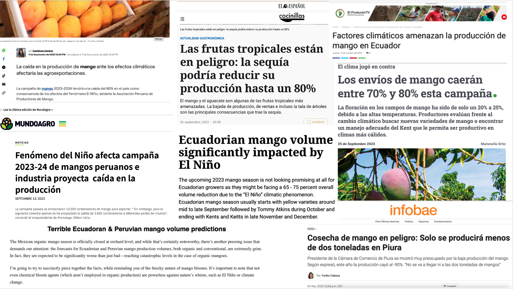
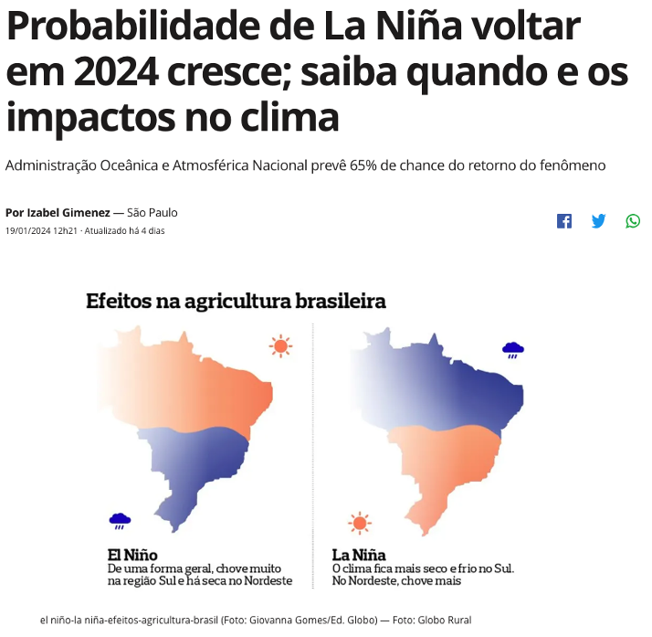
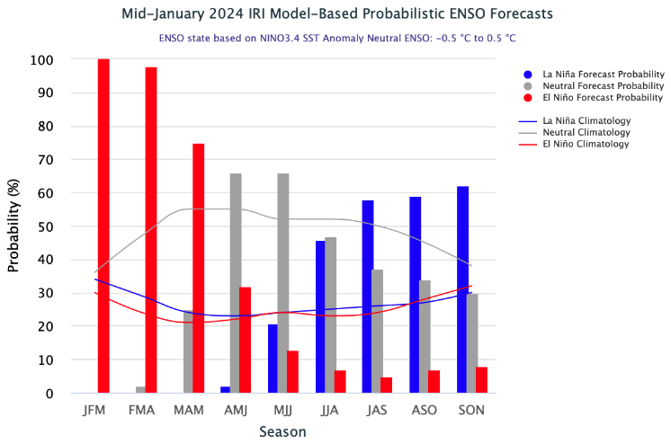
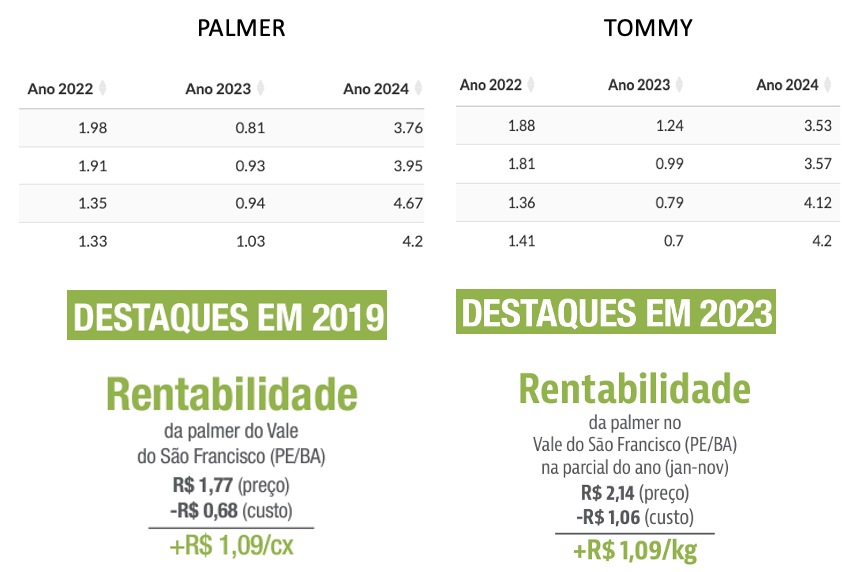
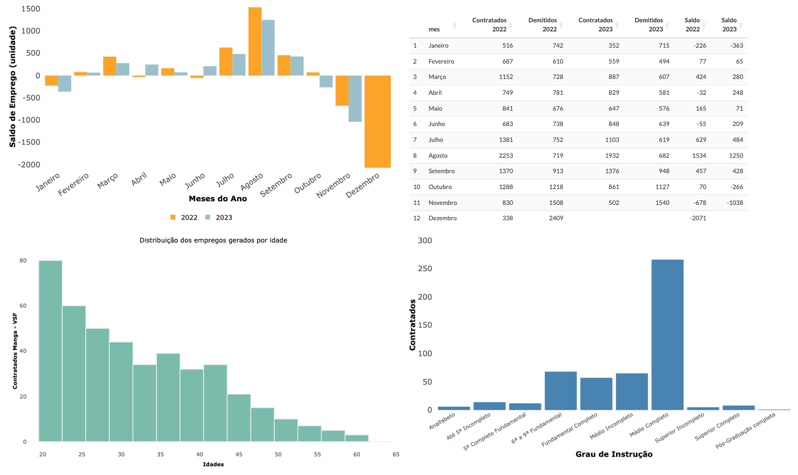

class: center

```{r setup, include=FALSE}
# Dependências dos slides/aula
library(knitr)          # CRAN v1.33
library(rmarkdown)      # CRAN v2.10
library(xaringan)       # CRAN v0.22
library(xaringanthemer) # CRAN v0.3.0
library(xaringanExtra)  # [github::gadenbuie/xaringanExtra] v0.5.5
library(RefManageR)     # CRAN v1.3.0
library(ggplot2)        # CRAN v3.3.5
library(fontawesome)    # [github::rstudio/fontawesome] v0.1.0
library(pagedown)

# Opções de chunks
options(htmltools.dir.version = FALSE)
knitr::opts_chunk$set(
  echo       = FALSE,
  warning    = FALSE,
  message    = FALSE,
  fig.retina = 3,
  fig.width  = 11,
  fig.asp    = 0.618,
  out.width  = "100%",
  fig.align  = "center",
  comment    = "#"
  )

# Cores para gráficos
colors <- c(
  blue       = "#282f6b",
  red        = "#b22200",
  yellow     = "#eace3f",
  green      = "#224f20",
  purple     = "#5f487c",
  orange     = "#b35c1e",
  turquoise  = "#419391",
  green_two  = "#839c56",
  light_blue = "#3b89bc",
  gray       = "#666666"
  )
```

```{r xaringan, echo=FALSE}
# Tema da apresentação
xaringanthemer::style_mono_light(
  base_color                      = unname(colors["blue"]),
  title_slide_background_image    = params$logo_slides, 
  title_slide_background_size     = 12,
  title_slide_background_position = "bottom 10px right 20px",
  title_slide_background_color    = "white",
  title_slide_text_color          = unname(colors["blue"]),
  footnote_position_bottom        = "15px"
  )

# Opções extras do tema
xaringanExtra::use_progress_bar(
  color    = colors["blue"], 
  location = "bottom"
  )
xaringanExtra::use_extra_styles(
  hover_code_line         = TRUE,
  mute_unhighlighted_code = FALSE
  )
xaringanExtra::use_panelset()
```

```{css, echo=FALSE}
pre {
  white-space: pre-wrap;
  overflow-y: scroll !important;
  max-height: 45vh !important;
  overflow-x: auto;
  max-width: 100%;
}
```

```{r load_refs, echo=FALSE, eval=params$references}
# Configuração de citações
RefManageR::BibOptions(
  check.entries = FALSE,
  bib.style     = "authoryear",
  cite.style    = "authoryear",
  style         = "markdown",
  hyperlink     = FALSE,
  dashed        = FALSE
  )
if(params$references){
  temp_refbib <- tempdir()
  download.file(
    url      = params$references_path, 
    destfile = paste0(temp_refbib, "/references.bib"), 
    mode     = "wb"
    )
  myBib <- RefManageR::ReadBib(paste0(temp_refbib, "/references.bib"), check = FALSE)
  }

# Como citar?
# RefManageR::TextCite(myBib, "id_da_citacao")
```

```{r utils, echo=FALSE}
# Função que pega um arquivo .Rmd, condicionalmente o renderiza, 
# e embute o conteúdo do mesmo formatado como Markdown puro 
# no output do documento atual
print_rmd <- function(file, encoding = "UTF-8", render = TRUE){
  if(render){rmarkdown::render(input = file, quiet = TRUE)}
  rmd <- readLines(con = file, encoding = encoding)
  cat("```md\n")
  cat(rmd, sep = "\n")
  cat("```\n")
}
```

### OS PREÇOS DE PALMER...

```{r tratamento_base, results='', fig.cap=''}
#Direcionado o R para o Diretorio a ser trabalhado
#setwd('c:/Users/Joao Ricardo Lima/Dropbox/tempecon/dados_manga')
setwd('/Users/jricardofl/Dropbox/tempecon/dados_manga')

#Inicio do Script
#Pacotes a serem utilizados 
library(mFilter)
library(forecast)
library(dplyr)
library(tsutils)
library(xts)
library(ggthemes)
library(FinTS)
library(scales)
library(ggplot2)
#library(easyGgplot2)
library(reshape)
library(reshape2)
library(seasonal)
library(uroot)
library(tseries)
library(plotly)
library(DT)
library(magrittr)
library(lubridate)
library(readxl)
library(tidyverse)
last <- as.Date("2024-01-12")
today <- as.Date("2024-01-19")
sem_ano <- 3 #ajustar semanalmente

options(digits=4)

#Entrando dados no R
dados <- read.csv2('dados_manga_palmer_semana.csv', header=T, sep=";", dec=".")
#dados <- dados[,-c(9:10)] #retirar as ultimas colunas
colnames(dados)[1]<-'produto'

#Entrando dados no R - Deflator
igpdi <- read.csv2('igpdi.csv', 
                   header=T, sep=";",
                   dec=".")

dados_comb<-cbind(dados, igpdi)

teste<-dados_comb[,4]-dados_comb[,7]

dadosp<-dados_comb[,-c(1,2,6,7)]

#Deflacionar a serie de manga
dadosp$preco_def <- dadosp[,3]*(tail(dadosp[,4],1)/dadosp[,4])
#dadosp<-dadosp[,-2]

#Criando uma variável com as datas semanais
dadosp$date <- seq(as.Date('2012-01-14'),to=today,by='1 week') 
dadosp$date[dadosp$date == "2016-01-02"] <- "2015-12-31" #ajustando algumas datas
dadosp$date[dadosp$date == "2015-01-03"] <- "2014-12-31"
dadosp$date[dadosp$date == "2014-01-04"] <- "2013-12-31"
dadosp$date[dadosp$date == "2013-01-05"] <- "2012-12-31"
dadosp$date[dadosp$date == "2022-01-01"] <- "2022-01-03"
dadosp$date[dadosp$date == "2022-12-31"] <- "2023-01-01"

#Analise de Serie Temporal
preco_palmer <- dadosp[,5]
preco_palmer <- ts(preco_palmer, start=c(2012,1), freq=52)
#preco_palmer <- window(preco_palmer, end=c(2021,52))

trend_palmer <- cmav(preco_palmer, outplot=F)

#Analise das comparações entre as médias

preco_palmer_2021_3 <- window(preco_palmer, start=c(2021,1), end=c(2023,52))
seas21_3<-seasplot(preco_palmer_2021_3, trend=F, outplot = F)
medias21_3 <- colMeans(seas21_3$season)

preco_palmer_2022 <- window(preco_palmer, end=c(2022,52))

preco_palmer_2023 <- window(preco_palmer, end=c(2023,52))
#seas21<-seasplot(preco_palmer_2021, trend=F, outplot = F)
#medias21 <- colMeans(seas21$season)

preco_palmer_24 <- as.matrix(tail(dadosp$preco_def,sem_ano)) 
preco_palmer_2024 <- matrix(NA, nrow=52, ncol=1)

for(i in 1:sem_ano){
  preco_palmer_2024[i,1] = preco_palmer_24[i,1]
}
  

#Como só se tem até a semana 52
medias21_3 <- medias21_3[1:52]
#medias21 <- medias21[1:52]

#matrix = matrix(NA, nrow=52, ncol=2)

#for(i in 1:52){
#  matrix[i,1] = min(seas21_3$season[,i])
#  matrix[i,2] = max(seas21_3$season[,i])
#}

time <- seq(1:52)
table <- data.frame(time, round(medias21_3,2), round(tail(preco_palmer_2022,52),2),
                    round(tail(preco_palmer_2023,52),2), preco_palmer_2024[,1])
colnames(table) = c('Semanas', 'Média 21_23', 'Ano 2022', 'Ano 2023', 
                    'Ano 2024')
tablea <- table[,-c(3:5)]
tableb <- table[,-c(2)]

tablea2 <- melt(tablea, id.var='Semanas')
tableb2 <- melt(tableb, id.var='Semanas')
mycolors <- c("lightblue3", "gray44", "gold")

g1 <- ggplot()+
  geom_col(data=tableb2, aes(x=Semanas, y=value, fill=variable), size=2, width = 0.7,
           position = "dodge")+
  scale_fill_manual(values=mycolors)+
    geom_line(data=tablea2, aes(x=Semanas, y=value, colour=variable), linetype = "solid",
            size = 1)+
  scale_colour_manual(values = c("chocolate")) +
  scale_y_continuous(limits = c(0, 5.5), n.breaks = 10, labels = number_format(accuracy = 0.01,
                                                       decimal.mark = ","))+
  scale_x_continuous(breaks = seq(1, 52, by = 3))+
  labs(y= "Preço R$", x= "Semanas de cada Ano", title='',
       caption = "Fonte: CEPEA reprocessado pelo Observatório de Mercado de Manga da Embrapa")+
  theme_minimal()+
  theme(axis.text.x=element_text(angle=0, hjust=0.5, size=10, margin = margin(b=20)),
        axis.text.y=element_text(hjust=0.5, size=10, margin = margin(l=20)),
        axis.title.y = element_text(size=10, face = "bold"),
        axis.title.x = element_text(size=10, face = "bold"),
        panel.grid.major = element_blank(),
        panel.grid.minor = element_blank(),
        plot.caption = element_text(hjust = 0, size=14),
        legend.position = "bottom", legend.title = element_blank(),
        legend.text=element_text(size=8)) # Definindo posição da legenda

#g1
ggplotly(g1) %>%
  layout(legend = list(
                      orientation = "h", 
                      x=0.2, 
                      y=-0.2,
                     title=''))
```


---
class: center

### OS PREÇOS DE TOMMY...

```{r setupt}
#Direcionado o R para o Diretorio a ser trabalhado
#setwd('c:/Users/Joao Ricardo Lima/Dropbox/tempecon/dados_manga')
setwd('/Users/jricardofl/Dropbox/tempecon/dados_manga')

#Entrando dados no R
dados <- read.csv2('dados_manga_tommy_semana.csv', header=T, sep=";", dec=".")
#dados <- dados[,-c(9:10)] #retirar as ultimas colunas
colnames(dados)[1]<-'produto'

#Entrando dados no R - Deflator
igpdi <- read.csv2('igpdi.csv', 
                   header=T, sep=";",
                   dec=".")

dados_comb<-cbind(dados, igpdi)

teste<-dados_comb[,4]-dados_comb[,7]

dadosp<-dados_comb[,-c(1,2,6,7)]

#Deflacionar a serie de manga
dadosp$preco_def <- dadosp[,3]*(tail(dadosp[,4],1)/dadosp[,4])
#dadosp<-dadosp[,-2]

#Criando uma variável com as datas semanais
dadosp$date <- seq(as.Date('2012-01-14'),to=today,by='1 week') 
dadosp$date[dadosp$date == "2016-01-02"] <- "2015-12-31" #ajustando algumas datas
dadosp$date[dadosp$date == "2015-01-03"] <- "2014-12-31"
dadosp$date[dadosp$date == "2014-01-04"] <- "2013-12-31"
dadosp$date[dadosp$date == "2013-01-05"] <- "2012-12-31"
dadosp$date[dadosp$date == "2022-12-31"] <- "2023-01-01"

#Analise de Serie Temporal
preco_tommy <- dadosp[,5]
preco_tommy <- ts(preco_tommy, start=c(2012,1), freq=52)
#preco_tommy <- window(preco_tommy, end=c(2021,52))

trend_tommy <- cmav(preco_tommy, outplot=F)

#Analise das comparações entre as médias

preco_tommy_2021_3 <- window(preco_tommy, start=c(2021,1), end=c(2023,52))
seas21_3<-seasplot(preco_tommy_2021_3, trend=F, outplot = F)
medias21_3 <- colMeans(seas21_3$season)

#Como só se tem até a semana 52
medias21_3 <- medias21_3[1:52]

preco_tommy_2022 <- window(preco_tommy, end=c(2022,52))
preco_tommy_2023 <- window(preco_tommy, end=c(2023,52))
preco_tommy_24 <- as.matrix(tail(dadosp$preco_def,sem_ano)) 
preco_tommy_2024 <- matrix(NA, nrow=52, ncol=1)

for(i in 1:sem_ano){
  preco_tommy_2024[i,1] = preco_tommy_24[i,1]
}

table <- data.frame(time, round(medias21_3,2), round(tail(preco_tommy_2022,52),2),
                    round(tail(preco_tommy_2023,52),2), preco_tommy_2024[,1])
colnames(table) = c('Semanas', 'Média 21_23', 'Ano 2022', 'Ano 2023', 
                    'Ano 2024')
tablea <- table[,-c(3:5)]
tableb <- table[,-c(2)]

tablea2 <- melt(tablea, id.var='Semanas')
tableb2 <- melt(tableb, id.var='Semanas')
mycolors <- c("lightblue3", "gray44", "gold")

g2 <- ggplot()+
  geom_col(data=tableb2, aes(x=Semanas, y=value, fill=variable), size=2, width = 0.7,
           position = "dodge")+
  scale_fill_manual(values=mycolors)+
    geom_line(data=tablea2, aes(x=Semanas, y=value, colour=variable), linetype = "solid",
            size = 1)+
  scale_colour_manual(values = c("chocolate")) +
  scale_y_continuous(limits = c(0, 5.5), n.breaks = 10, labels = number_format(accuracy = 0.01,
                                                       decimal.mark = ","))+
  scale_x_continuous(breaks = seq(1, 52, by = 3))+
  labs(y= "Preço R$", x= "Semanas de cada Ano", title='',
       caption = "Fonte: CEPEA reprocessado pelo Observatório de Mercado de Manga da Embrapa")+
  theme_minimal()+
  theme(axis.text.x=element_text(angle=0, hjust=0.5, size=10, margin = margin(b=20)),
        axis.text.y=element_text(hjust=0.5, size=10, margin = margin(l=20)),
        axis.title.y = element_text(size=10, face = "bold"),
        axis.title.x = element_text(size=10, face = "bold"),
        panel.grid.major = element_blank(),
        panel.grid.minor = element_blank(),
        plot.caption = element_text(hjust = 0, size=14),
        legend.position = "bottom", legend.title = element_blank(),
        legend.text=element_text(size=8)) # Definindo posição da legenda

#g2
ggplotly(g2) %>%
  layout(legend = list(
                      orientation = "h", 
                      x=0.2, 
                      y=-0.2,
                      title=''))
```

---
class: center
### RETROSPECTIVA...

.pull-left[

- Em 2022 se tem entre janeiro a abril preços baixos (menores do que a média), diversos problemas devido um excesso de chuvas, redução da qualidade, aumento de doenças, menores exportaçoes.

- Entre maio e agosto os preços estiveram maio e agosto os preços subiram, chegando a ficar acima da média por algumas semanas. 

- Depois de setembro se tem um aumento da oferta e queda dos valores recebidos pelos produtores. Mais para o final do ano se chegou a ter preços em semanas que sequer cobriam os custos de produção. 

]

.pull-right[
  
- Em 2023 começa com uma menor quantidade de mangas no primeiro semestre, resultado do clima no final de 2022 e receio de produtores sobre os preços, gerando uma expectativa de excesso para o segundo semestre. 

- No segundo semestre houve uma menor produção no Vale, quebra de safra nos países concorrentes e uma forte demanda internacional, elevando os preços ao produtor, tanto da fruta de mercado externo quanto de mercado interno. 

- Fica claro como funciona o mecanismo de mercado: lei da Oferta e a Demanda. Se a oferta for maior do que a demanda, os preços caem. Se for menor, os preços aumentam. 
]

---
class: center, middle
### FORTE IMPACTO NA PRODUÇÃO DE PAÍSES CONCORRENTES

```{r, echo=FALSE, out.width="85%"}

```

---
class: center
### ANÁLISE DA PRODUÇÃO DE MANGA - IBGE

```{r upe1, out.width="80%"}
#Direcionado o R para o Diretorio a ser trabalhado
#setwd('c:/Users/Joao Ricardo Lima/Dropbox/tempecon/dados_manga')
setwd('/Users/jricardofl/Dropbox/Embrapa/2023/UPE Agro 4.0/2023/aula1/dados')

#Inicio do Script
#Pacotes a serem utilizados

#Entrando dados no R
dados1 <- read_excel("tabela1.xlsx", col_names = TRUE)

mycolor1 <- "gold"

g3 <- 
  ggplot(data = dados1) +  #estetica vai valer para todos os geom's
  geom_col(aes(x=Ano, y=Manga/1000, fill="Volume (Mil Toneladas)"), lwd=1)+
  scale_fill_manual(values=mycolor1)+
  labs(y= "Mil Toneladas", x= "Anos", title='Evolução do Volume com Manga no Nordeste: 2001-2022',
       caption = "Fonte: IBGE (2023)") +
  scale_y_continuous(limits=c(0, 1300), n.breaks = 8, expand = expansion(add=c(0,0.5)))+
  theme_classic()+ #Definindo tema
  theme(axis.text.x=element_text(angle=0, hjust=0.5, size=10, margin = margin(b=5)),
        axis.text.y=element_text(hjust=1, size=12, margin = margin(l=10)),
        axis.title.x = element_text(size=12, face = "bold", margin = margin(b=0)),
        axis.title.y = element_text(size=12, face = "bold", margin = margin(l=20)),
        plot.title = element_text(hjust = 0.5, size=14),
        plot.caption = element_text(hjust = 0, size=8),
        legend.position = "bottom", legend.title = element_blank(),
        legend.text=element_text(size=12)) # Definindo posição da legenda

g3
```

---
class: center
### ANÁLISE DO CONSUMO DE MANGA - POF/IBGE

```{r upe4, out.width="80%"}
#Direcionado o R para o Diretorio a ser trabalhado
#setwd('c:/Users/Joao Ricardo Lima/Dropbox/tempecon/dados_manga')
setwd('/Users/jricardofl/Dropbox/tempecon/dados_manga')

#Inicio do Script
#Pacotes a serem utilizados 

mycolors3 <- c("orange", "lightblue3", "darkblue", "gold", "red", "darkgreen")

#Entrando dados no R
#dados3 <- read_excel('consrenda_brasil.xlsx', col_names = TRUE)
dados3 <- read.csv2('consrenda_brasil1.csv', header=T, sep=";", dec=".", stringsAsFactors = TRUE)
dados3$classes <- factor(dados3$classes, levels = c("Até R$1.908", "+R$1.908 a R$2.862", "+R$2.862 a R$5.724","+R$5.724 a R$9.540", "+R$9.540 a R$14.310", "+R$14.310"))
#dados3$classes <- as.factor(dados3$classes)  
dados3m <- melt(dados3, id.var='classes')

g4 <- ggplot()+
  geom_col(data=dados3m, aes(x=variable, y=value, fill=classes), lwd=1, position = "dodge")+ scale_fill_manual(values=mycolors3)+
  labs(y= "Consumo (kg) per capita anual", x= "Brasil e Regiões", title='Aquisição domiciliar per capita anual de manga por faixas de renda - 2018',
  caption = "Fonte: POF/IBGE reprocessado pelo Observatório de Mercado de Manga da Embrapa")+
  theme_minimal()+
  theme(axis.text.x=element_text(angle=0, hjust=0.5, size=10, margin = margin(b=10)),
        axis.text.y=element_text(hjust=0.5, size=10, margin = margin(l=10)),
        axis.title.y = element_text(size=10, face = "bold"),
        axis.title.x = element_text(size=10, face = "bold"),
        panel.grid.major = element_blank(),
        panel.grid.minor = element_blank(),
        plot.title = element_text(hjust = 0.5, size=10),
        plot.caption = element_text(hjust = 0, size=10),
        legend.position = "bottom", legend.title = element_blank(),
        legend.text=element_text(size=10)) # Definindo posição da legenda

g4
#ggplotly(g4) %>%
#  layout(legend = list(
#                      orientation = "h", 
#                      x=0.0, 
#                      y=-0.45,
#                      title=''))
```

---
class: center, middle
### SERÁ QUE ESSAS MANGAS AUMENTAM A DEMANDA? 

```{r, echo=FALSE, out.width="78%"}
knitr::include_graphics("img_r/manga1.png")
```

---
class: center, middle
### PERSPECTIVAS PARA A PRODUÇÃO 

.pull-left[

- Estamos vivendo o El niño, esperado que se mantenha em boa parte do primeiro semestre. Contudo, a oferta interna deve ser menor pois as temperaturas elevadas do segundo semestre de 2023 causaram muitos problemas, poucos frutos, manguito, distante do máximo possível de ser produzido.  

- A janela de mercado até abril, aproximadamente, é do Peru, que teve problemas com a safra. Assim, se mantém uma forte demanda pela manga do Brasil no começo de 2024. Os preços tendem a se manter altos enquanto a oferta interna se mantiver restrita e a oferta de outros países também estiver abaixo do normal. Assim, o efeito é positivo sobre a rentabilidade de quem conseguir produzir. 

]

.pull-right[

```{r, echo=FALSE, out.width="100%"}

```

]

---
class: center, middle
### PREVISÃO PROBABILIDADE DE EL NIÑO E LA NIÑA 

```{r, echo=FALSE, out.width="70%"}

```
Fonte: Informação disponibilizada pela Dra. Magna Soelma (Embrapa)

---
class: center, middle
### CRESCIMENTO DA ÁREA COM MANGA NO BRASIL E NO VALE 

.pull-left[

- A velocidade do aumento das áreas com manga no Vale do São Francisco está caindo nos últimos anos. O CEPEA estima que a área com manga no Vale se manteve entre 2022 e 2023 em torno de 53 mil ha. 

- A mesma coisa em Livramento de Nossa Senhora (12.750 ha) e no Norte de Minas Gerais (7,4 mil ha). Em São Paulo se tem uma redução de 0,4% na área. 

- A estimativa do CEPEA para o Vale era 51 mil ha em 2021, 49 mil ha em 2020, 45 mil ha em 2019, 39 mil em 2018, 30 mil em 2017 e 26 mil em 2016. 

]

.pull-right[

```{r, echo=FALSE, out.width="120%"}
knitr::include_graphics("img_r/manga4.png")
```


- Ou seja, entre 2016 e 2023 dobrou a área com manga no Vale do São Francisco. Além das áreas estarem sendo adensadas, aumentando o volume. 
] 


---
class: center, middle
### PERSPECTIVAS PARA A RENTABILIDADE 

.pull-left[

- Com custos médios de produção em torno de R$ 1,05, em 2023  apenas 4 semanas, no inicio do ano, a rentabilidade foi negativa. Em 2022 isto ocorreu em 12 semanas. 

-  A rentabilidade depende dos custos de produção (mão de obra passou de R$ 1.354 para R$ 1.450), depende da sua produtividade (função dos tratos culturais, investimento e o clima) e do preço da venda, que é basicamente definido pela variedade (Palmer, Tommy, Kent, Keitt, Rosa, Espada Vermelha, etc.), a qualidade (preço mínimo e preço máximo) e as condições do mercado (oferta e demanda). 

- Imagine uma produtividade em 2023 de 20 t. A Receita da Palmer seria R$ 20,6 mil e da Tommy R$ 14 mil, com base na tabela ao lado. Em 2024, mesmo sendo 7 t, a Receita seria R$ 29,4 mil.

]

.pull-right[

```{r, echo=FALSE, out.width="100%"}

```

- Em 2019 e em 2023, o valor líquido recebido pelo produtor (receita menos os custos) foi exatamente igual, R$ 1,09, de acordo com o CEPEA. Só que o poder de compra mudou muito neste período.
]

---
class: center, middle
### O MERCADO EXTERNO: RECEITA TOTAL E VOLUME

```{r tratamento_base_2, out.width="80%"}
#Direcionado o R para o Diretorio a ser trabalhado
#setwd('c:/Users/Joao Ricardo Lima/Dropbox/tempecon/dados_manga')
setwd('/Users/jricardofl/Dropbox/tempecon/dados_manga')
options(digits=4)

anterior <- as.Date("2023-11-01")
atual <-  as.Date("2023-12-01") #ultimo mes disponibilizado
today <- as.Date("2024-01-19") #data para o IGPI - ultima semana do preço
mes <- 12

#Entrando dados no R
dados1 <- read.csv2('exportacoes_2012_2023.csv', header=T, sep=";", dec = ".")
dados1 <- dados1/1000
dados1[,1] <- seq(2012, 2023, by = 1)
colnames(dados1) = c('Ano', 'Valor', 'Toneladas')
dados1 <- tibble(dados1)

#Entrando dados no R
dados2 <- read.csv2('total_exporta_br.csv', header=T, sep=";", dec = ".")
#dados <- dados[,-c(9:10)] #retirar as ultimas colunas
colnames(dados2)[1]<-'ano'


#Entrando dados no R
dados3 <- read.csv2('destinos_2023.csv', header=T, sep=";", dec = ".")
colnames(dados3)[1]<-'Paises'

#Entrando dados no R
dados4 <- read.csv2('via_2023.csv', header=T, sep=";", dec = ".")
colnames(dados4)[1]<-'Vias'

dados5 <- read.csv2('uf_2023.csv', header=T, sep=";" , dec = ".")
colnames(dados5)[1]<-'UF'

#Ajusta para Valor
#Analise de Serie Temporal
exporta_manga_valor <- dados2[,3]
exporta_manga_valor<-exporta_manga_valor/1000000
exporta_manga_valor <- ts(exporta_manga_valor, start=c(2012,1), freq=12)

#Tendencia
trend_valor <- cmav(exporta_manga_valor, outplot=F)
date <- seq(as.Date('2012-01-01'),to=atual,by='1 month')
trend_valor <- tibble(date, trend_valor)

#Sazonalidade
decompa<-decompose(exporta_manga_valor, type = 'multiplicative')
sazonal_valor <- decompa$figure
#meses <- seq(1:12)
meses <- seq(as.Date("2021/1/1"), by = "month", length.out = 12) 
sazonal_graph <- tibble(meses, sazonal_valor)

#Comparações com os anos e entre as médias/max/min

exporta_manga_valor_2020 <- window(exporta_manga_valor, end=c(2020,12))
seas20<-seasplot(exporta_manga_valor_2020, trend=F, outplot = F)
medias20 <- colMeans(seas20$season)

exporta_manga_valor_2021 <- window(exporta_manga_valor, end=c(2021,12))

exporta_manga_valor_2022 <- window(exporta_manga_valor, end=c(2022,12))
#seas21<-seasplot(preco_palmer_2021, trend=F, outplot = F)
#medias21 <- colMeans(seas21$season)

exporta_manga_valor_23 <- as.matrix(tail(exporta_manga_valor,mes)) #ajustar mensalmente
exporta_manga_valor_2023 <- matrix(NA, nrow=12, ncol=1)

for(i in 1:mes){
  exporta_manga_valor_2023[i,1] = exporta_manga_valor_23[i,1]
}
  
#Como só se tem até a semana 12
medias20 <- medias20[1:12]

matrix = matrix(NA, nrow=12, ncol=2)

for(i in 1:12){
  matrix[i,1] = min(seas20$season[,i])
  matrix[i,2] = max(seas20$season[,i])
}

#time <- c("Janeiro", "Fevereiro", "Março", "Abril", "Maio", "Junho", "Julho", "Agosto", "Setembro", "Outubro", "Novembro", #"Dezembro")
#time <-seq(1:12)
table <- data.frame(meses, matrix[,1], round(medias20,3), matrix[,2], round(tail(exporta_manga_valor_2021,12),3), round(tail(exporta_manga_valor_2022,12),3), exporta_manga_valor_2023[,1])
colnames(table) = c('Meses', 'Mínimo', 'Média', 'Máximo', '2021', '2022', '2023')

tablea <- table[,-c(5:7)]
tableb <- table[,-c(2,3,4)]

tablea2 <- melt(tablea, id.var='Meses')
tableb2 <- melt(tableb, id.var='Meses')
mycolors <- c("lightblue3", "gray44", "gold")

#Ajusta para Volume
#Analise de Serie Temporal
exporta_manga_volume <- dados2[,4]
exporta_manga_volume<-exporta_manga_volume/1000  #passando de quilo para tonelada

#Ajuste para a variação Mensal do Volume

variacao_volume_21 <-  dados2 %>% filter(ano=='2021')
variacao_volume_22 <-  dados2 %>% filter(ano=='2022')
variacao_volume_23 <-  dados2 %>% filter(ano=='2023')

variacao_volume_21 <-  variacao_volume_21[,4]/1000
variacao_volume_22 <-  variacao_volume_22[,4]/1000
variacao_volume_23 <-  variacao_volume_23[,4]/1000

#Setando como uma série temporal
exporta_manga_volume <- ts(exporta_manga_volume, start=c(2012,1), freq=12)

#Tendencia
trend_volume <- cmav(exporta_manga_volume, outplot=F)
trend_volume <- tibble(date, trend_volume)

#Sazonalidade
decompa<-decompose(exporta_manga_volume, type = 'multiplicative')
sazonal_volume <- decompa$figure
sazonal_graph_volume <- tibble(meses, sazonal_volume)

#Comparações com os anos e entre as médias/max/min

exporta_manga_volume_2020 <- window(exporta_manga_volume, end=c(2020,12))
seas20_vol<-seasplot(exporta_manga_volume_2020, trend=F, outplot = F)
medias20_vol <- colMeans(seas20_vol$season)

exporta_manga_volume_2021 <- window(exporta_manga_volume, end=c(2021,12))

exporta_manga_volume_2022 <- window(exporta_manga_volume, end=c(2022,12))

exporta_manga_volume_23 <- as.matrix(tail(exporta_manga_volume,mes)) #ajustar mensalmente
exporta_manga_volume_2023 <- matrix(NA, nrow=12, ncol=1)

for(i in 1:mes){
  exporta_manga_volume_2023[i,1] = exporta_manga_volume_23[i,1]
}
  
#Como só se tem até a semana 12
medias20_vol <- medias20_vol[1:12]

matrix_vol = matrix(NA, nrow=12, ncol=2)

for(i in 1:12){
  matrix_vol[i,1] = min(seas20_vol$season[,i])
  matrix_vol[i,2] = max(seas20_vol$season[,i])
}

#time <- c("Janeiro", "Fevereiro", "Março", "Abril", "Maio", "Junho", "Julho", "Agosto", "Setembro", "Outubro", "Novembro", #"Dezembro")
#time <-seq(1:12)
table_volume <- data.frame(meses, round(matrix_vol[,1],0), round(medias20_vol,0), round(matrix_vol[,2],0), round(tail(exporta_manga_volume_2021,12),0),
round(tail(exporta_manga_volume_2022,12),0), round(exporta_manga_volume_2023[,1],0))
colnames(table_volume) = c('Meses', 'Mínimo', 'Média', 'Máximo', '2021', '2022', '2023')

tablea_vol <- table_volume[,-c(5:7)]
tableb_vol <- table_volume[,-c(2,3,4)]

tablea2_vol <- melt(tablea_vol, id.var='Meses')
tableb2_vol <- melt(tableb_vol, id.var='Meses')


#Variação Mensal 2021

variacao_volume_2021 <- as.matrix(variacao_volume_21)
variacao_volume_2022 <- as.matrix(variacao_volume_22)
variacao_volume_2023 <- matrix(NA, nrow=12, ncol=1)
variacao_volume_23 <- as.matrix(variacao_volume_23)

for(i in 1:mes){
  variacao_volume_2023[i,1] = variacao_volume_23[i,1] 
}

variacao_22 <- ((variacao_volume_2022/variacao_volume_2021) - 1)*100
variacao_23 <- ((variacao_volume_2023/variacao_volume_2022) - 1)*100

variacao <- data.frame(meses, variacao_22, variacao_23)
colnames(variacao) = c('Meses', 'Variação 2022 e 2021', 'Variação 2023 e 2022')

variacaom <- melt(variacao, id.var='Meses')

mycolors2 <- c("orange", "lightblue3")

#Preço Exportação

#Entrando dados no R
dadosexp <- read.csv2('manga_export_medias_deflacionados.csv', header=T, sep=";", dec=".")
#colnames(dadosexp)[1]<-'Palmer'

#Entrando dados no R - Deflator
igpdi <- read.csv2('igpdi.csv', 
                   header=T, sep=";",
                   dec=".")
colnames(igpdi)[1]<-'Ano'

igpdi2 <- igpdi %>% filter (Ano >= 2021) 
igpdi2$date <- seq(as.Date('2021-01-05'),to=today,by='1 week') 
igpdi2 <- igpdi2 %>% filter(date > "2021-07-27")

dadosexp_comb<-cbind(dadosexp, igpdi2)
dadosexp_comb<-dadosexp_comb[,-c(1:2)]

#Deflacionar a serie de manga de exportação
dadosexp_comb$Palmer <- dadosexp_comb[,1]*(tail(dadosexp_comb[,8],1)/dadosexp_comb[,8])
dadosexp_comb$Tommy_USA <- dadosexp_comb[,2]*(tail(dadosexp_comb[,8],1)/dadosexp_comb[,8])
dadosexp_comb$Tommy_Europa <- dadosexp_comb[,3]*(tail(dadosexp_comb[,8],1)/dadosexp_comb[,8])
dadosexp_comb$Kent <- dadosexp_comb[,4]*(tail(dadosexp_comb[,8],1)/dadosexp_comb[,8])
dadosexp_comb$Keitt <- dadosexp_comb[,5]*(tail(dadosexp_comb[,8],1)/dadosexp_comb[,8])

dadosexp_table <- dadosexp_comb %<>%
  select(c(date, Palmer, Tommy_USA, Tommy_Europa, Kent, Keitt))

dadosexp_comb <- melt(dadosexp_comb, id.var='date')

#Gráfico com Ggplot2

mycolor1 <- "gold"
mycolor2 <- "red"

g5 <- ggplot(data=dados1) +  #estetica vai valer para todos os geom's
  geom_col(aes(x=Ano, y=Toneladas, fill="Mil Toneladas"), lwd=1)+
    scale_fill_manual(values=mycolor1)+
  geom_line(aes(x=Ano, y=Valor, colour="Milhões de Dólares"), size=2)+
  scale_colour_manual(values=mycolor2)+
  labs(y= "US$ Milhões / Mil Ton", x= "Anos", title='',
       caption = "Fonte: COMEXSTAT reprocessado pelo Observatório de Mercado de Manga da Embrapa") +
  scale_y_continuous(limits=c(0, 320), n.breaks = 10, expand = expansion(add=c(0,0.5)))+
  scale_x_continuous(breaks = seq(2012, 2023, by = 1))+
  theme_classic()+ #Definindo tema
  theme(axis.text.x=element_text(angle=0, hjust=0.5, size=14, margin = margin(b=20)),
        axis.text.y=element_text(hjust=1, size=14, margin = margin(l=20)),
        axis.title.x = element_text(size=14, face = "bold", margin = margin(b=20)),
        axis.title.y = element_text(size=14, face = "bold", margin = margin(l=20)),
        plot.title = element_text(hjust = 0.5, size=16, face="italic"),
        plot.caption = element_text(hjust = 0, size=12),
        legend.position = "bottom", legend.title = element_blank(),
        legend.text=element_text(size=12)) # Definindo posição da legenda

g5
#ggplotly(g1) %>%
# layout(legend = list(
#                      orientation = "h", 
#                     x=0.25, 
#                      y=-0.2,
#                      title=''))
```

---
class: center, middle
### O MERCADO EXTERNO: VOLUME MENSAL

```{r exporta1, out.width="80%"}

tablea_vol1 <- tablea_vol[,-c(2,4)]
tablea3_vol <- melt(tablea_vol1, id.var='Meses')

g6 <- ggplot()+
  geom_col(data=tableb2_vol, aes(x=Meses, y=value, fill=variable), lwd=1,
           position = "dodge")+
  scale_fill_manual(values=mycolors)+
  geom_line(data=tablea3_vol, aes(x=Meses, y=value, colour=variable), linetype = "solid",
            size = 1)+
    scale_colour_manual(values = c("chocolate")) +
    scale_y_continuous(limits = c(0, 52000), n.breaks = 10)+
    scale_x_date(date_breaks = "1 month",
               labels = date_format("%B"))+
  labs(y= "Toneladas", x= "Meses do Ano", title='',
       caption = "Fonte: COMEXSTAT reprocessado pelo Observatório de Mercado de Manga da Embrapa")+
  theme_minimal()+
  theme(axis.text.x=element_text(angle=25, hjust=0.5, size=11, margin = margin(b=20)),
        axis.text.y=element_text(hjust=0.5, size=14, margin = margin(l=20)),
        axis.title.y = element_text(size=14, face = "bold"),
        axis.title.x = element_text(size=14, face = "bold"),
        panel.grid.major = element_blank(),
        panel.grid.minor = element_blank(),
        plot.caption = element_text(hjust = 0, size=14),
        legend.position = "bottom", legend.title = element_blank(),
        legend.text=element_text(size=12)) # Definindo posição da legenda

g6
#ggplotly(g7) %>%
#  layout(legend = list(
#                      orientation = "h", 
#                      x=0.1, 
#                      y=-0.2,
#                      title=''))
```

---
class: center, middle
### O MERCADO EXTERNO: PRINCIPAIS DESTINOS

```{r exporta2, out.width="80%"}

#Gráfico com Ggplot2

mycolor1 <- "gold"

g7 <- ggplot(data=dados3) +  #estetica vai valer para todos os geom's
  geom_col(aes(x = reorder(Paises, -Participacao), y= Participacao, fill="% do Total"), lwd=1)+
    scale_fill_manual(values=mycolor1) +
  labs(y= "% do Volume Total Exportados", x= "Países", title='',
       caption = "Fonte: COMEXSTAT reprocessado pelo Observatório de Mercado de Manga da Embrapa")+
  scale_y_continuous(limits=c(0, 46), n.breaks = 10, expand = expansion(add=c(0,0.5)))+
   theme_classic()+ #Definindo tema
  theme(axis.text.x=element_text(angle=0, hjust=0.5, size=8, margin = margin(b=20)),
        axis.text.y=element_text(hjust=1, size=14, margin = margin(l=20)),
        axis.title.x = element_text(size=14, face = "bold", margin = margin(b=20)),
        axis.title.y = element_text(size=14, face = "bold", margin = margin(l=40)),
        plot.title = element_text(hjust = 0.5, size=16, face="italic"),
        plot.caption = element_text(hjust = 0, size=12),
        legend.position = "bottom", legend.title = element_blank(),
        legend.text=element_text(size=12)) # Definindo posição da legenda

g7
#ggplotly(g10) %>%
#  layout(legend = list(
#                      orientation = "h", 
#                      x=0.4, 
#                      y=-0.2,
#                      title=''))
```

---
class: center, middle
### O MERCADO EXTERNO: UNIDADES DA FEDERAÇÃO

```{r exporta3, out.width="80%"}

#Gráfico com Ggplot2

g8 <- ggplot(data=dados5) +  #estetica vai valer para todos os geom's
  geom_col(aes(x = reorder(UF, -Participacao), y= Participacao, fill="% do Total"), lwd=1)+
    scale_fill_manual(values=mycolor1) +
  labs(y= "% Exportação", x= "Unidade da Federação", title='',
       caption = "Fonte: COMEXSTAT reprocessado pelo Observatório de Mercado de Manga da Embrapa")+
  scale_y_continuous(limits=c(0, 50), n.breaks = 10, expand = expansion(add=c(0,0.5)))+
   theme_classic()+ #Definindo tema
  theme(axis.text.x=element_text(angle=0, hjust=0.5, size=12, margin = margin(b=20)),
        axis.text.y=element_text(hjust=1, size=14, margin = margin(l=20)),
        axis.title.x = element_text(size=14, face = "bold", margin = margin(b=20)),
        axis.title.y = element_text(size=14, face = "bold", margin = margin(l=40)),
        plot.title = element_text(hjust = 0.5, size=16, face="italic"),
        plot.caption = element_text(hjust = 0, size=12),
        legend.position = "bottom", legend.title = element_blank(),
        legend.text=element_text(size=12)) # Definindo posição da legenda

g8
#ggplotly(g12) %>%
#  layout(legend = list(
#                      orientation = "h", 
#                      x=0.4, 
#                      y=-0.2,
#                      title=''))
```

---
class: center, middle
### O MERCADO EXTERNO: PREÇOS AO PRODUTOR

``` {r exporta4, out.width="80%"}
#Gráfico com Ggplot2

mycolors3 <- c("orange", "lightblue3")

dadosexp_comb1 <- dadosexp_table %<>%
  select(c(date, Palmer, Tommy_Europa))

dadosexp_comb1 <- melt(dadosexp_comb1, id.var='date')

g9 <- ggplot()+
  geom_col(data=dadosexp_comb1, aes(x=date, y=value, fill=variable), size=2, 
           width = 5, position = "dodge")+
  scale_fill_manual(values=mycolors3)+
  scale_y_continuous(limits = c(0, 6), n.breaks = 4, labels = number_format(accuracy = 0.01,
                                                                            decimal.mark = ","))+
  scale_x_date(breaks = date_breaks("3 weeks"), expand=c(0,0),
               labels = date_format("%W-%y"))+
  labs(y= "Preços R$", x= "Semanas do Ano", title='',
       caption = "Fonte: CEPEA reprocessado pelo Observatório de Mercado de Manga da Embrapa")+
  theme_minimal()+
  theme(axis.text.x=element_text(angle=45, hjust=0.5, size=11, margin = margin(b=10)),
        axis.text.y=element_text(hjust=0.5, size=14, margin = margin(l=20)),
        axis.title.y = element_text(size=14, face = "bold"),
        axis.title.x = element_text(size=14, face = "bold"),
        panel.grid.major = element_blank(),
        panel.grid.minor = element_blank(),
        plot.caption = element_text(hjust = 0, size=14),
        legend.position = "bottom", legend.title = element_blank(),
        legend.text=element_text(size=12)) # Definindo posição da legenda

g9
#ggplotly(g9) %>%
#  layout(legend = list(
#                      orientation = "h", 
#                      x=0.20, 
#                      y=-0.2,
#                      title=''))
```

---
class: center, middle
### O MERCADO AMERICANO

``` {r exporta5, out.width="80%"}
#Gráfico com Ggplot2
#load("dados_eua1.RData")
setwd('/Users/jricardofl/Dropbox/Embrapa/2023/Mercado de Manga/Mercado Externo/dashboard')

load("data/dados_eua1.RData")

dados_eua <- dados

dados_eua1 <- filter(dados_eua, ano == 2022 | ano == 2023, pais == "Brasil" | pais == "Mexico")

#load("dados_eua2.RData")
#load("data/dados_eua2.RData")

#dados_eua2 <- dados

options(digits=4)
date <- seq(as.Date('2021-01-01'),to=as.Date('2021-12-01'),by='1 month')

# Gerar gráfico dinâmico (se atualiza conforme o input da sidebar)
mycolors2 <- c("orange", "darkgreen", "red", "blue", "#42257C", "#09C7C1", "gray", "lightblue3")
  
g10 <- dados_eua1 %>% 
    ggplot()+
    geom_col(aes(x=semana, y=caixas/1000, fill=ano), size=2, width = 0.8, position = "dodge")+
    scale_x_continuous(breaks = scales::breaks_width(1), expand = expansion(0))+
    scale_fill_manual(values=mycolors2)+
    labs(y= "Mil Caixas de 4Kg", x= "Semanas do Ano", title='', caption = "Fonte: National Mango Board com base no USDA Market News.")+
    theme_minimal()+
    theme(axis.text.x=element_text(angle=0, hjust=0.5, size=10, margin = margin(b=10)),
          axis.text.y=element_text(hjust=0.5, size=10, margin = margin(l=10)),
          panel.grid.major = element_blank(),
          panel.grid.minor = element_blank(),
          plot.caption = element_text(hjust = 0, size=12),
          plot.title = element_text(hjust = 0.5, size=14),
          legend.position = "bottom", legend.title = element_blank(),
          legend.text=element_text(size=10)) # Definindo posição da legenda)

g10
```

---
class: center, middle
### O MERCADO AMERICANO: PREÇOS TOMMY ATKINS BRASIL

``` {r exporta6, out.width="80%"}
#Gráfico com Ggplot2
#load("dados_eua1.RData")
setwd('/Users/jricardofl/Dropbox/Embrapa/2023/Mercado de Manga/Mercado Externo/dashboard')

load("data/dados_eua2.RData")

dados_eua2 <- dados

dados_eua21 <- filter(dados_eua2, ano == 2022 | ano == 2023, origem == "BRAZIL", variedade == "TOMMY ATKINS")

dados_eua21 <- dados_eua21[,c(2,3,6)]
dados_eua21 <- na.omit(dados_eua21)

mycolors3 <- c("orange", "darkgreen")
  
g11 <- dados_eua21  %>%
  ggplot(aes(x=semana, fill=ano))+
  geom_col(aes(y=Tam_8), size=2, width = 0.8, position = "dodge")+
  scale_y_continuous(n.breaks =10)+
  scale_x_continuous(breaks = scales::breaks_width(1), expand = expansion(0))+
  scale_fill_manual(values=mycolors3)+
  labs(y= "Preços em US$", x= "Semanas do Ano", title='TAMANHO 8', caption = "Fonte: National Mango Board com base no USDA Market News.")+
  theme_minimal()+
  theme(axis.text.x=element_text(angle=0, hjust=0.5, size=12, margin = margin(b=10)),
        axis.text.y=element_text(hjust=0.5, size=12, margin = margin(l=10)),
        panel.grid.major = element_blank(),
        panel.grid.minor = element_blank(),
        plot.caption = element_text(hjust = 0, size=12),
        plot.title = element_text(hjust = 0.5, size=14),
        legend.position = "bottom", legend.title = element_blank(),
        legend.text=element_text(size=10)) # Definindo posição da legenda)


g11
```

---
class: center, middle
### O MERCADO DE TRABALHO

```{r, echo=FALSE, out.width="80%"}

```
Fonte: CAGED reprocessado pelo Observatório de Mercado de Manga da Embrapa.

---
class: center, middle
### O OBSERVATÓRIO DE MERCADO DE MANGA DA EMBRAPA

```{r, echo=FALSE, out.width="93%"}
knitr::include_graphics("img_r/manga6.png")
```

---
class: center, middle

```{r, echo=FALSE, out.width="40%"}
knitr::include_graphics("img_r/logo_manga.jpg")
```

João Ricardo F. de Lima

joao.ricardo@embrapa.br

```{r, echo=FALSE, out.width="15%"}

```

```{r, echo=FALSE, out.width="15%"}
knitr::include_graphics("img_r/logo_embrapa.jpg")
```

```{r, echo=FALSE, out.width="15%"}
knitr::include_graphics("img_r/apoio1.png")
```