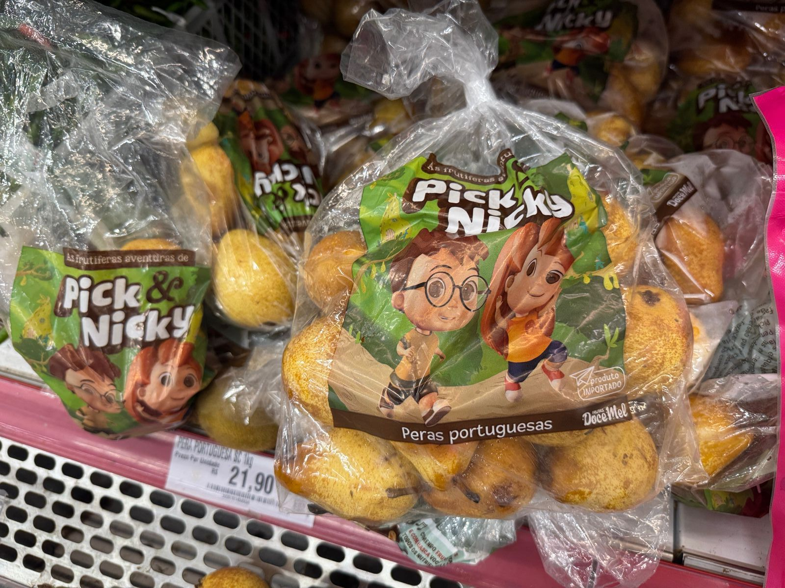
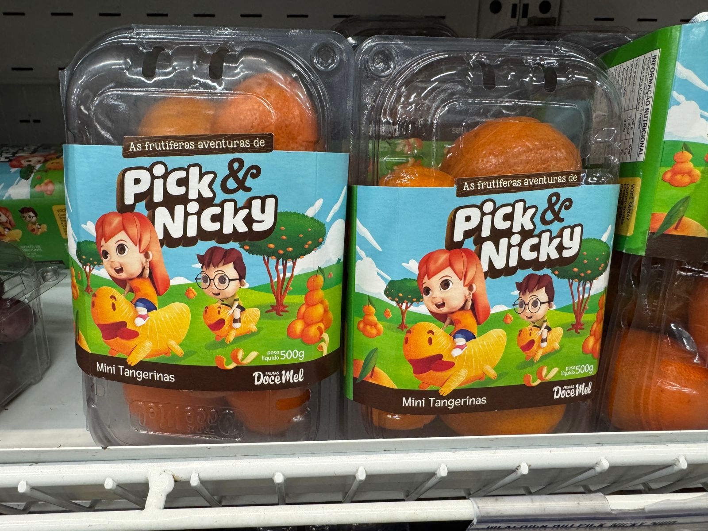
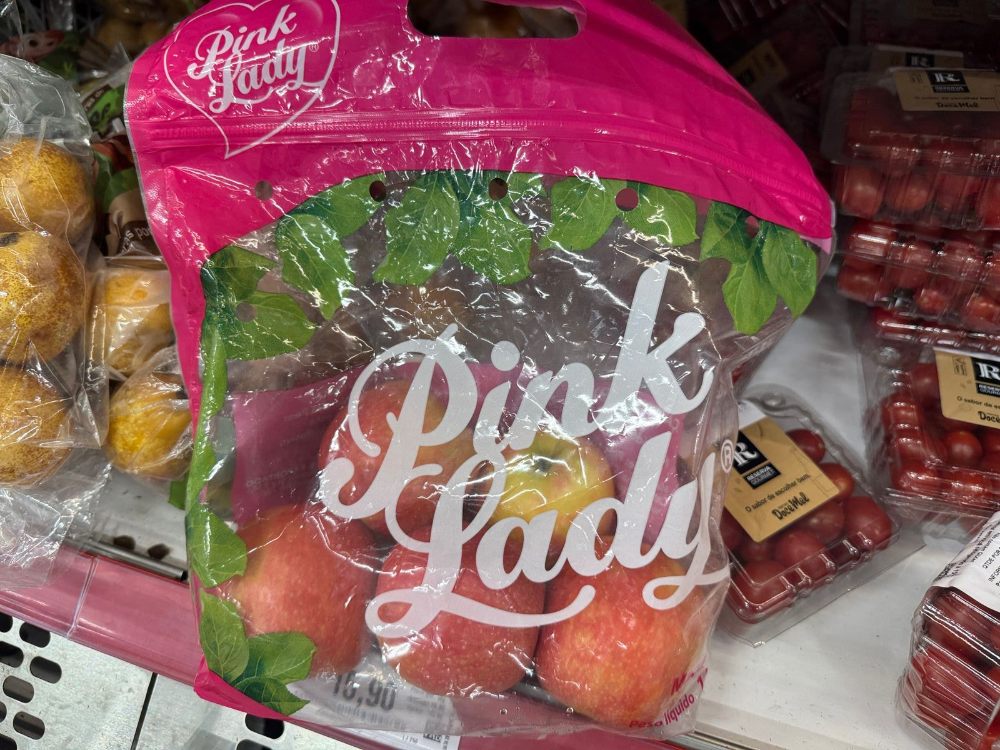

class: top, left, white-bg

```{r setup, include=FALSE}
# Dependências dos slides/aula
library(knitr)          # CRAN v1.33
library(rmarkdown)      # CRAN v2.10
library(xaringan)       # CRAN v0.22
library(xaringanthemer) # CRAN v0.3.0
library(xaringanExtra)  # [github::gadenbuie/xaringanExtra] v0.5.5
library(RefManageR)     # CRAN v1.3.0
library(ggplot2)        # CRAN v3.3.5
library(fontawesome)    # [github::rstudio/fontawesome] v0.1.0
library(pagedown)
library(dplyr)
library(ggimage)
library(ggtext)
library(glue)

# Opções de chunks
options(htmltools.dir.version = FALSE)
knitr::opts_chunk$set(
  echo       = FALSE,
  warning    = FALSE,
  message    = FALSE,
  fig.retina = 3,
  fig.width  = 11,
  fig.asp    = 0.618,
  out.width  = "100%",
  fig.align  = "center",
  comment    = "#"
  )

# Cores para gráficos
colors <- c(
  blue       = "#282f6b",
  red        = "#b22200",
  yellow     = "#eace3f",
  green      = "#224f20",
  purple     = "#5f487c",
  orange     = "#b35c1e",
  turquoise  = "#419391",
  green_two  = "#839c56",
  light_blue = "#3b89bc",
  gray       = "#666666"
  )
```

```{r xaringan, echo=FALSE}
# Tema da apresentação
xaringanthemer::style_mono_light(
  base_color                      = unname(colors["blue"]),
  title_slide_background_image    = params$logo_slides, 
  title_slide_background_size     = 10,
  title_slide_background_position = "bottom 10px right 20px",
  title_slide_background_color    = "white",
  title_slide_text_color          = unname(colors["blue"]),
  footnote_position_bottom        = "15px"
  )

# Opções extras do tema
xaringanExtra::use_progress_bar(
  color    = colors["blue"], 
  location = "bottom"
  )
xaringanExtra::use_extra_styles(
  hover_code_line         = TRUE,
  mute_unhighlighted_code = FALSE
  )
xaringanExtra::use_panelset()
```

```{css, echo=FALSE}
pre {
  white-space: pre-wrap;
  overflow-y: scroll !important;
  max-height: 45vh !important;
  overflow-x: auto;
  max-width: 100%;
}
```

```{css}
/* Add this to your xaringan-themer.css file or within a <style> tag in your .Rmd file */
.white-bg {
  background-color: white !important;
  color: black !important; /* Optional: to ensure text is visible against a white background */
}
```

```{r load_refs, echo=FALSE, eval=params$references}
# Configuração de citações
RefManageR::BibOptions(
  check.entries = FALSE,
  bib.style     = "authoryear",
  cite.style    = "authoryear",
  style         = "markdown",
  hyperlink     = FALSE,
  dashed        = FALSE
  )
if(params$references){
  temp_refbib <- tempdir()
  download.file(
    url      = params$references_path, 
    destfile = paste0(temp_refbib, "/references.bib"), 
    mode     = "wb"
    )
  myBib <- RefManageR::ReadBib(paste0(temp_refbib, "/references.bib"), check = FALSE)
  }

# Como citar?
# RefManageR::TextCite(myBib, "id_da_citacao")
```

```{r utils, echo=FALSE}
# Função que pega um arquivo .Rmd, condicionalmente o renderiza, 
# e embute o conteúdo do mesmo formatado como Markdown puro 
# no output do documento atual
print_rmd <- function(file, encoding = "UTF-8", render = TRUE){
  if(render){rmarkdown::render(input = file, quiet = TRUE)}
  rmd <- readLines(con = file, encoding = encoding)
  cat("```md\n")
  cat(rmd, sep = "\n")
  cat("```\n")
}
```


### QUEM SOU EU?

.pull-left[

```{r, echo=FALSE, out.width="70%"}

```
]

.pull-right[

#### - João Ricardo Lima
#### - Casado com a Paloma desde 2002
#### - Pai do Biel (2003) e da Duda (2013)
#### - Paulistano e Cidadão Petrolinense
#### - Corinthiano
#### - Skatista Old School
#### - Doutor em Economia Aplicada - UFV (2008)
#### - Professor Universitário (2002), Pesquisador da Embrapa Semiárido (2010) e Instrutor do Senar (2024)

]

---
class: top, left

### A QUESTÃO CLIMÁTICA

- A questão climática é preocupação constante, com perspectivas de um ano diferente de 2024.

.pull-left[

```{r, echo=FALSE, out.width="110%"}

```

]

.pull-right[

```{r, echo=FALSE, out.width="110%"}

```

]

Fonte: https://iri.columbia.edu/our-expertise/climate/forecasts/enso/current/

---
class: top, left, white-bg

### A QUESTÃO DA OFERTA

- A cada ano aumenta a área plantada e a produtividade na região.

.pull-left[

```{r, echo=FALSE, out.width="140%"}

```

]

.pull-right[

```{r, echo=FALSE, out.width="140%"}

```

]

Fonte: https://www.hfbrasil.org.br/br/revista/acessar/completo/edicao-de-dezembro-anuario-2024-2025.aspx

---
class: top, left, white-bg

### A QUESTÃO DA MÃO DE OBRA NAS FAZENDAS

### - O Estoque de Mão de obra fecha o ano de 2024 mais alto do que em 2023.

.pull-left[

```{r maisif1, out.width="140%"}

# Pacotes a serem utilizados
library(lubridate)
library(ggplot2)
library(scales)
library(plotly)
library(dplyr)
library(DT)
library(tidyverse)

#Direcionado o R para o Diretorio a ser trabalhado
setwd('/Users/jricardofl/Dropbox/tempecon/dados_caged')

atual <-  as.Date("2024-12-01")

#Entrando dados no R
dados1 <- read.csv2('dezembro_2024.csv', header=T, sep=";", dec = ".")
colnames(dados1)[1] <- 'date'
dados1$date <- seq(as.Date('2021-01-01'),to=atual,by='1 month')
dados1a <- dados1 
dados1a$ano <- strftime(dados1a$date, format="%Y") 
dados1a$mes <- strftime(dados1a$date, format="%B") 

saldo_23 <- dados1a %>% filter(ano=='2023')

saldo_23 <- saldo_23 %>%
  select(c(ano, mes, Saldo_Manga))


saldo_24 <- dados1a %>% filter(ano=='2024')

saldo_24 <- saldo_24 %>%
  select(c(ano, mes, Saldo_Manga))

saldom <- rbind(saldo_23, saldo_24)
saldom$mes <- factor(saldom$mes,levels = c("Janeiro", "Fevereiro", "Março", "Abril", "Maio", "Junho", "Julho", "Agosto", "Setembro", "Outubro", "Novembro", "Dezembro"))

#Entrando dados no R
dados2 <- read.csv2('estoque_dezembro24.csv', header=T, sep=";")

dados2 <- dados2 |>
  mutate(meses = dmy(paste("01", meses, sep = "/"))) #

# Step 2: Generate new columns for mango and grape sums
dados2 <- dados2 |>
  mutate(manga_total = manga_pe + manga_ba,
         uva_total = uva_pe + uva_ba)

estoquem <- saldom
estoquem$manga_total <- dados2$manga_total
estoquem <- estoquem[,-c(3)]


# Step 4: Create the column graph using ggplot2
mycolors2 <- c("lightblue3", "orange")

g0 <- ggplot() +  #estetica vai valer para todos os geom's
  geom_col(data=estoquem, aes(x=mes, y=manga_total, fill=ano), size=2, width = 0.9, position = "dodge")+
    scale_fill_manual(values=mycolors2)+
    labs(y= "Estoque de Emprego (unidade)", x= "Meses do Ano", title='',
       caption = "")+
    scale_y_continuous(limits=c(0, 15000), n.breaks = 10, expand = expansion(add=c(0,0.5)))+
  theme_minimal()+ #Definindo tema
  theme(axis.text.x=element_text(angle=35, hjust=1, size=14, margin = margin(b=20)),
        axis.text.y=element_text(hjust=1, size=14, margin = margin(l=20)),
        axis.title.x = element_text(size=14, face = "bold", margin = margin(b=20)),
        axis.title.y = element_text(size=14, face = "bold", margin = margin(l=20)),
        panel.grid.major = element_blank(),
        panel.grid.minor = element_blank(),
        plot.title = element_text(hjust = 0.5, size=16, face="italic"),
        plot.caption = element_text(hjust = 0, size=12),
        legend.position = "bottom", legend.title = element_blank(),
        legend.text=element_text(size=12)) # Definindo posição da legenda

g0

```

]

.pull-right[

```{r maisif2, out.width="140%"}
estoquem$uva_total <- dados2$uva_total
estoquem <- estoquem[,-c(3)]


# Step 4: Create the column graph using ggplot2
mycolors2 <- c("lightblue3", "purple")

g1 <- ggplot() +  #estetica vai valer para todos os geom's
  geom_col(data=estoquem, aes(x=mes, y=uva_total, fill=ano), size=2, width = 0.9, position = "dodge")+
    scale_fill_manual(values=mycolors2)+
    labs(y= "Estoque de Emprego", x= "Meses do Ano", title='',
       caption = "")+
    scale_y_continuous(limits=c(0, 35000), n.breaks = 10, expand = expansion(add=c(0,0.5)))+
  theme_minimal()+ #Definindo tema
  theme(axis.text.x=element_text(angle=35, hjust=1, size=14, margin = margin(b=20)),
        axis.text.y=element_text(hjust=1, size=14, margin = margin(l=20)),
        axis.title.x = element_text(size=14, face = "bold", margin = margin(b=20)),
        axis.title.y = element_text(size=14, face = "bold", margin = margin(l=20)),
        panel.grid.major = element_blank(),
        panel.grid.minor = element_blank(),
        plot.title = element_text(hjust = 0.5, size=16, face="italic"),
        plot.caption = element_text(hjust = 0, size=12),
        legend.position = "bottom", legend.title = element_blank(),
        legend.text=element_text(size=12)) # Definindo posição da legenda

g1
```

]

#### Fonte: CAGED (2025) reprocessado pelos Observatórios de Mercado da Embrapa.


---
class: top, left, white-bg

### OS CUSTOS DE PRODUÇÃO

#### -  Os custos de produção já estão mais altos devido o aumento do salário mínimo e mão de obra é uma parte importante do custo. Uma outra parte é dolarizada e, pelo menos até o momento, o dólar está com tendência de queda.

.pull-left[

```{r maisif3, out.width="140%"}

anos <- 2011:2025
salario_nominal <- c(545, 622, 678, 724, 788, 880, 937, 954, 998, 1045, 1100, 1212, 1320, 1412, 1518)
salario_real <- c(1212.80, 1299.63, 1338.49, 1349.53, 1380.38, 1392.87, 1395.35, 1379.99, 1391.52, 1396.90, 1406.87, 1408.42, 1450.04, 1482.59, 1520.43)

# Crie um data frame
dados <- data.frame(anos, salario_nominal, salario_real)

# Crie o gráfico
ggplot(dados, aes(x = anos)) +
  geom_line(aes(y = salario_nominal, color = "Nominal"), size=2) +
  geom_line(aes(y = salario_real, color = "Real"), size=2) +
  labs(title = "Evolução do Salário Mínimo no Brasil (2011-2025)",
       x = "Ano",
       y = "Valor (R$)",
       color = "Tipo de Valor") +
  scale_color_manual(values = c("Nominal" = "blue", "Real" = "red")) +
scale_x_continuous(breaks = seq(2011, 2025, by = 2), labels = seq(2011, 2025, by = 2)) +  # Correct scale
theme_minimal()+
  theme(axis.text.x=element_text(angle=35, hjust=0.5, size=16, margin = margin(b=20)),
        axis.text.y=element_text(hjust=0.5, size=18, margin = margin(l=20)),
        axis.title.y = element_text(size=14, face = "bold"),
        axis.title.x = element_text(size=16, face = "bold"),
        panel.grid.major = element_blank(),
        panel.grid.minor = element_blank(),
        plot.caption = element_text(hjust = 0, size=18),
        legend.position = "bottom", legend.title = element_blank(),
        legend.text=element_text(size=16)) # Definindo posição da legenda

```

]

.pull-right[

```{r maisif4, out.width="140%"}
library(rbcb)

#Cambio Baixando os dados para o R
dados6 <- get_market_expectations("monthly", "Câmbio", start_date = "2025-01-01")
dados6 <- dados6 %>% filter (baseCalculo == 0, DataReferencia == '12/2025') 
dados6 <- data.frame(dates=dados6$Data, cambio=dados6$Media)

g4 <- ggplot(data=dados6)+
  geom_line(aes(x=dates, y=cambio), color="blue", size=2)+
    scale_x_date(date_breaks = "1 week",
               labels = date_format("%d-%b"))+
  labs(y= "Câmbio Esperado para Dezembro/2025", x= "Semanas do Ano", title='Expectativas do Mercado para a Taxa de Câmbio Dez/25.',
       caption = "")+
theme_minimal()+
  theme(axis.text.x=element_text(angle=35, hjust=0.5, size=16, margin = margin(b=20)),
        axis.text.y=element_text(hjust=0.5, size=18, margin = margin(l=20)),
        axis.title.y = element_text(size=14, face = "bold"),
        axis.title.x = element_text(size=16, face = "bold"),
        panel.grid.major = element_blank(),
        panel.grid.minor = element_blank(),
        plot.caption = element_text(hjust = 0, size=18),
        legend.position = "bottom", legend.title = element_blank(),
        legend.text=element_text(size=16)) # Definindo posição da legenda

g4
```
]

#### Fonte: IBGE (2025) e BACEN (2025) reprocessados pelos Observatórios de Mercado da Embrapa.

---
class: top, left, white-bg

### NOVOS MERCADOS: CHINA; ÍNDIA; AMÉRICA DO SUL


```{r, echo=FALSE, out.width="90%"}
# Instalar pacotes, se necessário
#install.packages(c("ggplot2", "rnaturalearth", "rnaturalearthdata", "sf"))

# Carregar pacotes
library(ggplot2)
library(rnaturalearth)
library(rnaturalearthdata)
library(sf)

# Obter os dados do mapa mundial
world <- ne_countries(scale = "medium", returnclass = "sf")

# Definir países a destacar
paises_destaque <- c("China", "India", "Argentina", "Bolivia", "Chile", "Colombia",
                     "Ecuador", "Paraguay", "Peru", "Uruguay", "Venezuela")

# Definir a Europa (todos os países listados no ne_countries com região = Europe)
paises_europa <- world[world$region_un == "Europe", ]$name

# Criar o mapa
ggplot(data = world) +
  # Fundo do mapa (países não destacados)
  geom_sf(fill = "gray90", color = "black") +  
  # Pintar a Europa de cinza claro
  geom_sf(data = world[world$name %in% paises_europa, ], 
          fill = "lightgray", color = "black") +  
  # Pintar os Estados Unidos de azul claro
  geom_sf(data = world[world$name == "United States", ], 
          fill = "darkgrey", color = "white") +  
  # Destacar os países selecionados (China, Índia e América do Sul)
  geom_sf(data = world[world$name %in% paises_destaque, ], 
          aes(fill = name), color = "black") +  
  # Definir cores para os países
  scale_fill_manual(values = c("China" = "red", "India" = "orange", 
                               "Argentina" = "#98FF98", "Bolivia" = "#77DD77", 
                               "Chile" = "lightgreen", "Colombia" = "#00FA9A",
                               "Ecuador" = "#32CD32", "Paraguay" = "#228B22", 
                               "Peru" = "#2E8B57", "Uruguay" = "darkgreen", 
                               "Venezuela" = "#355E3B")) +  
  # Personalizar título e legenda
  labs(title = "",
       fill = "Países Destacados") +
  theme_minimal() +
  theme(legend.position = "right",
        axis.text = element_blank(), 
        axis.ticks = element_blank(),
        panel.grid = element_blank())


```

---
class: top, left

### NOVAS CULTURAS

```{r, echo=FALSE, out.width="66%"}

```

---
class: top, left

### NOVAS CULTURAS

```{r, echo=FALSE, out.width="80%"}

```

---
class: top, left

### NOVAS CULTURAS

```{r, echo=FALSE, out.width="80%"}

```

---
class: top, left

### NOVAS CULTURAS

```{r, echo=FALSE, out.width="63%"}

```

---
class: top, left

### NOVAS CULTURAS

.pull-left[

```{r, echo=FALSE, out.width="80%"}

```

]

.pull-right[

```{r, echo=FALSE, out.width="80%"}

```

]

---
class: top, left

### O DIFERENCIAL DAS EMBALAGENS

```{r, echo=FALSE, out.width="63%"}

```

---
class: top, left

### O DIFERENCIAL DAS EMBALAGENS

```{r, echo=FALSE, out.width="65%"}
knitr::include_graphics("imgs/embala11.jpg")
```

---
class: top, left

### O DIFERENCIAL DAS EMBALAGENS

```{r, echo=FALSE, out.width="65%"}

```

---
class: top, left

### O DIFERENCIAL DAS EMBALAGENS

```{r, echo=FALSE, out.width="65%"}

```

---
class: top, left

### O DIFERENCIAL DAS EMBALAGENS

```{r, echo=FALSE, out.width="65%"}

```

---
class: top, left

### O DIFERENCIAL DAS EMBALAGENS

```{r, echo=FALSE, out.width="65%"}
knitr::include_graphics("imgs/embala16.jpg")
```

---
class: top, left

### O DIFERENCIAL DAS EMBALAGENS

```{r, echo=FALSE, out.width="65%"}

```

---
class: top, left

### O DIFERENCIAL DAS EMBALAGENS

```{r, echo=FALSE, out.width="65%"}

```

---
class: top, left

### O DIFERENCIAL DAS EMBALAGENS

```{r, echo=FALSE, out.width="65%"}
knitr::include_graphics("imgs/embala19.jpg")
```

---
class: top, left

### O DIFERENCIAL DAS EMBALAGENS

```{r, echo=FALSE, out.width="65%"}
knitr::include_graphics("imgs/embala20.jpg")
```

---
class: top, left

### O DIFERENCIAL DAS EMBALAGENS

```{r, echo=FALSE, out.width="65%"}
knitr::include_graphics("imgs/embala27.jpg")
```

---
class: top, left

### EMBALAGENS COM MAIOR PREOCUPAÇÃO AMBIENTAL

```{r, echo=FALSE, out.width="65%"}

```

---
class: top, left

### EMBALAGENS COM MAIOR PREOCUPAÇÃO AMBIENTAL

.pull-left[

```{r, echo=FALSE, out.width="85%"}

```

]

.pull-right[

```{r, echo=FALSE, out.width="85%"}
knitr::include_graphics("imgs/ambiente3.jpg")
```

]

---
class: top, left

### EMBALAGENS COM MAIOR PREOCUPAÇÃO AMBIENTAL

```{r, echo=FALSE, out.width="75%"}

```

---
class: top, left

### EMBALAGENS COM MAIOR PREOCUPAÇÃO AMBIENTAL

```{r, echo=FALSE, out.width="75%"}

```

---
class: top, left

### EMBALAGENS COM MAIOR PREOCUPAÇÃO AMBIENTAL

```{r, echo=FALSE, out.width="75%"}

```

---
class: top, left

### EMBALAGENS COM MAIOR PREOCUPAÇÃO AMBIENTAL

```{r, echo=FALSE, out.width="70%"}
knitr::include_graphics("imgs/ambiente7.jpg")
```

---
class: center, left

### DIFERENCIAL DA APRESENTAÇÃO DO PRODUTO

.pull-left[

```{r, echo=FALSE, out.width="73%"}

```

]

.pull-right[

```{r, echo=FALSE, out.width="73%"}

```

]

---
class: top, left

### DIFERENCIAL DE APRESENTAÇÃO DO PRODUTO

```{r, echo=FALSE, out.width="65%"}

```

---
class: center, middle, white-bg

```{r, echo=FALSE, out.width="26%"}
knitr::include_graphics("imgs/logo_manga.png")
```


# OBRIGADO!

João Ricardo F. de Lima <br>
Email: joao.ricardo@embrapa.br

<br>https://www.embrapa.br/observatorio-da-manga
<br>https://www.embrapa.br/observatorio-da-uva


Telefones:<br>
87-99961-5799

```{r, echo=FALSE, out.width="20%"}
knitr::include_graphics("imgs/apoio1.png")
```
