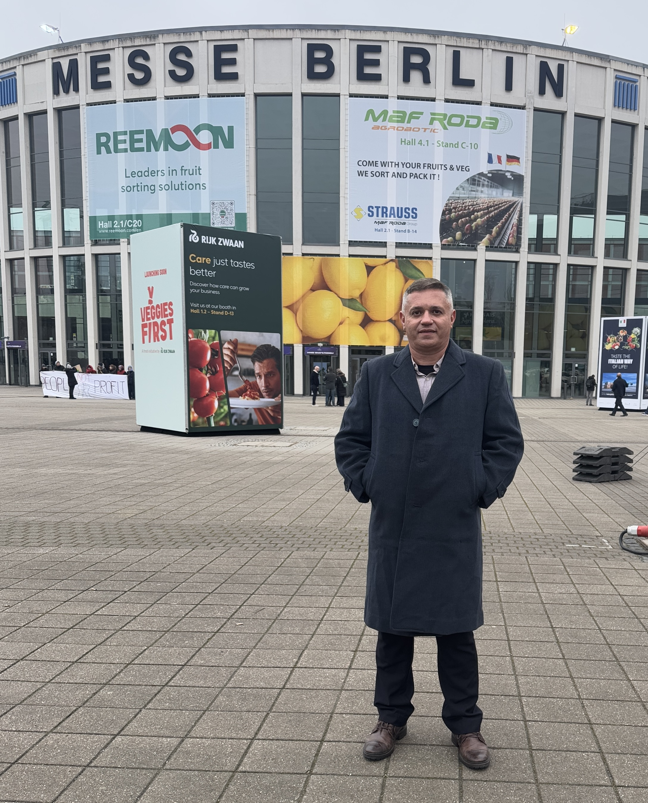
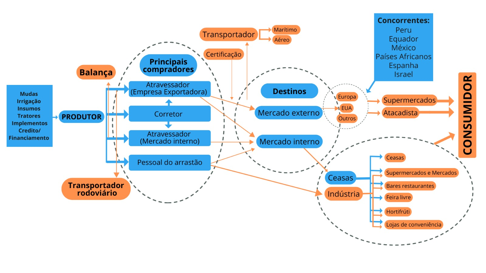
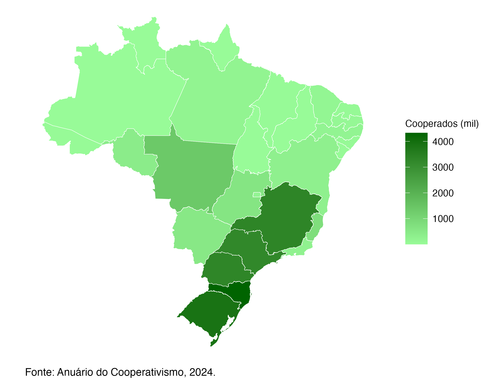
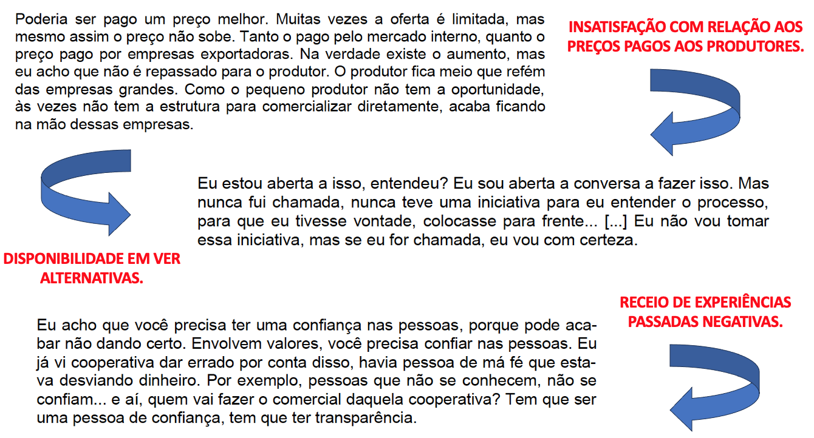
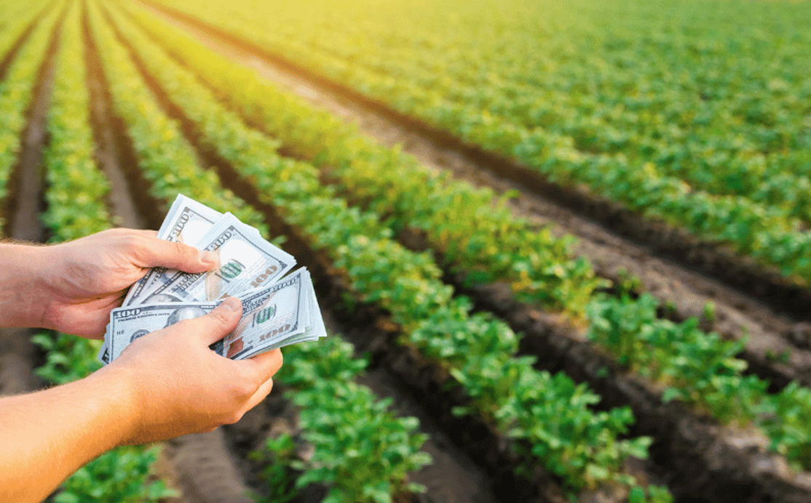
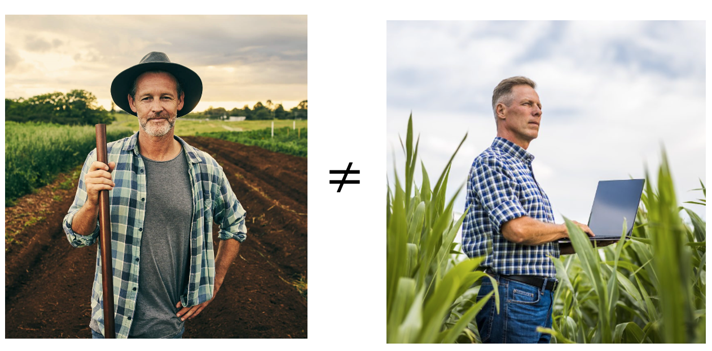
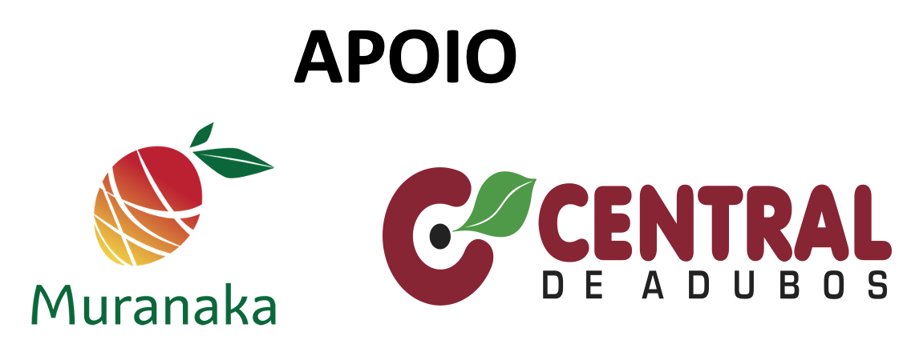

class: top, left, white-bg

```{r setup, include=FALSE}
# Dependências dos slides/aula
library(knitr)          # CRAN v1.33
library(rmarkdown)      # CRAN v2.10
library(xaringan)       # CRAN v0.22
library(xaringanthemer) # CRAN v0.3.0
library(xaringanExtra)  # [github::gadenbuie/xaringanExtra] v0.5.5
library(RefManageR)     # CRAN v1.3.0
library(ggplot2)        # CRAN v3.3.5
library(fontawesome)    # [github::rstudio/fontawesome] v0.1.0
library(pagedown)
library(dplyr)
library(ggimage)
library(ggtext)
library(glue)

# Opções de chunks
options(htmltools.dir.version = FALSE)
knitr::opts_chunk$set(
  echo       = FALSE,
  warning    = FALSE,
  message    = FALSE,
  fig.retina = 3,
  fig.width  = 11,
  fig.asp    = 0.618,
  out.width  = "100%",
  fig.align  = "center",
  comment    = "#"
  )

# Cores para gráficos
colors <- c(
  blue       = "#282f6b",
  red        = "#b22200",
  yellow     = "#eace3f",
  green      = "#224f20",
  purple     = "#5f487c",
  orange     = "#b35c1e",
  turquoise  = "#419391",
  green_two  = "#839c56",
  light_blue = "#3b89bc",
  gray       = "#666666"
  )
```

```{r xaringan, echo=FALSE}
# Tema da apresentação
xaringanthemer::style_mono_light(
  base_color                      = unname(colors["blue"]),
  title_slide_background_image    = params$logo_slides, 
  title_slide_background_size     = 10,
  title_slide_background_position = "bottom 10px right 20px",
  title_slide_background_color    = "white",
  title_slide_text_color          = unname(colors["blue"]),
  footnote_position_bottom        = "15px"
  )

# Opções extras do tema
xaringanExtra::use_progress_bar(
  color    = colors["blue"], 
  location = "bottom"
  )
xaringanExtra::use_extra_styles(
  hover_code_line         = TRUE,
  mute_unhighlighted_code = FALSE
  )
xaringanExtra::use_panelset()
```

```{css, echo=FALSE}
pre {
  white-space: pre-wrap;
  overflow-y: scroll !important;
  max-height: 45vh !important;
  overflow-x: auto;
  max-width: 100%;
}
```

```{css}
/* Add this to your xaringan-themer.css file or within a <style> tag in your .Rmd file */
.white-bg {
  background-color: white !important;
  color: black !important; /* Optional: to ensure text is visible against a white background */
}
```

```{r load_refs, echo=FALSE, eval=params$references}
# Configuração de citações
RefManageR::BibOptions(
  check.entries = FALSE,
  bib.style     = "authoryear",
  cite.style    = "authoryear",
  style         = "markdown",
  hyperlink     = FALSE,
  dashed        = FALSE
  )
if(params$references){
  temp_refbib <- tempdir()
  download.file(
    url      = params$references_path, 
    destfile = paste0(temp_refbib, "/references.bib"), 
    mode     = "wb"
    )
  myBib <- RefManageR::ReadBib(paste0(temp_refbib, "/references.bib"), check = FALSE)
  }

# Como citar?
# RefManageR::TextCite(myBib, "id_da_citacao")
```

```{r utils, echo=FALSE}
# Função que pega um arquivo .Rmd, condicionalmente o renderiza, 
# e embute o conteúdo do mesmo formatado como Markdown puro 
# no output do documento atual
print_rmd <- function(file, encoding = "UTF-8", render = TRUE){
  if(render){rmarkdown::render(input = file, quiet = TRUE)}
  rmd <- readLines(con = file, encoding = encoding)
  cat("```md\n")
  cat(rmd, sep = "\n")
  cat("```\n")
}
```


### QUEM SOU EU?

.pull-left[
```{r, echo=FALSE, out.width="80%"}

```
]

.pull-right[

#### - João Ricardo Lima
#### - Casado com a Paloma desde 2002
#### - Pai do Biel (2003) e da Duda (2013)
#### - Paulistano e Cidadão Petrolinense
#### - Corinthiano
#### - Skatista Old School
#### - Doutor em Economia Aplicada - UFV (2008)
#### - Professor Universitário (2002), Pesquisador da Embrapa Semiárido (2010) e Instrutor do Senar (2024)

]

---
class: top, left

### UMA COMPLEXA CADEIA PRODUTIVA

```{r, echo=FALSE, out.width="85%"}

```
Fonte: LIMA et al, 2023.

---
class: top, left

### NÚMERO DE COOPERADOS POR ESTADO NO BRASIL EM 2023.

```{r coop1, echo=FALSE, message = FALSE, out.width="65%"}
# Load necessary libraries
#library(sf)
#library(ggplot2)
#library(dplyr)
#library(readr)

# Load the shapefile for Brazilian states
#brazil <- st_read("https://raw.githubusercontent.com/codeforamerica/click_that_hood/master/public/data/brazil-states.geojson", quiet = TRUE)

# Convert `sigla` column to character (just in case)
#brazil$sigla <- as.character(brazil$sigla)

# Load your dataset
#cooperatives <- data.frame(
#  UF = c("AC", "AL", "AM", "AP", "BA", "CE", "DF", "ES", "GO", "MA", "MG", "MS", "MT", "PA", "PB", "PE", "PI", "PR", "RJ", "RN", "RO", "RR", "RS", "SC", "SE", "SP", "TO"),
#  members_2023 = c(22265, 68768, 17953, 4637, 298486, 147805, 183042, 801583, 609709, 41685, 3331331, 513841, 1380632, 201318, 99961, 188268, 15912, 3297859, 253276, 70505, 405762, 10479, 3876269, 4327882, 23502, 3242175, 17800)
#)

# Merge shapefile with cooperative data using `sigla`
#brazil <- brazil %>%
#  left_join(cooperatives, by = c("sigla" = "UF"))

# Convert values to numeric (to avoid mapping errors)
#brazil$members_2023 <- as.numeric(brazil$members_2023)

# Plot the corrected map
#ggplot(brazil) +
#  geom_sf(aes(fill = members_2023/1000), color = "white") +
#  scale_fill_gradient(low = "palegreen", high = "darkgreen", na.value = "white") +
#  theme_void() +
#  labs(fill = "Cooperados (mil)",
#       caption = "Fonte: Anuário do Cooperativismo, 2024.") +
#  theme(axis.text = element_blank(),
#        axis.ticks = element_blank(),
#        panel.grid = element_blank(),
#        legend.position = "right",  # Move legend to the left
#       legend.key.size = unit(0.9, "cm"),  # Reduce legend box size
#        legend.text = element_text(size = 11),  # Reduce text size
#        plot.caption = element_text(hjust = 0, size = 12),
#        plot.background = element_rect(fill = "transparent", color = NA))

#ggsave("mapa_cooperados.png", width = 8, height = 6, dpi = 300, bg = "transparent")


```

---
class: center, middle, white-bg

### POR QUE NÃO TEMOS MAIS COOPERATIVAS NO VALE DO S. FRANCISCO?

```{r, echo=FALSE, out.width="40%"}
knitr::include_graphics("imgs/duvida.png")
```

---
class: center, middle, white-bg

Segundo o Censo Agropecuário do IBGE (2017) o Submédio do Vale do São Francisco tem 5.291 produtores de manga e 1.338 produtores de uva de mesa. 

```{r coop2, echo=FALSE, out.width="80%"}
### AGRICULTURA FAMILIAR ENTRE PRODUTORES DE MANGA E UVA
# Load libraries
library(ggplot2)
library(dplyr)
library(patchwork)  # To arrange graphs side by side

# Create dataset
data_mango <- data.frame(
  Category = c("Agricultor Familiar", "Não Agricultor Familiar"),
  Percentage = c(61.84, 38.16)
)

data_grape <- data.frame(
  Category = c("Agricultor Familiar", "Não Agricultor Familiar"),
  Percentage = c(53.59, 46.41)
)

# Mango Growers Graph
p1 <- ggplot(data_mango, aes(x = Category, y = Percentage, fill = Category)) +
  geom_bar(stat = "identity") +
  scale_fill_manual(values = c("gold", "yellow")) +
  labs(title = "Produtores de Manga", y = "Porcentagem (%)", x = "") +
  ylim(0, 70) +  # **Set same Y-axis scale**
  theme_minimal() +
  theme(legend.position = "none",
        plot.title = element_text(size = 20, face = "bold"))

# Table Grapes Growers Graph
p2 <- ggplot(data_grape, aes(x = Category, y = Percentage, fill = Category)) +
  geom_bar(stat = "identity") +
  scale_fill_manual(values = c("purple", "orchid")) +
  labs(title = "Produtores de Uva de Mesa", y = "Porcentagem (%)", x = "") +
  ylim(0, 70) +  # **Set same Y-axis scale**
  theme_minimal() +
  theme(legend.position = "none",
        plot.title = element_text(size = 20, face = "bold"))

# Combine both plots side by side
p1 + p2

```

---
class: center, middle

### PRECISAMOS SER COOPERADOS NO VALE DO S. FRANCISCO?

```{r coop3, out.width="80%"}
library(lubridate)
today <- as.Date('2025-02-14')
last <- today - 7
sem_ano <- isoweek(today)

#Direcionado o R para o Diretorio a ser trabalhado
#setwd('c:/Users/Joao Ricardo Lima/Dropbox/tempecon/dados_manga')
setwd('/Users/jricardofl/Dropbox/tempecon/dados_manga')

#Inicio do Script
#Pacotes a serem utilizados 
library(foreign)
library(mFilter)
library(forecast)
library(dplyr)
library(tsutils)
library(xts)
library(ggthemes)
library(FinTS)
library(scales)
library(ggplot2)
#library(easyGgplot2)
library(reshape)
library(reshape2)
library(imputeTS)
library(seasonal)
library(uroot)
library(tseries)
library(quantmod)
library(kableExtra)# complex tables
library(lmtest)
library(plotly)
library(DT)
library(magrittr)

options(digits=4)

#Entrando dados no R
dados <- read.csv2('dados_manga_palmer_semana.csv', header=T, sep=";", dec=".")
#dados <- dados[,-c(9:10)] #retirar as ultimas colunas
colnames(dados)[1]<-'produto'

#Entrando dados no R - Deflator
igpdi <- read.csv2('igpdi.csv', 
                   header=T, sep=";",
                   dec=".")

dados_comb<-cbind(dados, igpdi)

teste<-dados_comb[,4]-dados_comb[,7]

dadosp<-dados_comb[,-c(1,2,6,7)]

#Deflacionar a serie de manga
dadosp$preco_def <- dadosp[,3]*(tail(dadosp[,4],1)/dadosp[,4])
#dadosp<-dadosp[,-2]

#Criando uma variável com as datas semanais
date <- seq(as.Date('2012-01-07'),to=today,by='1 week')
date <- date[date != as.Date('2016-12-31')]
date[date == as.Date('2022-12-31')] <- as.Date('2023-01-01')
date <- date[date != as.Date('2023-12-30')]
date <- c(date, as.Date(today))
dadosp$date <- date

#Analise de Serie Temporal
preco_palmer <- dadosp[,5]
preco_palmer <- ts(preco_palmer, start=c(2012,1), freq=52)
#preco_palmer <- window(preco_palmer, end=c(2021,52))

trend_palmer <- cmav(preco_palmer, outplot=F)

#Gráfico com Ggplot2

ggplot(data=dadosp, aes(x=date)) +  #estetica vai valer para todos os geom's
  geom_line(aes(y=preco_def, colour="PREÇO"), lwd=1)+
  geom_line(aes(y=trend_palmer, colour="TENDÊNCIA"), lwd=1)+
  scale_colour_manual("", 
                      breaks = c("PREÇO", "TENDÊNCIA"),
                      values = c("blue", "red")) +
  labs(y= "Preço Palmer (R$)", x= "Semanas de cada Ano", title='',
       caption = "Fonte: CEPEA reprocessado pelo Observatório de Mercado de Manga da Embrapa") +
  scale_y_continuous(limits=c(0,8), n.breaks = 9, expand = expansion(add=c(0,0.5)), 
                     labels=number_format(accuracy = 0.01, decimal.mark = ","))+
  scale_x_date(date_breaks = "1 year",
               labels = date_format("%Y"))+
  theme_classic()+ #Definindo tema
  theme(axis.text.x=element_text(angle=0, hjust=0.5, size=14, margin = margin(b=20)),
        axis.text.y=element_text(hjust=1, size=14, margin = margin(l=20)),
        axis.title.x = element_text(size=14, face = "bold", margin = margin(b=20)),
        axis.title.y = element_text(size=14, face = "bold", margin = margin(l=20)),
        plot.title = element_text(hjust = 0.5, size=16, face="italic"),
        plot.caption = element_text(hjust = 0, size=12),
        legend.position = c(1,1),
        legend.justification = c(1.2, 1.2),
        legend.text=element_text(size=12))
```

---
class: center, middle

### PRECISAMOS SER COOPERADOS NO VALE DO S. FRANCISCO?

```{r coop4, out.width="80%"}
library(imputeTS)

#Direcionado o R para o Diretorio a ser trabalhado
#setwd('c:/Users/Joao Ricardo Lima/Dropbox/tempecon/dados_uva')
setwd('/Users/jricardofl/Dropbox/tempecon/dados_uva')

#Entrando dados no R Vitoria sem Embalagem
dados3 <- read.csv2('dados_uva_vitoriaSE_semana.csv', header=T, sep=";", dec=".")
#dados <- dados[,-c(9:10)] #retirar as ultimas colunas
colnames(dados3)[1]<-'produto'

#organização das bases para Uva Branca e Vitoria Embalada
#Entrando dados no R - Deflator
igpdi <- read.csv2('igpdi_uva.csv', 
                   header=T, sep=";",
                   dec=".")
colnames(igpdi)[1]<-'ano'

igpdi2 <- igpdi %>% filter(ano >= '2019')

#Juntar tudo em um unico tibble
dadosv <- full_join(dados3, igpdi2)

#Resolver os Missing
dadosv <-na_kalman(dadosv)

#Deflacionar a série de precos
dadosv$preco_def <- dadosv[,4]*(tail(dadosv[,5],1)/dadosv[,5])

#Criando uma variável com as datas semanais
dadosv$date <- seq(as.Date('2019-01-07'),to=today, by='1 week') #ajustar toda semana

#Passar para um Tibble
dadosv <- tibble(dadosv)

#Ajustando como uma série temporal
dadosv <- dadosv %>% 
  select(c(date, produto, preco_def, ano))

vitoriase <- dadosv
preco_vitoriase <- ts(vitoriase[,3], start=c(2019,1), freq=52)
sazonal_vitoriase <- cmav(preco_vitoriase, outplot = F)

#Gráficos

negrase1 <- ggplot(data=vitoriase, aes(x=date)) +  #estetica vai valer para todos os geom's
  geom_line(aes(y=preco_def, colour="PREÇO"), lwd=1)+
  geom_line(aes(y=sazonal_vitoriase, colour="TENDÊNCIA"), lwd=1)+
  scale_colour_manual("", 
                      breaks = c("PREÇO", "TENDÊNCIA"),
                      values = c("blue", "red")) +
  labs(y= "Preço Uva Vitória Contentor (R$)", x= "Semanas de cada Ano", title='',
       caption = "Fonte: CEPEA reprocessado pelo Observatório de Mercado de Uva da Embrapa") +
  scale_y_continuous(limits=c(0,12), n.breaks = 8, expand = expansion(add=c(0,0.5)), 
                     labels=number_format(accuracy = 0.01, decimal.mark = ","))+
  scale_x_date(date_breaks = "1 year",
               labels = date_format("%Y"))+
  theme_classic()+ #Definindo tema
  theme(axis.text.x=element_text(angle=0, hjust=0.5, size=14, margin = margin(b=20)),
        axis.text.y=element_text(hjust=0.5, size=14, margin = margin(l=20)),
        axis.title.x = element_text(size=14, face = "bold", margin = margin(b=20)),
        axis.title.y = element_text(size=14, face = "bold", margin = margin(l=20)),
        plot.title = element_text(hjust = 0.5, size=16, face="italic"),
        plot.caption = element_text(hjust = 0, size=12),
        legend.position = c(1,1),
        legend.justification = c(1.2, 1.2),
        legend.text=element_text(size=12)) # Definindo posição da legenda

negrase1
```

---
class: top, left, white-bg

```{r, echo=FALSE}

```
Fonte: LIMA, 2021.

---
class: center, middle, white-bg

### POR QUE PRECISAMOS DE MAIS COOPERATIVAS NO VALE DO S. FRANCISCO?

```{r, echo=FALSE, out.width="40%"}
knitr::include_graphics("imgs/duvida.png")
```

---
class: top, left, white-bg

### AGRONEGÓCIO É UMA FORMA DE SE GANHAR DINHEIRO

```{r, echo=FALSE, out.width="80%"}

```

---
class: top, left, white-bg

### DIFERENÇA ENTRE O PRODUTOR RURAL E O EMPRESÁRIO RURAL

```{r, echo=FALSE}

```

---
class: top, left

## PONTOS PARA REFLETIRMOS/TRABALHARMOS...

### - AUMENTO DA ESCOLARIDADE
 
### - PROFISSIONALISMO

### - GESTÃO DO AGRONEGÓCIO

### - UNIÃO DE EMPRESÁRIOS RURAIS

### - ORGANIZAÇÃO DOS DADOS 

### - ESTRATÉGIA DE DESENVOLVIMENTO

---
class: center, middle, white-bg

```{r, echo=FALSE, out.width="26%"}
knitr::include_graphics("imgs/logo_manga.png")
```

# OBRIGADO!

João Ricardo F. de Lima <br>
Email: joao.ricardo@embrapa.br

<br>https://www.embrapa.br/observatorio-da-manga
<br>https://www.embrapa.br/observatorio-da-uva


Telefones:<br>
87-99961-5799

```{r, echo=FALSE, out.width="20%"}

```
