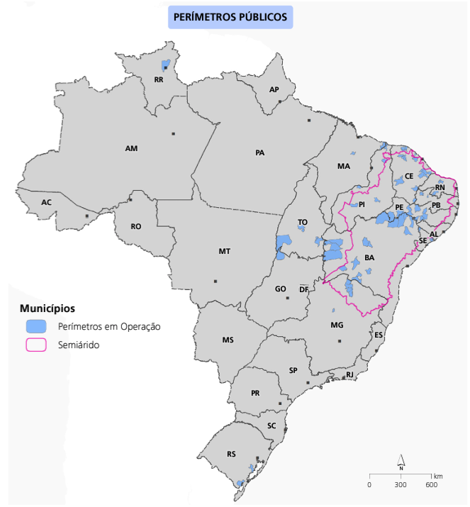
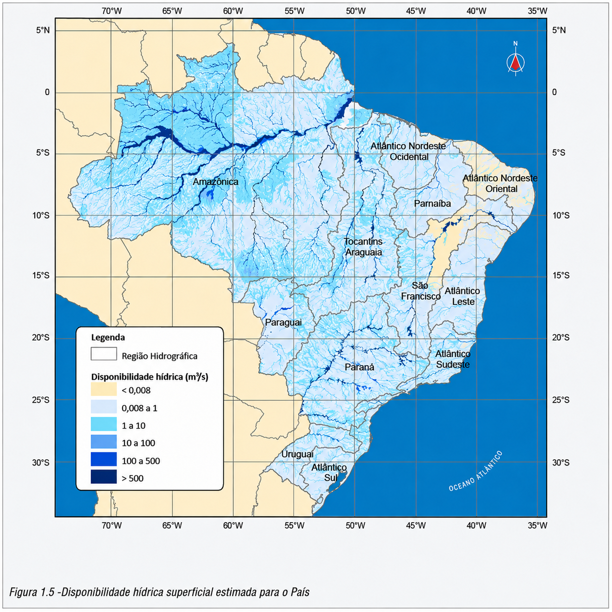
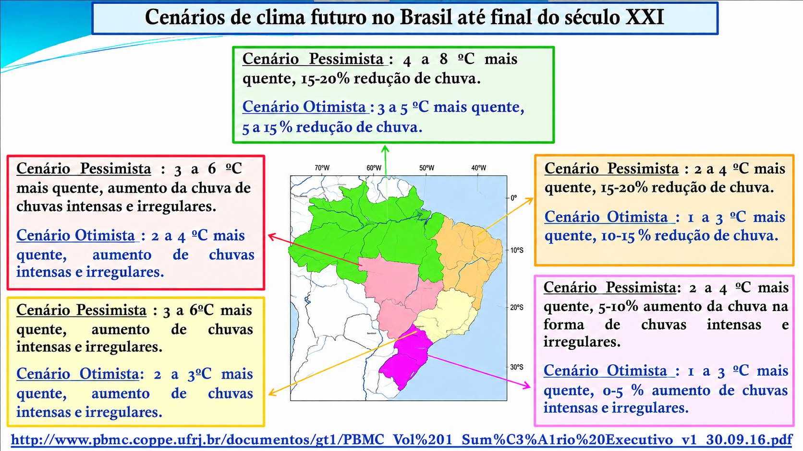
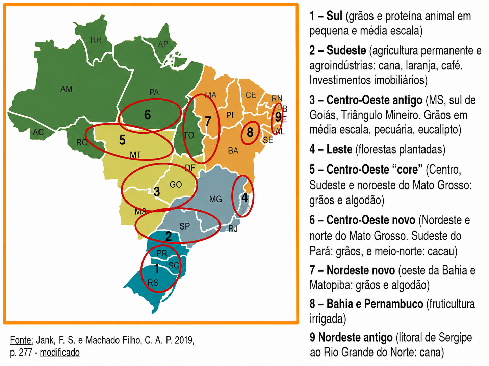
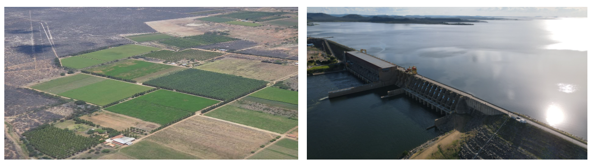
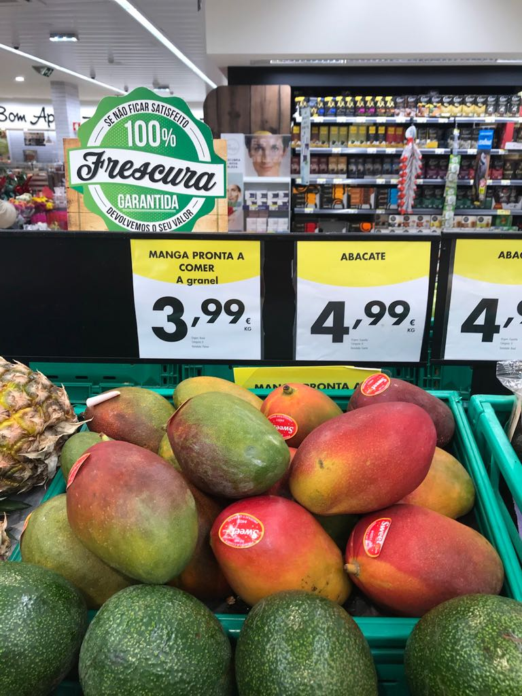
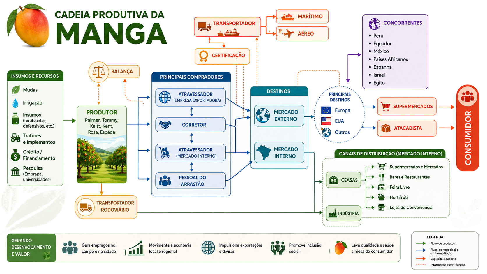
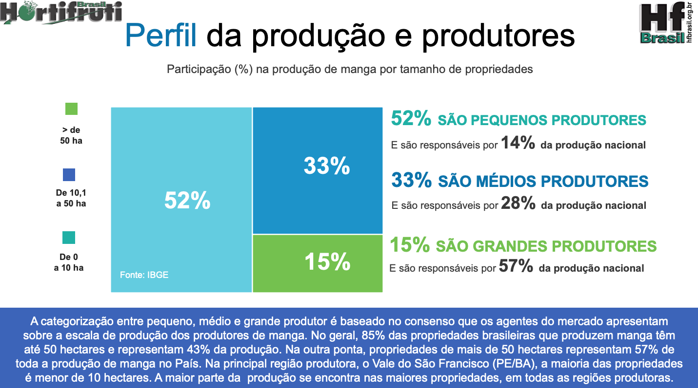
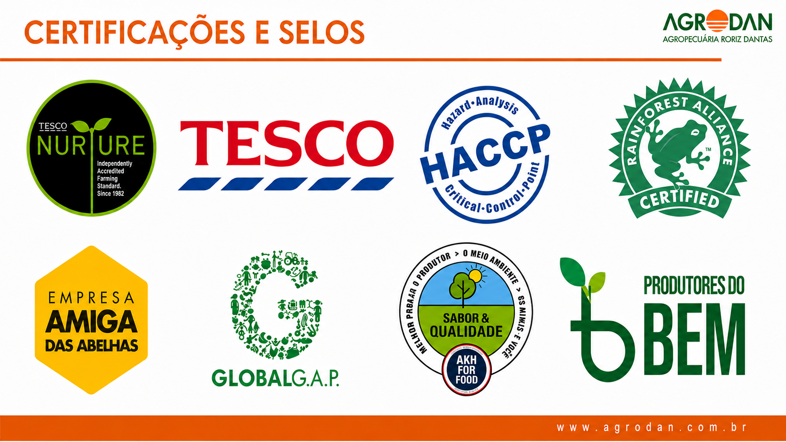
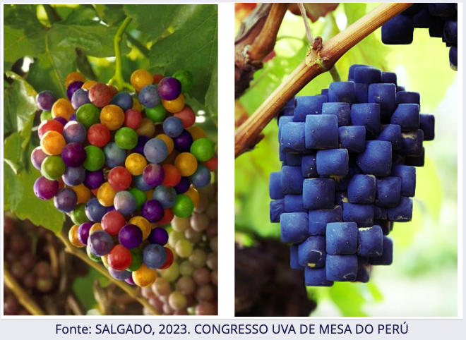

## João Ricardo Lima  {.center .aboutmeslide}

::: columns
::: {.column width="60%"}

-   Contatos

    -   Instagram: [\@jotaerre.econ](https://www.instagram.com/jotaerre.econ/)

    -   Email: [joao.ricardo@embrapa.br](joao.ricardo@embrapa.br)
    
    -   Linkedin: [Joao Ricardo Lima](https://www.linkedin.com/in/joao-ricardo-lima-7b6273240/)


-   Sobre mim

    -   Doutor em Economia Aplicada (UFV-MG)

    -   Pesquisador em Economia Rural da Embrapa Semiárido - Petrolina/PE
    
    -   Coordenador dos Observatórios de Mercado de Manga e Uva da Embrapa
:::

::: {.column width="40%"}
{width=90%}

:::
:::

```{r}
#| label: slide1

# Dependências dos slides/aula
library(knitr)          # CRAN v1.33
library(rmarkdown)      # CRAN v2.10
library(xaringan)       # CRAN v0.22
library(xaringanthemer) # CRAN v0.3.0
library(xaringanExtra)  # [github::gadenbuie/xaringanExtra] v0.5.5
library(RefManageR)     # CRAN v1.3.0
library(ggplot2)        # CRAN v3.3.5
library(fontawesome)    # [github::rstudio/fontawesome] v0.1.0
library(pagedown)
library(dplyr)
library(ggimage)
library(ggtext)
library(glue)
library(reshape2)
library(scales)
library(reticulate)

# Usa o Python do sistema (ja tem pandas/plotnine instalados) em vez do
# ambiente gerenciado padrao do reticulate (que vem sem pacotes)
reticulate::use_python("C:/Users/Lenovo/AppData/Local/Programs/Python/Python314/python.exe", required = TRUE)

# Opções de chunks (echo/warning/message/fig-width/fig-height/fig-align valem
# para todos os slides; cada chunk individual so precisa do #| label)
# dev.args com bg="transparent" faz os PNGs saírem sem fundo branco, para
# combinar com o fundo cinza-lavanda (#E9EAF0) do tema dos slides.
options(htmltools.dir.version = FALSE)
knitr::opts_chunk$set(
  echo       = FALSE,
  warning    = FALSE,
  message    = FALSE,
  fig.retina = 3,
  fig.width  = 16,
  fig.height = 8,
  out.width  = "100%",
  fig.align  = "center",
  comment    = "#",
  dev.args   = list(bg = "transparent")
  )

# Tema para remover o fundo branco dos gráficos ggplot (o dev.args acima cuida
# do dispositivo PNG, mas o ggplot ainda pinta seu proprio fundo por cima)
tema_transparente <- theme(
  plot.background   = element_rect(fill = "transparent", colour = NA),
  panel.background  = element_rect(fill = "transparent", colour = NA),
  legend.background = element_rect(fill = "transparent", colour = NA),
  legend.key        = element_rect(fill = "transparent", colour = NA)
  )

# Cores para gráficos
colors <- c(
  blue       = "#282f6b",
  red        = "#b22200",
  yellow     = "#eace3f",
  green      = "#224f20",
  purple     = "#5f487c",
  orange     = "#b35c1e",
  turquoise  = "#419391",
  green_two  = "#839c56",
  light_blue = "#3b89bc",
  gray       = "#666666"
  )
```


## A DUALIDADE DO SEMIÁRIDO BRASILEIRO.

::: columns
::: {.column width="50%"}

```{r}
#| label: slide2
#| out.width: "83%"


```
Fonte: Atlas da Irrigação, 2017.

:::
::: {.column width="50%"}


```{r}
#| label: slide3
#| out.width: "90%"


```
Fonte: ANA, 2013.
:::
:::

## AS MUDANÇAS CLIMÁTICAS

```{r}
#| label: slide4


```

## A PRODUÇÃO DE RIQUEZA NO SEMIÁRIDO

```{r}
#| label: slide5
#| out.height: "800px"
 

```

## A PRODUÇÃO DE RIQUEZA NO SEMIÁRIDO

<br>
<br>

```{r}
#| label: slide6


```


- ### ÁGUA IRRIGAÇÃO + MUITAS HORAS DE SOL + TECNOLOGIA = FRUTICULTURA DO VALE 

## A PRODUÇÃO DE RIQUEZA NO SEMIÁRIDO

```{r}
#| label: slide7

knitr::include_graphics("imgs/seacon6.png")
```


## A PRODUÇÃO DE RIQUEZA NO SEMIÁRIDO

::: columns
::: {.column width="50%"}

```{r}
#| label: slide8
#| out.width: "80%"

knitr::include_graphics("imgs/seacon3.jpg")
```

:::
::: {.column width="50%"}

```{r}
#| label: slide9
#| out.width: "80%"


```

:::
:::

## TAXA DE CRESCIMENTO POPULACIONAL: 2000 E 2025 {.titulo-pequeno}

```{python}
#| label: slide10

import matplotlib
matplotlib.rcParams['savefig.transparent'] = True  # remove o fundo branco do PNG

import pandas as pd
from plotnine import *

# Dados brutos: IBGE Censo 2000 e IBGE Estimativas da População 2025
dados_ = pd.read_csv('dados/populacao_2000_2025.csv', sep=';')

# Vale do São Francisco = soma de Petrolina (PE) + Juazeiro (BA)
vale = dados_[dados_['local'].isin(['Petrolina', 'Juazeiro'])][['populacao_2000', 'populacao_2025']].sum()
vale_row = pd.DataFrame({
    'local': ['Vale do S. Francisco'],
    'populacao_2000': [vale['populacao_2000']],
    'populacao_2025': [vale['populacao_2025']],
})

dados_1 = pd.concat([
    dados_[dados_['local'].isin(['Brasil', 'Nordeste', 'Bahia', 'Pernambuco'])][['local', 'populacao_2000', 'populacao_2025']],
    vale_row
], ignore_index=True)

# Taxa de crescimento populacional entre 2000 e 2025
dados_1['taxa'] = ((dados_1['populacao_2025'] - dados_1['populacao_2000']) / dados_1['populacao_2000'] * 100).round(1)
dados_1['rotulo'] = dados_1['taxa'].map(lambda v: f"{v:.1f}")

ordem = ["Brasil", "Nordeste", "Bahia", "Pernambuco", "Vale do S. Francisco"]
dados_1['local'] = pd.Categorical(dados_1['local'], categories=ordem, ordered=True)

g2a = (
    ggplot(dados_1, aes(x='local', y='taxa'))
    + geom_col(fill="darkgreen", width=0.7)
    + geom_text(aes(label='rotulo'), va='bottom', size=13)
    + labs(y="Taxa de Crescimento (%)", x="Regiões",
           caption="Fonte: IBGE (Censo 2000 e Estimativas da População 2025) reprocessado pelos Observatórios de Manga e Uva da Embrapa, 2026.")
    + scale_y_continuous(breaks=list(range(0, 90, 10)), limits=(0, 85), expand=(0, 0))
    + annotate("text", x=1, y=82, label="A tendência é que aglomerações populacionais\nse concentrem em locais que tenham água e emprego.",
               size=16, fontstyle='italic', ha='left', va='top')
    + theme_minimal()
    + theme(
        axis_text_x=element_text(size=15),
        axis_text_y=element_text(size=15),
        axis_title_x=element_text(size=15, weight='bold'),
        axis_title_y=element_text(size=15, weight='bold'),
        plot_caption=element_text(ha='left', size=14),
        panel_grid_major_x=element_blank(),
        panel_grid_minor=element_blank(),
        figure_size=(16, 8)
    )
)

g2a.show()
```

## EVOLUÇÃO DA ÁREA PLANTADA DE FRUTAS NO VALE {.titulo-pequeno}

- ####  Área plantada total foi de ~70.500 ha (2010) para ~122.600 ha (2024). A manga sozinha respondeu por ~40,7% de todo o crescimento líquido (21.201 ha dos 52.104 ha totais de expansão entre 2010 e 2024).

```{r}
#| label: slide10b
#| fig-width: 20
#| fig-height: 8

# Area plantada (ha) de manga, uva, banana, coco-da-baia, goiaba, limao,
# maracuja, melao e melancia, somada nos 42 municipios das mesorregioes
# Vale Sao-Franciscano da Bahia + Sao Francisco Pernambucano (IBGE/PAM)
dados_area <- read.csv2('dados/area_plantada_vsf_detalhe.csv', header = T, sep = ";", dec = ".")

dados_area_tot <- dados_area |>
  group_by(Ano) |>
  summarise(AreaPlantada_ha = sum(AreaPlantada_ha), .groups = "drop")

g7 <- ggplot(dados_area_tot, aes(x = Ano, y = AreaPlantada_ha)) +
  geom_line(color = colors[["green"]], linewidth = 2.2) +
  geom_point(color = colors[["green"]], size = 3.5) +
  scale_y_continuous(name = "Área Plantada (ha)", n.breaks = 8,
                      limits = c(0, max(dados_area_tot$AreaPlantada_ha) * 1.1),
                      expand = expansion(add = c(0, 0))) +
  scale_x_continuous(breaks = seq(2010, 2024, by = 1)) +
  labs(x = "Anos", title = '',
       caption = "Fonte: IBGE - PAM (Produção Agrícola Municipal), reprocessado pelos Observatórios de Manga e Uva da Embrapa, 2025.\nSoma de manga, uva, banana, coco-da-baía, goiaba, limão, maracujá, melão e melancia nas mesorregiões Vale São-Franciscano da Bahia e São Francisco Pernambucano.") +
  theme_classic() +
  theme(axis.text.x = element_text(angle = 45, hjust = 1, size = 18, margin = margin(t = 5)),
        axis.text.y = element_text(size = 18, margin = margin(r = 10)),
        axis.title.x = element_text(size = 20, face = "bold", margin = margin(t = 10)),
        axis.title.y = element_text(size = 20, face = "bold", margin = margin(r = 20)),
        plot.caption = element_text(hjust = 0, size = 14))
g7 + tema_transparente
```

## ÁREA COM UVA NO VALE

```{python}
#| label: mba_areauva
#| echo: false
#| warning: false
#| message: false
#| fig-width: 16
#| fig-height: 8
#| fig-align: "center"


# --- Imports
from pathlib import Path
#import os
import pandas as pd
import matplotlib.pyplot as plt
from plotnine import *

plt.close('all')  # evita que figuras de chunks anteriores atrapalhem a captura desta
plt.rcParams['savefig.transparent'] = True  # remove o fundo branco do PNG

data_dir = Path("C:/Users/Lenovo/Dropbox/tempecon/dados_uva/2025")

# ========= Vale do São Francisco =========
vale = pd.read_excel(
    data_dir/'area_vale.xlsx',
    skiprows=4,
    na_values='-'
)
vale = vale.rename(columns={vale.columns[0]: 'mesorregiao'})
vale = vale.iloc[:-1, :]  # remove total/rodapé

# Somar todas as linhas (fica 1 linha com os anos)
year_cols = vale.columns[1:]
vale_sum = pd.DataFrame(vale[year_cols].sum()).T
vale_sum.insert(0, 'regiao', 'Vale do São Francisco')

# ========= Long format (melt) =========
dados_long = vale_sum.melt(id_vars='regiao', var_name='year', value_name='value')

# Garantir numérico e criar valor em mil ha
dados_long['value'] = pd.to_numeric(dados_long['value'], errors='coerce')
dados_long['value_k'] = dados_long['value'] / 1000.0

# Ordenar anos (mesmo se forem strings)
try:
    anos_ordenados = sorted(dados_long['year'].unique(), key=lambda x: int(str(x)))
except Exception:
    anos_ordenados = sorted(dados_long['year'].unique())
dados_long['year'] = pd.Categorical(dados_long['year'], categories=anos_ordenados, ordered=True)

# ========= Plot =========
paleta = {
    "Vale do São Francisco": "#6F2DA8"  # Grape
}
cores = [paleta[k] for k in ["Vale do São Francisco"]]

plot = (
    ggplot(dados_long, aes(x='year', y='value_k', fill='regiao')) +
    geom_col(position=position_dodge(width=0.9), size=1) +
    scale_fill_manual(values=cores) +
    labs(
        y="Área Plantada de Uva (mil ha)",
        x="Ano",
        title="",
        caption="Fonte: PAM/IBGE (2025) reprocessado pelo Observatório de Mercado de Uva da Embrapa"
    )
    + theme_minimal()
    + theme(
        legend_position='bottom',
        legend_title=element_blank(),
        legend_text=element_text(size=18),
        axis_title_x=element_text(weight='bold', size=18),
        axis_title_y=element_text(weight='bold', size=18),
        axis_text_x=element_text(size=18),
        axis_text_y=element_text(size=18),
        plot_caption=element_text(ha='left', size=18),
        figure_size=(16, 8),
    )
)

plot.show()
```

## QUANTIDADE DE UVA NO VALE

```{python}
#| label: mba_quantiuva
#| echo: false
#| warning: false
#| message: false
#| fig-width: 16
#| fig-height: 8
#| fig-align: "center"


# --- Imports
from pathlib import Path
#import os
import pandas as pd
import matplotlib.pyplot as plt
from plotnine import *

plt.close('all')  # evita que figuras de chunks anteriores atrapalhem a captura desta
plt.rcParams['savefig.transparent'] = True  # remove o fundo branco do PNG

data_dir = Path("C:/Users/Lenovo/Dropbox/tempecon/dados_uva/2025")

# ========= Vale do São Francisco =========
vale = pd.read_excel(
    data_dir/'quanti_vale.xlsx',
    skiprows=4,
    na_values='-'
)
vale = vale.rename(columns={vale.columns[0]: 'mesorregiao'})
vale = vale.iloc[:-1, :]  # remove total/rodapé

# Somar todas as linhas (fica 1 linha com os anos)
year_cols = vale.columns[1:]
vale_sum = pd.DataFrame(vale[year_cols].sum()).T
vale_sum.insert(0, 'regiao', 'Vale do São Francisco')

# ========= Long format (melt) =========
dados_long = vale_sum.melt(id_vars='regiao', var_name='year', value_name='value')

# Garantir numérico e criar valor em mil ha
dados_long['value'] = pd.to_numeric(dados_long['value'], errors='coerce')
dados_long['value_k'] = dados_long['value'] / 1000.0

# Ordenar anos (mesmo se forem strings)
try:
    anos_ordenados = sorted(dados_long['year'].unique(), key=lambda x: int(str(x)))
except Exception:
    anos_ordenados = sorted(dados_long['year'].unique())
dados_long['year'] = pd.Categorical(dados_long['year'], categories=anos_ordenados, ordered=True)

# ========= Plot =========
paleta = {
    "Vale do São Francisco": "#6F2DA8"  # Grape
}
cores = [paleta[k] for k in ["Vale do São Francisco"]]

plot = (
    ggplot(dados_long, aes(x='year', y='value_k', fill='regiao')) +
    geom_col(position=position_dodge(width=0.9), size=1) +
    scale_fill_manual(values=cores) +
    labs(
        y="Quantidade Produzida de Uva (mil Ton.)",
        x="Ano",
        title="",
        caption="Fonte: PAM/IBGE (2025) reprocessado pelo Observatório de Mercado de Uva da Embrapa"
    )
    + theme_minimal()
    + theme(
        legend_position='bottom',
        legend_title=element_blank(),
        legend_text=element_text(size=18),
        axis_title_x=element_text(weight='bold', size=18),
        axis_title_y=element_text(weight='bold', size=18),
        axis_text_x=element_text(size=18),
        axis_text_y=element_text(size=18),
        plot_caption=element_text(ha='left', size=18),
        figure_size=(16, 8),
    )
)

plot.show()
```

## ÁREA COM MANGA NO VALE

```{python}
#| label: mba_areamanga
#| echo: false
#| warning: false
#| message: false
#| fig-width: 16
#| fig-height: 8
#| fig-align: "center"


# --- Imports
from pathlib import Path
#import os
import pandas as pd
from plotnine import *

data_dir = Path("C:/Users/Lenovo/Dropbox/tempecon/dados_manga/2025")

# ========= Vale do São Francisco =========
vale = pd.read_excel(
    data_dir/'area_vale.xlsx',
    skiprows=4,
    na_values='-'
)
vale = vale.rename(columns={vale.columns[0]: 'mesorregiao'})
vale = vale.iloc[:-1, :]  # remove total/rodapé

# Somar todas as linhas (fica 1 linha com os anos)
year_cols = vale.columns[1:]
vale_sum = pd.DataFrame(vale[year_cols].sum()).T
vale_sum.insert(0, 'regiao', 'Vale do São Francisco')

# ========= Long format (melt) =========
dados_long = vale_sum.melt(id_vars='regiao', var_name='year', value_name='value')

# Garantir numérico e criar valor em mil ha
dados_long['value'] = pd.to_numeric(dados_long['value'], errors='coerce')
dados_long['value_k'] = dados_long['value'] / 1000.0

# Ordenar anos (mesmo se forem strings)
try:
    anos_ordenados = sorted(dados_long['year'].unique(), key=lambda x: int(str(x)))
except Exception:
    anos_ordenados = sorted(dados_long['year'].unique())
dados_long['year'] = pd.Categorical(dados_long['year'], categories=anos_ordenados, ordered=True)

# ========= Plot =========
paleta = {
    "Vale do São Francisco": "gold"  # Gold
}
cores = [paleta[k] for k in ["Vale do São Francisco"]]

plot = (
    ggplot(dados_long, aes(x='year', y='value_k', fill='regiao')) +
    geom_col(position=position_dodge(width=0.9), size=1) +
    scale_fill_manual(values=cores) +
    labs(
        y="Área Plantada de Manga (mil ha)",
        x="Ano",
        title="",
        caption="Fonte: PAM/IBGE (2025) reprocessado pelo Observatório de Mercado de Manga da Embrapa"
    )
    + theme_minimal()
    + theme(
        legend_position='bottom',
        legend_title=element_blank(),
        legend_text=element_text(size=18),
        axis_title_x=element_text(weight='bold', size=18),
        axis_title_y=element_text(weight='bold', size=18),
        axis_text_x=element_text(size=18),
        axis_text_y=element_text(size=18),
        plot_caption=element_text(ha='left', size=18),
        figure_size=(16, 8),
        panel_background=element_rect(fill='None', color='None'),
        plot_background=element_rect(fill='None', color='None'),
    )
)

# desenha o gráfico na figura atual respeitando o fundo transparente

plot.show()
```

## QUANTIDADE DE MANGA NO VALE

```{python}
#| label: mba_quantimanga
#| echo: false
#| warning: false
#| message: false
#| fig-width: 16
#| fig-height: 8
#| fig-align: "center"


# --- Imports
from pathlib import Path
#import os
import pandas as pd
from plotnine import *

data_dir = Path("C:/Users/Lenovo/Dropbox/tempecon/dados_manga/2025")

# ========= Vale do São Francisco =========
vale = pd.read_excel(
    data_dir/'quanti_vale.xlsx',
    skiprows=4,
    na_values='-'
)
vale = vale.rename(columns={vale.columns[0]: 'mesorregiao'})
vale = vale.iloc[:-1, :]  # remove total/rodapé

# Somar todas as linhas (fica 1 linha com os anos)
year_cols = vale.columns[1:]
vale_sum = pd.DataFrame(vale[year_cols].sum()).T
vale_sum.insert(0, 'regiao', 'Vale do São Francisco')

# ========= Long format (melt) =========
dados_long = vale_sum.melt(id_vars='regiao', var_name='year', value_name='value')

# Garantir numérico e criar valor em mil ha
dados_long['value'] = pd.to_numeric(dados_long['value'], errors='coerce')
dados_long['value_k'] = dados_long['value'] / 1000.0

# Ordenar anos (mesmo se forem strings)
try:
    anos_ordenados = sorted(dados_long['year'].unique(), key=lambda x: int(str(x)))
except Exception:
    anos_ordenados = sorted(dados_long['year'].unique())
dados_long['year'] = pd.Categorical(dados_long['year'], categories=anos_ordenados, ordered=True)

# ========= Plot =========
paleta = {
    "Vale do São Francisco": "gold"  # Grape
}
cores = [paleta[k] for k in ["Vale do São Francisco"]]

plot = (
    ggplot(dados_long, aes(x='year', y='value_k', fill='regiao')) +
    geom_col(position=position_dodge(width=0.9), size=1) +
    scale_fill_manual(values=cores) +
    labs(
        y="Quantidade Produzida de Manga (mil Ton.)",
        x="Ano",
        title="",
        caption="Fonte: PAM/IBGE (2025) reprocessado pelo Observatório de Mercado de Manga da Embrapa"
    )
    + theme_minimal()
    + theme(
        legend_position='bottom',
        legend_title=element_blank(),
        legend_text=element_text(size=18),
        axis_title_x=element_text(weight='bold', size=18),
        axis_title_y=element_text(weight='bold', size=18),
        axis_text_x=element_text(size=18),
        axis_text_y=element_text(size=18),
        plot_caption=element_text(ha='left', size=18),
        figure_size=(16, 8),
        panel_background=element_rect(fill='None', color='None'),
        plot_background=element_rect(fill='None', color='None'),
    )
)

# desenha o gráfico na figura atual respeitando o fundo transparente

plot.show()
```

## GERAÇÃO DE EMPREGOS NA FRUTICULTURA

```{r}
#| label: slide11

knitr::include_graphics("imgs/seacon8.png")
```

## GERAÇÃO DE EMPREGOS NA FRUTICULTURA

```{r}
#| label: slide12

dados1 <- read.csv2('dados/dezembro_2025.csv', header=T, sep=";", dec = ".")
dados1$date <- seq(as.Date('2021-01-01'),to=as.Date('2025-12-01'),by='1 month')

dados1a <- dados1 |> 
  dplyr::select(
    "date"     = `date`,
    "variable" = `Variavel`,
    "value"    = `Proporcao`
  ) |> 
  dplyr::as_tibble()

g1 <- ggplot(data=dados1a) +
  geom_col(aes(x=date, y=value, fill="variable"))+
  scale_fill_manual(values="blue") +#muda a cor da barra
  labs(y= "Proporção Agro/Total (%)", x= "Meses dos Anos",
       caption = "Fonte: CAGED reprocessado pelos Observatórios de Manga e Uva da Embrapa, 2026.")+
  scale_y_continuous(n.breaks = 10)+
  scale_x_date(date_breaks = "3 month",
              labels = date_format("%m/%Y"),
              expand = expansion(add=c(0,0)))+
  geom_text(data=dados1a, aes(y=value, x=date, label=value), 
            hjust=0.5, vjust=-1.2)+
  theme_minimal() + #Definindo tema
   theme(axis.text.x = element_text(angle=45, margin = margin(b=10), 
                                    size=12,
                                    hjust=1), 
        axis.text.y = element_text(margin = margin(b=10), size=14), 
        axis.title.x = element_text(size=14, face = "bold", margin = margin(b=10)),
        axis.title.y = element_text(size=14, face = "bold", margin = margin(l=20)),
        panel.grid.major = element_blank(),
        panel.grid.minor = element_blank(), # retirando as linhas
        plot.caption = element_text(hjust = 0, size=14), #ajuste Fonte
        legend.title = element_blank(),
        legend.text=element_text(size=14),
        legend.position = "none") # Definindo posição da legenda

g1 + tema_transparente
```

## REPRESENTATIVIDADE DO VALE NA OFERTA NACIONAL {.titulo-pequeno}

```{r}
#| label: slide13

dados2 <- read.csv2('dados/volume.csv', header=T, sep=";", dec = ".")

dados2a <- melt(dados2, id.var='Fruta')

mycolors <- c("lightblue3", "darkgreen")

g2 <- ggplot() +
  geom_col(data=dados2a, aes(x=Fruta, y=value, fill=variable), size=2, width = 0.7, position = position_dodge(width = .5, preserve = "total"))+
  scale_fill_manual(values=mycolors) +
  scale_y_continuous(n.breaks = 10)+
  labs(y= "Vale sobre o Total Nacional e Regional (%)", x= "Frutas",
       caption = "Fonte: IBGE reprocessado pelos Observatórios de Manga e Uva da Embrapa, 2025.")+
  geom_text(data=dados2a, aes(y=value, x=Fruta, group=variable, label=value), 
    position = position_dodge(width = .5, preserve = "total"), 
    size=4, 
    hjust=0.5, 
    vjust=-1.0)+
  theme_minimal() + #Definindo tema
  theme(axis.text.x = element_text(margin = margin(b=10), size=14), 
        axis.text.y = element_text(margin = margin(b=10), size=14), 
        axis.title.x = element_text(size=14, face = "bold", margin = margin(b=10)),
        axis.title.y = element_text(size=14, face = "bold", margin = margin(l=20)),
        panel.grid.major = element_blank(),
        panel.grid.minor = element_blank(), # retirando as linhas
        plot.caption = element_text(hjust = 0, size=14), #ajuste Fonte
        legend.title = element_blank(),
        legend.text=element_text(size=14),
        legend.position = "bottom") # Definindo posição da legenda
g2 + tema_transparente
```

## VBP DA PRODUÇÃO DA FRUTICULTURA DO VALE {.titulo-pequeno}

```{r}
#| label: slide14

dados21 <- read.csv2('dados/vbp.csv', header=T, sep=";", dec = ".")

dados21a <- melt(dados21, id.var='Fruta')

mycolors <- "darkblue"

g2a <- ggplot() +
  geom_col(data=dados21a, aes(x=Fruta, y=value, fill=variable), size=2, width = 0.7, position = position_dodge(width = .5, preserve = "total"))+
  scale_fill_manual(values=mycolors) +
  scale_y_continuous(n.breaks = 10)+
  labs(y= "Vale Bruto da Produção (milhões R$)", x= "Frutas",
       caption = "Fonte: IBGE reprocessado pelos Observatórios de Manga e Uva da Embrapa, 2025.")+
  geom_text(data=dados21a, aes(y=value, x=Fruta, group=variable, label=value), 
    position = position_dodge(width = .5, preserve = "total"), 
    size=4, 
    hjust=0.5, 
    vjust=-1.0)+
  theme_minimal() + #Definindo tema
  theme(axis.text.x = element_text(margin = margin(b=10), size=14), 
        axis.text.y = element_text(margin = margin(b=10), size=14), 
        axis.title.x = element_text(size=14, face = "bold", margin = margin(b=10)),
        axis.title.y = element_text(size=14, face = "bold", margin = margin(l=20)),
        panel.grid.major = element_blank(),
        panel.grid.minor = element_blank(), # retirando as linhas
        plot.caption = element_text(hjust = 0, size=14), #ajuste Fonte
        legend.title = element_blank(),
        legend.text=element_text(size=14),
        legend.position = "bottom") +  # Define legend position
  # Add annotation box with the desired text
  annotate("text", x = -Inf, y = Inf, label = "Estas frutas selecionadas, somadas,\ngeraram cerca de 9,5 bilhões de reais em 2024", 
           hjust = -0.3, vjust = 2, size = 5, color = "black", fontface = "italic", 
           box.colour = "black", fill = "white") # Text properties and box style
g2a + tema_transparente
```


## A COMPLEXA CADEIA PRODUTIVA DA FRUTICULTURA {.titulo-pequeno}

```{r}
#| label: slide15


```
Fonte: LIMA et al, 2023.


## A IMPORTANTE FUNÇÃO DO MERCADO EXTERNO.

- 97,5% DE TODA A UVA EXPORTADA PELO BRASIL, EM 2025, FOI PRODUZIDA NO VALE DO SÃO FRANCISCO. 

```{r}
#| label: slide16
#| fig-width: 20
#| fig-height: 8

dados3 <- read.csv2('dados/uva_exportacoes_2004_2025.csv', header=T, sep=";", dec = ".")
dados3 <- dados3/1000
dados3[,1] <- seq(2004, 2025, by = 1)
colnames(dados3) = c('Ano', 'Valor', "Toneladas")
dados3 <- dplyr::tibble(dados3)

# fator para plotar "Valor" (US$ Mil) na mesma escala visual de "Toneladas",
# assim os dois cabem no mesmo gráfico com eixos Y independentes
fator_escala <- max(dados3$Toneladas) / max(dados3$Valor)

g3 <- ggplot(dados3, aes(x = Ano)) +
  geom_col(aes(y = Toneladas), fill = "purple", width = 0.7) +
  geom_line(aes(y = Valor * fator_escala), color = "red", linewidth = 2.2) +
  scale_y_continuous(
    name = "Toneladas",
    limits = c(0, max(dados3$Toneladas) * 1.15),
    expand = expansion(add = c(0, 0)),
    n.breaks = 10,
    sec.axis = sec_axis(~ . / fator_escala, name = "US$ Mil")
  ) +
  scale_x_continuous(breaks = seq(2004, 2025, by = 1)) +
  labs(x = "Anos", title = '',
       caption = "Fonte: COMEXSTAT reprocessado pelo Observatório de Mercado de Uva da Embrapa, 2026") +
  theme_classic() + #Definindo tema
  theme(axis.text.x = element_text(angle = 45, hjust = 1, size = 18, margin = margin(b = 10)),
        axis.text.y = element_text(hjust = 1, size = 18, margin = margin(l = 20), color = "purple"),
        axis.text.y.right = element_text(hjust = 0, size = 18, margin = margin(r = 20), color = "red"),
        axis.title.x = element_text(size = 20, face = "bold", margin = margin(b = 5)),
        axis.title.y = element_text(size = 20, face = "bold", margin = margin(l = 20), color = "purple"),
        axis.title.y.right = element_text(size = 20, face = "bold", margin = margin(l = 20), color = "red"),
        plot.caption = element_text(hjust = 0, size = 18),
        legend.position = "none") # Definindo posição da legenda
g3 + tema_transparente
```

## EXPORTAÇÕES DE UVAS BRASIL X PERU

```{python}
#| label: mba_exp_brasil_peru
#| echo: false
#| warning: false
#| message: false
#| fig-width: 16
#| fig-height: 8
#| fig-align: "center"

import pandas as pd
import matplotlib.pyplot as plt
from plotnine import (
    ggplot, aes, geom_line, scale_color_manual,
    scale_x_continuous, scale_y_continuous, labs, theme_minimal, theme
)
from plotnine.themes.elements import *

plt.close('all')  # evita que figuras de chunks anteriores atrapalhem a captura desta
plt.rcParams['savefig.transparent'] = True  # remove o fundo branco do PNG

# Leitura dos dados
df = pd.read_csv("dados/brasil_peru_uva.csv", sep=";", decimal=".")

# Garantindo tipos numéricos
df["ano"] = pd.to_numeric(df["ano"], errors="coerce")
df["Brasil"] = pd.to_numeric(df["Brasil"], errors="coerce")
df["Peru"] = pd.to_numeric(df["Peru"], errors="coerce")

# Removendo NA e ordenando
df = df.dropna(subset=["ano", "Brasil", "Peru"]).sort_values("ano")

# Convertendo para mil toneladas e passando para formato longo
df["Brasil"] = df["Brasil"] / 1000
df["Peru"] = df["Peru"] / 1000
dados = df.melt(id_vars="ano", value_vars=["Brasil", "Peru"],
                var_name="pais", value_name="valor")

# Formatação numérica BR (milhar com ponto, decimal com vírgula)
def fmt_pt(v):
    s = f"{v:,.0f}"
    return s.replace(",", "X").replace(".", ",").replace("X", ".")

a_min, a_max = int(df["ano"].min()), int(df["ano"].max())

plot = (
    ggplot(dados, aes("ano", "valor", color="pais"))
    + geom_line(size=1.5)
    + scale_color_manual(values={"Brasil": "#6F2DA8", "Peru": "#FF0000"})
    + scale_x_continuous(breaks=range(a_min, a_max + 1, 5))
    + scale_y_continuous(labels=lambda l: [fmt_pt(v) for v in l])
    + labs(
        x="Ano",
        y="Mil toneladas",
        title="",
        caption="Fonte: COMTRADE/COMEXSTAT (2026). Dados reprocessados pelo "
                "Observatório de Mercado da Embrapa."
    )
    + theme_minimal()
    + theme(
        legend_position='bottom',
        legend_title=element_blank(),
        legend_text=element_text(size=18),
        axis_title_x=element_text(weight='bold', size=18),
        axis_title_y=element_text(weight='bold', size=18),
        axis_text_x=element_text(size=18),
        axis_text_y=element_text(size=18),
        plot_caption=element_text(ha='left', size=16),
        figure_size=(16, 8),
    )
)

plot.show()
```

## EXPORTAÇÕES DE UVAS DO BRASIL X EUA

```{python}
#| label: mba_exporta_eua
#| echo: false
#| warning: false
#| message: false
#| fig-width: 16
#| fig-height: 8
#| fig-align: "center"

import unicodedata
import pandas as pd
import matplotlib.pyplot as plt
from plotnine import (
    ggplot, aes, geom_col, geom_text, position_dodge,
    scale_fill_manual, scale_y_continuous, labs, theme_minimal, theme
)
from plotnine.themes.elements import *

plt.close('all')  # evita que figuras de chunks anteriores atrapalhem a captura desta
plt.rcParams['savefig.transparent'] = True  # remove o fundo branco do PNG

def _norm(s):
    s = unicodedata.normalize('NFKD', str(s).strip().lower())
    return ''.join(c for c in s if not unicodedata.combining(c))

df = pd.read_csv("C:/Users/Lenovo/Dropbox/tempecon/dados_uva/USA_24_25.csv",
                 sep=";", decimal=".")
df.columns = ['mes', 'Toneladas_2024', 'Toneladas_2025']
df['mes'] = df['mes'].map(_norm)

ordem = ['janeiro', 'fevereiro', 'marco', 'abril', 'maio', 'junho',
         'julho', 'agosto', 'setembro', 'outubro', 'novembro', 'dezembro']
abbr = {'janeiro': 'Jan', 'fevereiro': 'Fev', 'marco': 'Mar', 'abril': 'Abr',
        'maio': 'Mai', 'junho': 'Jun', 'julho': 'Jul', 'agosto': 'Ago',
        'setembro': 'Set', 'outubro': 'Out', 'novembro': 'Nov',
        'dezembro': 'Dez'}

df = df[df['mes'].isin(ordem)]
longo = df.melt(id_vars='mes',
                value_vars=['Toneladas_2024', 'Toneladas_2025'],
                var_name='Ano', value_name='valor')
longo['Ano'] = longo['Ano'].str[-4:]
longo['valor'] = pd.to_numeric(longo['valor'], errors='coerce')
longo['mes_lab'] = pd.Categorical(longo['mes'].map(abbr),
                                  categories=[abbr[m] for m in ordem],
                                  ordered=True)

def fmt1(v):
    s = f"{v:,.1f}"
    return s.replace(",", "X").replace(".", ",").replace("X", ".")

longo['label'] = longo['valor'].map(
    lambda v: fmt1(v) if pd.notna(v) else "")

plot = (
    ggplot(longo, aes('mes_lab', 'valor', fill='Ano'))
    + geom_col(position=position_dodge(width=0.8), width=0.7)
    + scale_fill_manual(values={'2024': '#6F2DA8', '2025': '#FF0000'})
    + scale_y_continuous(labels=lambda l: [fmt1(v) for v in l])
    + labs(
        x="Meses",
        y="Volume exportado para os EUA (ton)",
        title="",
        caption="Fonte: COMEXSTAT (2025). Dados reprocessados pelo "
                "Observatório de Mercado da Embrapa."
    )
    + theme_minimal()
    + theme(
        legend_position='bottom',
        legend_title=element_blank(),
        legend_text=element_text(size=18),
        axis_title_x=element_text(weight='bold', size=18),
        axis_title_y=element_text(weight='bold', size=18),
        axis_text_x=element_text(size=16),
        axis_text_y=element_text(size=18),
        plot_caption=element_text(ha='left', size=16),
        figure_size=(16, 8),
    )
)

plot.show()
```

## A IMPORTANTE FUNÇÃO DO MERCADO EXTERNO.

- 92% DE TODA A MANGA EXPORTADA PELO BRASIL, EM 2025, FOI PRODUZIDA NO VALE DO SÃO FRANCISCO. 

```{r}
#| label: slide18
#| fig-width: 20
#| fig-height: 8

dados4 <- read.csv2('dados/manga_exportacoes_2004_2025.csv', header=T, sep=";", dec = ".")
dados4[,1] <- seq(2004, 2025, by = 1)
colnames(dados4) = c('Ano', 'Valor', "Toneladas")
dados4 <- dplyr::tibble(dados4)

# Toneladas e Valor (US$ Mil) ficam em faixas parecidas (dezenas/centenas de
# milhares), entao cabem num unico eixo Y sem precisar de eixo secundario
dados4a <- dados4 |> dplyr::mutate(Toneladas = Toneladas/1000, Valor = Valor/1000)

g5 <- ggplot(dados4a, aes(x = Ano)) +
  geom_col(aes(y = Toneladas, fill = "Toneladas"), width = 0.7) +
  geom_line(aes(y = Valor, color = "Valor (US$ Mil)"), linewidth = 2.2) +
  scale_fill_manual(name = NULL, values = c("Toneladas" = "gold")) +
  scale_color_manual(name = NULL, values = c("Valor (US$ Mil)" = "red")) +
  scale_y_continuous(name = "Toneladas / US$ Mil", n.breaks = 10, expand = expansion(add = c(0, 0.5))) +
  scale_x_continuous(breaks = seq(2004, 2025, by = 1)) +
  labs(x = "Anos", title = '',
       caption = "Fonte: COMEXSTAT reprocessado pelo Observatório de Mercado de Manga da Embrapa, 2026.") +
  theme_classic() + #Definindo tema
  theme(axis.text.x = element_text(angle = 45, hjust = 1, size = 18, margin = margin(b = 5)),
        axis.text.y = element_text(hjust = 1, size = 18, margin = margin(l = 20)),
        axis.title.x = element_text(size = 20, face = "bold", margin = margin(b = 5)),
        axis.title.y = element_text(size = 20, face = "bold", margin = margin(l = 20)),
        plot.caption = element_text(hjust = 0, size = 18),
        legend.position = "bottom", legend.title = element_blank(),
        legend.text = element_text(size = 22)) # Definindo posição da legenda
g5 + tema_transparente
```

## EXPORTAÇÕES DE MANGAS BRASIL X PERU

```{python}
#| label: mba_exp_peru_brasil
#| echo: false
#| warning: false
#| message: false
#| fig-width: 16
#| fig-height: 8
#| fig-align: "center"

import pandas as pd
import matplotlib.pyplot as plt
from plotnine import (
    ggplot, aes, geom_line, scale_color_manual,
    scale_x_continuous, scale_y_continuous, labs, theme_minimal, theme
)
from plotnine.themes.elements import *

# === fundo transparente ===
plt.rcParams['figure.facecolor'] = 'none'
plt.rcParams['axes.facecolor'] = 'none'

# Leitura dos dados
df = pd.read_csv("dados/brasil_peru_manga.csv", sep=";", decimal=".")

# Garantindo tipos numéricos
df["ano"] = pd.to_numeric(df["ano"], errors="coerce")
df["Brasil"] = pd.to_numeric(df["Brasil"], errors="coerce")
df["Peru"] = pd.to_numeric(df["Peru"], errors="coerce")

# Removendo NA e ordenando
df = df.dropna(subset=["ano", "Brasil", "Peru"]).sort_values("ano")

# Convertendo para mil toneladas e passando para formato longo
df["Brasil"] = df["Brasil"] / 1000
df["Peru"] = df["Peru"] / 1000
dados = df.melt(id_vars="ano", value_vars=["Brasil", "Peru"],
                var_name="pais", value_name="valor")

# Formatação numérica BR (milhar com ponto, decimal com vírgula)
def fmt_pt(v):
    s = f"{v:,.0f}"
    return s.replace(",", "X").replace(".", ",").replace("X", ".")

a_min, a_max = int(df["ano"].min()), int(df["ano"].max())

plot = (
    ggplot(dados, aes("ano", "valor", color="pais"))
    + geom_line(size=1.5)
    + scale_color_manual(values={"Brasil": "gold", "Peru": "#FF0000"})
    + scale_x_continuous(breaks=range(a_min, a_max + 1, 5))
    + scale_y_continuous(labels=lambda l: [fmt_pt(v) for v in l])
    + labs(
        x="Ano",
        y="Mil toneladas",
        title="",
        caption="Fonte: COMTRADE/COMEXSTAT/APEM (2026). Dados reprocessados pelo "
                "Observatório de Mercado da Embrapa."
    )
    + theme_minimal()
    + theme(
        legend_position='bottom',
        legend_title=element_blank(),
        legend_text=element_text(size=18),
        axis_title_x=element_text(weight='bold', size=18),
        axis_title_y=element_text(weight='bold', size=18),
        axis_text_x=element_text(size=18),
        axis_text_y=element_text(size=18),
        plot_caption=element_text(ha='left', size=16),
        figure_size=(16, 8),
        panel_background=element_rect(fill='None', color='None'),
        plot_background=element_rect(fill='None', color='None'),
    )
)

plot.show()
```

## EXPORTAÇÕES EUA × RESTO DO MUNDO

<br>

```{python}
#| label: mba_manga_eua_resto
#| echo: false
#| warning: false
#| message: false
#| fig-width: 18
#| fig-height: 16
#| fig-align: "center"

import pandas as pd
import matplotlib.pyplot as plt
from matplotlib.ticker import FuncFormatter

plt.rcParams['figure.facecolor'] = 'none'
plt.rcParams['axes.facecolor'] = 'none'

df = pd.read_csv("dados/brasil_eua.csv", sep=";")
df.columns = [c.strip() for c in df.columns]
for c in ["ano", "exportacao_total", "exportacao_eua"]:
    df[c] = pd.to_numeric(df[c], errors="coerce")
df["perc_eua"] = (df["exportacao_eua"] / df["exportacao_total"] * 100).round(0)

fig, ax1 = plt.subplots(figsize=(16, 8))
ax2 = ax1.twinx()

ax1.bar(df["ano"], df["exportacao_eua"], width=0.6, color="gold",
        label="Contêineres p/ EUA")
ax2.plot(df["ano"], df["perc_eua"], color="#FF0000", linewidth=2,
         marker="o", label="% do total exportado")

for x, y in zip(df["ano"], df["perc_eua"]):
    ax2.annotate(f"{int(y)}%", (x, y), textcoords="offset points",
                 xytext=(0, 10), ha="center", color="#FF0000",
                 fontsize=13, fontweight="bold")

ax1.set_xlabel("Ano", fontsize=18, fontweight="bold")
ax1.set_ylabel("Contêineres exportados para os EUA",
                fontsize=18, fontweight="bold")
ax2.set_ylabel("% do total exportado pelo Brasil",
                fontsize=18, fontweight="bold")
ax1.set_xticks(df["ano"])
ax1.tick_params(axis='both', labelsize=15)
ax2.tick_params(axis='both', labelsize=15)
# eixo do percentual começa em 0
_ = ax2.set_ylim(0, (int(df["perc_eua"].max()) // 5 + 1) * 5)
ax2.yaxis.set_major_formatter(FuncFormatter(lambda v, p: f"{int(v)}%"))
for s in ax1.spines.values():
    s.set_visible(False)
for s in ax2.spines.values():
    s.set_visible(False)
ax1.set_facecolor('none')
ax2.set_facecolor('none')
fig.patch.set_alpha(0)

l1, lab1 = ax1.get_legend_handles_labels()
l2, lab2 = ax2.get_legend_handles_labels()
_ = ax1.legend(l1 + l2, lab1 + lab2, loc='upper center',
               bbox_to_anchor=(0.5, -0.12), ncol=2, fontsize=15, frameon=False)
_ = fig.text(0.01, 0.01, "Fonte: COMEXSTAT (2025). Reprocessado pelo "
             "Observatório de Mercado da Embrapa.", ha='left', fontsize=14)
fig.subplots_adjust(bottom=0.20)
plt.show()
plt.close(fig)
```


## PREÇO NOS EUA — TOMMY ATKINS: 2024 × 2025 {.titulo-pequeno}

```{python}
#| label: mba_manga_preco_tommy
#| echo: false
#| warning: false
#| message: false
#| fig-width: 16
#| fig-height: 8
#| fig-align: "center"

import pyreadr
import pandas as pd
import matplotlib.pyplot as plt
from plotnine import (
    ggplot, aes, geom_col, geom_text, position_dodge,
    scale_fill_manual, scale_y_continuous, labs, theme_minimal, theme
)
from plotnine.themes.elements import *

plt.rcParams['figure.facecolor'] = 'none'
plt.rcParams['axes.facecolor'] = 'none'

# --- Dados (RData via pyreadr) ---
res = pyreadr.read_r("dados/dados_eua2.RData")
df = res['dados']

tommy = df[(df['variedade'] == 'TOMMY ATKINS') &
           (df['origem'] == 'BRAZIL') &
           (df['ano'].isin(['2024', '2025']))].copy()
tommy['semana'] = tommy['semana'].astype(int)
tommy['ano'] = tommy['ano'].astype(int)
tommy = tommy[(tommy['semana'] >= 31) & (tommy['semana'] <= 50)]

g = (tommy.groupby(['ano', 'semana'])['Tam_10'].mean()
          .reset_index().dropna(subset=['Tam_10']))
g['ano'] = pd.Categorical(g['ano'].astype(str), categories=['2024', '2025'],
                          ordered=True)
g['semana'] = pd.Categorical(g['semana'],
                             categories=sorted(g['semana'].unique()),
                             ordered=True)

def fmt_pt(v, dec=2):
    s = f"{v:,.{dec}f}"
    return s.replace(",", "X").replace(".", ",").replace("X", ".")

g['label'] = g['Tam_10'].map(lambda v: fmt_pt(v, 2))

plot = (
    ggplot(g, aes('semana', 'Tam_10', fill='ano'))
    + geom_col(position=position_dodge(width=0.8), width=0.7)
    + geom_text(aes(label='label'),
                position=position_dodge(width=0.8),
                va='bottom', size=9)
    + scale_fill_manual(values={'2024': '#027559', '2025': 'gold'})
    + scale_y_continuous(labels=lambda l: [fmt_pt(v, 0) for v in l])
    + labs(
        x="Semanas", y="Preço (USD)", title="",
        caption="Fonte: USDA/AMS (2025). Reprocessado pelo Observatório de "
                "Mercado de Manga da Embrapa."
    )
    + theme_minimal()
    + theme(
        legend_position='bottom',
        legend_title=element_blank(),
        legend_text=element_text(size=18),
        axis_title_x=element_text(weight='bold', size=18),
        axis_title_y=element_text(weight='bold', size=18),
        axis_text_x=element_text(size=15),
        axis_text_y=element_text(size=18),
        plot_caption=element_text(ha='left', size=16),
        figure_size=(16, 8),
        panel_background=element_rect(fill='None', color='None'),
        plot_background=element_rect(fill='None', color='None'),
    )
)

plot.show()
```

## VOLUME EXPORTADO UVA POR DESTINO

```{r}
#| label: slide20

dados_exporta <- read.csv2('dados/destinos_exporta_uva.csv', header=T, sep=";", stringsAsFactors = FALSE)

# Step 2: Convert 'Date' column to Date format and reorder data
dados_exporta$Ano <- as.Date(paste0(dados_exporta$Ano, "-01-01"), format = "%Y-%m-%d")

# Filter data for the years 2015 to 2025
dados_exporta <- dados_exporta |>
  filter(format(Ano, "%Y") >= 2015 & format(Ano, "%Y") <= 2025) |>
  arrange(Ano) # Arrange in descending order (from 2015 to 2025)

# Step 3: Create the bar graph
ggplot(dados_exporta, aes(x = format(Ano, "%Y"), y = quilo/1000, fill = bloco)) +
  geom_bar(stat = "identity", position = "dodge") +
  labs(x = "Anos", y = "Volume Exportado", 
       title = "",
       fill = "Destino",
       caption = "Fonte: COMEXSTAT reprocessado pelo Observatório de Mercado de Uva da Embrapa, 2026.") +
  scale_y_continuous(n.breaks = 10)+
  theme_minimal()+ #Definindo tema
  theme(axis.text.x=element_text(angle=0, hjust=0.5, size=14, margin = margin(b=5)),
        axis.text.y=element_text(hjust=1, size=14, margin = margin(l=20)),
        axis.title.x = element_text(size=14, face = "bold", margin = margin(b=5)),
        axis.title.y = element_text(size=14, face = "bold", margin = margin(l=20)),
        plot.caption = element_text(hjust = 0, size=16),
        legend.position = "bottom", legend.title = element_blank(),
        legend.text=element_text(size=10)) + # Definindo posição da legenda
  tema_transparente
```

## VOLUME EXPORTADO MANGA POR DESTINO

```{r}
#| label: slide21

dados_exporta <- read.csv2('dados/destinos_exporta.csv', header=T, sep=";", stringsAsFactors = FALSE)

# Step 2: Convert 'Date' column to Date format and reorder data
dados_exporta$Ano <- as.Date(paste0(dados_exporta$Ano, "-01-01"), format = "%Y-%m-%d")

# Filter data for the years 2015 to 2025
dados_exporta <- dados_exporta |>
  filter(format(Ano, "%Y") >= 2015 & format(Ano, "%Y") <= 2025) |>
  arrange(Ano) # Arrange in descending order (from 2015 to 2025)

# Step 3: Create the bar graph
ggplot(dados_exporta, aes(x = format(Ano, "%Y"), y = quilo/1000, fill = bloco)) +
  geom_bar(stat = "identity", position = "dodge") +
  labs(x = "Anos", y = "Volume Exportado", 
       title = "",
       fill = "Destino",
       caption = "Fonte: COMEXSTAT reprocessado pelo Observatório de Mercado de Manga da Embrapa, 2026") +
  scale_y_continuous(n.breaks = 10)+
  theme_minimal()+ #Definindo tema
  theme(axis.text.x=element_text(angle=0, hjust=0.5, size=14, margin = margin(b=5)),
        axis.text.y=element_text(hjust=1, size=14, margin = margin(l=20)),
        axis.title.x = element_text(size=14, face = "bold", margin = margin(b=5)),
        axis.title.y = element_text(size=14, face = "bold", margin = margin(l=20)),
        plot.caption = element_text(hjust = 0, size=16),
        legend.position = "bottom", legend.title = element_blank(),
        legend.text=element_text(size=10)) + # Definindo posição da legenda
  tema_transparente
```

## RELAÇÃO CUSTO DE PRODUÇÃO X PREÇOS VITÓRIA {.titulo-pequeno}

```{python}
#| label: mba_custo_preco_vitória
#| echo: false
#| warning: false
#| message: false
#| fig-width: 18
#| fig-height: 8
#| fig-align: "center"

import pandas as pd
import matplotlib.pyplot as plt
from plotnine import (
    ggplot, aes, geom_col, geom_line, scale_fill_manual, scale_color_manual,
    scale_y_continuous, labs, theme_minimal, theme
)
from plotnine.themes.elements import *

plt.close('all')  # evita que figuras de chunks anteriores atrapalhem a captura desta
plt.rcParams['savefig.transparent'] = True  # remove o fundo branco do PNG

# Preço e custo de produção da manga Palmer, janeiro/2023 a junho/2026
df = pd.read_csv("dados/preco_custo_vitoria.csv", sep=";", decimal=".")
df.columns = ['mes', 'preco', 'custo']
df['preco'] = (df['preco'].str.replace('R$', '', regex=False)
                           .str.replace(',', '.', regex=False)
                           .astype(float))
df['custo'] = pd.to_numeric(df['custo'], errors='coerce')
df['data'] = pd.date_range(start='2025-01-01', periods=len(df), freq='MS')
df['data_lab'] = df['data'].dt.strftime('%m/%Y')
df['data_lab'] = pd.Categorical(df['data_lab'], categories=df['data_lab'], ordered=True)

def fmt_pt(v, dec=2):
    s = f"{v:,.{dec}f}"
    return s.replace(",", "X").replace(".", ",").replace("X", ".")

plot = (
    ggplot(df, aes(x='data_lab'))
    + geom_col(aes(y='custo', fill='"Custo de Produção (R$/kg)"'), width=0.7)
    + geom_line(aes(y='preco', color='"Preço Uva Vitória (R$/kg)"', group=1), size=1.8)
    + scale_fill_manual(name=None, values={"Custo de Produção (R$/kg)": "#b22200"})
    + scale_color_manual(name=None, values={"Preço Uva Vitória (R$/kg)": "purple"})
    + scale_y_continuous(labels=lambda l: [fmt_pt(v, 2) for v in l])
    + labs(
        x="Mês/Ano", y="R$/kg", title="",
        caption="Fonte: CEPEA reprocessado pelo observatório de Mercado de Uva da Embrapa, 2026."
    )
    + theme_minimal()
    + theme(
        legend_position='bottom',
        legend_title=element_blank(),
        legend_text=element_text(size=16),
        axis_title_x=element_text(weight='bold', size=18),
        axis_title_y=element_text(weight='bold', size=18),
        axis_text_x=element_text(size=11, rotation=90),
        axis_text_y=element_text(size=16),
        plot_caption=element_text(ha='left', size=14),
        figure_size=(18, 8),
    )
)

plot.show()
```

## RELAÇÃO CUSTO DE PRODUÇÃO X PREÇOS TOMMY {.titulo-pequeno}

```{python}
#| label: mba_custo_preco_tommy
#| echo: false
#| warning: false
#| message: false
#| fig-width: 18
#| fig-height: 8
#| fig-align: "center"

import pandas as pd
import matplotlib.pyplot as plt
from plotnine import (
    ggplot, aes, geom_col, geom_line, scale_fill_manual, scale_color_manual,
    scale_y_continuous, labs, theme_minimal, theme
)
from plotnine.themes.elements import *

plt.close('all')  # evita que figuras de chunks anteriores atrapalhem a captura desta
plt.rcParams['savefig.transparent'] = True  # remove o fundo branco do PNG

# Preço e custo de produção da manga Tommy Atkins, janeiro/2023 a junho/2026
df = pd.read_csv("dados/preco_custo_tommy.csv", sep=";", decimal=".")
df.columns = ['mes', 'preco', 'custo']
df['preco'] = (df['preco'].str.replace('R$', '', regex=False)
                           .str.replace(',', '.', regex=False)
                           .astype(float))
df['custo'] = pd.to_numeric(df['custo'], errors='coerce')
df['data'] = pd.date_range(start='2024-01-01', periods=len(df), freq='MS')
df['data_lab'] = df['data'].dt.strftime('%m/%Y')
df['data_lab'] = pd.Categorical(df['data_lab'], categories=df['data_lab'], ordered=True)

def fmt_pt(v, dec=2):
    s = f"{v:,.{dec}f}"
    return s.replace(",", "X").replace(".", ",").replace("X", ".")

plot = (
    ggplot(df, aes(x='data_lab'))
    + geom_col(aes(y='custo', fill='"Custo de Produção (R$/kg)"'), width=0.7)
    + geom_line(aes(y='preco', color='"Preço Tommy (R$/kg)"', group=1), size=1.8)
    + scale_fill_manual(name=None, values={"Custo de Produção (R$/kg)": "#b22200"})
    + scale_color_manual(name=None, values={"Preço Tommy (R$/kg)": "gold"})
    + scale_y_continuous(labels=lambda l: [fmt_pt(v, 2) for v in l])
    + labs(
        x="Mês/Ano", y="R$/kg", title="",
        caption="Fonte: CEPEA reprocessado pelo Observatório de Mercado de Manga da Embrapa, 2026."
    )
    + theme_minimal()
    + theme(
        legend_position='bottom',
        legend_title=element_blank(),
        legend_text=element_text(size=16),
        axis_title_x=element_text(weight='bold', size=18),
        axis_title_y=element_text(weight='bold', size=18),
        axis_text_x=element_text(size=11, rotation=90),
        axis_text_y=element_text(size=16),
        plot_caption=element_text(ha='left', size=14),
        figure_size=(18, 8),
    )
)

plot.show()
```

## RELAÇÃO CUSTO DE PRODUÇÃO X PREÇOS PALMER {.titulo-pequeno}

```{python}
#| label: mba_custo_preco_palmer
#| echo: false
#| warning: false
#| message: false
#| fig-width: 18
#| fig-height: 8
#| fig-align: "center"

import pandas as pd
import matplotlib.pyplot as plt
from plotnine import (
    ggplot, aes, geom_col, geom_line, scale_fill_manual, scale_color_manual,
    scale_y_continuous, labs, theme_minimal, theme
)
from plotnine.themes.elements import *

plt.close('all')  # evita que figuras de chunks anteriores atrapalhem a captura desta
plt.rcParams['savefig.transparent'] = True  # remove o fundo branco do PNG

# Preço e custo de produção da manga Palmer, janeiro/2023 a junho/2026
df = pd.read_csv("dados/preco_custo_palmer.csv", sep=";", decimal=".")
df.columns = ['mes', 'preco', 'custo']
df['preco'] = (df['preco'].str.replace('R$', '', regex=False)
                           .str.replace(',', '.', regex=False)
                           .astype(float))
df['custo'] = pd.to_numeric(df['custo'], errors='coerce')
df['data'] = pd.date_range(start='2024-01-01', periods=len(df), freq='MS')
df['data_lab'] = df['data'].dt.strftime('%m/%Y')
df['data_lab'] = pd.Categorical(df['data_lab'], categories=df['data_lab'], ordered=True)

def fmt_pt(v, dec=2):
    s = f"{v:,.{dec}f}"
    return s.replace(",", "X").replace(".", ",").replace("X", ".")

plot = (
    ggplot(df, aes(x='data_lab'))
    + geom_col(aes(y='custo', fill='"Custo de Produção (R$/kg)"'), width=0.7)
    + geom_line(aes(y='preco', color='"Preço Palmer (R$/kg)"', group=1), size=1.8)
    + scale_fill_manual(name=None, values={"Custo de Produção (R$/kg)": "#b22200"})
    + scale_color_manual(name=None, values={"Preço Palmer (R$/kg)": "gold"})
    + scale_y_continuous(labels=lambda l: [fmt_pt(v, 2) for v in l])
    + labs(
        x="Mês/Ano", y="R$/kg", title="",
        caption="Fonte: CEPEA reprocessado pelo observatório de Mercado de Manga da Embrapa, 2026."
    )
    + theme_minimal()
    + theme(
        legend_position='bottom',
        legend_title=element_blank(),
        legend_text=element_text(size=16),
        axis_title_x=element_text(weight='bold', size=18),
        axis_title_y=element_text(weight='bold', size=18),
        axis_text_x=element_text(size=11, rotation=90),
        axis_text_y=element_text(size=16),
        plot_caption=element_text(ha='left', size=14),
        figure_size=(18, 8),
    )
)

plot.show()
```


##  PERFIL DE PRODUTORES DE UVA

```{r}
#| label: slide22

knitr::include_graphics("imgs/chtt3.png")
```

## PERFIL DE PRODUTORES DE MANGA

```{r}
#| label: slide23


```

## FRUTAS DO VALE DO SÃO FRANCISCO

```{r}
#| label: slide24

knitr::include_graphics("imgs/chtt5.png")
```


## A SUSTENTABILIDADE NO VALE DO SÃO FRANCISCO {.titulo-pequeno} 

::: columns
::: {.column width="50%"}

```{r}
#| label: slide25


```

:::
::: {.column width="50%"}

- ### NÃO É MAIS APENAS SABOR, QUALIDADE E PREÇO QUE OS CONSUMIDORES BUSCAM!

- ### BUSCAM SE ALIMENTAR PARA TER MELHOR QUALIDADE DE VIDA COM MENOS IMPACTO NO MEIO AMBIENTE!

Fonte: Hortifruti Brasil (03/19).
:::
:::

## CERTIFICAÇÕES PARA PODER EXPORTAR

```{r}
#| label: slide26


```

## REINVENÇÃO É CONSTANTE

```{r}
#| label: slide27

knitr::include_graphics("imgs/seacon12.png")
```

## REINVENÇÃO É CONSTANTE

```{r}
#| label: slide28


```


## DIVERSIFICAÇÃO DE CULTURAS

```{r}
#| label: slide29

knitr::include_graphics("imgs/seacon14.png")
```

## {.center .thankslide}

<div style="text-align: center;">
  
</div>


<div style="text-align: center;"> 
  <h2 style="color: #282f6b; font-size: 2em; margin-bottom: 20px;">
    MUITO OBRIGADO!
  </h2>
  <br>
  <!-- This part will have a smaller font size -->
  <p style="font-size: 0.8em; color: #333;">
    <a href="https://www.embrapa.br/observatorio-da-manga" target="_blank">
      https://www.embrapa.br/observatorio-da-manga
    </a>
    <br>
    <a href="https://www.embrapa.br/observatorio-da-uva" target="_blank">
      https://www.embrapa.br/observatorio-da-uva
    </a>
    <br>
📲 **WhatsApp:** <br>
+55 87 99961-5799  
  </p>
</div>


