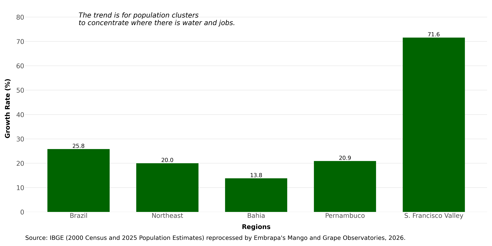
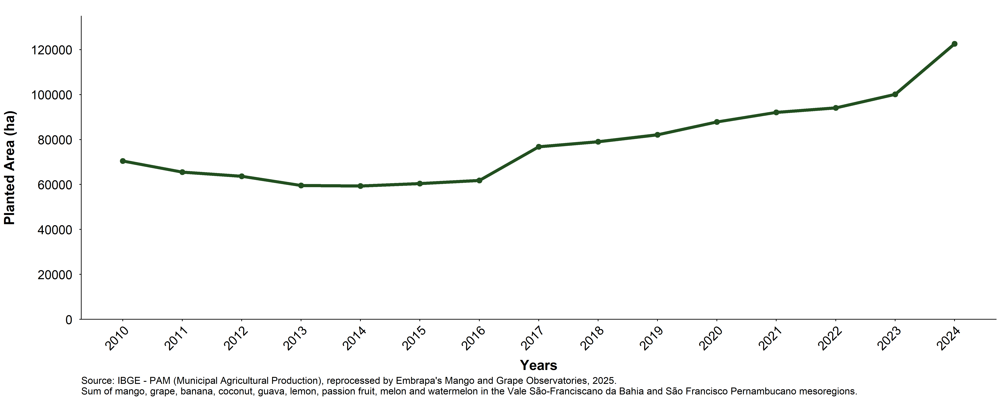
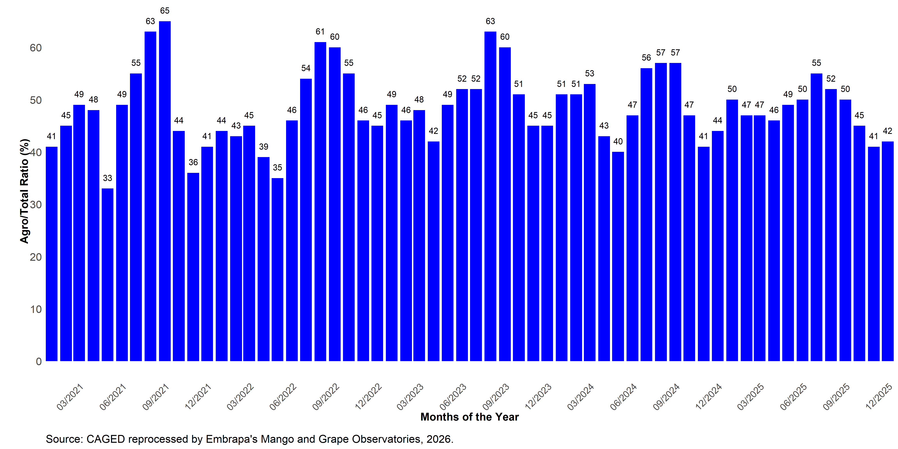
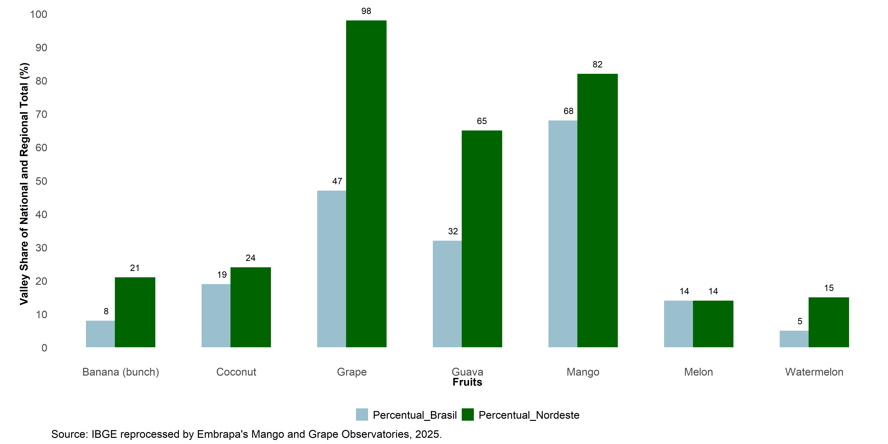
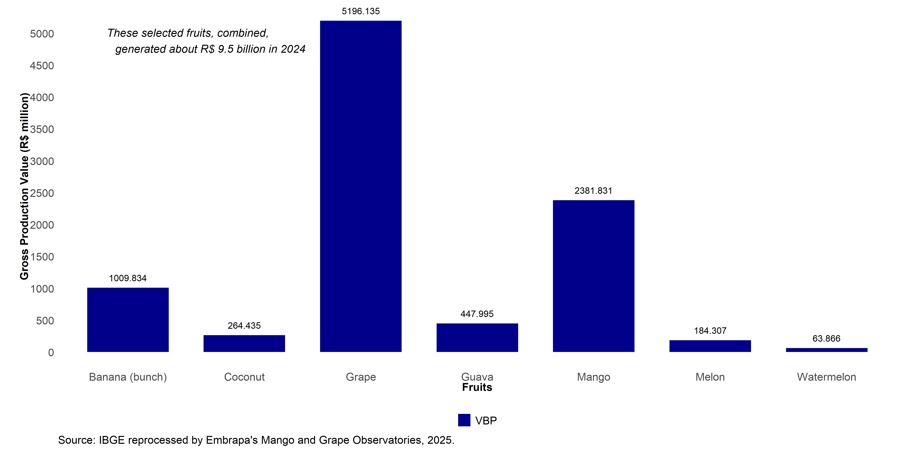
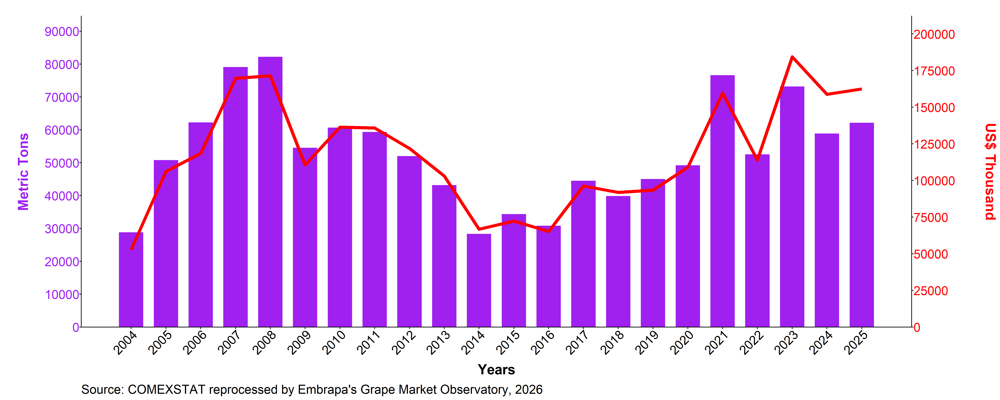
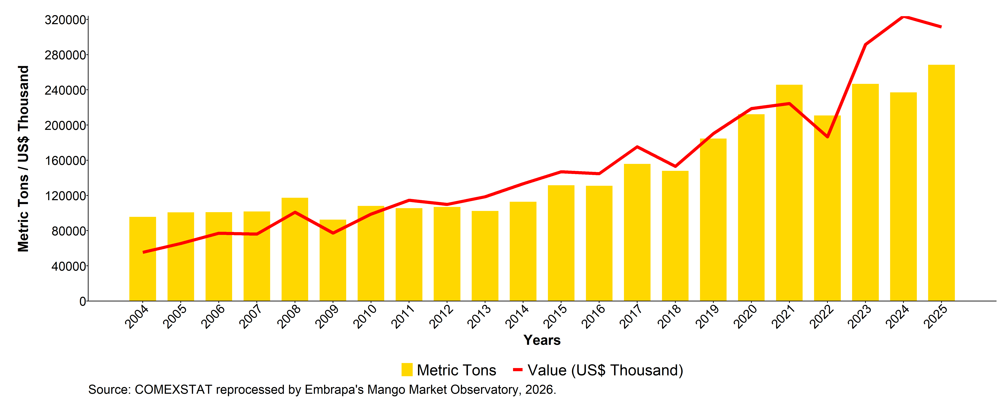
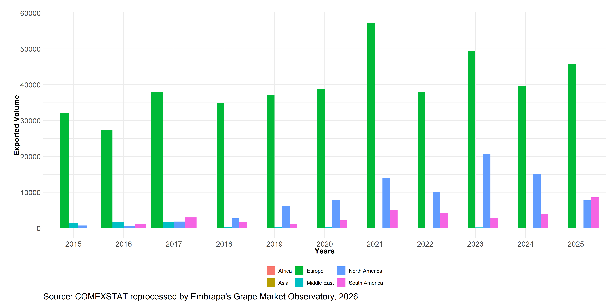
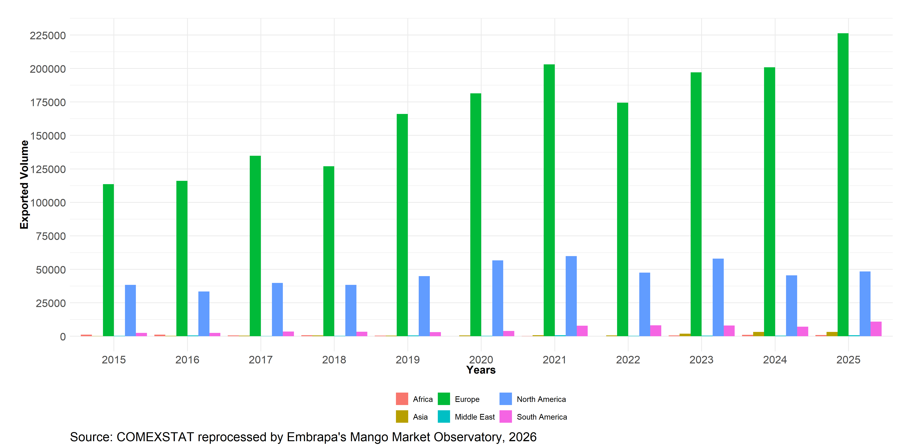

## João Ricardo Lima  {.center .aboutmeslide}

::: columns
::: {.column width="60%"}

-   Contact

    -   Instagram: [\@jotaerre.econ](https://www.instagram.com/jotaerre.econ/)

    -   Email: [joao.ricardo@embrapa.br](joao.ricardo@embrapa.br)

    -   LinkedIn: [Joao Ricardo Lima](https://www.linkedin.com/in/joao-ricardo-lima-7b6273240/)

-   About me

    -   PhD in Applied Economics (UFV-MG)

    -   Rural Economics Researcher at Embrapa Semiárido - Petrolina/PE

    -   Coordinator of Embrapa's Mango and Grape Market Observatories
:::

::: {.column width="40%"}
{width=90%}

:::
:::

::: {.cell}

:::

## THE DUALITY OF THE BRAZILIAN SEMI-ARID REGION.

::: columns
::: {.column width="50%"}

::: {.cell layout-align="center"}
::: {.cell-output-display}
{fig-align='center' width=83%}
:::
:::

Source: Irrigation Atlas, 2017.

:::
::: {.column width="50%"}

::: {.cell layout-align="center"}
::: {.cell-output-display}
{fig-align='center' width=90%}
:::
:::

Source: ANA, 2013.
:::
:::

## CLIMATE CHANGE

::: {.cell layout-align="center"}
::: {.cell-output-display}
{fig-align='center' width=100%}
:::
:::

## WEALTH PRODUCTION IN THE SEMI-ARID REGION

::: {.cell layout-align="center"}
::: {.cell-output-display}
{fig-align='center' width=100% height=800px}
:::
:::

## WEALTH PRODUCTION IN THE SEMI-ARID REGION

 
 

::: {.cell layout-align="center"}
::: {.cell-output-display}
{fig-align='center' width=100%}
:::
:::

- ### IRRIGATION WATER + MANY HOURS OF SUNLIGHT + TECHNOLOGY = FRUIT GROWING IN THE VALLEY

## WEALTH PRODUCTION IN THE SEMI-ARID REGION

::: {.cell layout-align="center"}
::: {.cell-output-display}
{fig-align='center' width=100%}
:::
:::

## WEALTH PRODUCTION IN THE SEMI-ARID REGION

::: columns
::: {.column width="50%"}

::: {.cell layout-align="center"}
::: {.cell-output-display}
{fig-align='center' width=80%}
:::
:::

:::
::: {.column width="50%"}

::: {.cell layout-align="center"}
::: {.cell-output-display}
{fig-align='center' width=80%}
:::
:::

:::
:::

## POPULATION GROWTH RATE: 2000 AND 2025 {.titulo-pequeno}

::: {.cell layout-align="center"}
::: {.cell-output-display}
{fig-align='center' width=100%}
:::
:::

## GROWTH OF FRUIT-PLANTED AREA IN THE VALLEY {.titulo-pequeno}

- #### Total planted area grew from ~70,500 ha (2010) to ~122,600 ha (2024). Mango alone accounted for ~40.7% of all net growth (21,201 ha of the total 52,104 ha expansion between 2010 and 2024).

::: {.cell layout-align="center"}
::: {.cell-output-display}
{fig-align='center' width=100%}
:::
:::

## JOB CREATION IN FRUIT GROWING

::: {.cell layout-align="center"}
::: {.cell-output-display}
{fig-align='center' width=100%}
:::
:::

## JOB CREATION IN FRUIT GROWING

::: {.cell layout-align="center"}
::: {.cell-output-display}
{fig-align='center' width=100%}
:::
:::

## SHARE OF THE VALLEY IN NATIONAL SUPPLY {.titulo-pequeno}

::: {.cell layout-align="center"}
::: {.cell-output-display}
{fig-align='center' width=100%}
:::
:::

## GROSS PRODUCTION VALUE OF FRUIT GROWING IN THE VALLEY {.titulo-pequeno}

::: {.cell layout-align="center"}
::: {.cell-output-display}
{fig-align='center' width=100%}
:::
:::

## THE COMPLEX FRUIT-GROWING PRODUCTION CHAIN {.titulo-pequeno}

::: {.cell layout-align="center"}
::: {.cell-output-display}
{fig-align='center' width=100%}
:::
:::

Source: LIMA et al., 2023.

## THE IMPORTANT ROLE OF THE EXTERNAL MARKET.

- 97.5% OF ALL GRAPES EXPORTED BY BRAZIL IN 2025 WERE PRODUCED IN THE SÃO FRANCISCO VALLEY.

::: {.cell layout-align="center"}
::: {.cell-output-display}
{fig-align='center' width=100%}
:::
:::

## THE IMPORTANT ROLE OF THE EXTERNAL MARKET.

- 92% OF ALL MANGOES EXPORTED BY BRAZIL IN 2025 WERE PRODUCED IN THE SÃO FRANCISCO VALLEY.

::: {.cell layout-align="center"}
::: {.cell-output-display}
{fig-align='center' width=100%}
:::
:::

## GRAPE EXPORT VOLUME BY DESTINATION

::: {.cell layout-align="center"}
::: {.cell-output-display}
{fig-align='center' width=100%}
:::
:::

## MANGO EXPORT VOLUME BY DESTINATION

::: {.cell layout-align="center"}
::: {.cell-output-display}
{fig-align='center' width=100%}
:::
:::

## PROFILE OF GRAPE PRODUCERS

::: {.cell layout-align="center"}
::: {.cell-output-display}
{fig-align='center' width=100%}
:::
:::

## PROFILE OF MANGO PRODUCERS

::: {.cell layout-align="center"}
::: {.cell-output-display}
{fig-align='center' width=100%}
:::
:::

## FRUITS OF THE SÃO FRANCISCO VALLEY

::: {.cell layout-align="center"}
::: {.cell-output-display}
{fig-align='center' width=100%}
:::
:::

## SUSTAINABILITY IN THE SÃO FRANCISCO VALLEY {.titulo-pequeno}

::: columns
::: {.column width="50%"}

::: {.cell layout-align="center"}
::: {.cell-output-display}
{fig-align='center' width=100%}
:::
:::

:::
::: {.column width="50%"}

- ### IT'S NO LONGER JUST FLAVOR, QUALITY AND PRICE THAT CONSUMERS ARE LOOKING FOR!

- ### THEY WANT TO EAT FOR A BETTER QUALITY OF LIFE WITH LESS IMPACT ON THE ENVIRONMENT!

Source: Hortifruti Brasil (03/19).
:::
:::

## CERTIFICATIONS REQUIRED FOR EXPORTING

::: {.cell layout-align="center"}
::: {.cell-output-display}
{fig-align='center' width=100%}
:::
:::

## CONSTANT REINVENTION

::: {.cell layout-align="center"}
::: {.cell-output-display}
{fig-align='center' width=100%}
:::
:::

## CONSTANT REINVENTION

::: {.cell layout-align="center"}
::: {.cell-output-display}
{fig-align='center' width=100%}
:::
:::

## CROP DIVERSIFICATION

::: {.cell layout-align="center"}
::: {.cell-output-display}
{fig-align='center' width=100%}
:::
:::

## {.center .thankslide}

  

  <h2 style="color: #282f6b; font-size: 2em; margin-bottom: 20px;">
    THANK YOU VERY MUCH!
  </h2>
   
  <!-- This part will have a smaller font size -->
  

    <a href="https://www.embrapa.br/observatorio-da-manga" target="_blank">
      https://www.embrapa.br/observatorio-da-manga
    </a>
     
    <a href="https://www.embrapa.br/observatorio-da-uva" target="_blank">
      https://www.embrapa.br/observatorio-da-uva
    </a>
     
📲 **WhatsApp:**  
+55 87 99961-5799
  

