## João Ricardo Lima 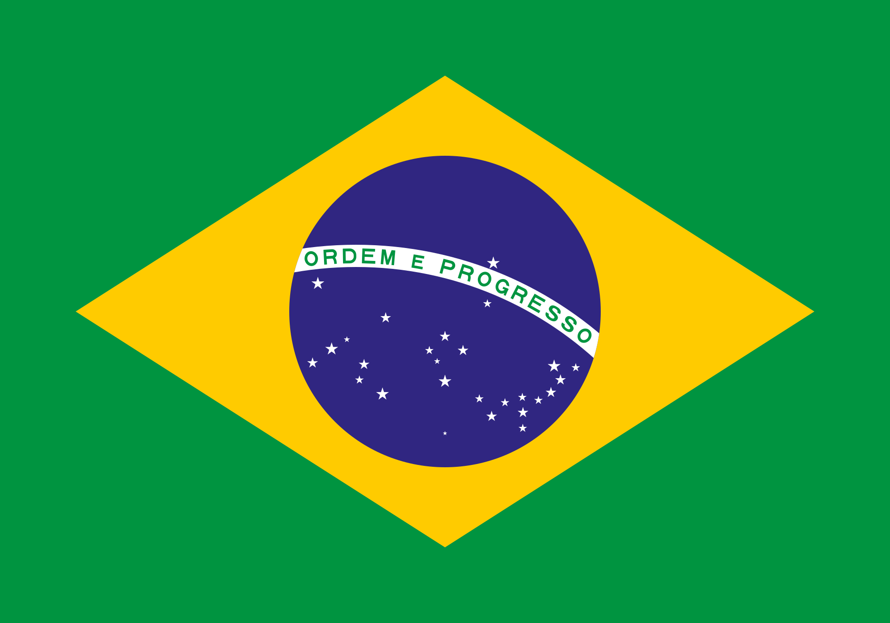 {.center .aboutmeslide}

::: columns
::: {.column width="60%"}

-   Contact

    -   Instagram: [\@jotaerre.econ](https://www.instagram.com/jotaerre.econ/)

    -   Email: [joao.ricardo@embrapa.br](joao.ricardo@embrapa.br)

    -   LinkedIn: [Joao Ricardo Lima](https://www.linkedin.com/in/joao-ricardo-lima-7b6273240/)


-   About me

    -   PhD in Applied Economics (UFV-MG)

    -   Rural Economics Researcher at Embrapa Semiárido - Petrolina/PE

    -   Coordinator of Embrapa's Mango and Grape Market Observatories
:::

::: {.column width="40%"}
{width=90%}

:::
:::

```{r}
#| label: slide1

# Slide/lecture dependencies
library(knitr)          # CRAN v1.33
library(rmarkdown)      # CRAN v2.10
library(xaringan)       # CRAN v0.22
library(xaringanthemer) # CRAN v0.3.0
library(xaringanExtra)  # [github::gadenbuie/xaringanExtra] v0.5.5
library(RefManageR)     # CRAN v1.3.0
library(ggplot2)        # CRAN v3.3.5
library(fontawesome)    # [github::rstudio/fontawesome] v0.1.0
library(pagedown)
library(dplyr)
library(ggimage)
library(ggtext)
library(glue)
library(reshape2)
library(scales)
library(reticulate)

# Uses the system Python (already has pandas/plotnine installed) instead of
# reticulate's default managed environment (which comes without packages)
reticulate::use_python("C:/Users/Lenovo/AppData/Local/Programs/Python/Python314/python.exe", required = TRUE)

# Chunk options (echo/warning/message/fig-width/fig-height/fig-align apply to
# all slides; each individual chunk only needs #| label)
# dev.args with bg="transparent" makes PNGs come out without a white
# background, to match the lavender-gray background (#E9EAF0) of the slide theme.
options(htmltools.dir.version = FALSE)
knitr::opts_chunk$set(
  echo       = FALSE,
  warning    = FALSE,
  message    = FALSE,
  fig.retina = 3,
  fig.width  = 16,
  fig.height = 8,
  out.width  = "100%",
  fig.align  = "center",
  comment    = "#",
  dev.args   = list(bg = "transparent")
  )

# Theme to remove the white background from ggplot charts (the dev.args above
# handles the PNG device, but ggplot still paints its own background on top)
tema_transparente <- theme(
  plot.background   = element_rect(fill = "transparent", colour = NA),
  panel.background  = element_rect(fill = "transparent", colour = NA),
  legend.background = element_rect(fill = "transparent", colour = NA),
  legend.key        = element_rect(fill = "transparent", colour = NA)
  )

# Chart colors
colors <- c(
  blue       = "#282f6b",
  red        = "#b22200",
  yellow     = "#eace3f",
  green      = "#224f20",
  purple     = "#5f487c",
  orange     = "#b35c1e",
  turquoise  = "#419391",
  green_two  = "#839c56",
  light_blue = "#3b89bc",
  gray       = "#666666"
  )
```


## THE DUALITY OF THE BRAZILIAN SEMI-ARID REGION.

::: columns
::: {.column width="50%"}

```{r}
#| label: slide2
#| out.width: "83%"

knitr::include_graphics("imgs/chtt1.png")
```
Source: Irrigation Atlas, 2017.

:::
::: {.column width="50%"}


```{r}
#| label: slide3
#| out.width: "90%"

knitr::include_graphics("imgs/chtt2.png")
```
Source: ANA, 2013.
:::
:::

## CLIMATE CHANGE

```{r}
#| label: slide4

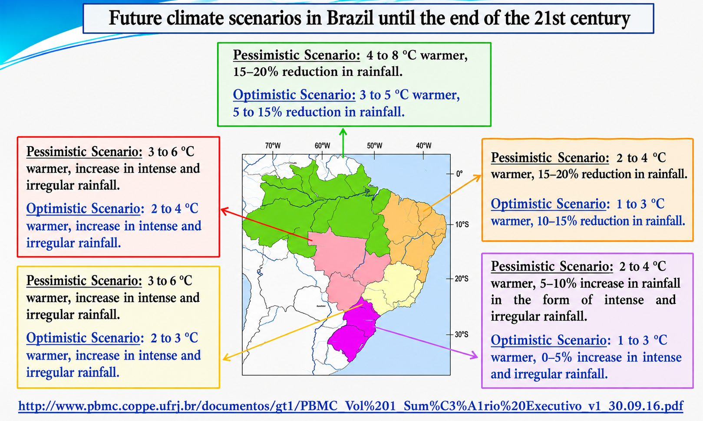
```

## WEALTH PRODUCTION IN THE SEMI-ARID REGION

```{r}
#| label: slide5
#| out.height: "800px"

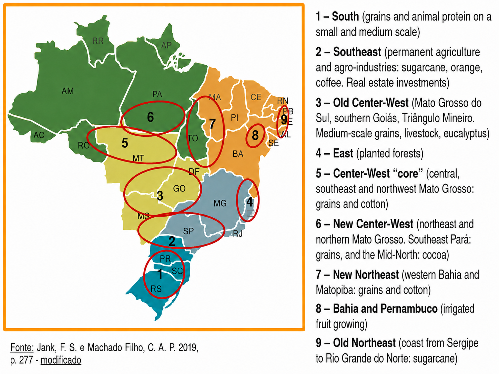
```

## WEALTH PRODUCTION IN THE SEMI-ARID REGION

<br>
<br>

```{r}
#| label: slide6

knitr::include_graphics("imgs/seacon5.png")
```


- ### IRRIGATION WATER + MANY HOURS OF SUNLIGHT + TECHNOLOGY = FRUIT GROWING IN THE VALLEY

## WEALTH PRODUCTION IN THE SEMI-ARID REGION

```{r}
#| label: slide7

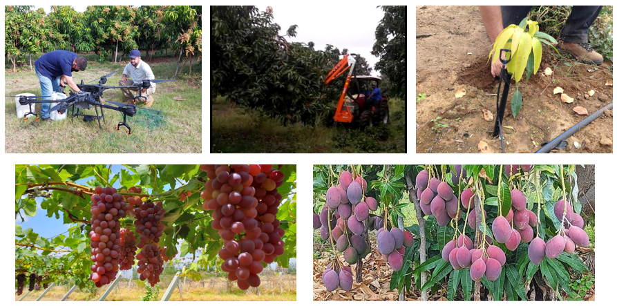
```


## WEALTH PRODUCTION IN THE SEMI-ARID REGION

::: columns
::: {.column width="50%"}

```{r}
#| label: slide8
#| out.width: "80%"

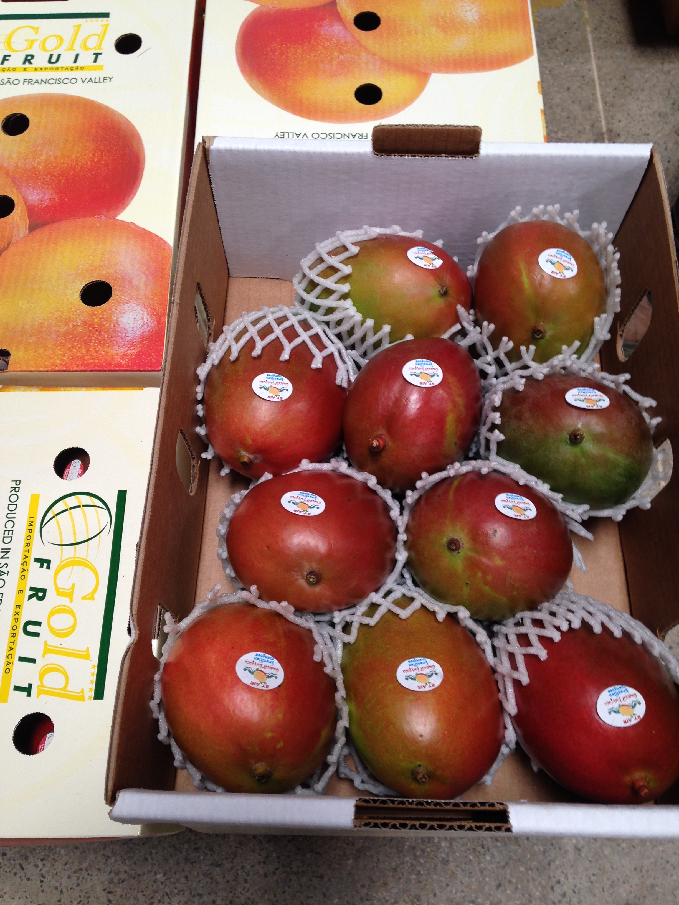
```

:::
::: {.column width="50%"}

```{r}
#| label: slide9
#| out.width: "80%"

knitr::include_graphics("imgs/seacon2.jpg")
```

:::
:::

## POPULATION GROWTH RATE: 2000 AND 2025 {.titulo-pequeno}

```{python}
#| label: slide10

import matplotlib
matplotlib.rcParams['savefig.transparent'] = True  # remove the white background from the PNG

import pandas as pd
from plotnine import *

# Raw data: IBGE 2000 Census and IBGE 2025 Population Estimates
dados_ = pd.read_csv('dados/populacao_2000_2025.csv', sep=';')

# São Francisco Valley = sum of Petrolina (PE) + Juazeiro (BA)
vale = dados_[dados_['local'].isin(['Petrolina', 'Juazeiro'])][['populacao_2000', 'populacao_2025']].sum()
vale_row = pd.DataFrame({
    'local': ['S. Francisco Valley'],
    'populacao_2000': [vale['populacao_2000']],
    'populacao_2025': [vale['populacao_2025']],
})

dados_1 = pd.concat([
    dados_[dados_['local'].isin(['Brasil', 'Nordeste', 'Bahia', 'Pernambuco'])][['local', 'populacao_2000', 'populacao_2025']],
    vale_row
], ignore_index=True)

# Translate region names for display
dados_1['local'] = dados_1['local'].replace({
    'Brasil': 'Brazil',
    'Nordeste': 'Northeast',
})

# Population growth rate between 2000 and 2025
dados_1['taxa'] = ((dados_1['populacao_2025'] - dados_1['populacao_2000']) / dados_1['populacao_2000'] * 100).round(1)
dados_1['rotulo'] = dados_1['taxa'].map(lambda v: f"{v:.1f}")

ordem = ["Brazil", "Northeast", "Bahia", "Pernambuco", "S. Francisco Valley"]
dados_1['local'] = pd.Categorical(dados_1['local'], categories=ordem, ordered=True)

g2a = (
    ggplot(dados_1, aes(x='local', y='taxa'))
    + geom_col(fill="darkgreen", width=0.7)
    + geom_text(aes(label='rotulo'), va='bottom', size=13)
    + labs(y="Growth Rate (%)", x="Regions",
           caption="Source: IBGE (2000 Census and 2025 Population Estimates) reprocessed by Embrapa's Mango and Grape Observatories, 2026.")
    + scale_y_continuous(breaks=list(range(0, 90, 10)), limits=(0, 85), expand=(0, 0))
    + annotate("text", x=1, y=82, label="The trend is for population clusters\nto concentrate where there is water and jobs.",
               size=16, fontstyle='italic', ha='left', va='top')
    + theme_minimal()
    + theme(
        axis_text_x=element_text(size=15),
        axis_text_y=element_text(size=15),
        axis_title_x=element_text(size=15, weight='bold'),
        axis_title_y=element_text(size=15, weight='bold'),
        plot_caption=element_text(ha='left', size=14),
        panel_grid_major_x=element_blank(),
        panel_grid_minor=element_blank(),
        figure_size=(16, 8)
    )
)

g2a.show()
```

## GROWTH OF FRUIT-PLANTED AREA IN THE VALLEY {.titulo-pequeno}

- #### Total planted area grew from ~70,500 ha (2010) to ~122,600 ha (2024). Mango alone accounted for ~40.7% of all net growth (21,201 ha of the total 52,104 ha expansion between 2010 and 2024).

```{r}
#| label: slide10b
#| fig-width: 20
#| fig-height: 8

# Planted area (ha) of mango, grape, banana, coconut, guava, lemon, passion
# fruit, melon and watermelon, summed across the 42 municipalities of the
# Vale Sao-Franciscano da Bahia + Sao Francisco Pernambucano mesoregions (IBGE/PAM)
dados_area <- read.csv2('dados/area_plantada_vsf_detalhe.csv', header = T, sep = ";", dec = ".")

dados_area_tot <- dados_area |>
  group_by(Ano) |>
  summarise(AreaPlantada_ha = sum(AreaPlantada_ha), .groups = "drop")

g7 <- ggplot(dados_area_tot, aes(x = Ano, y = AreaPlantada_ha)) +
  geom_line(color = colors[["green"]], linewidth = 2.2) +
  geom_point(color = colors[["green"]], size = 3.5) +
  scale_y_continuous(name = "Planted Area (ha)", n.breaks = 8,
                      limits = c(0, max(dados_area_tot$AreaPlantada_ha) * 1.1),
                      expand = expansion(add = c(0, 0))) +
  scale_x_continuous(breaks = seq(2010, 2024, by = 1)) +
  labs(x = "Years", title = '',
       caption = "Source: IBGE - PAM (Municipal Agricultural Production), reprocessed by Embrapa's Mango and Grape Observatories, 2025.\nSum of mango, grape, banana, coconut, guava, lemon, passion fruit, melon and watermelon in the Vale São-Franciscano da Bahia and São Francisco Pernambucano mesoregions.") +
  theme_classic() +
  theme(axis.text.x = element_text(angle = 45, hjust = 1, size = 18, margin = margin(t = 5)),
        axis.text.y = element_text(size = 18, margin = margin(r = 10)),
        axis.title.x = element_text(size = 20, face = "bold", margin = margin(t = 10)),
        axis.title.y = element_text(size = 20, face = "bold", margin = margin(r = 20)),
        plot.caption = element_text(hjust = 0, size = 14))
g7 + tema_transparente
```

## JOB CREATION IN FRUIT GROWING

```{r}
#| label: slide11

knitr::include_graphics("imgs/seacon8.png")
```

## JOB CREATION IN FRUIT GROWING

```{r}
#| label: slide12

dados1 <- read.csv2('dados/dezembro_2025.csv', header=T, sep=";", dec = ".")
dados1$date <- seq(as.Date('2021-01-01'),to=as.Date('2025-12-01'),by='1 month')

dados1a <- dados1 |>
  dplyr::select(
    "date"     = `date`,
    "variable" = `Variavel`,
    "value"    = `Proporcao`
  ) |>
  dplyr::as_tibble()

g1 <- ggplot(data=dados1a) +
  geom_col(aes(x=date, y=value, fill="variable"))+
  scale_fill_manual(values="blue") +#changes bar color
  labs(y= "Agro/Total Ratio (%)", x= "Months of the Year",
       caption = "Source: CAGED reprocessed by Embrapa's Mango and Grape Observatories, 2026.")+
  scale_y_continuous(n.breaks = 10)+
  scale_x_date(date_breaks = "3 month",
              labels = date_format("%m/%Y"),
              expand = expansion(add=c(0,0)))+
  geom_text(data=dados1a, aes(y=value, x=date, label=value),
            hjust=0.5, vjust=-1.2)+
  theme_minimal() + #Setting theme
   theme(axis.text.x = element_text(angle=45, margin = margin(b=10),
                                    size=12,
                                    hjust=1),
        axis.text.y = element_text(margin = margin(b=10), size=14),
        axis.title.x = element_text(size=14, face = "bold", margin = margin(b=10)),
        axis.title.y = element_text(size=14, face = "bold", margin = margin(l=20)),
        panel.grid.major = element_blank(),
        panel.grid.minor = element_blank(), # removing grid lines
        plot.caption = element_text(hjust = 0, size=14), #caption styling
        legend.title = element_blank(),
        legend.text=element_text(size=14),
        legend.position = "none") # Setting legend position

g1 + tema_transparente
```

## SHARE OF THE VALLEY IN NATIONAL SUPPLY {.titulo-pequeno}

```{r}
#| label: slide13

dados2 <- read.csv2('dados/volume.csv', header=T, sep=";", dec = ".")

# Translate fruit names for display
dados2$Fruta <- dplyr::recode(dados2$Fruta,
  "Banana (cacho)" = "Banana (bunch)",
  "Côco"           = "Coconut",
  "Goiaba"         = "Guava",
  "Manga"          = "Mango",
  "Melancia"       = "Watermelon",
  "Melão"          = "Melon",
  "Uva"            = "Grape")

dados2a <- melt(dados2, id.var='Fruta')

mycolors <- c("lightblue3", "darkgreen")

g2 <- ggplot() +
  geom_col(data=dados2a, aes(x=Fruta, y=value, fill=variable), size=2, width = 0.7, position = position_dodge(width = .5, preserve = "total"))+
  scale_fill_manual(values=mycolors) +
  scale_y_continuous(n.breaks = 10)+
  labs(y= "Valley Share of National and Regional Total (%)", x= "Fruits",
       caption = "Source: IBGE reprocessed by Embrapa's Mango and Grape Observatories, 2025.")+
  geom_text(data=dados2a, aes(y=value, x=Fruta, group=variable, label=value),
    position = position_dodge(width = .5, preserve = "total"),
    size=4,
    hjust=0.5,
    vjust=-1.0)+
  theme_minimal() + #Setting theme
  theme(axis.text.x = element_text(margin = margin(b=10), size=14),
        axis.text.y = element_text(margin = margin(b=10), size=14),
        axis.title.x = element_text(size=14, face = "bold", margin = margin(b=10)),
        axis.title.y = element_text(size=14, face = "bold", margin = margin(l=20)),
        panel.grid.major = element_blank(),
        panel.grid.minor = element_blank(), # removing grid lines
        plot.caption = element_text(hjust = 0, size=14), #caption styling
        legend.title = element_blank(),
        legend.text=element_text(size=14),
        legend.position = "bottom") # Setting legend position
g2 + tema_transparente
```

## GROSS PRODUCTION VALUE OF FRUIT GROWING IN THE VALLEY {.titulo-pequeno}

```{r}
#| label: slide14

dados21 <- read.csv2('dados/vbp.csv', header=T, sep=";", dec = ".")

# Translate fruit names for display
dados21$Fruta <- dplyr::recode(dados21$Fruta,
  "Banana (cacho)" = "Banana (bunch)",
  "Coco"           = "Coconut",
  "Goiaba"         = "Guava",
  "Manga"          = "Mango",
  "Melancia"       = "Watermelon",
  "Melao"          = "Melon",
  "Uva"            = "Grape")

dados21a <- melt(dados21, id.var='Fruta')

mycolors <- "darkblue"

g2a <- ggplot() +
  geom_col(data=dados21a, aes(x=Fruta, y=value, fill=variable), size=2, width = 0.7, position = position_dodge(width = .5, preserve = "total"))+
  scale_fill_manual(values=mycolors) +
  scale_y_continuous(n.breaks = 10)+
  labs(y= "Gross Production Value (R$ million)", x= "Fruits",
       caption = "Source: IBGE reprocessed by Embrapa's Mango and Grape Observatories, 2025.")+
  geom_text(data=dados21a, aes(y=value, x=Fruta, group=variable, label=value),
    position = position_dodge(width = .5, preserve = "total"),
    size=4,
    hjust=0.5,
    vjust=-1.0)+
  theme_minimal() + #Setting theme
  theme(axis.text.x = element_text(margin = margin(b=10), size=14),
        axis.text.y = element_text(margin = margin(b=10), size=14),
        axis.title.x = element_text(size=14, face = "bold", margin = margin(b=10)),
        axis.title.y = element_text(size=14, face = "bold", margin = margin(l=20)),
        panel.grid.major = element_blank(),
        panel.grid.minor = element_blank(), # removing grid lines
        plot.caption = element_text(hjust = 0, size=14), #caption styling
        legend.title = element_blank(),
        legend.text=element_text(size=14),
        legend.position = "bottom") +  # Define legend position
  # Add annotation box with the desired text
  annotate("text", x = -Inf, y = Inf, label = "These selected fruits, combined,\ngenerated about R$ 9.5 billion in 2024",
           hjust = -0.3, vjust = 2, size = 5, color = "black", fontface = "italic",
           box.colour = "black", fill = "white") # Text properties and box style
g2a + tema_transparente
```


## THE COMPLEX FRUIT-GROWING PRODUCTION CHAIN {.titulo-pequeno}

```{r}
#| label: slide15

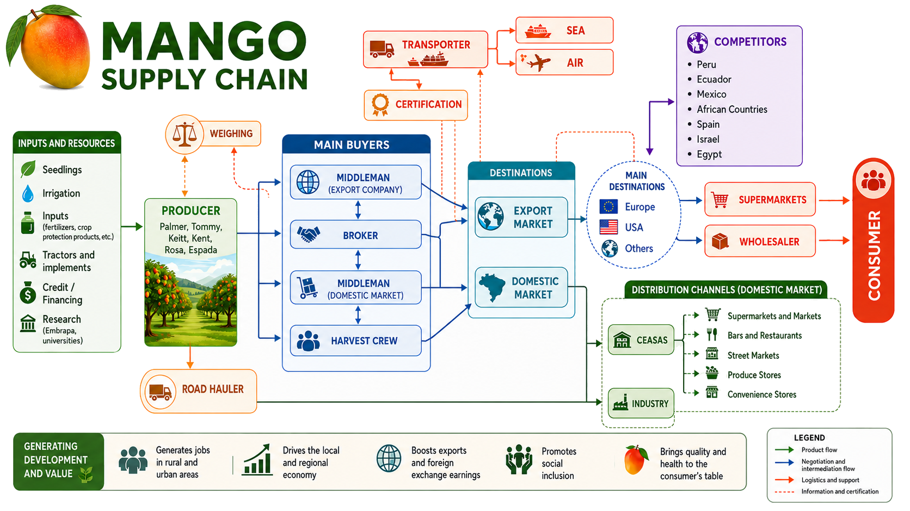
```
Source: LIMA et al., 2023.


## THE IMPORTANT ROLE OF THE EXTERNAL MARKET.

- 97.5% OF ALL GRAPES EXPORTED BY BRAZIL IN 2025 WERE PRODUCED IN THE SÃO FRANCISCO VALLEY.

```{r}
#| label: slide16
#| fig-width: 20
#| fig-height: 8

dados3 <- read.csv2('dados/uva_exportacoes_2004_2025.csv', header=T, sep=";", dec = ".")
dados3 <- dados3/1000
dados3[,1] <- seq(2004, 2025, by = 1)
colnames(dados3) = c('Ano', 'Valor', "Toneladas")
dados3 <- dplyr::tibble(dados3)

# factor to plot "Valor" (US$ Thousand) on the same visual scale as
# "Toneladas", so both fit on the same chart with independent Y axes
fator_escala <- max(dados3$Toneladas) / max(dados3$Valor)

g3 <- ggplot(dados3, aes(x = Ano)) +
  geom_col(aes(y = Toneladas), fill = "purple", width = 0.7) +
  geom_line(aes(y = Valor * fator_escala), color = "red", linewidth = 2.2) +
  scale_y_continuous(
    name = "Metric Tons",
    limits = c(0, max(dados3$Toneladas) * 1.15),
    expand = expansion(add = c(0, 0)),
    n.breaks = 10,
    sec.axis = sec_axis(~ . / fator_escala, name = "US$ Thousand")
  ) +
  scale_x_continuous(breaks = seq(2004, 2025, by = 1)) +
  labs(x = "Years", title = '',
       caption = "Source: COMEXSTAT reprocessed by Embrapa's Grape Market Observatory, 2026") +
  theme_classic() + #Setting theme
  theme(axis.text.x = element_text(angle = 45, hjust = 1, size = 18, margin = margin(b = 10)),
        axis.text.y = element_text(hjust = 1, size = 18, margin = margin(l = 20), color = "purple"),
        axis.text.y.right = element_text(hjust = 0, size = 18, margin = margin(r = 20), color = "red"),
        axis.title.x = element_text(size = 20, face = "bold", margin = margin(b = 5)),
        axis.title.y = element_text(size = 20, face = "bold", margin = margin(l = 20), color = "purple"),
        axis.title.y.right = element_text(size = 20, face = "bold", margin = margin(l = 20), color = "red"),
        plot.caption = element_text(hjust = 0, size = 18),
        legend.position = "none") # Setting legend position
g3 + tema_transparente
```

## THE IMPORTANT ROLE OF THE EXTERNAL MARKET.

- 92% OF ALL MANGOES EXPORTED BY BRAZIL IN 2025 WERE PRODUCED IN THE SÃO FRANCISCO VALLEY.

```{r}
#| label: slide18
#| fig-width: 20
#| fig-height: 8

dados4 <- read.csv2('dados/manga_exportacoes_2004_2025.csv', header=T, sep=";", dec = ".")
dados4[,1] <- seq(2004, 2025, by = 1)
colnames(dados4) = c('Ano', 'Valor', "Toneladas")
dados4 <- dplyr::tibble(dados4)

# Metric tons and value (US$ thousand) fall within similar ranges (tens/
# hundreds of thousands), so they fit on a single Y axis without needing a
# secondary axis
dados4a <- dados4 |> dplyr::mutate(Toneladas = Toneladas/1000, Valor = Valor/1000)

g5 <- ggplot(dados4a, aes(x = Ano)) +
  geom_col(aes(y = Toneladas, fill = "Metric Tons"), width = 0.7) +
  geom_line(aes(y = Valor, color = "Value (US$ Thousand)"), linewidth = 2.2) +
  scale_fill_manual(name = NULL, values = c("Metric Tons" = "gold")) +
  scale_color_manual(name = NULL, values = c("Value (US$ Thousand)" = "red")) +
  scale_y_continuous(name = "Metric Tons / US$ Thousand", n.breaks = 10, expand = expansion(add = c(0, 0.5))) +
  scale_x_continuous(breaks = seq(2004, 2025, by = 1)) +
  labs(x = "Years", title = '',
       caption = "Source: COMEXSTAT reprocessed by Embrapa's Mango Market Observatory, 2026.") +
  theme_classic() + #Setting theme
  theme(axis.text.x = element_text(angle = 45, hjust = 1, size = 18, margin = margin(b = 5)),
        axis.text.y = element_text(hjust = 1, size = 18, margin = margin(l = 20)),
        axis.title.x = element_text(size = 20, face = "bold", margin = margin(b = 5)),
        axis.title.y = element_text(size = 20, face = "bold", margin = margin(l = 20)),
        plot.caption = element_text(hjust = 0, size = 18),
        legend.position = "bottom", legend.title = element_blank(),
        legend.text = element_text(size = 22)) # Setting legend position
g5 + tema_transparente
```

## GRAPE EXPORT VOLUME BY DESTINATION

```{r}
#| label: slide20

dados_exporta <- read.csv2('dados/destinos_exporta_uva.csv', header=T, sep=";", stringsAsFactors = FALSE)

# Translate destination bloc names for display
dados_exporta$bloco <- dplyr::recode(dados_exporta$bloco,
  "Africa"           = "Africa",
  "America do Norte" = "North America",
  "America do Sul"   = "South America",
  "Asia"             = "Asia",
  "Europa"           = "Europe",
  "Oriente Medio"    = "Middle East")

# Step 2: Convert 'Date' column to Date format and reorder data
dados_exporta$Ano <- as.Date(paste0(dados_exporta$Ano, "-01-01"), format = "%Y-%m-%d")

# Filter data for the years 2015 to 2025
dados_exporta <- dados_exporta |>
  filter(format(Ano, "%Y") >= 2015 & format(Ano, "%Y") <= 2025) |>
  arrange(Ano) # Arrange in descending order (from 2015 to 2025)

# Step 3: Create the bar graph
ggplot(dados_exporta, aes(x = format(Ano, "%Y"), y = quilo/1000, fill = bloco)) +
  geom_bar(stat = "identity", position = "dodge") +
  labs(x = "Years", y = "Exported Volume",
       title = "",
       fill = "Destination",
       caption = "Source: COMEXSTAT reprocessed by Embrapa's Grape Market Observatory, 2026.") +
  scale_y_continuous(n.breaks = 10)+
  theme_minimal()+ #Setting theme
  theme(axis.text.x=element_text(angle=0, hjust=0.5, size=14, margin = margin(b=5)),
        axis.text.y=element_text(hjust=1, size=14, margin = margin(l=20)),
        axis.title.x = element_text(size=14, face = "bold", margin = margin(b=5)),
        axis.title.y = element_text(size=14, face = "bold", margin = margin(l=20)),
        plot.caption = element_text(hjust = 0, size=16),
        legend.position = "bottom", legend.title = element_blank(),
        legend.text=element_text(size=10)) + # Setting legend position
  tema_transparente
```

## MANGO EXPORT VOLUME BY DESTINATION

```{r}
#| label: slide21

dados_exporta <- read.csv2('dados/destinos_exporta.csv', header=T, sep=";", stringsAsFactors = FALSE)

# Translate destination bloc names for display
dados_exporta$bloco <- dplyr::recode(dados_exporta$bloco,
  "Africa"           = "Africa",
  "America do Norte" = "North America",
  "America do Sul"   = "South America",
  "Asia"             = "Asia",
  "Europa"           = "Europe",
  "Oriente Medio"    = "Middle East")

# Step 2: Convert 'Date' column to Date format and reorder data
dados_exporta$Ano <- as.Date(paste0(dados_exporta$Ano, "-01-01"), format = "%Y-%m-%d")

# Filter data for the years 2015 to 2025
dados_exporta <- dados_exporta |>
  filter(format(Ano, "%Y") >= 2015 & format(Ano, "%Y") <= 2025) |>
  arrange(Ano) # Arrange in descending order (from 2015 to 2025)

# Step 3: Create the bar graph
ggplot(dados_exporta, aes(x = format(Ano, "%Y"), y = quilo/1000, fill = bloco)) +
  geom_bar(stat = "identity", position = "dodge") +
  labs(x = "Years", y = "Exported Volume",
       title = "",
       fill = "Destination",
       caption = "Source: COMEXSTAT reprocessed by Embrapa's Mango Market Observatory, 2026") +
  scale_y_continuous(n.breaks = 10)+
  theme_minimal()+ #Setting theme
  theme(axis.text.x=element_text(angle=0, hjust=0.5, size=14, margin = margin(b=5)),
        axis.text.y=element_text(hjust=1, size=14, margin = margin(l=20)),
        axis.title.x = element_text(size=14, face = "bold", margin = margin(b=5)),
        axis.title.y = element_text(size=14, face = "bold", margin = margin(l=20)),
        plot.caption = element_text(hjust = 0, size=16),
        legend.position = "bottom", legend.title = element_blank(),
        legend.text=element_text(size=10)) + # Setting legend position
  tema_transparente
```

## PROFILE OF GRAPE PRODUCERS

```{r}
#| label: slide22

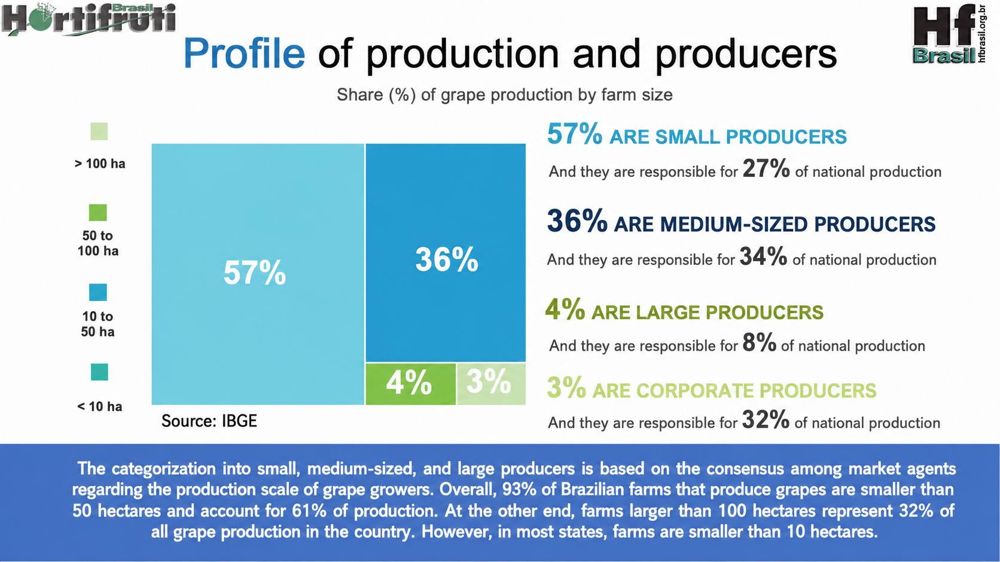
```

## PROFILE OF MANGO PRODUCERS

```{r}
#| label: slide23

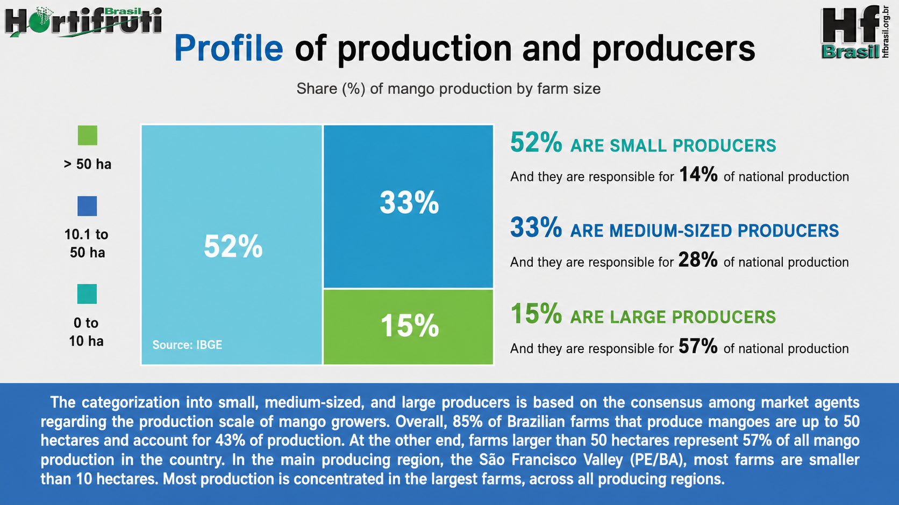
```

## FRUITS OF THE SÃO FRANCISCO VALLEY

```{r}
#| label: slide24

knitr::include_graphics("imgs/chtt5.png")
```


## SUSTAINABILITY IN THE SÃO FRANCISCO VALLEY {.titulo-pequeno}

::: columns
::: {.column width="50%"}

```{r}
#| label: slide25

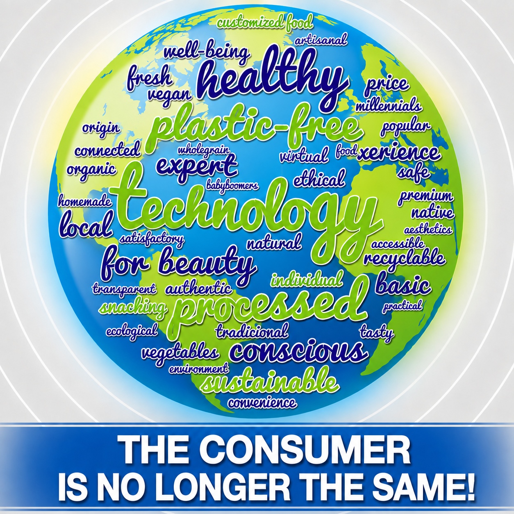
```

:::
::: {.column width="50%"}

- ### IT'S NO LONGER JUST FLAVOR, QUALITY AND PRICE THAT CONSUMERS ARE LOOKING FOR!

- ### THEY WANT TO EAT FOR A BETTER QUALITY OF LIFE WITH LESS IMPACT ON THE ENVIRONMENT!

Source: Hortifruti Brasil (03/19).
:::
:::

## CERTIFICATIONS REQUIRED FOR EXPORTING

```{r}
#| label: slide26

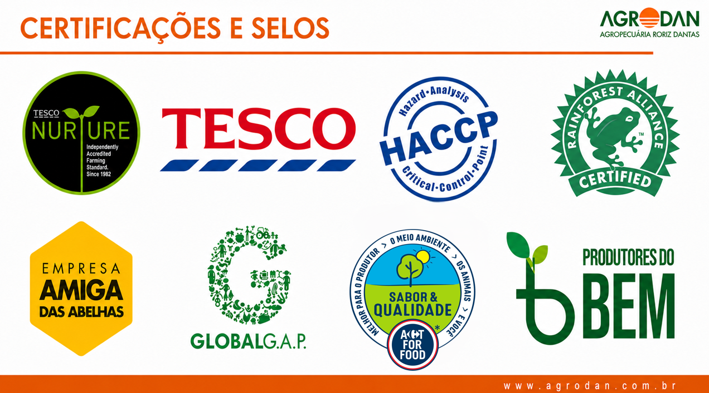
```

## CONSTANT REINVENTION

```{r}
#| label: slide27

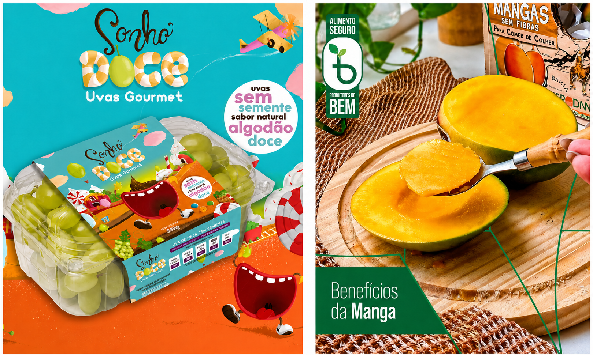
```

## CONSTANT REINVENTION

```{r}
#| label: slide28

knitr::include_graphics("imgs/seacon13.png")
```


## CROP DIVERSIFICATION

```{r}
#| label: slide29

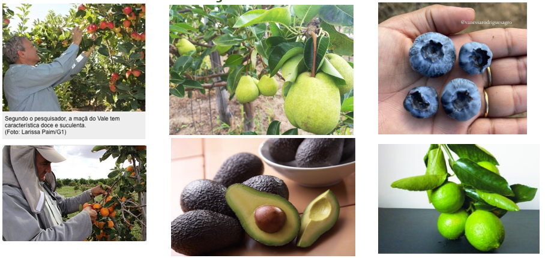
```

## {.center .thankslide}

<div style="text-align: center;">
  
</div>


<div style="text-align: center;">
  <h2 style="color: #282f6b; font-size: 2em; margin-bottom: 20px;">
    THANK YOU VERY MUCH!
  </h2>
  <br>
  <!-- This part will have a smaller font size -->
  <p style="font-size: 0.8em; color: #333;">
    <a href="https://www.embrapa.br/observatorio-da-manga" target="_blank">
      https://www.embrapa.br/observatorio-da-manga
    </a>
    <br>
    <a href="https://www.embrapa.br/observatorio-da-uva" target="_blank">
      https://www.embrapa.br/observatorio-da-uva
    </a>
    <br>
📲 **WhatsApp:** <br>
+55 87 99961-5799
  </p>
</div>

