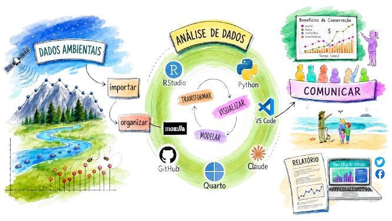

# MINHA REALIDADE

## O PONTO DE PARTIDA {.titulo-pequeno}

::: columns
::: {.column width="50%"}

<br>

- Trabalho com **Ciências Sociais Aplicadas** — mercados, preços, emprego, comércio exterior, clima — e isso tem implicações para o tipo de dado que uso;

- Utilizo, por enquanto, exclusivamente **dados secundários**: não há experimentos de campo, ensaios ou coletas primárias;

- Os dados são **públicos** — mas *público* não significa *pronto para usar*;

- Sem dados sigilosos: a preocupação com segurança é menor do que em outras áreas;

:::
::: {.column width="50%"}

<br>

- O trabalho começa **depois** que o dado é publicado;

- Há um enorme esforço de organização, tratamento e integração antes de qualquer análise;

- Cada Observatório de Mercado (uva, manga, etc.) tem seu próprio fluxo de dados.

:::
:::

# DE ONDE VÊM OS DADOS

## AS FONTES {.titulo-pequeno}

::: columns
::: {.column width="50%"}

<br>

**Portais e sites institucionais**

- IBGE (PAM, SIDRA, CEMPRE)
- CEPEA/ESALQ
- MAPA, COMEXSTAT
- FAO, COMTRADE
- Banco Central do Brasil (SGS)
- NASA POWER (dados climáticos)
- IPEADATA

:::
::: {.column width="50%"}

<br>

**O problema real**

- Dados **dispersos** em diferentes portais
- Formatos **diferentes**: CSV, XLS, JSON, HTML
- Frequências **diferentes**: semanal, mensal, anual
- Chegam em **ritmos diferentes** — alguns por email toda semana, outros uma vez por ano

:::
:::

## FONTES VIA EMAIL E APIs {.titulo-pequeno}

::: columns
::: {.column width="50%"}

<br>

**Boletins e cotações por e-mail**

- Boletins semanais de preços chegam diretamente na caixa de entrada
- Exemplo: CEPEA manga, CEPEA uva, a empresa Forever disponibiliza dados de conteineres exportados de mangas por semana para a União Europeia e Reino Unido.
- Precisam ser extraídos, padronizados e incorporados à base existente

:::
::: {.column width="50%"}

<br>

**APIs**

- Banco Central do Brasil (SGS)
- IBGE/SIDRA
- NASA POWER
- IPEADATA
- Permitem acesso direto e atualização automatizada

:::
:::

# ORGANIZAÇÃO E ARMAZENAMENTO

## ESTRUTURA DE ARQUIVOS {.titulo-pequeno}

::: columns
::: {.column width="50%"}

<br>

- Toda base de dados começa com uma **decisão de estrutura**: como organizar pastas, como nomear arquivos, como versionar

- Uma boa estrutura de pastas economiza horas de busca no futuro

- Convenção de nomes: consistente, sem espaços, com datas quando necessário

:::
::: {.column width="50%"}

<br>

**Exemplo de organização**

```
tempecon/
├── dados_uva/
│   ├── 2024/
│   ├── 2025/
│   └── exportacoes_2011_2025.csv
├── dados_manga/
│   ├── 2025/
│   └── precos_manga.csv
└── dados_macro/
    └── cambio_ptax.csv
```

:::
:::

## POR QUE CSV? {.titulo-pequeno}

::: columns
::: {.column width="50%"}

<br>

**Vantagens do .csv**

- Funciona em **qualquer software**: R, Python, Excel, Stata, LibreOffice
- É **texto puro** — legível sem programa especial
- Sem dependência de software proprietário
- Leve, sem metadados embutidos
- Facilita controle de versão (git)

:::
::: {.column width="50%"}

<br>

**Panorama de formatos**

| Formato | Quando usar |
|---------|-------------|
| `.csv`  | Dados tabulares, interoperabilidade máxima |
| `.xlsx` | Múltiplas abas, formatação visual |
| `.json` | Dados hierárquicos, retorno de APIs |
| `.parquet` | Grandes volumes, análise com Python/R |
| `.db` / SQL | Múltiplas tabelas relacionadas |

:::
:::

## ONDE FICAM OS DADOS {.titulo-pequeno}

::: columns
::: {.column width="55%"}

<br>

**Armazenamento local + Dropbox**

- Arquivos no computador local, sincronizados com o Dropbox
- **Vantagens**: backup automático, acesso de qualquer lugar, histórico de versões
- **Trade-offs honestos**:
  - Versionamento não é explícito — depende do histórico automático
  - Dados ficam "invisíveis" para outros pesquisadores e para a instituição
  - Se o pesquisador sair, os "dados vão juntos" — não ficam na memória institucional

:::
::: {.column width="45%"}

<br>

> Não é a solução "ideal" de um banco de dados corporativo.
> É a solução pragmática que funciona no dia a dia da pesquisa.

<br>

A reflexão vale: repositórios institucionais (BDPA) existem e têm papel importante na **memória organizacional** dos dados.

:::
:::

# TRATAMENTO E QUALIDADE

## OS DADOS NÃO CHEGAM PRONTOS {.titulo-pequeno}

::: columns
::: {.column width="50%"}

<br>

**Missing values**

- Dados ausentes por falha de coleta, período sem informação ou erro na fonte
- Estratégias: interpolação, imputação, exclusão — cada uma com consequências para a análise

**Outliers e erros de fonte**

- Valores absurdos que passaram pelo sistema da fonte
- Preços negativos, quantidades zeradas em meses atípicos
- Erros de digitação nas bases originais

:::
::: {.column width="50%"}

<br>

**Incorporação incremental**

- A base cresce ao longo do tempo
- Novos dados precisam ser incorporados sem quebrar o histórico
- Critérios de entrada precisam ser estáveis: mesma unidade, mesma deflação, mesma fonte

**Documentação**

- Registrar o que foi feito: qual tratamento, quando, por quê
- Sem isso, ninguém — nem você mesmo em 6 meses — consegue reproduzir

:::
:::

## QUALIDADE É UM PROCESSO CONTÍNUO {.titulo-pequeno}

<br>

::: columns
::: {.column width="33%"}

**Validação na entrada**

- Checar faixa de valores esperados
- Verificar consistência com períodos anteriores
- Confirmar unidades e escala

:::
::: {.column width="33%"}

**Limpeza**

- Tratar missing values
- Corrigir erros identificados
- Padronizar categorias e nomes

:::
::: {.column width="33%"}

**Auditoria periódica**

- Revisar a base com olhar crítico
- Verificar se novas versões da fonte alteraram dados históricos
- Atualizar documentação

:::
:::

<br>

> Qualidade de dados não é um evento — é uma prática.

# AUTOMAÇÃO: A VIRADA DE JOGO

## DE MANUAL PARA AUTOMÁTICO {.titulo-pequeno}

::: columns
::: {.column width="50%"}

<br>

**Por muito tempo: alimentação manual**

- Copiar e colar de emails
- Digitar de tabelas em sites
- Baixar arquivos manualmente, renomear, mover para a pasta certa

**Consequências**

- Sujeito a erro humano (digitação, unidade errada, linha pulada)
- Trabalhoso e repetitivo
- Difícil de escalar conforme o número de variáveis cresce

:::
::: {.column width="50%"}

<br>

**Hoje: automação**

- **Leitura automática de emails**: boletins de CEPEA chegam toda sexta-feira e são processados automaticamente por um assistente de IA que lê o email, extrai os dados e os incorpora à base
- **Download via APIs**: Banco Central, IBGE, NASA POWER, etc — dados puxados diretamente no código, sem intervenção manual

**Ganhos reais**

- Menos erro e Mais tempo para análise
- Processo documentado e reproduzível

:::
:::

## AUTOMAÇÃO NA PRÁTICA {.titulo-pequeno}

::: columns
::: {.column width="50%"}

<br>

**Exemplo: leitura de email**

Toda sexta-feira chegam boletins de preços. Com automação:

1. Email é lido automaticamente
2. Dados extraídos e validados
3. Incorporados ao CSV existente
4. Processo registrado com data e hora

**Antes**: 15–20 minutos por boletim, risco de erro

**Hoje**: automático, auditável

:::
::: {.column width="50%"}

<br>

**Exemplo: API do Banco Central**

```python
import requests
url = ("https://api.bcb.gov.br/dados/serie/"
       "bcdata.sgs.1/dados"
       "?formato=json"
       "&dataInicial=01/01/2024"
       "&dataFinal=31/12/2024")
dados = requests.get(url).json()
```

Dados de câmbio diário, atualizados automaticamente, sem copiar uma célula sequer.

:::
:::

# DADO SEM USO É ARQUIVO

## O CICLO SÓ SE FECHA COM ANÁLISE E DISSEMINAÇÃO {.titulo-pequeno}

::: columns
::: {.column width="55%"}

<br>

- Ter uma base bem organizada é necessário — mas **não suficiente**

- É preciso saber **quais estatísticas e análises fazem sentido** para o problema em questão: série temporal, análise de preços relativos, correlação, modelagem de previsão?

- O método errado com dado certo **gera conclusão errada**

- E o dado certo, analisado corretamente, precisa **chegar até quem decide**

:::
::: {.column width="45%"}

<br>

**Formatos de disseminação**

| Produto | Público |
|---------|---------|
| Artigo científico | Pares acadêmicos |
| Palestra técnica | Especialistas |
| Boletim / relatório | Gestores |
| Dashboard | Monitoramento contínuo |
| Card / mensagem | Produtor, mercado, público amplo |

:::
:::

## O CICLO COMPLETO

<div style="text-align: center;">
  
</div>
Adaptado de https://beatrizmilz.github.io/slidesR/xaringan/09-2021-rday.html#9

## {.center .thankslide}

<div style="text-align: center;">
  
</div>

<br>

<div style="text-align: center;"> 
  <h2 style="color: #282f6b; font-size: 2em; margin-bottom: 20px;">
    MUITO OBRIGADO!
  </h2>
  <br>
  <!-- This part will have a smaller font size -->
  <p style="font-size: 0.8em; color: #333;">
    <a href="https://www.embrapa.br/web/semiarido/observatorio-da-manga" target="_blank">
      https://www.embrapa.br/web/semiarido/observatorio-da-manga
    </a>
    <br>
    <a href="https://www.embrapa.br/web/semiarido/observatorio-da-uva" target="_blank">
      https://www.embrapa.br/web/semiarido/observatorio-da-uva
    </a>
    <br>
    <br>
📲 **WhatsApp:**
+55 87 99961-5799  
  </p>
</div>
