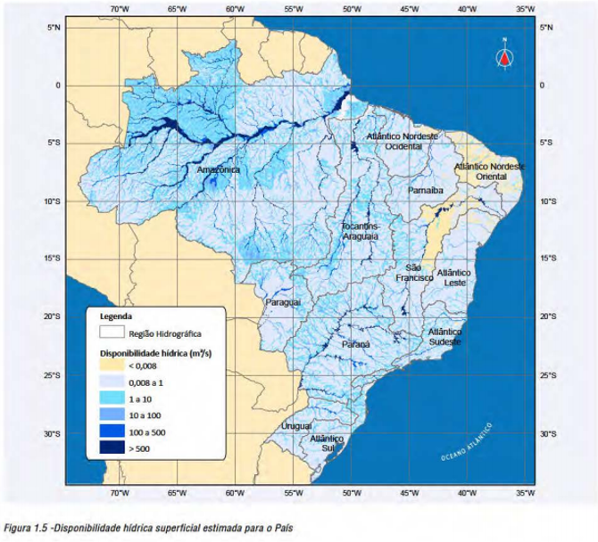
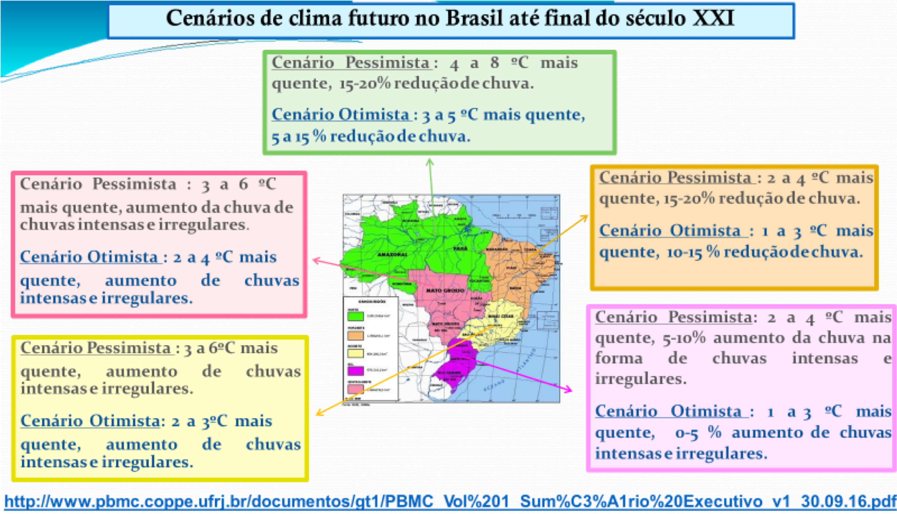
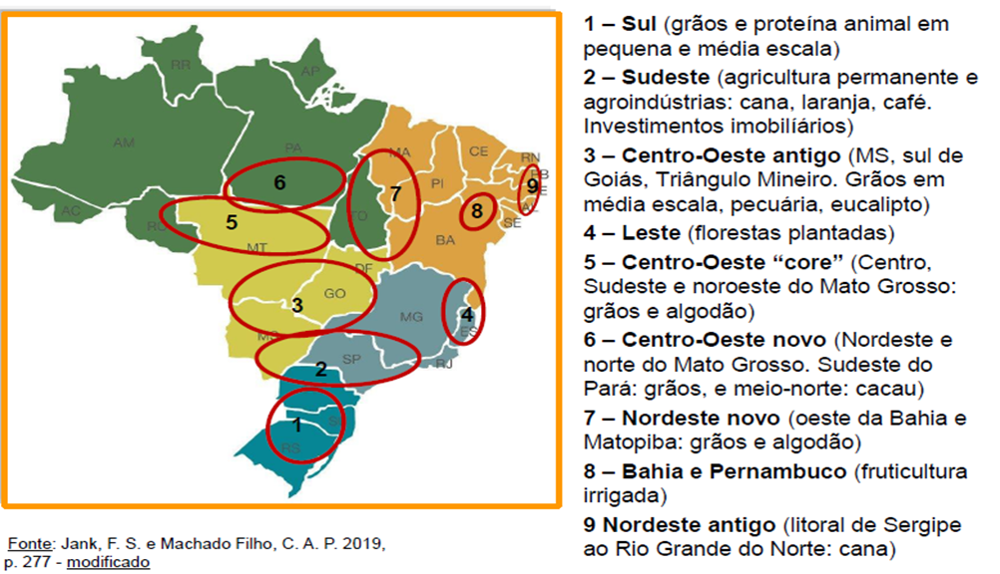
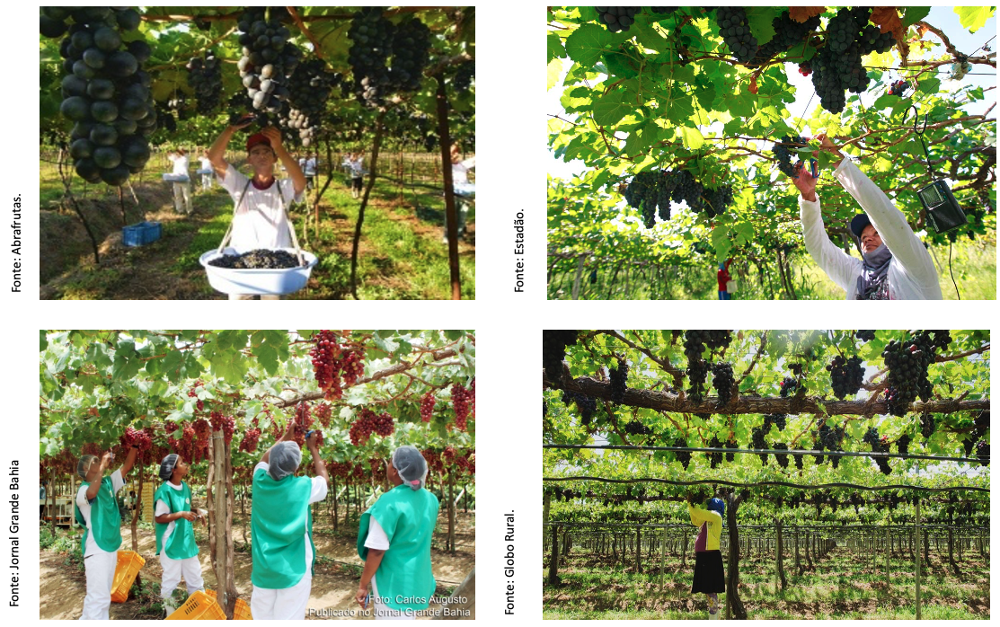
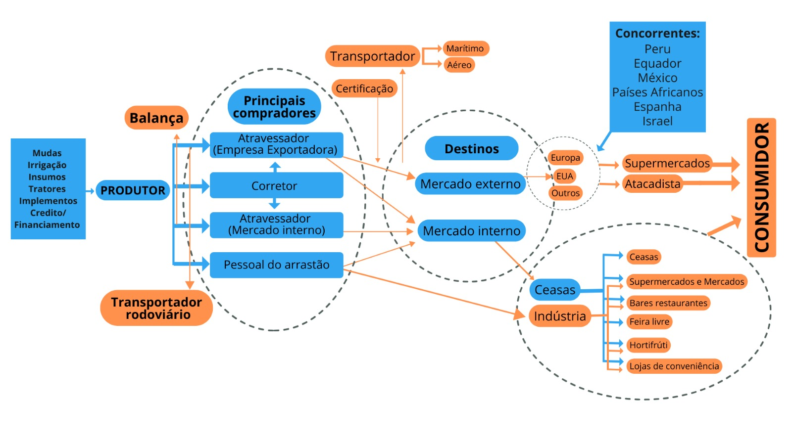
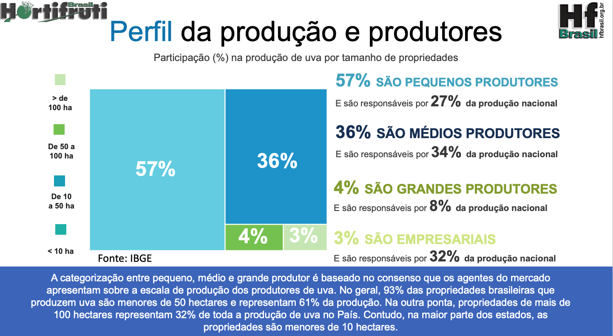
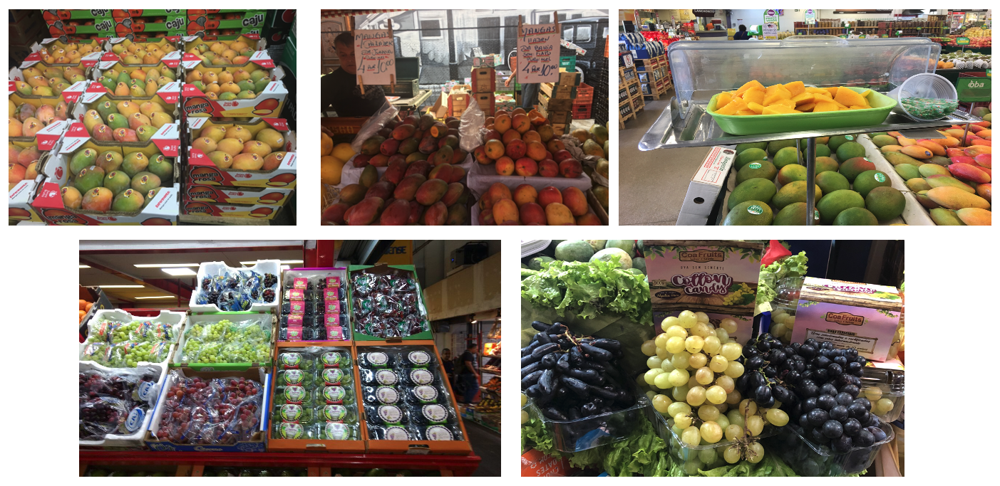
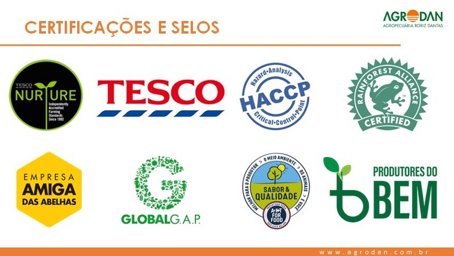
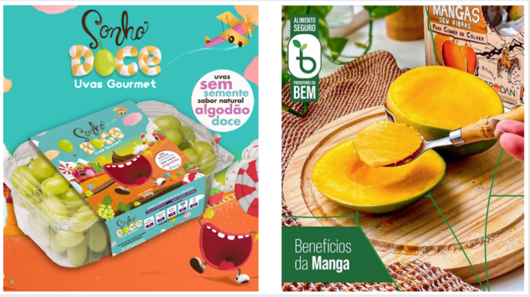

## João Ricardo Lima  {.center .aboutmeslide}

::: columns
::: {.column width="60%"}

-   Contatos

    -   Instagram: [\@jotaerre.econ](https://www.instagram.com/jotaerre.econ/)

    -   Email: [joao.ricardo@embrapa.br](joao.ricardo@embrapa.br)
    
    -   Linkedin: [Joao Ricardo Lima](https://www.linkedin.com/in/joao-ricardo-lima-7b6273240/)


-   Sobre mim

    -   Doutor em Economia Aplicada (UFV-MG)

    -   Pesquisador em Economia Rural da Embrapa Semiárido - Petrolina/PE
    
    -   Coordenador dos Observatórios de Mercado de Manga e Uva da Embrapa
:::

::: {.column width="40%"}
{width=110%}

:::
:::

```{r}

#| label: slide1
#| echo: false
#| warning: false
#| message: false
#| fig-width: 16
#| fig-height: 8
#| fig-align: "center"


# Dependências dos slides/aula
library(knitr)          # CRAN v1.33
library(rmarkdown)      # CRAN v2.10
library(xaringan)       # CRAN v0.22
library(xaringanthemer) # CRAN v0.3.0
library(xaringanExtra)  # [github::gadenbuie/xaringanExtra] v0.5.5
library(RefManageR)     # CRAN v1.3.0
library(ggplot2)        # CRAN v3.3.5
library(fontawesome)    # [github::rstudio/fontawesome] v0.1.0
library(pagedown)
library(dplyr)
library(ggimage)
library(ggtext)
library(glue)

# Opções de chunks
options(htmltools.dir.version = FALSE)
knitr::opts_chunk$set(
  echo       = FALSE,
  warning    = FALSE,
  message    = FALSE,
  fig.retina = 3,
  fig.width  = 11,
  fig.asp    = 0.618,
  out.width  = "100%",
  fig.align  = "center",
  comment    = "#"
  )

# Cores para gráficos
colors <- c(
  blue       = "#282f6b",
  red        = "#b22200",
  yellow     = "#eace3f",
  green      = "#224f20",
  purple     = "#5f487c",
  orange     = "#b35c1e",
  turquoise  = "#419391",
  green_two  = "#839c56",
  light_blue = "#3b89bc",
  gray       = "#666666"
  )
```


## A DUALIDADE DO SEMIÁRIDO BRASILEIRO.

::: columns
::: {.column width="50%"}

```{r}

#| label: slide2
#| echo: false
#| warning: false
#| message: false
#| fig-width: 16
#| fig-height: 8
#| fig-align: "center"


knitr::include_graphics("imgs/chtt1.png")
```
Fonte: Atlas da Irrigação, 2017.

:::
::: {.column width="50%"}


```{r}

#| label: slide3
#| echo: false
#| warning: false
#| message: false
#| fig-width: 16
#| fig-height: 8
#| fig-align: "center"



```
Fonte: ANA, 2013.
:::
:::

## AS MUDANÇAS CLIMÁTICAS

```{r}

#| label: slide4
#| echo: false
#| warning: false
#| message: false
#| fig-width: 16
#| fig-height: 8
#| fig-align: "center"



```

## A PRODUÇÃO DE RIQUEZA NO SEMIÁRIDO

```{r}

#| label: slide5
#| echo: false
#| warning: false
#| message: false
#| fig-width: 16
#| fig-height: 8
#| fig-align: "center"
 

```

## A PRODUÇÃO DE RIQUEZA NO SEMIÁRIDO

<br>
<br>

```{r}

#| label: slide6
#| echo: false
#| warning: false
#| message: false
#| fig-width: 16
#| fig-height: 8
#| fig-align: "center"

knitr::include_graphics("imgs/seacon5.png")
```


- ### ÁGUA IRRIGAÇÃO + MUITAS HORAS DE SOL + TECNOLOGIA = FRUTICULTURA DO VALE 

## A PRODUÇÃO DE RIQUEZA NO SEMIÁRIDO

```{r}

#| label: slide7
#| echo: false
#| warning: false
#| message: false
#| fig-width: 16
#| fig-height: 8
#| fig-align: "center"

knitr::include_graphics("imgs/seacon6.png")
```


## A PRODUÇÃO DE RIQUEZA NO SEMIÁRIDO

::: columns
::: {.column width="50%"}

```{r}

#| label: slide8
#| echo: false
#| warning: false
#| message: false
#| fig-width: 16
#| fig-height: 8
#| fig-align: "center"

knitr::include_graphics("imgs/seacon3.jpg")
```

:::
::: {.column width="50%"}

```{r}

#| label: slide9
#| echo: false
#| warning: false
#| message: false
#| fig-width: 16
#| fig-height: 8
#| fig-align: "center"


knitr::include_graphics("imgs/seacon2.jpg")
```

:::
:::

## TAXA DE CRESCIMENTO POPULACIONAL: 2000 E 2024 {.titulo-pequeno}

```{r}

#| label: slide10
#| echo: false
#| warning: false
#| message: false
#| fig-width: 16
#| fig-height: 8
#| fig-align: "center"

#Direcionado o R para o Diretorio a ser trabalhado
#setwd('/Users/jricardofl/Dropbox/Embrapa/2024/Eventos/mpo')
#setwd('C:/Users/Lenovo/Dropbox/Embrapa/2024/Eventos/mpo')

#Inicio do Script
#Pacotes a serem utilizados 
library(reshape2)

#Entrando dados no R
dados_ <- read.csv2('dados/populacao.csv', header=T, sep=";", dec = ".")

# Set the custom order for 'regiao' using factor
dados_$regiao <- factor(dados_$regiao, levels = c("Brasil", "Nordeste", "Bahia", "Pernambuco", "Vale do S. Francisco"))

dados_1 <- melt(dados_, id.var='regiao')

mycolors <- "darkgreen"

g2a <- ggplot() +
  geom_col(data=dados_1, aes(x=regiao, y=value, fill=variable), size=2, width = 0.7, position = position_dodge(width = .5, preserve = "total"))+
  scale_fill_manual(values=mycolors) +
  scale_y_continuous(n.breaks = 10)+
  labs(y= "Taxa de Crescimento (%)", x= "Regiões",
       caption = "Fonte: IBGE reprocessado pelos Observatórios de Manga e Uva da Embrapa, 2025.")+
  geom_text(data=dados_1, aes(y=value, x=regiao, group=variable, label=value), 
    position = position_dodge(width = .5, preserve = "total"), 
    size=4, 
    hjust=0.5, 
    vjust=-1.0)+
  theme_minimal() + #Definindo tema
  theme(axis.text.x = element_text(margin = margin(b=10), size=14), 
        axis.text.y = element_text(margin = margin(b=10), size=14), 
        axis.title.x = element_text(size=14, face = "bold", margin = margin(b=10)),
        axis.title.y = element_text(size=14, face = "bold", margin = margin(l=20)),
        panel.grid.major = element_blank(),
        panel.grid.minor = element_blank(), # retirando as linhas
        plot.caption = element_text(hjust = 0, size=14), #ajuste Fonte
        legend.title = element_blank(),
        legend.text=element_text(size=14),
        legend.position = "bottom") +  # Define legend position
  # Add annotation box with the desired text
  annotate("text", x = -Inf, y = Inf, label = "A tendência é que aglomerações populacionais \nse concentrem em locais que tenham água e emprego.", 
           hjust = -0.6, vjust = 1.3, size = 5, color = "black", fontface = "italic", 
           box.colour = "black", fill = "white") # Text properties and box style
# Nome do eixo mais para baixo
g2a
```

## GERAÇÃO DE EMPREGOS NA FRUTICULTURA

```{r}

#| label: slide11
#| echo: false
#| warning: false
#| message: false
#| fig-width: 16
#| fig-height: 8
#| fig-align: "center"


```

## GERAÇÃO DE EMPREGOS NA FRUTICULTURA

```{r}

#| label: slide12
#| echo: false
#| warning: false
#| message: false
#| fig-width: 16
#| fig-height: 8
#| fig-align: "center"


#Direcionado o R para o Diretorio a ser trabalhado
#setwd('C:/Users/Lenovo/Dropbox/Dropbox/Embrapa/2024/Eventos/mpo')

#Inicio do Script
#Pacotes a serem utilizados 
library(ggplot2)
library(scales)
library(plotly)
library(dplyr)

#Entrando dados no R
dados1 <- read.csv2('dados/setembro_2025.csv', header=T, sep=";", dec = ".")
dados1$date <- seq(as.Date('2021-01-01'),to=as.Date('2025-09-01'),by='1 month')

dados1a <- dados1 |> 
  dplyr::select(
    "date"     = `date`,
    "variable" = `Variavel`,
    "value"    = `Proporcao`
  ) |> 
  dplyr::as_tibble()

g1 <- ggplot(data=dados1a) +
  geom_col(aes(x=date, y=value, fill="variable"))+
  scale_fill_manual(values="blue") +#muda a cor da barra
  labs(y= "Proporção Agro/Total (%)", x= "Meses dos Anos",
       caption = "Fonte: CAGED reprocessado pelos Observatórios de Manga e Uva da Embrapa, 2025.")+
  scale_y_continuous(n.breaks = 10)+
  scale_x_date(date_breaks = "3 month",
              labels = date_format("%m/%Y"),
              expand = expansion(add=c(0,0)))+
  geom_text(data=dados1a, aes(y=value, x=date, label=value), 
            hjust=0.5, vjust=-1.2)+
  theme_minimal() + #Definindo tema
   theme(axis.text.x = element_text(angle=45, margin = margin(b=10), 
                                    size=12,
                                    hjust=1), 
        axis.text.y = element_text(margin = margin(b=10), size=14), 
        axis.title.x = element_text(size=14, face = "bold", margin = margin(b=10)),
        axis.title.y = element_text(size=14, face = "bold", margin = margin(l=20)),
        panel.grid.major = element_blank(),
        panel.grid.minor = element_blank(), # retirando as linhas
        plot.caption = element_text(hjust = 0, size=14), #ajuste Fonte
        legend.title = element_blank(),
        legend.text=element_text(size=14),
        legend.position = "none") # Definindo posição da legenda

g1

```

## REPRESENTATIVIDADE DO VALE NA OFERTA NACIONAL {.titulo-pequeno}

```{r}

#| label: slide13
#| echo: false
#| warning: false
#| message: false
#| fig-width: 16
#| fig-height: 8
#| fig-align: "center"


#Direcionado o R para o Diretorio a ser trabalhado
#setwd('/Users/jricardofl/Dropbox/Embrapa/2024/Eventos/mpo')

#Inicio do Script
#Pacotes a serem utilizados 
library(reshape2)

#Entrando dados no R
dados2 <- read.csv2('dados/volume.csv', header=T, sep=";", dec = ".")

dados2a <- melt(dados2, id.var='Fruta')

mycolors <- c("lightblue3", "darkgreen")

g2 <- ggplot() +
  geom_col(data=dados2a, aes(x=Fruta, y=value, fill=variable), size=2, width = 0.7, position = position_dodge(width = .5, preserve = "total"))+
  scale_fill_manual(values=mycolors) +
  scale_y_continuous(n.breaks = 10)+
  labs(y= "Vale sobre o Total Nacional e Regional (%)", x= "Frutas",
       caption = "Fonte: IBGE reprocessado pelos Observatórios de Manga e Uva da Embrapa, 2025.")+
  geom_text(data=dados2a, aes(y=value, x=Fruta, group=variable, label=value), 
    position = position_dodge(width = .5, preserve = "total"), 
    size=4, 
    hjust=0.5, 
    vjust=-1.0)+
  theme_minimal() + #Definindo tema
  theme(axis.text.x = element_text(margin = margin(b=10), size=14), 
        axis.text.y = element_text(margin = margin(b=10), size=14), 
        axis.title.x = element_text(size=14, face = "bold", margin = margin(b=10)),
        axis.title.y = element_text(size=14, face = "bold", margin = margin(l=20)),
        panel.grid.major = element_blank(),
        panel.grid.minor = element_blank(), # retirando as linhas
        plot.caption = element_text(hjust = 0, size=14), #ajuste Fonte
        legend.title = element_blank(),
        legend.text=element_text(size=14),
        legend.position = "bottom") # Definindo posição da legenda
# Nome do eixo mais para baixo
g2
```

## VB DA PRODUÇÃO DA FRUTICULTURA DO VALE {.titulo-pequeno}

```{r}

#| label: slide14
#| echo: false
#| warning: false
#| message: false
#| fig-width: 16
#| fig-height: 8
#| fig-align: "center"

#Direcionado o R para o Diretorio a ser trabalhado
#setwd('/Users/jricardofl/Dropbox/Embrapa/2024/Eventos/mpo')

#Inicio do Script
#Pacotes a serem utilizados 
library(reshape2)

#Entrando dados no R
dados21 <- read.csv2('dados/vbp.csv', header=T, sep=";", dec = ".")

dados21a <- melt(dados21, id.var='Fruta')

mycolors <- "darkblue"

g2a <- ggplot() +
  geom_col(data=dados21a, aes(x=Fruta, y=value, fill=variable), size=2, width = 0.7, position = position_dodge(width = .5, preserve = "total"))+
  scale_fill_manual(values=mycolors) +
  scale_y_continuous(n.breaks = 10)+
  labs(y= "Vale Bruto da Produção (milhões R$)", x= "Frutas",
       caption = "Fonte: IBGE reprocessado pelos Observatórios de Manga e Uva da Embrapa, 2025.")+
  geom_text(data=dados21a, aes(y=value, x=Fruta, group=variable, label=value), 
    position = position_dodge(width = .5, preserve = "total"), 
    size=4, 
    hjust=0.5, 
    vjust=-1.0)+
  theme_minimal() + #Definindo tema
  theme(axis.text.x = element_text(margin = margin(b=10), size=14), 
        axis.text.y = element_text(margin = margin(b=10), size=14), 
        axis.title.x = element_text(size=14, face = "bold", margin = margin(b=10)),
        axis.title.y = element_text(size=14, face = "bold", margin = margin(l=20)),
        panel.grid.major = element_blank(),
        panel.grid.minor = element_blank(), # retirando as linhas
        plot.caption = element_text(hjust = 0, size=14), #ajuste Fonte
        legend.title = element_blank(),
        legend.text=element_text(size=14),
        legend.position = "bottom") +  # Define legend position
  # Add annotation box with the desired text
  annotate("text", x = -Inf, y = Inf, label = "Estas frutas selecionadas, somadas,\ngeraram cerca de 9,5 bilhões de reais em 2024", 
           hjust = -0.3, vjust = 2, size = 5, color = "black", fontface = "italic", 
           box.colour = "black", fill = "white") # Text properties and box style
# Nome do eixo mais para baixo
g2a
```


## A COMPLEXA CADEIA PRODUTIVA DA FRUTICULTURA {.titulo-pequeno}

```{r}

#| label: slide15
#| echo: false
#| warning: false
#| message: false
#| fig-width: 16
#| fig-height: 8
#| fig-align: "center"



```
Fonte: LIMA et al, 2023.


## A IMPORTANTE FUNÇÃO DO MERCADO EXTERNO.

- 98% DE TODA A UVA EXPORTADA PELO BRASIL, EM 2024, FOI PRODUZIDA NO VALE DO SÃO FRANCISCO. 

::: columns
::: {.column width="50%"}


```{r}

#| label: slide16
#| echo: false
#| warning: false
#| message: false
#| fig-width: 16
#| fig-height: 8
#| fig-align: "center"


#Entrando dados no R
dados3 <- read.csv2('dados/uva_exportacoes_2004_2024.csv', header=T, sep=";", dec = ".")
dados3 <- dados3/1000
dados3[,1] <- seq(2004, 2024, by = 1)
colnames(dados3) = c('Ano', 'Valor', "Toneladas")
dados3 <- dplyr::tibble(dados3)

mycolor1 <- "purple"

g3 <- ggplot(data=dados3) +  #estetica vai valer para todos os geom's
  geom_col(aes(x=Ano, y=Toneladas, fill="Toneladas"), lwd=1)+
    scale_fill_manual(values=mycolor1)+
  labs(y= "Toneladas", x= "Anos", title='',
       caption = "Fonte: COMEXSTAT reprocessado pelo Observatório de Mercado de uva da Embrapa, 2025") +
  scale_y_continuous(limits=c(0, 85000), n.breaks = 10, expand = expansion(add=c(0,0.5)))+
  scale_x_continuous(breaks = seq(2004, 2024, by = 1))+
  theme_classic()+ #Definindo tema
  theme(axis.text.x=element_text(angle=45, hjust=1, size=14, margin = margin(b=10)),
        axis.text.y=element_text(hjust=1, size=14, margin = margin(l=20)),
        axis.title.x = element_text(size=14, face = "bold", margin = margin(b=5)),
        axis.title.y = element_text(size=14, face = "bold", margin = margin(l=20)),
        plot.caption = element_text(hjust = 0, size=16),
        legend.position = "bottom", legend.title = element_blank(),
        legend.text=element_text(size=20)) # Definindo posição da legenda
g3
```

:::
::: {.column width="50%"}


```{r}

#| label: slide17
#| echo: false
#| warning: false
#| message: false
#| fig-width: 16
#| fig-height: 8
#| fig-align: "center"


g4 <- ggplot(data=dados3) +  #estetica vai valer para todos os geom's
  geom_col(aes(x=Ano, y=Valor, fill="Valor em $ mil dólares"), lwd=1)+
    scale_fill_manual(values=mycolor1)+
  labs(y= "US$ Mil", x= "Anos", title='',
       caption = "Fonte: COMEXSTAT reprocessado pelo Observatório de Mercado de uva da Embrapa, 2025.") +
  scale_y_continuous(limits=c(0, 185000), n.breaks = 10, expand = expansion(add=c(0,0.5)))+
  scale_x_continuous(breaks = seq(2004, 2024, by = 1))+
  theme_classic()+ #Definindo tema
  theme(axis.text.x=element_text(angle=45, hjust=1, size=14, margin = margin(b=10)),
        axis.text.y=element_text(hjust=1, size=14, margin = margin(l=20)),
        axis.title.x = element_text(size=14, face = "bold", margin = margin(b=5)),
        axis.title.y = element_text(size=14, face = "bold", margin = margin(l=20)),
        plot.caption = element_text(hjust = 0, size=16),
        legend.position = "bottom", legend.title = element_blank(),
        legend.text=element_text(size=20)) # Definindo posição da legenda
g4
```

:::
:::

## A IMPORTANTE FUNÇÃO DO MERCADO EXTERNO.

- 92% DE TODA A MANGA EXPORTADA PELO BRASIL, EM 2024, FOI PRODUZIDA NO VALE DO SÃO FRANCISCO. 

::: columns
::: {.column width="50%"}

```{r}

#| label: slide18
#| echo: false
#| warning: false
#| message: false
#| fig-width: 16
#| fig-height: 8
#| fig-align: "center"


#Entrando dados no R
dados4 <- read.csv2('dados/manga_exportacoes_2004_2024.csv', header=T, sep=";", dec = ".")
dados4[,1] <- seq(2004, 2024, by = 1)
colnames(dados4) = c('Ano', 'Valor', "Toneladas")
#dados1 <- dplyr::tibble(dados1)

mycolor1 <- "gold"

g5 <- ggplot(data=dados4) +  #estetica vai valer para todos os geom's
  geom_col(aes(x=Ano, y=Toneladas/1000, fill="Toneladas"), lwd=1)+
    scale_fill_manual(values=mycolor1)+
  labs(y= "Toneladas", x= "Anos", title='',
       caption = "Fonte: COMEXSTAT reprocessado pelo Observatório de Mercado de Manga da Embrapa, 2025.") +
  scale_y_continuous(limits=c(0, 250000), n.breaks = 6, expand = expansion(add=c(0,0.5)))+
  scale_x_continuous(breaks = seq(2004, 2024, by = 1))+
  theme_classic()+ #Definindo tema
  theme(axis.text.x=element_text(angle=45, hjust=1, size=14, margin = margin(b=5)),
        axis.text.y=element_text(hjust=1, size=14, margin = margin(l=20)),
        axis.title.x = element_text(size=14, face = "bold", margin = margin(b=5)),
        axis.title.y = element_text(size=14, face = "bold", margin = margin(l=20)),
        plot.caption = element_text(hjust = 0, size=16),
        legend.position = "bottom", legend.title = element_blank(),
        legend.text=element_text(size=20)) # Definindo posição da legenda
g5
```

:::
::: {.column width="50%"}

```{r}

#| label: slide19
#| echo: false
#| warning: false
#| message: false
#| fig-width: 16
#| fig-height: 8
#| fig-align: "center"


g6 <- ggplot(data=dados4) +  #estetica vai valer para todos os geom's
  geom_col(aes(x=Ano, y=Valor/1000, fill="Valor em $ mil dólares"), lwd=1)+
    scale_fill_manual(values=mycolor1)+
  labs(y= "US$ Mil", x= "Anos", title='',
       caption = "Fonte: COMEXSTAT reprocessado pelo Observatório de Mercado de Manga da Embrapa, 2025") +
  scale_y_continuous(limits=c(0, 340000), n.breaks = 10, expand = expansion(add=c(0,0.5)))+
  scale_x_continuous(breaks = seq(2004, 2024, by = 1))+
  theme_classic()+ #Definindo tema
  theme(axis.text.x=element_text(angle=45, hjust=1, size=14, margin = margin(b=5)),
        axis.text.y=element_text(hjust=1, size=14, margin = margin(l=20)),
        axis.title.x = element_text(size=14, face = "bold", margin = margin(b=5)),
        axis.title.y = element_text(size=14, face = "bold", margin = margin(l=20)),
        plot.caption = element_text(hjust = 0, size=16),
        legend.position = "bottom", legend.title = element_blank(),
        legend.text=element_text(size=20)) # Definindo posição da legenda
g6
```

:::
:::

## VOLUME EXPORTADO UVA POR DESTINO

```{r}

#| label: slide20
#| echo: false
#| warning: false
#| message: false
#| fig-width: 16
#| fig-height: 8
#| fig-align: "center"


#Entrando dados no R
dados_exporta <- read.csv2('dados/destinos_exporta_uva.csv', header=T, sep=";", stringsAsFactors = FALSE)

# Step 2: Convert 'Date' column to Date format and reorder data
dados_exporta$Ano <- as.Date(paste0(dados_exporta$Ano, "-01-01"), format = "%Y-%m-%d")

# Filter data for the years 2015 to 2023
dados_exporta <- dados_exporta |>
  filter(format(Ano, "%Y") >= 2015 & format(Ano, "%Y") <= 2024) |>
  arrange(Ano) # Arrange in descending order (from 2015 to 2023)

# Step 3: Create the bar graph
ggplot(dados_exporta, aes(x = format(Ano, "%Y"), y = quilo/1000, fill = bloco)) +
  geom_bar(stat = "identity", position = "dodge") +
  labs(x = "Anos", y = "Volume Exportado", 
       title = "",
       fill = "Destino",
       caption = "Fonte: COMEXSTAT reprocessado pelo Observatório de Mercado de Uva da Embrapa, 2025.") +
  scale_y_continuous(n.breaks = 10)+
  theme_minimal()+ #Definindo tema
  theme(axis.text.x=element_text(angle=0, hjust=0.5, size=14, margin = margin(b=5)),
        axis.text.y=element_text(hjust=1, size=14, margin = margin(l=20)),
        axis.title.x = element_text(size=14, face = "bold", margin = margin(b=5)),
        axis.title.y = element_text(size=14, face = "bold", margin = margin(l=20)),
        plot.caption = element_text(hjust = 0, size=16),
        legend.position = "bottom", legend.title = element_blank(),
        legend.text=element_text(size=10)) # Definindo posição da legenda
```

## VOLUME EXPORTADO MANGA POR DESTINO

```{r}

#| label: slide21
#| echo: false
#| warning: false
#| message: false
#| fig-width: 16
#| fig-height: 8
#| fig-align: "center"


#Entrando dados no R
dados_exporta <- read.csv2('dados/destinos_exporta.csv', header=T, sep=";", stringsAsFactors = FALSE)

# Step 2: Convert 'Date' column to Date format and reorder data
dados_exporta$Ano <- as.Date(paste0(dados_exporta$Ano, "-01-01"), format = "%Y-%m-%d")

# Filter data for the years 2015 to 2024
dados_exporta <- dados_exporta |>
  filter(format(Ano, "%Y") >= 2015 & format(Ano, "%Y") <= 2024) |>
  arrange(Ano) # Arrange in descending order (from 2015 to 2024)

# Step 3: Create the bar graph
ggplot(dados_exporta, aes(x = format(Ano, "%Y"), y = quilo/1000, fill = bloco)) +
  geom_bar(stat = "identity", position = "dodge") +
  labs(x = "Anos", y = "Volume Exportado", 
       title = "",
       fill = "Destino",
       caption = "Fonte: COMEXSTAT reprocessado pelo Observatório de Mercado de Manga da Embrapa") +
  scale_y_continuous(n.breaks = 10)+
  theme_minimal()+ #Definindo tema
  theme(axis.text.x=element_text(angle=0, hjust=0.5, size=14, margin = margin(b=5)),
        axis.text.y=element_text(hjust=1, size=14, margin = margin(l=20)),
        axis.title.x = element_text(size=14, face = "bold", margin = margin(b=5)),
        axis.title.y = element_text(size=14, face = "bold", margin = margin(l=20)),
        plot.caption = element_text(hjust = 0, size=16),
        legend.position = "bottom", legend.title = element_blank(),
        legend.text=element_text(size=10)) # Definindo posição da legenda
```

##  PERFIL DE PRODUTORES DE UVA

```{r}

#| label: slide22
#| echo: false
#| warning: false
#| message: false
#| fig-width: 16
#| fig-height: 8
#| fig-align: "center"


```

## PERFIL DE PRODUTORES DE MANGA

```{r}

#| label: slide23
#| echo: false
#| warning: false
#| message: false
#| fig-width: 16
#| fig-height: 8
#| fig-align: "center"

knitr::include_graphics("imgs/chtt4.png")
```

## FRUTAS DO VALE DO SÃO FRANCISCO

```{r}

#| label: slide24
#| echo: false
#| warning: false
#| message: false
#| fig-width: 16
#| fig-height: 8
#| fig-align: "center"


```


## A SUSTENTABILIDADE NO VALE DO SÃO FRANCISCO {.titulo-pequeno} 

::: columns
::: {.column width="50%"}

```{r}

#| label: slide25
#| echo: false
#| warning: false
#| message: false
#| fig-width: 16
#| fig-height: 8
#| fig-align: "center"


```

:::
::: {.column width="50%"}

- ### NÃO É MAIS APENAS SABOR, QUALIDADE E PREÇO QUE OS CONSUMIDORES BUSCAM!

- ### BUSCAM SE ALIMENTAR PARA TER MELHOR QUALIDADE DE VIDA COM MENOS IMPACTO NO MEIO AMBIENTE!

Fonte: Hortifruti Brasil (03/19).
:::
:::

## CERTIFICAÇÕES PARA PODER EXPORTAR

```{r}

#| label: slide26
#| echo: false
#| warning: false
#| message: false
#| fig-width: 16
#| fig-height: 8
#| fig-align: "center"


```

## REINVENÇÃO É CONSTANTE

```{r}

#| label: slide27
#| echo: false
#| warning: false
#| message: false
#| fig-width: 16
#| fig-height: 8
#| fig-align: "center"


```

## REINVENÇÃO É CONSTANTE

```{r}

#| label: slide28
#| echo: false
#| warning: false
#| message: false
#| fig-width: 16
#| fig-height: 8
#| fig-align: "center"


knitr::include_graphics("imgs/seacon13.png")
```


## DIVERSIFICAÇÃO DE CULTURAS

```{r}

#| label: slide29
#| echo: false
#| warning: false
#| message: false
#| fig-width: 16
#| fig-height: 8
#| fig-align: "center"


knitr::include_graphics("imgs/seacon14.png")
```

## {.center .thankslide}

<div style="text-align: center;">
  
</div>


<div style="text-align: center;"> 
  <h2 style="color: #282f6b; font-size: 2em; margin-bottom: 20px;">
    MUITO OBRIGADO!
  </h2>
  <br>
  <!-- This part will have a smaller font size -->
  <p style="font-size: 0.8em; color: #333;">
    <a href="https://www.embrapa.br/observatorio-da-manga" target="_blank">
      https://www.embrapa.br/observatorio-da-manga
    </a>
    <br>
    <a href="https://www.embrapa.br/observatorio-da-uva" target="_blank">
      https://www.embrapa.br/observatorio-da-uva
    </a>
    <br>
📲 **WhatsApp:** <br>
+55 87 99961-5799  
  </p>
  
</div>


